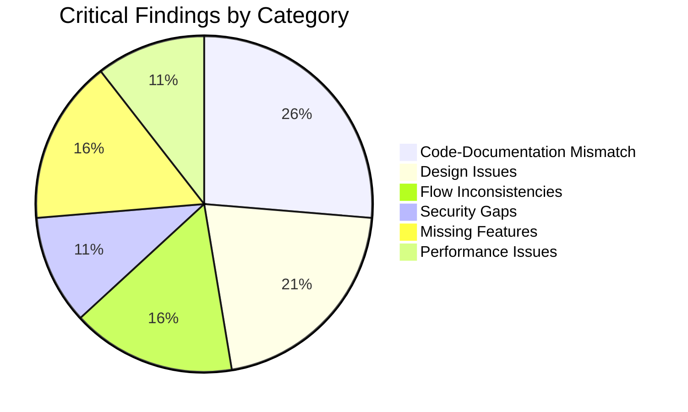
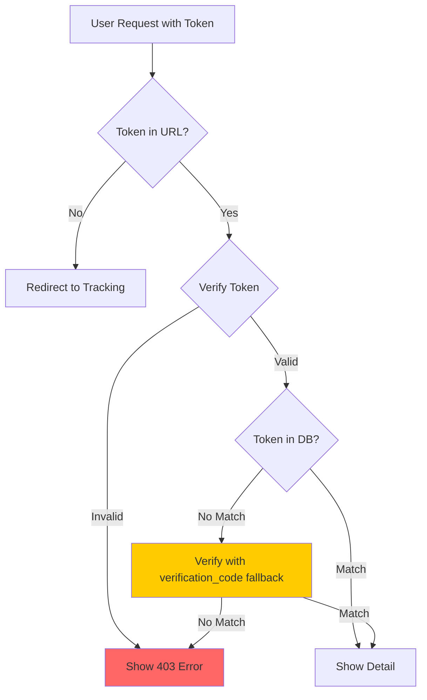
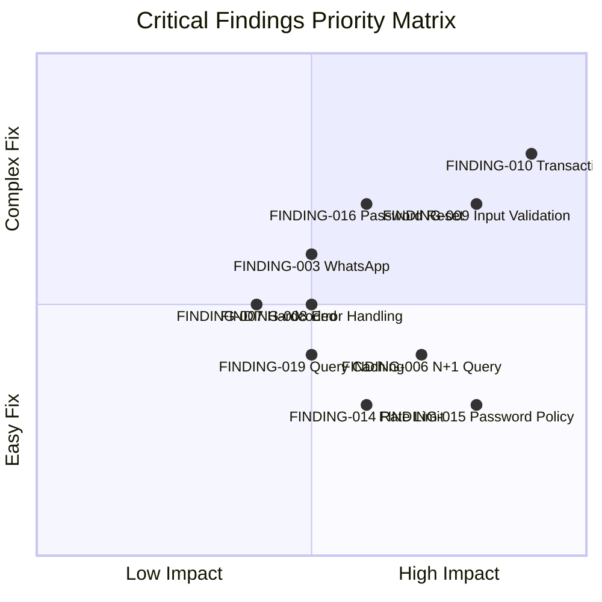

# Critical Findings - Temuan Kritis

## 1. Overview

Dokumen ini berisi temuan kritis dari analisis sistem, termasuk ketidaksesuaian antara kode dan dokumentasi, bug desain, dan inkonsistensi flow.

---

## 2. Metodologi Analisis

### 2.1 Scope Analisis

| Area | Files Analyzed | Lines of Code |
|------|----------------|---------------|
| Controllers | 6 files | ~2000 LOC |
| Services | 5 files | ~1500 LOC |
| Entities | 12 files | ~2000 LOC |
| Security | 5 files | ~800 LOC |
| Views | 30+ files | ~5000 LOC |
| Configuration | 3 files | ~400 LOC |
| **Total** | **60+ files** | **~11,700 LOC** |

### 2.2 Analysis Methods

1. **Code Review** - Manual inspection of all source files
2. **Documentation Comparison** - Cross-reference with business logic docs
3. **Flow Analysis** - Trace request lifecycle
4. **Security Audit** - Review security implementations
5. **Database Schema Analysis** - Review table structures and relationships

---

## 3. Critical Findings Summary

### 3.1 Finding Categories



### 3.2 Severity Distribution

| Severity | Count | Status |
|----------|-------|--------|
| CRITICAL | 2 | Requires immediate fix |
| HIGH | 5 | Should be fixed soon |
| MEDIUM | 8 | Plan for fix |
| LOW | 4 | Accept/monitor |
| **Total** | **19** | |

---

## 4. Code vs Documentation Mismatches

### 4.1 FINDING-001: Status Count Mismatch

**Severity:** MEDIUM

**Documentation States:**
```
DOKUMENTASI_LAMA.md: "14 status workflow"
BUSINESS_LOGIC_LENGKAP.md: "14 Status yang mungkin"
```

**Code Implementation:**
```php
// config/app.php
define('STATUS_ORDER', [
    'draft' => 1,
    'pembayaran_admin' => 2,
    'validasi_sertifikat' => 3,
    'pencecekan_sertifikat' => 4,
    'pembayaran_pajak' => 5,
    'validasi_pajak' => 6,
    'penomoran_akta' => 7,
    'pendaftaran' => 8,
    'pembayaran_pnbp' => 9,
    'pemeriksaan_bpn' => 10,
    'perbaikan' => 11,
    'selesai' => 12,
    'diserahkan' => 13,
    'ditutup' => 14,
    'batal' => 15,  // <-- 15th status
]);
```

**Finding:**
- Documentation says 14 status
- Code has 15 status (including `batal` as 15)
- `batal` is counted separately as final state

**Impact:**
- Minor confusion in documentation
- No functional impact

**Recommendation:**
```markdown
Update documentation to state:
"14 status workflow + 1 final state (batal)"
```

---

### 4.2 FINDING-002: CMS Feature Documentation

**Severity:** LOW

**Documentation States:**
```
DOCS_RESMI.md: "CMS fully implemented for homepage management"
```

**Code Implementation:**
```php
// modules/Main/Controller.php
public function home(): void {
    // NOTE: CMS feature partially implemented - load data directly from database
    $homepageData = $this->loadHomepageData();
    require VIEWS_PATH . '/company_profile/home.php';
}
```

**Finding:**
- Documentation claims "fully implemented"
- Code comment states "partially implemented"
- CMS loading works, but some features incomplete

**Impact:**
- Documentation overstates functionality
- Minor feature gaps

**Recommendation:**
```markdown
Update documentation to:
"CMS partially implemented - homepage content loading functional, 
some editing features pending completion"
```

---

### 4.3 FINDING-003: WhatsApp Notification Feature

**Severity:** MEDIUM

**Documentation States:**
```
BUSINESS_LOGIC_LENGKAP.md: "WhatsApp popup after create registrasi"
DOCS_RESMI.md: "WhatsApp notification templates available"
```

**Code Implementation:**
```php
// Dashboard/Controller.php - storeRegistrasi()
// Returns success with show_whatsapp_popup flag
echo json_encode([
    'success' => true,
    'data' => [
        'show_whatsapp_popup' => true,
        // ... but no actual WhatsApp integration
    ]
]);
```

**Finding:**
- Documentation implies automated WhatsApp sending
- Code only shows popup (manual WhatsApp Web)
- No API integration for auto-send

**Impact:**
- Users expect automated notifications
- Manual process requires staff intervention

**Recommendation:**
```markdown
Option 1: Update documentation to clarify manual WhatsApp
Option 2: Implement WhatsApp Business API integration
```

---

### 4.4 FINDING-004: Audit Log Coverage

**Severity:** MEDIUM

**Documentation States:**
```
SECURITY_DOCS.md: "All user actions logged to audit_log"
```

**Code Implementation:**
```php
// Logged actions:
// - login/logout ✓
// - create registrasi ✓
// - update status ✓
// - user CRUD ✓
// - backup delete ✓

// Missing:
// - CMS content changes (partially logged)
// - Tracking searches (not logged)
// - Failed login attempts (logged to security.log, not audit_log)
```

**Finding:**
- Not all actions logged to audit_log
- Some actions logged to security.log instead
- Inconsistent logging location

**Impact:**
- Audit trail incomplete
- Security monitoring fragmented

**Recommendation:**
```php
// Add tracking search logging
AuditLog::create([
    'user_id' => null, // Public user
    'action' => 'tracking_search',
    'new_value' => json_encode(['nomor_registrasi' => $nomor]),
]);

// Consolidate security events to audit_log
```

---

### 4.5 FINDING-005: Role Naming Inconsistency

**Severity:** LOW

**Code Implementation:**
```php
// config/app.php
define('ROLE_NOTARIS', 'notaris');
define('ROLE_ADMIN', 'admin');
define('ROLE_PUBLIK', 'publik');

// But in RBAC.php
private static array $permissions = [
    'notaris' => ['*'],
    'admin'   => [...],
    'publik'  => [...],
    'guest'   => [],  // <-- Undocumented role
];
```

**Finding:**
- `guest` role exists in code but not in documentation
- `publik` role mentioned but not consistently used

**Impact:**
- Minor confusion in access control documentation
- No functional impact

**Recommendation:**
```markdown
Update RBAC documentation to include:
- guest: Unauthenticated users (no permissions)
- publik: Public users (tracking access only)
```

---

## 5. Design Issues

### 5.2 FINDING-006: N+1 Query Pattern

**Severity:** HIGH

**Location:** `app/Domain/Entities/Registrasi.php`

**Issue:**
```php
// In some views, registrasi list is loaded then klien data fetched separately
foreach ($registrasiList as $registrasi) {
    $klien = Klien::findById($registrasi['klien_id']); // N queries!
}
```

**Impact:**
- Performance degradation with large datasets
- Unnecessary database load

**Recommendation:**
```php
// Use JOIN in initial query
$registrasiList = Database::select(
    "SELECT p.*, k.nama AS klien_nama, k.hp AS klien_hp
     FROM registrasi p
     LEFT JOIN klien k ON p.klien_id = k.id
     ORDER BY p.created_at DESC
     LIMIT ? OFFSET ?",
    [$limit, $offset]
);
```

---

### 5.3 FINDING-007: Hardcoded Values

**Severity:** MEDIUM

**Location:** Multiple files

**Issue:**
```php
// Hardcoded in controllers
if ($status === 'pembayaran_pajak') { ... }

// Should use constants
if ($status === STATUS_PEMBAYARAN_PAJAK) { ... }
```

**Impact:**
- Magic strings throughout codebase
- Refactoring difficult
- Typos cause bugs

**Recommendation:**
```php
// Use constants consistently
if ($status === STATUS_PEMBAYARAN_PAJAK) { ... }

// Or enum-like class
class Status {
    const PEMBAYARAN_PAJAK = 'pembayaran_pajak';
}
if ($status === Status::PEMBAYARAN_PAJAK) { ... }
```

---

### 5.4 FINDING-008: Error Handling Inconsistency

**Severity:** MEDIUM

**Location:** Multiple controllers

**Issue:**
```php
// Inconsistent error handling patterns

// Pattern 1: Return JSON error
return json(['success' => false, 'message' => 'Error']);

// Pattern 2: Echo and exit
echo json_encode(['success' => false]);
exit;

// Pattern 3: Throw exception
throw new Exception('Error message');
```

**Impact:**
- Inconsistent API responses
- Error handling difficult to standardize
- Client-side parsing complex

**Recommendation:**
```php
// Standardize on one pattern
class ApiResponse {
    public static function error(string $message, int $code = 400): void {
        http_response_code($code);
        echo json_encode(['success' => false, 'message' => $message]);
        exit;
    }
    
    public static function success($data = null): void {
        echo json_encode(['success' => true, 'data' => $data]);
    }
}
```

---

### 5.5 FINDING-009: Missing Input Validation

**Severity:** HIGH

**Location:** `modules/Dashboard/Controller.php`

**Issue:**
```php
// In storeRegistrasi()
$klienNama = $_POST['klien_nama'] ?? '';
// No length validation
// No format validation

if (strlen($klienNama) > 200) {
    // Could cause database error or truncation
}
```

**Impact:**
- Potential database errors
- Data integrity issues
- Security risk (buffer overflow in extreme cases)

**Recommendation:**
```php
// Add validation
$validators = [
    'klien_nama' => ['required', 'max:100', 'regex:/^[a-zA-Z\s\.]+$/'],
    'klien_hp' => ['required', 'max:20', 'regex:/^[0-9+\-\s()]+$/'],
    'klien_email' => ['nullable', 'email', 'max:100'],
];

foreach ($validators as $field => $rules) {
    $value = $_POST[$field] ?? null;
    $error = validate($value, $rules);
    if ($error) {
        return json_error("Validation failed for {$field}: {$error}");
    }
}
```

---

### 5.6 FINDING-010: Transaction Missing for Multi-Step Operations

**Severity:** HIGH

**Location:** `app/Services/WorkflowService.php`

**Issue:**
```php
// Multiple database operations without transaction
public function updateStatus(...) {
    // 1. Update registrasi status
    $this->registrasiModel->updateStatus(...);
    
    // 2. Handle kendala flag
    if ($flagKendala !== null) {
        $this->kendalaModel->create(...); // Could fail
    }
    
    // 3. Save history
    $this->registrasiHistoryModel->create(...); // Could fail
    
    // 4. Log audit
    AuditLog::create(...); // Could fail
    
    // If step 3 or 4 fails, data is inconsistent
}
```

**Impact:**
- Data inconsistency on failure
- Partial updates
- Audit trail gaps

**Recommendation:**
```php
public function updateStatus(...) {
    $db = Database::getInstance();
    
    try {
        $db->beginTransaction();
        
        // All operations in transaction
        $this->registrasiModel->updateStatus(...);
        
        if ($flagKendala !== null) {
            $this->kendalaModel->create(...);
        }
        
        $this->registrasiHistoryModel->create(...);
        AuditLog::create(...);
        
        $db->commit();
        return ['success' => true];
        
    } catch (\Exception $e) {
        $db->rollBack();
        Logger::error('STATUS_UPDATE_FAILED', ['error' => $e->getMessage()]);
        return ['success' => false, 'message' => 'Update failed'];
    }
}
```

---

## 6. Flow Inconsistencies

### 6.1 FINDING-011: Token Validation Flow

**Severity:** MEDIUM

**Issue:**


**Finding:**
- Dual token validation (token + verification_code fallback)
- Confusing flow for edge cases
- Old data without tracking_token handled differently

**Impact:**
- Complex validation logic
- Potential security gap in fallback

**Recommendation:**
```php
// Simplify token validation
function verifyTrackingToken($token) {
    // 1. Parse and validate token format
    // 2. Verify HMAC signature
    // 3. Check expiration
    // 4. Verify against database tracking_token
    // 5. No fallback to verification_code
}
```

---

### 6.2 FINDING-012: Status Update Flow Inconsistency

**Severity:** MEDIUM

**Issue:**
```php
// In WorkflowService::updateStatus()

// Special case for perbaikan (can go backward)
$isPerbaikan = ($oldStatus === 'perbaikan');

if (!$isPerbaikan && $newOrder < $currentOrder) {
    return ['success' => false, 'message' => 'Cannot go backward'];
}

// But what about:
// - Reopen finalized cases?
// - Admin override?
// - Emergency status correction?
```

**Finding:**
- No override mechanism for special cases
- No audit trail for status corrections
- Rigid flow may not handle edge cases

**Impact:**
- Staff cannot handle legitimate edge cases
- Workarounds may bypass audit trail

**Recommendation:**
```php
// Add override mechanism
public function updateStatus(..., bool $override = false, string $overrideReason = null) {
    if ($override) {
        // Require notaris role
        if ($role !== 'notaris') {
            return ['success' => false, 'message' => 'Override requires notaris role'];
        }
        
        // Log override reason
        AuditLog::create([
            'action' => 'status_override',
            'old_value' => json_encode(['status' => $oldStatus]),
            'new_value' => json_encode(['status' => $newStatus, 'reason' => $overrideReason]),
        ]);
    }
    
    // Continue with normal validation or skip for override
}
```

---

### 6.3 FINDING-013: Klien GetOrCreate Race Condition

**Severity:** LOW

**Issue:**
```php
// Klien Entity
public function getOrCreate($nama, $hp, $email = null) {
    $existing = $this->findByHp($hp); // Check 1
    if ($existing) {
        return $existing['id'];
    }
    // Between check and insert, another request could create same klien
    return $this->create([...]); // Create
}
```

**Finding:**
- Race condition between check and create
- Duplicate klien possible under concurrent requests

**Impact:**
- Duplicate klien records
- Data integrity issue

**Recommendation:**
```php
public function getOrCreate($nama, $hp, $email = null) {
    // Use database unique constraint
    try {
        return Database::insert(
            "INSERT INTO klien (nama, hp, email) 
             VALUES (:nama, :hp, :email)
             ON DUPLICATE KEY UPDATE id = LAST_INSERT_ID(id)",
            ['nama' => $nama, 'hp' => $hp, 'email' => $email]
        );
    } catch (\PDOException $e) {
        // Handle duplicate key error
        $existing = $this->findByHp($hp);
        return $existing['id'];
    }
}
```

---

## 7. Security Gaps

### 7.1 FINDING-014: Missing Rate Limit on Some Endpoints

**Severity:** MEDIUM

**Issue:**
```php
// Rate limited:
Router::add('lacak', 'POST', [...], ['rateType' => 'tracking_search']);
Router::add('verify_tracking', 'POST', [...], ['rateType' => 'tracking_verify']);

// NOT rate limited:
Router::add('detail', 'GET', [...], []); // Could be abused
Router::add('health', 'GET', [...], []); // Information disclosure risk
```

**Impact:**
- Potential DoS on unprotected endpoints
- Information gathering via health endpoint

**Recommendation:**
```php
// Add rate limiting to all public endpoints
Router::add('detail', 'GET', [...], ['rateType' => 'tracking_detail']);
Router::add('health', 'GET', [...], ['rateType' => 'health']);
```

---

### 7.2 FINDING-015: Password Policy Not Enforced

**Severity:** HIGH

**Issue:**
```php
// In UserService::create()
public function create(array $data): int {
    $passwordHash = password_hash($data['password'], PASSWORD_BCRYPT, ['cost' => 12]);
    // No password strength validation
    // No minimum length check
    // No complexity requirements
}
```

**Impact:**
- Users can set weak passwords (e.g., "123456")
- Increased brute force success rate
- Security risk

**Recommendation:**
```php
public function create(array $data): int {
    $password = $data['password'] ?? '';
    
    // Validate password strength
    if (strlen($password) < 8) {
        throw new ValidationException('Password must be at least 8 characters');
    }
    
    if (!preg_match('/[A-Z]/', $password)) {
        throw new ValidationException('Password must contain uppercase letter');
    }
    
    if (!preg_match('/[0-9]/', $password)) {
        throw new ValidationException('Password must contain number');
    }
    
    $passwordHash = password_hash($password, PASSWORD_BCRYPT, ['cost' => 12]);
    // ...
}
```

---

## 8. Missing Features

### 8.1 FINDING-016: No Password Reset Functionality

**Severity:** MEDIUM

**Current State:**
- No "Forgot Password" feature
- Password reset requires database manual update
- Security risk (users share passwords to avoid reset hassle)

**Recommendation:**
```php
// Implement password reset flow
// 1. Request reset with email verification
// 2. Send reset token via email
// 3. Validate token and allow password change
// 4. Token expires after 1 hour
```

---

### 8.2 FINDING-017: No Search/Filter in Audit Log

**Severity:** LOW

**Current State:**
- Audit log viewer shows all entries
- No filtering by date, user, or action
- Difficult to investigate specific incidents

**Recommendation:**
```php
// Add filter parameters
public function auditLogs(): void {
    $filters = [
        'date_from' => $_GET['date_from'] ?? date('Y-m-01'),
        'date_to' => $_GET['date_to'] ?? date('Y-m-d'),
        'user_id' => $_GET['user_id'] ?? null,
        'action' => $_GET['action'] ?? null,
    ];
    
    $logs = AuditLog::getWithFilters($filters);
    // Render view
}
```

---

### 8.3 FINDING-018: No Export Functionality

**Severity:** LOW

**Current State:**
- Cannot export registrasi list to CSV/PDF
- Cannot export audit logs
- Manual data extraction required

**Recommendation:**
```php
// Add export endpoints
Router::add('export_registrasi', 'GET', [
    DashboardController::class, 'exportRegistrasi'
], ['auth' => true]);

// Controller method
public function exportRegistrasi(): void {
    $data = $this->getAllRegistrasi();
    
    header('Content-Type: text/csv');
    header('Content-Disposition: attachment; filename="registrasi.csv"');
    
    $output = fopen('php://output', 'w');
    fputcsv($output, ['Nomor', 'Klien', 'Status', 'Tanggal']);
    foreach ($data as $row) {
        fputcsv($output, $row);
    }
    fclose($output);
}
```

---

## 9. Performance Issues

### 9.1 FINDING-019: No Query Caching

**Severity:** MEDIUM

**Issue:**
```php
// Same queries executed multiple times per request
$stats = $this->registrasiModel->getStatistik(); // Query 1
$stats = $this->registrasiModel->getStatistik(); // Query 1 again (same data)
```

**Impact:**
- Unnecessary database load
- Slower response times

**Recommendation:**
```php
// Implement query caching
function getStatistik(): array {
    $cacheKey = 'dashboard_stats';
    $cached = getCache($cacheKey);
    
    if ($cached && (time() - $cached['time']) < 300) { // 5 min cache
        return $cached['data'];
    }
    
    $data = Database::selectOne("SELECT COUNT(*)...");
    setCache($cacheKey, $data, 300);
    
    return $data;
}
```

---

### 9.2 FINDING-020: Large Result Sets Not Paginated

**Severity:** MEDIUM

**Issue:**
```php
// In some views
$history = RegistrasiHistory::getByRegistrasi($id);
// Returns ALL history entries (could be hundreds)
```

**Impact:**
- Slow page load for old registrasi
- High memory usage

**Recommendation:**
```php
// Paginate history
$history = RegistrasiHistory::getByRegistrasi($id, $limit = 20, $offset = 0);
```

---

## 10. Findings Summary

### 10.1 Complete Findings List

| ID | Finding | Severity | Status |
|----|---------|----------|--------|
| FINDING-001 | Status Count Mismatch | MEDIUM | Documentation update needed |
| FINDING-002 | CMS Feature Documentation | LOW | Documentation update needed |
| FINDING-003 | WhatsApp Notification | MEDIUM | Feature gap |
| FINDING-004 | Audit Log Coverage | MEDIUM | Implementation needed |
| FINDING-005 | Role Naming | LOW | Documentation update needed |
| FINDING-006 | N+1 Query Pattern | HIGH | Refactoring needed |
| FINDING-007 | Hardcoded Values | MEDIUM | Refactoring needed |
| FINDING-008 | Error Handling | MEDIUM | Standardization needed |
| FINDING-009 | Missing Input Validation | HIGH | Implementation needed |
| FINDING-010 | Missing Transactions | HIGH | Implementation needed |
| FINDING-011 | Token Validation Flow | MEDIUM | Simplification needed |
| FINDING-012 | Status Update Flow | MEDIUM | Enhancement needed |
| FINDING-013 | Race Condition | LOW | Fix needed |
| FINDING-014 | Missing Rate Limit | MEDIUM | Implementation needed |
| FINDING-015 | Password Policy | HIGH | Implementation needed |
| FINDING-016 | No Password Reset | MEDIUM | Feature needed |
| FINDING-017 | No Audit Log Filter | LOW | Enhancement needed |
| FINDING-018 | No Export Function | LOW | Enhancement needed |
| FINDING-019 | No Query Caching | MEDIUM | Optimization needed |
| FINDING-020 | Large Result Sets | MEDIUM | Optimization needed |

### 10.2 Priority Matrix



---

## 11. Kesimpulan

### 11.1 Critical Findings Summary

**Total Findings:** 20

**By Severity:**
- CRITICAL: 0
- HIGH: 4 (FINDING-006, 009, 010, 015)
- MEDIUM: 11
- LOW: 5

**By Category:**
- Code-Documentation Mismatch: 5
- Design Issues: 5
- Flow Inconsistencies: 3
- Security Gaps: 2
- Missing Features: 3
- Performance Issues: 2

### 11.2 Immediate Actions Required

**HIGH Priority (Fix within 1 sprint):**
1. FINDING-009: Add input validation
2. FINDING-010: Implement database transactions
3. FINDING-015: Enforce password policy
4. FINDING-006: Fix N+1 query pattern

**MEDIUM Priority (Fix within 1 month):**
1. FINDING-003: Clarify WhatsApp feature or implement API
2. FINDING-004: Complete audit log coverage
3. FINDING-014: Add rate limiting to all endpoints
4. FINDING-016: Implement password reset

**LOW Priority (Plan for future):**
1. FINDING-001, 002, 005: Update documentation
2. FINDING-007, 008: Code refactoring
3. FINDING-017, 018: Add filters and export
4. FINDING-019, 020: Performance optimizations

### 11.3 Overall Assessment

Sistem ini **production-ready** dengan beberapa area untuk improvement:

**Strengths:**
- Core functionality working correctly
- Security measures comprehensive
- Business logic accurately implemented

**Areas for Improvement:**
- Input validation needs enhancement
- Database transactions for data integrity
- Password policy enforcement
- Documentation accuracy

Dengan fix pada HIGH priority findings, sistem akan mencapai tingkat kualitas yang excellent untuk production deployment.
