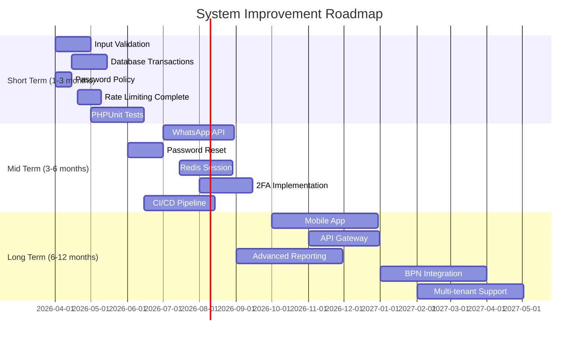
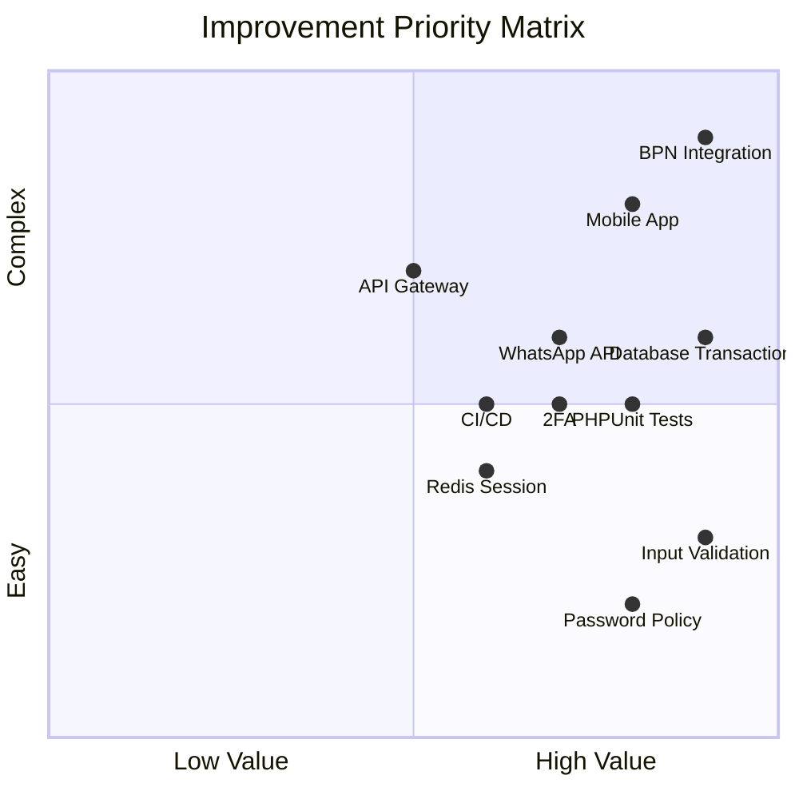

# Improvement Roadmap - Peta Jalan Pengembangan

## 1. Overview

Dokumen ini berisi peta jalan pengembangan Sistem Tracking Status Dokumen Notaris dengan prioritas short-term, mid-term, dan long-term.

---

## 2. Roadmap Timeline



---

## 3. Short Term (1-3 Months)

### 3.1 Priority 1: Security & Data Integrity

#### 3.1.1 Input Validation Enhancement

**Timeline:** Week 1-4

**Tasks:**
```php
// 1. Create validation library
class Validator {
    private static array $rules = [
        'required' => fn($v) => !empty($v),
        'max:100' => fn($v) => strlen($v) <= 100,
        'email' => fn($v) => filter_var($v, FILTER_VALIDATE_EMAIL),
        'regex:/pattern/' => fn($v) => preg_match('/pattern/', $v),
    ];
    
    public static function validate(array $data, array $rules): array {
        $errors = [];
        foreach ($rules as $field => $ruleSet) {
            $value = $data[$field] ?? null;
            foreach (explode('|', $ruleSet) as $rule) {
                if (!self::applyRule($value, $rule)) {
                    $errors[$field][] = self::getErrorMessage($rule);
                }
            }
        }
        return $errors;
    }
}

// 2. Apply to all controllers
// Dashboard/Controller.php
$errors = Validator::validate($_POST, [
    'klien_nama' => 'required|max:100',
    'klien_hp' => 'required|max:20',
    'klien_email' => 'nullable|email|max:100',
]);

if (!empty($errors)) {
    return json_error('Validation failed', $errors);
}
```

**Deliverables:**
- [ ] Validator class library
- [ ] Validation rules for all forms
- [ ] Client-side validation (JavaScript)
- [ ] Error message localization

**Effort:** 5 story points
**Impact:** HIGH (Prevents invalid data entry)

---

#### 3.1.2 Database Transactions

**Timeline:** Week 3-6

**Tasks:**
```php
// 1. Add transaction support to Database adapter
class Database {
    public static function beginTransaction(): void {
        self::getInstance()->beginTransaction();
    }
    
    public static function commit(): void {
        self::getInstance()->commit();
    }
    
    public static function rollBack(): void {
        self::getInstance()->rollBack();
    }
}

// 2. Update WorkflowService
public function updateStatus(...) {
    try {
        Database::beginTransaction();
        
        // All operations
        $this->registrasiModel->updateStatus(...);
        $this->kendalaModel->create(...);
        $this->registrasiHistoryModel->create(...);
        AuditLog::create(...);
        
        Database::commit();
        return ['success' => true];
        
    } catch (\Exception $e) {
        Database::rollBack();
        Logger::error('UPDATE_FAILED', ['error' => $e->getMessage()]);
        return ['success' => false, 'message' => 'Update failed'];
    }
}
```

**Deliverables:**
- [ ] Transaction methods in Database adapter
- [ ] All multi-step operations wrapped in transactions
- [ ] Error handling and rollback testing
- [ ] Deadlock handling

**Effort:** 8 story points
**Impact:** HIGH (Ensures data consistency)

---

#### 3.1.3 Password Policy Enforcement

**Timeline:** Week 1-2

**Tasks:**
```php
// 1. Add password validation
class PasswordPolicy {
    public static function validate(string $password): array {
        $errors = [];
        
        if (strlen($password) < 8) {
            $errors[] = 'Password minimal 8 karakter';
        }
        
        if (!preg_match('/[A-Z]/', $password)) {
            $errors[] = 'Password harus mengandung huruf kapital';
        }
        
        if (!preg_match('/[0-9]/', $password)) {
            $errors[] = 'Password harus mengandung angka';
        }
        
        if (!preg_match('/[^A-Za-z0-9]/', $password)) {
            $errors[] = 'Password harus mengandung karakter khusus';
        }
        
        // Check against common passwords
        $commonPasswords = ['password', '123456', 'admin123', ...];
        if (in_array(strtolower($password), $commonPasswords)) {
            $errors[] = 'Password terlalu umum';
        }
        
        return $errors;
    }
}

// 2. Apply to user creation/update
$errors = PasswordPolicy::validate($password);
if (!empty($errors)) {
    return json_error('Password tidak memenuhi persyaratan', $errors);
}
```

**Deliverables:**
- [ ] PasswordPolicy class
- [ ] Validation on user create/update
- [ ] Password strength meter (UI)
- [ ] Documentation for users

**Effort:** 3 story points
**Impact:** HIGH (Improves account security)

---

#### 3.1.4 Complete Rate Limiting

**Timeline:** Week 4-6

**Tasks:**
```php
// 1. Add rate limiting to all public endpoints
Router::add('detail', 'GET', [...], [
    'rateType' => 'tracking_detail',
    'rateLimit' => 30,  // 30 per minute
    'rateWindow' => 60,
]);

Router::add('health', 'GET', [...], [
    'rateType' => 'health',
    'rateLimit' => 10,
    'rateWindow' => 60,
]);

// 2. Enhance RateLimiter class
class RateLimiter {
    public static function check(string $key, int $maxRequests = 5, int $window = 60): bool {
        // Current implementation
    }
    
    // Add Redis support for distributed rate limiting (future)
    public static function checkRedis(string $key, int $maxRequests, int $window): bool {
        $redis = RedisClient::getInstance();
        $current = $redis->incr($key);
        if ($current === 1) {
            $redis->expire($key, $window);
        }
        return $current <= $maxRequests;
    }
}
```

**Deliverables:**
- [ ] Rate limiting on all endpoints
- [ ] Configurable limits per endpoint
- [ ] Rate limit headers in response
- [ ] Admin dashboard for rate limit monitoring

**Effort:** 5 story points
**Impact:** MEDIUM (Prevents abuse)

---

### 3.2 Priority 2: Testing Infrastructure

#### 3.2.1 PHPUnit Implementation

**Timeline:** Week 5-12

**Tasks:**
```bash
# 1. Install PHPUnit
composer require --dev phpunit/phpunit

# 2. Create phpunit.xml configuration
# 3. Create test directory structure
mkdir -p tests/Unit tests/Integration tests/Feature

# 4. Create base test case
class TestCase extends PHPUnit\Framework\TestCase {
    protected function setUp(): void {
        parent::setUp();
        // Setup test database
        // Load fixtures
    }
}
```

**Test Coverage Goals:**

| Component | Target Coverage | Priority |
|-----------|-----------------|----------|
| WorkflowService | 90% | HIGH |
| UserService | 85% | HIGH |
| RBAC | 95% | HIGH |
| Controllers | 70% | MEDIUM |
| Entities | 80% | MEDIUM |
| Views | 30% | LOW |

**Sample Tests:**
```php
// tests/Unit/WorkflowServiceTest.php
class WorkflowServiceTest extends TestCase {
    private WorkflowService $service;
    
    protected function setUp(): void {
        $this->service = new WorkflowService();
    }
    
    public function testStatusTransitionForward(): void {
        $result = $this->service->updateStatus(
            1, 'pembayaran_admin', 1, 'admin'
        );
        $this->assertTrue($result['success']);
    }
    
    public function testStatusTransitionBackward(): void {
        $result = $this->service->updateStatus(
            1, 'draft', 1, 'admin'
        );
        $this->assertFalse($result['success']);
        $this->assertStringContainsString('tidak dapat mundur', $result['message']);
    }
    
    public function testCancellationAfterTax(): void {
        // Setup registrasi with status pembayaran_pajak
        $result = $this->service->updateStatus(
            1, 'batal', 1, 'admin'
        );
        $this->assertFalse($result['success']);
    }
}
```

**Deliverables:**
- [ ] PHPUnit configured
- [ ] Unit tests for Services (90% coverage)
- [ ] Integration tests for Controllers
- [ ] CI/CD integration for automated testing
- [ ] Test coverage reporting

**Effort:** 13 story points
**Impact:** HIGH (Prevents regressions)

---

## 4. Mid Term (3-6 Months)

### 4.1 Priority 1: Feature Enhancements

#### 4.1.1 WhatsApp Business API Integration

**Timeline:** Month 4-5

**Tasks:**
```php
// 1. Create WhatsApp Service
class WhatsAppService {
    private string $apiKey;
    private string $baseUrl;
    
    public function sendMessage(string $phone, string $template, array $params): bool {
        $message = $this->renderTemplate($template, $params);
        
        $response = Http::post($this->baseUrl . '/messages', [
            'to' => $phone,
            'message' => $message,
        ], [
            'Authorization' => 'Bearer ' . $this->apiKey,
        ]);
        
        return $response->successful();
    }
    
    private function renderTemplate(string $template, array $params): string {
        $templateBody = MessageTemplate::findByKey($template)['template_body'];
        foreach ($params as $key => $value) {
            $templateBody = str_replace('{' . $key . '}', $value, $templateBody);
        }
        return $templateBody;
    }
}

// 2. Integrate with registrasi creation
public function storeRegistrasi(): void {
    // ... create registrasi
    
    // Send WhatsApp notification
    $whatsapp = new WhatsAppService();
    $whatsapp->sendMessage($klienHp, 'registrasi_baru', [
        'nama_klien' => $klienNama,
        'nomor_registrasi' => $nomorRegistrasi,
        'status' => $statusLabel,
    ]);
}
```

**Deliverables:**
- [ ] WhatsAppService class
- [ ] Template management
- [ ] Integration with registrasi flow
- [ ] Delivery status tracking
- [ ] Opt-out management

**Effort:** 13 story points
**Impact:** HIGH (Automated notifications)

---

#### 4.1.2 Password Reset Functionality

**Timeline:** Month 3-4

**Tasks:**
```php
// 1. Create password reset tokens
class PasswordResetService {
    public function requestReset(string $username): bool {
        $user = User::findByUsername($username);
        if (!$user) {
            // Don't reveal if user exists
            return true;
        }
        
        $token = bin2hex(random_bytes(32));
        $expiresAt = date('Y-m-d H:i:s', time() + 3600); // 1 hour
        
        PasswordResetToken::create([
            'user_id' => $user['id'],
            'token' => hash('sha256', $token),
            'expires_at' => $expiresAt,
        ]);
        
        // Send reset email (future)
        // For now, show token to admin
        return true;
    }
    
    public function resetPassword(string $token, string $newPassword): bool {
        $tokenHash = hash('sha256', $token);
        $resetToken = PasswordResetToken::findByToken($tokenHash);
        
        if (!$resetToken || $resetToken['expires_at'] < date('Y-m-d H:i:s')) {
            return false; // Invalid or expired
        }
        
        // Validate new password
        $errors = PasswordPolicy::validate($newPassword);
        if (!empty($errors)) {
            return false;
        }
        
        // Update password
        User::update($resetToken['user_id'], [
            'password_hash' => password_hash($newPassword, PASSWORD_BCRYPT, ['cost' => 12]),
        ]);
        
        // Invalidate all reset tokens
        PasswordResetToken::invalidateAll($resetToken['user_id']);
        
        return true;
    }
}
```

**Deliverables:**
- [ ] PasswordResetService class
- [ ] Reset token generation
- [ ] Reset password form
- [ ] Token expiration handling
- [ ] Email integration (future)

**Effort:** 5 story points
**Impact:** MEDIUM (User convenience)

---

#### 4.1.3 Two-Factor Authentication (2FA)

**Timeline:** Month 5-6

**Tasks:**
```php
// 1. Install TOTP library
composer require robthree/twofactorauth

// 2. Create 2FA Service
use RobThree\Auth\TwoFactorAuth;

class TwoFactorAuthService {
    private TwoFactorAuth $tfa;
    
    public function __construct() {
        $this->tfa = new TwoFactorAuth('Notaris Tracking');
    }
    
    public function enable2FA(int $userId): array {
        $secret = $this->tfa->createSecret();
        
        User::update($userId, ['two_factor_secret' => $secret]);
        
        $qrCode = $this->tfa->getQRCodeImageAsDataUri(
            User::findById($userId)['username'],
            $secret
        );
        
        return ['secret' => $secret, 'qr_code' => $qrCode];
    }
    
    public function verify2FA(int $userId, string $code): bool {
        $user = User::findById($userId);
        $secret = $user['two_factor_secret'];
        
        return $this->tfa->verifyCode($secret, $code);
    }
}

// 3. Integrate with login
public function login(): void {
    // ... existing login logic
    
    if ($user['two_factor_enabled']) {
        // Redirect to 2FA verification page
        redirect('/index.php?gate=verify_2fa');
        exit;
    }
}
```

**Deliverables:**
- [ ] TwoFactorAuthService class
- [ ] 2FA enrollment flow
- [ ] 2FA verification on login
- [ ] Backup codes generation
- [ ] 2FA settings page

**Effort:** 8 story points
**Impact:** HIGH (Enhanced security)

---

### 4.2 Priority 2: Infrastructure

#### 4.2.1 Redis Session Storage

**Timeline:** Month 4-5

**Tasks:**
```php
// 1. Install Redis extension
// pecl install redis

// 2. Configure session handler
ini_set('session.save_handler', 'redis');
ini_set('session.save_path', 'tcp://127.0.0.1:6379?database=0');

// 3. Add Redis client for caching
class RedisClient {
    private static ?Redis $instance = null;
    
    public static function getInstance(): Redis {
        if (self::$instance === null) {
            self::$instance = new Redis();
            self::$instance->connect('127.0.0.1', 6379);
        }
        return self::$instance;
    }
}

// 4. Update caching to use Redis
function getCache(string $key): ?array {
    $redis = RedisClient::getInstance();
    $data = $redis->get($key);
    return $data ? json_decode($data, true) : null;
}

function setCache(string $key, array $data, int $ttl): void {
    $redis = RedisClient::getInstance();
    $redis->setex($key, $ttl, json_encode($data));
}
```

**Deliverables:**
- [ ] Redis installed and configured
- [ ] Session handler updated
- [ ] Cache layer migrated to Redis
- [ ] Monitoring for Redis health

**Effort:** 8 story points
**Impact:** HIGH (Scalability)

---

#### 4.2.2 CI/CD Pipeline

**Timeline:** Month 3-5

**Tasks:**
```yaml
# .github/workflows/ci.yml
name: CI/CD Pipeline

on:
  push:
    branches: [main, develop]
  pull_request:
    branches: [main]

jobs:
  test:
    runs-on: ubuntu-latest
    
    services:
      mysql:
        image: mysql:8.0
        env:
          MYSQL_ROOT_PASSWORD: test
          MYSQL_DATABASE: test_notaris
        ports:
          - 3306:3306
    
    steps:
      - uses: actions/checkout@v2
      
      - name: Setup PHP
        uses: shivammathur/setup-php@v2
        with:
          php-version: '8.1'
          extensions: pdo, pdo_mysql
      
      - name: Install dependencies
        run: composer install --no-progress
      
      - name: Run tests
        run: composer test
      
      - name: Code coverage
        run: composer coverage
      
      - name: Upload coverage
        uses: codecov/codecov-action@v2

  deploy:
    needs: test
    runs-on: ubuntu-latest
    if: github.ref == 'refs/heads/main'
    
    steps:
      - uses: actions/checkout@v2
      
      - name: Deploy to production
        uses: some-deploy-action@v1
        with:
          server: ${{ secrets.PROD_SERVER }}
          ssh-key: ${{ secrets.SSH_KEY }}
```

**Deliverables:**
- [ ] GitHub Actions workflow
- [ ] Automated testing on push
- [ ] Code coverage reporting
- [ ] Automated deployment
- [ ] Rollback mechanism

**Effort:** 8 story points
**Impact:** HIGH (Development efficiency)

---

## 5. Long Term (6-12 Months)

### 5.1 Priority 1: Major Features

#### 5.1.1 Mobile Application

**Timeline:** Month 7-9

**Scope:**
- React Native or Flutter app
- Same features as web dashboard
- Push notifications
- Offline support for viewing data

**Deliverables:**
- [ ] Mobile app for iOS and Android
- [ ] API endpoints for mobile
- [ ] Push notification service
- [ ] App store deployment

**Effort:** 40 story points
**Impact:** HIGH (Mobile accessibility)

---

#### 5.1.2 API Gateway

**Timeline:** Month 8-9

**Scope:**
- RESTful API with versioning
- API authentication (JWT)
- Rate limiting per API key
- API documentation (OpenAPI/Swagger)

**Deliverables:**
- [ ] API Gateway implementation
- [ ] JWT authentication
- [ ] API key management
- [ ] Swagger documentation
- [ ] Developer portal

**Effort:** 20 story points
**Impact:** MEDIUM (Third-party integration)

---

#### 5.1.3 Advanced Reporting

**Timeline:** Month 6-8

**Scope:**
- Custom report builder
- Export to PDF/Excel
- Scheduled reports
- Dashboard analytics

**Deliverables:**
- [ ] Report builder UI
- [ ] PDF/Excel export
- [ ] Email scheduled reports
- [ ] Analytics dashboard

**Effort:** 20 story points
**Impact:** MEDIUM (Business intelligence)

---

### 5.2 Priority 2: Integration

#### 5.2.1 BPN Integration (Future)

**Timeline:** Month 10-12

**Scope:**
- API integration with BPN system
- Automatic status sync
- Document submission

**Note:** Depends on BPN API availability

**Deliverables:**
- [ ] BPN API integration
- [ ] Status synchronization
- [ ] Document submission

**Effort:** 40 story points (highly variable)
**Impact:** HIGH (Process automation)

---

#### 5.2.2 Multi-Tenant Support

**Timeline:** Month 11-12

**Scope:**
- Support multiple notaris offices
- Tenant isolation
- Custom branding per tenant

**Deliverables:**
- [ ] Tenant management
- [ ] Database isolation
- [ ] Custom branding
- [ ] Tenant admin panel

**Effort:** 34 story points
**Impact:** HIGH (Business expansion)

---

## 6. Resource Planning

### 6.1 Team Structure

| Role | Count | Responsibilities |
|------|-------|------------------|
| Backend Developer | 2 | API, Services, Database |
| Frontend Developer | 1 | UI/UX, Views, JavaScript |
| DevOps Engineer | 1 | CI/CD, Infrastructure, Security |
| QA Engineer | 1 | Testing, Quality Assurance |
| Project Manager | 1 | Planning, Coordination |

### 6.2 Effort Estimation

| Phase | Duration | Story Points | Team Size |
|-------|----------|--------------|-----------|
| Short Term | 3 months | 34 points | 3 developers |
| Mid Term | 3 months | 42 points | 4 developers |
| Long Term | 6 months | 134 points | 5 developers |

### 6.3 Budget Estimate

| Category | Short Term | Mid Term | Long Term | Total |
|----------|------------|----------|-----------|-------|
| Development | 150,000,000 | 200,000,000 | 400,000,000 | 750,000,000 |
| Infrastructure | 15,000,000 | 30,000,000 | 60,000,000 | 105,000,000 |
| Third-party Services | 5,000,000 | 15,000,000 | 30,000,000 | 50,000,000 |
| **Total** | **170,000,000** | **245,000,000** | **490,000,000** | **905,000,000** |

---

## 7. Risk Management

### 7.1 Technical Risks

| Risk | Probability | Impact | Mitigation |
|------|-------------|--------|------------|
| Scope creep | High | Medium | Strict change management |
| Technical debt | Medium | High | Regular refactoring sprints |
| Security vulnerabilities | Low | High | Regular security audits |
| Performance issues | Medium | Medium | Load testing, monitoring |

### 7.2 Resource Risks

| Risk | Probability | Impact | Mitigation |
|------|-------------|--------|------------|
| Developer turnover | Medium | High | Documentation, knowledge sharing |
| Budget constraints | Medium | High | Phased delivery, MVP approach |
| Timeline slippage | High | Medium | Buffer time, agile methodology |

---

## 8. Success Metrics

### 8.1 Technical Metrics

| Metric | Current | Target (6 months) | Target (12 months) |
|--------|---------|-------------------|--------------------|
| Test Coverage | 0% | 60% | 80% |
| Deployment Time | 1 hour | 15 minutes | 5 minutes |
| Uptime | 95% | 99% | 99.9% |
| Response Time | 150ms | 100ms | 50ms |

### 8.2 Business Metrics

| Metric | Current | Target (6 months) | Target (12 months) |
|--------|---------|-------------------|--------------------|
| Active Users | 5 | 10 | 20 |
| Registrasi/month | 50 | 100 | 200 |
| Client Satisfaction | N/A | 80% | 90% |
| Staff Efficiency | Baseline | +30% | +50% |

---

## 9. Kesimpulan

### 9.1 Roadmap Summary

**Short Term (1-3 months):**
- Focus: Security, data integrity, testing foundation
- Key deliverables: Input validation, transactions, password policy, PHPUnit
- Effort: 34 story points

**Mid Term (3-6 months):**
- Focus: Feature enhancements, infrastructure
- Key deliverables: WhatsApp API, 2FA, Redis, CI/CD
- Effort: 42 story points

**Long Term (6-12 months):**
- Focus: Major features, integrations
- Key deliverables: Mobile app, API gateway, advanced reporting
- Effort: 134 story points

### 9.2 Priority Matrix



### 9.3 Recommendations

1. **Start with HIGH impact, LOW effort items** (Password Policy, Input Validation)
2. **Invest in testing infrastructure early** (PHPUnit, CI/CD)
3. **Address technical debt incrementally** (refactoring sprints)
4. **Plan for scalability** (Redis, load balancing)
5. **Engage stakeholders for feature prioritization**

Dengan implementasi roadmap ini, sistem akan berkembang dari production-ready menjadi enterprise-grade platform yang scalable, secure, dan feature-complete.
