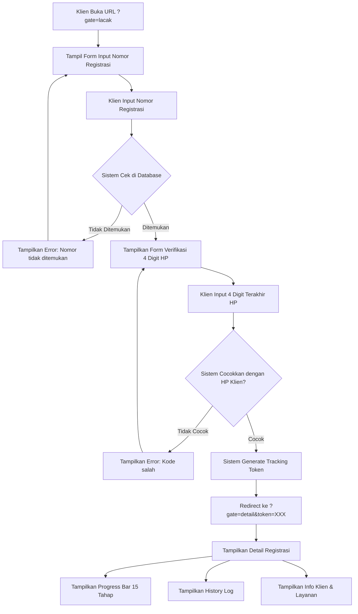
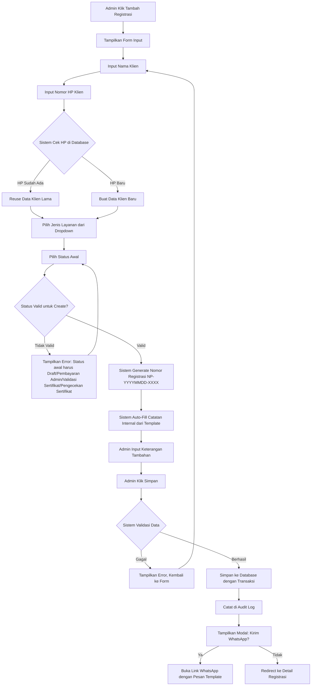
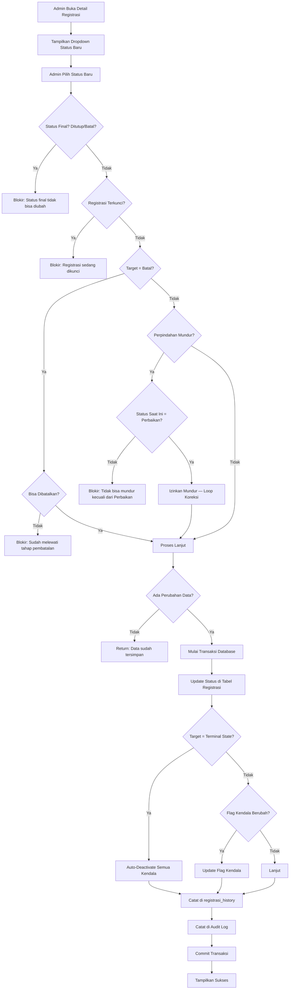
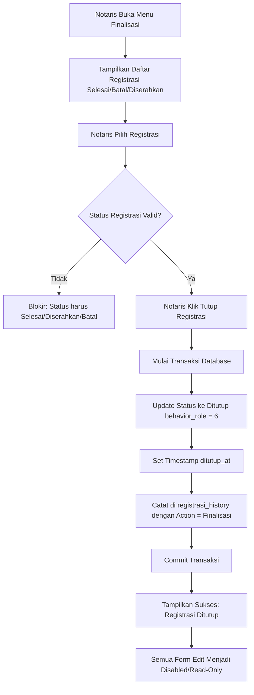
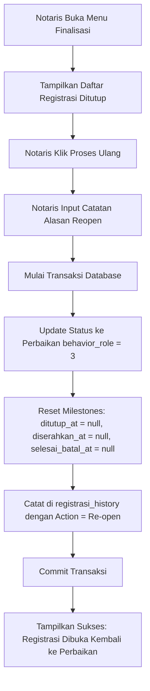

# DOKUMENTASI AKHIR
## Sistem Tracking Notaris & PPAT — Notaris Sri Anah SH.M.Kn
### Versi Aplikasi: 1.1.2 | Basis Database: `norasblmupdate2`

**Dokumen ini disusun berdasarkan kode sumber aplikasi yang ada (bukan asumsi).**
Setiap atribut, tabel, fitur, dan alur diverifikasi langsung dari file `config/app.php`, `config/routes.php`, `app/Domain/Entities/`, `app/Services/`, `modules/`, dan `database.sql`.

---

# DAFTAR ISI

1. [Evaluasi Umum Sistem](#1-evaluasi-umum-sistem)
2. [Perancangan Fitur & Diagram](#2-perancangan-fitur--diagram)
3. [Permodelan Sistem](#3-permodelan-sistem)
4. [Bisnis Proses Kantor Notaris](#4-bisnis-proses-kantor-notaris)
5. [Database Final](#5-database-final)
6. [Arsitektur & Keamanan](#6-arsitektur--keamanan)
7. [Daftar Route Aplikasi](#7-daftar-route-aplikasi)
8. [Role & Hak Akses](#8-role--hak-akses)

---

# 1. EVALUASI UMUM SISTEM

## 1.1 Identitas Sistem

| Atribut | Nilai |
|---|---|
| **Nama Aplikasi** | Notaris Sri Anah SH.M.Kn |
| **Versi** | 1.1.2 |
| **Framework** | Native PHP 8.1+ (PSR-4 Autoloader, Singleton PDO) |
| **Database** | MariaDB 11.4 / MySQL 8.x |
| **Nama Database** | `norasblmupdate2` |
| **Total Tabel** | 13 tabel utama |
| **Total Entitas** | 14 model PHP |
| **Total Controller** | 6 controller |
| **Total Route** | ~45 route aktif |

## 1.2 Evaluasi Atribut Sistem

Sistem ini dibangun untuk memenuhi kebutuhan nyata kantor notaris. Atribut yang digunakan disederhanakan sesuai fungsionalitas aktual:

### Atribut Inti (Wajib Ada)

| # | Atribut | Status | Keterangan |
|---|---------|--------|------------|
| 1 | Registrasi Dokumen | Ada | Tabel `registrasi` — entitas utama |
| 2 | Data Klien | Ada | Tabel `klien` — nama, HP, email |
| 3 | Jenis Layanan | Ada | Tabel `layanan` — 8 jenis layanan notaris |
| 4 | Status Workflow | Ada | 15 tahap di `workflow_steps` |
| 5 | Riwayat Perubahan | Ada | Tabel `registrasi_history` — immutable ledger |
| 6 | Tracking Publik | Ada | Token + verifikasi 4 digit HP |
| 7 | Kendala | Ada | Tabel `kendala` — flag hambatan |
| 8 | Autentikasi | Ada | Bcrypt, session fingerprinting |
| 9 | Audit Log | Ada | Tabel `audit_log` |
| 10 | CMS Website | Ada | 4 tabel CMS untuk landing page |

### Atribut Pelengkap

| # | Atribut | Status | Keterangan |
|---|---------|--------|------------|
| 11 | Template Pesan WA | Ada | `message_templates` |
| 12 | Template Catatan | Ada | `note_templates` per status |
| 13 | Backup Database | Ada | Modul BackupService |
| 14 | Manajemen User | Ada | CRUD user dengan 2 role |

## 1.3 Kesimpulan Evaluasi

Sistem **siap pakai** untuk operasional kantor notaris karena:

1. **Workflow 15 tahap** mencerminkan alur nyata: Draft → Pembayaran Admin → Validasi Sertifikat → Pengecekan Sertifikat → Pembayaran Pajak → Validasi Pajak → Penomoran Akta → Pendaftaran → Pembayaran PNBP → Pemeriksaan BPN → Perbaikan → Selesai → Diserahkan → Ditutup → Batal
2. **Tracking publik** tanpa login — klien cek status mandiri 24/7
3. **Keamanan berlapis** — CSRF, bcrypt, prepared statements, rate limiting
4. **Audit trail** lengkap — setiap perubahan tercatat dengan IP, user, dan timestamp

---

# 2. PERANCANGAN FITUR & DIAGRAM

## 2.1 Daftar Fitur Utama

| # | Fitur | Controller | Route |
|---|-------|------------|-------|
| 1 | Landing Page / Company Profile | `Main\Controller` | `?gate=home` |
| 2 | Tracking Registrasi Publik | `Main\Controller` | `?gate=lacak` |
| 3 | Verifikasi 4 Digit HP | `Main\Controller` | `?gate=verify_tracking` |
| 4 | Detail Registrasi Publik | `Main\Controller` | `?gate=detail` |
| 5 | Login / Logout | `Auth\Controller` | `?gate=login` / `?gate=logout` |
| 6 | Dashboard Operasional | `Dashboard\Controller` | `?gate=dashboard` |
| 7 | Buat Registrasi Baru | `Dashboard\Controller` | `?gate=registrasi_create` |
| 8 | Daftar Registrasi | `Dashboard\Controller` | `?gate=registrasi` |
| 9 | Detail Registrasi Internal | `Dashboard\Controller` | `?gate=registrasi_detail` |
| 10 | Update Status Workflow | `Dashboard\Controller` | `?gate=update_status` |
| 11 | Update Data Klien | `Dashboard\Controller` | `?gate=update_klien` |
| 12 | Toggle Kendala | `Dashboard\Controller` | `?gate=toggle_kendala` |
| 13 | Toggle Lock Registrasi | `Dashboard\Controller` | `?gate=toggle_lock` |
| 14 | Finalisasi (Tutup/Reopen) | `Finalisasi\Controller` | `?gate=finalisasi` |
| 15 | Manajemen User | `Dashboard\Controller` | `?gate=users` |
| 16 | CMS Editor | `CMS\Controller` | `?gate=cms_editor` |
| 17 | Manajemen Layanan | `CMS\Controller` | `?gate=cms_edit_layanan` |
| 18 | Backup Database | `Dashboard\Controller` | `?gate=backups` |
| 19 | Audit Log | `Dashboard\Controller` | `?gate=audit` |
| 20 | Health Check | `Main\Controller` | `?gate=health` |

---

## 2.2 Use Case Diagram

### 2.2.1 Use Case Diagram — Aktor: Publik/Klien

```
┌─────────────────────────────────────────────────────────┐
│                    SISTEM NORA 2.0                       │
│                                                         │
│  ┌──────────────────┐   ┌──────────────────────┐       │
│  │  Lihat Homepage  │   │  Lacak Registrasi    │       │
│  └────────┬─────────┘   └──────────┬───────────┘       │
│           │                        │                    │
│           │                        ▼                    │
│           │              ┌─────────────────────┐        │
│           │              │ Input Nomor Regis-   │        │
│           │              │ trasi (Looping)      │        │
│           │              └──────────┬──────────┘        │
│           │                         │                   │
│           │                         ▼                   │
│           │              ┌─────────────────────┐        │
│           │              │ Verifikasi 4 Digit  │        │
│           │              │ Nomor HP (Looping)  │        │
│           │              └──────────┬──────────┘        │
│           │                         │                   │
│           │                         ▼                   │
│           │              ┌─────────────────────┐        │
│           │              │ Lihat Detail         │        │
│           │              │ Registrasi + Prog-   │        │
│           │              │ ress + History Log   │        │
│           │              └─────────────────────┘        │
└─────────────────────────────────────────────────────────┘

  Aktor: Publik/Klien
  ─────
  ● Bisa akses homepage tanpa login
  ● Bisa lacak registrasi dengan nomor registrasi
  ● Harus verifikasi 4 digit HP untuk lihat detail
  ● Token berlaku 24 jam, bisa refresh tanpa verifikasi ulang
```

### 2.2.2 Use Case Diagram — Aktor: Admin/Staff

```
┌────────────────────────────────────────────────────────────────┐
│                        SISTEM NORA 2.0                          │
│                                                                │
│  ┌───────────────┐  ┌────────────────┐  ┌──────────────────┐  │
│  │ Login         │  │ Lihat Dashboard│  │ Daftar Registrasi│  │
│  └───────┬───────┘  └───────┬────────┘  └───────┬──────────┘  │
│          │                  │                    │              │
│          │                  │                    ▼              │
│          │                  │           ┌──────────────────┐   │
│          │                  │           │ Buat Registrasi  │   │
│          │                  │           │ Baru             │   │
│          │                  │           │ (Input → Loop)   │   │
│          │                  │           └──────────────────┘   │
│          │                  │                                   │
│          │                  ▼                                   │
│          │         ┌─────────────────────────────┐             │
│          │         │ Detail Registrasi            │             │
│          │         │ ├─ Update Status             │             │
│          │         │ ├─ Update Klien              │             │
│          │         │ ├─ Toggle Kendala            │             │
│          │         │ └─ Lihat History             │             │
│          │         └─────────────────────────────┘             │
└────────────────────────────────────────────────────────────────┘

  Aktor: Admin/Staff
  ──────
  ● Bisa buat registrasi baru
  ● Bisa update status (hanya maju, kecuali dari Perbaikan)
  ● Bisa update data klien
  ● Bisa toggle flag kendala
  ● TIDAK bisa finalisasi, user management, CMS, backup
```

### 2.2.3 Use Case Diagram — Aktor: Notaris/Administrator

```
┌────────────────────────────────────────────────────────────────────┐
│                           SISTEM NORA 2.0                           │
│                                                                    │
│  Semua fitur Admin/Staff +                                        │
│                                                                    │
│  ┌─────────────────┐  ┌─────────────────┐  ┌──────────────────┐  │
│  │ Finalisasi      │  │ Manajemen User  │  │ CMS Editor       │  │
│  │ ├─ Tutup Regis- │  │ ├─ Tambah User  │  │ ├─ Edit Homepage │  │
│  │    trasi        │  │ ├─ Edit User    │  │ ├─ Edit Layanan  │  │
│  │ └─ Reopen Case  │  │ └─ Hapus User   │  │ ├─ Edit Pesan WA │  │
│  └─────────────────┘  └─────────────────┘  │ └─ Edit Catatan  │  │
│                                             └──────────────────┘  │
│  ┌─────────────────┐  ┌─────────────────┐  ┌──────────────────┐  │
│  │ Lock/Unlock     │  │ Backup Database │  │ Audit Log        │  │
│  │ Registrasi      │  │ ├─ Buat Backup  │  │ ├─ Lihat Log     │  │
│  │                 │  │ └─ Hapus Backup │  │ └─ Filter Log    │  │
│  └─────────────────┘  └─────────────────┘  └──────────────────┘  │
└────────────────────────────────────────────────────────────────────┘

  Aktor: Notaris/Administrator
  ──────────
  ● Semua akses Admin/Staff
  ● Finalisasi: tutup/reopen registrasi
  ● Lock/unlock registrasi sensitif
  ● Manajemen user (tambah/edit/hapus)
  ● CMS editor (homepage, layanan, pesan, catatan)
  ● Backup database
  ● Audit log
```

---

## 2.3 Activity Diagram

### 2.3.1 Activity Diagram — Proses Tracking Publik



### 2.3.2 Activity Diagram — Proses Buat Registrasi Baru



### 2.3.3 Activity Diagram — Update Status Workflow



### 2.3.4 Activity Diagram — Finalisasi (Tutup Registrasi)



### 2.3.5 Activity Diagram — Reopen Case (Buka Kembali)



---

# 3. PERMODELAN SISTEM

## 3.1 Prinsip Input dengan Looping

Sistem dirancang agar **tidak ada proses yang langsung gagal tanpa solusi**. Jika data tidak valid, sistem mengarahkan pengguna kembali ke input sebelumnya.

### 3.1.1 Looping pada Tracking Publik

```
┌──────────────────────────────────────────────────────────────┐
│                  ALUR LOOPING TRACKING PUBLIK                │
│                                                              │
│  ┌─────────────┐                                             │
│  │ INPUT:      │ ◄──────────────────────────────┐            │
│  │ Nomor       │                                │            │
│  │ Registrasi  │                                │            │
│  └──────┬──────┘                                │            │
│         │                                       │            │
│         ▼                                       │            │
│  ┌─────────────┐     ┌──────────────┐          │            │
│  │ VALIDASI:   │────►│ ERROR:       │──────────┘            │
│  │ Cek di DB   │ No  │ Nomor tidak  │  (Loop kembali       │
│  └──────┬──────┘     │ ditemukan    │   ke input)           │
│         │ Yes        └──────────────┘                       │
│         ▼                                                   │
│  ┌─────────────┐                                            │
│  │ INPUT:      │ ◄──────────────────────────────┐            │
│  │ 4 Digit HP  │                                │            │
│  └──────┬──────┘                                │            │
│         │                                       │            │
│         ▼                                       │            │
│  ┌─────────────┐     ┌──────────────┐          │            │
│  │ VALIDASI:   │────►│ ERROR:       │──────────┘            │
│  │ Cocokkan HP │ No  │ Kode salah   │  (Loop kembali       │
│  └──────┬──────┘     └──────────────┘   ke input)           │
│         │ Yes                                               │
│         ▼                                                   │
│  ┌─────────────┐                                            │
│  │ BERHASIL:   │                                            │
│  │ Generate    │                                            │
│  │ Token →     │                                            │
│  │ Detail Page │                                            │
│  └─────────────┘                                            │
└──────────────────────────────────────────────────────────────┘
```

**Implementasi di Kode** (`modules/Main/Controller.php`):

- `searchRegistrasiByNomor()` (line 143-191): Jika nomor tidak ditemukan, return JSON `{success: false, message: "Nomor registrasi tidak ditemukan"}` — form tetap tampil, user bisa input ulang.
- `verifyTracking()` (line 196-284): Jika kode 4 digit salah, return JSON `{success: false, message: "Kode verifikasi salah"}` — form verifikasi tetap tampil, user bisa input ulang.

### 3.1.2 Looping pada Buat Registrasi

```
┌──────────────────────────────────────────────────────────────┐
│              ALUR LOOPING BUAT REGISTRASI                    │
│                                                              │
│  ┌─────────────┐                                             │
│  │ INPUT:      │ ◄──────────────────────────────┐            │
│  │ Nama, HP,   │                                │            │
│  │ Layanan,    │                                │            │
│  │ Status      │                                │            │
│  └──────┬──────┘                                │            │
│         │                                       │            │
│         ▼                                       │            │
│  ┌─────────────┐     ┌──────────────┐          │            │
│  │ VALIDASI:   │────►│ ERROR:       │──────────┘            │
│  │ - Status    │ No  │ Status awal  │  (Kembali ke form     │
│  │   valid?    │     │ harus 1-4    │   dengan pesan error)  │
│  │ - Data      │     │ Data wajib   │                        │
│  │   lengkap?  │     │ diisi        │                        │
│  └──────┬──────┘     └──────────────┘                       │
│         │ Yes                                               │
│         ▼                                                   │
│  ┌─────────────┐                                            │
│  │ SISTEM:     │                                            │
│  │ - Cek HP    │                                            │
│  │ - GetOrCreate│                                           │
│  │ - Generate  │                                            │
│  │   Nomor Reg │                                            │
│  │ - Simpan DB │                                            │
│  └──────┬──────┘                                            │
│         │                                                   │
│         ▼                                                   │
│  ┌─────────────┐                                            │
│  │ BERHASIL:   │                                            │
│  │ Modal WA →  │                                            │
│  │ Detail Page │                                            │
│  └─────────────┘                                            │
└──────────────────────────────────────────────────────────────┘
```

### 3.1.3 Looping pada Update Status

```
┌──────────────────────────────────────────────────────────────┐
│              ALUR LOOPING UPDATE STATUS                      │
│                                                              │
│  ┌─────────────┐                                             │
│  │ INPUT:      │ ◄──────────────────────────────┐            │
│  │ Status Baru │                                │            │
│  │ + Catatan   │                                │            │
│  └──────┬──────┘                                │            │
│         │                                       │            │
│         ▼                                       │            │
│  ┌─────────────┐     ┌──────────────┐          │            │
│  │ VALIDASI:   │────►│ ERROR:       │──────────┘            │
│  │ 1. Status   │     │ "Status tidak│  (Kembali ke         │
│  │    final?   │     │  dapat       │   halaman detail      │
│  │ 2. Locked?  │     │  diubah"     │   dengan pesan error)  │
│  │ 3. Batal?   │     │ "Registrasi  │                        │
│  │    Bisa?    │     │  dikunci"    │                        │
│  │ 4. Mundur?  │     │ "Tidak bisa  │                        │
│  │    Perbaikan?│    │  mundur"     │                        │
│  └──────┬──────┘     └──────────────┘                       │
│         │ All Pass                                          │
│         ▼                                                   │
│  ┌─────────────┐                                            │
│  │ SISTEM:     │                                            │
│  │ - Transaksi │                                            │
│  │ - Update DB │                                            │
│  │ - History   │                                            │
│  │ - Audit Log │                                            │
│  │ - Commit    │                                            │
│  └──────┬──────┘                                            │
│         │                                                   │
│         ▼                                                   │
│  ┌─────────────┐                                            │
│  │ BERHASIL:   │                                            │
│  │ "Status     │                                            │
│  │  berhasil   │                                            │
│  │  diperbarui"│                                            │
│  └─────────────┘                                            │
└──────────────────────────────────────────────────────────────┘
```

## 3.2 Validasi Transisi Status (Berbasis Kode Asli)

Implementasi di `app/Services/WorkflowService.php` (line 73-83):

```php
// Cegah mundur kecuali ke/dari Perbaikan
if ($currentStep && $nextStep['sort_order'] < $currentStep['sort_order']) {
    $isCurrentRepair = ((int)$currentStep['behavior_role'] === 3);
    $isTargetRepair = ((int)$nextStep['behavior_role'] === 3);
    
    if (!$isCurrentRepair && !$isTargetRepair) {
        throw new \Exception('Status tidak dapat mundur kecuali ke tahap Perbaikan');
    }
}
```

Implementasi di `app/Domain/Entities/Registrasi.php` (line 134-144):

```php
public function canBeCancelled(int $id): bool
{
    $row = Database::selectOne(
        "SELECT w.is_cancellable 
         FROM registrasi r 
         JOIN workflow_steps w ON r.current_step_id = w.id 
         WHERE r.id = :id", 
        ['id' => $id]
    );
    return (bool)($row['is_cancellable'] ?? false);
}
```

## 3.3 Anti Spam / Ghost Submit

Implementasi di `WorkflowService.php` (line 97-105):

```php
// Blokir jika tidak ada perubahan data sama sekali
if (!$hasStatusChange && !$hasFlagChange && !$hasNotesChange && !$hasKeteranganChange) {
    $db->rollBack();
    return ['success' => true, 'message' => 'Data sudah tersimpan (Tidak ada perubahan baru).'];
}
```

---

# 4. BISNIS PROSES KANTOR NOTARIS

## 4.1 Proses Bisnis: Registrasi Baru

### Alur Konkrit

```
1. Klien datang ke kantor / hubungi kantor
2. Staff buka menu Tambah Registrasi (?gate=registrasi_create)
3. Staff isi form:
   - Nama Klien: "Budi Santoso"
   - Nomor HP: "081234567890"
   - Layanan: Dropdown → "Akta Jual Beli"
   - Status: Dropdown → "Draft" (hanya 4 pilihan awal)
   - Keterangan: "Klien menyerahkan KTP, KK, dan sertifikat tanah"
4. Staff klik Simpan
5. Sistem:
   a. Cek apakah HP 081234567890 sudah ada di tabel klien
   b. Jika ada → gunakan klien_id yang sama
   c. Jika tidak ada → INSERT baru ke tabel klien
   d. Generate nomor registrasi: NP-20260315-XXXX
   e. Auto-fill catatan dari note_templates
   f. INSERT ke tabel registrasi
   g. INSERT ke tabel registrasi_history
   h. INSERT ke tabel audit_log
6. Modal muncul: "Kirim WhatsApp sekarang?"
7. Staff klik "WhatsApp" → buka link WA ke nomor klien
```

### Validasi yang Dilakukan Sistem

| Validasi | Sumber Kode | Error Message |
|----------|-------------|---------------|
| Status awal harus 1-4 | `Dashboard\Controller::storeRegistrasi()` | "Status awal hanya boleh: Draft, Pembayaran Admin, Validasi Sertifikat, atau Pengecekan Sertifikat" |
| Data wajib diisi | Controller | "Semua field wajib diisi" |
| Nomor registrasi unik | Database UNIQUE constraint | "Nomor registrasi sudah ada" |

---

## 4.2 Proses Bisnis: Update Status

### Alur Konkrit

```
1. Staff buka detail registrasi (?gate=registrasi_detail&id=XXX)
2. Staff lihat status saat ini: "Validasi Sertifikat" (step 3)
3. Staff buka dropdown "Status Baru"
4. Sistem sudah filter dropdown:
   - Hanya tampil: Pengecekan Sertifikat, Pembayaran Pajak, dst (step 4+)
   - Tidak tampil: Draft, Pembayaran Admin (step 1-2, sudah lewat)
   - Tidak tampil: Batal (jika sudah lewat step 5)
5. Staff pilih "Pengecekan Sertifikat"
6. Staff centang "Tandai Ada Kendala" (jika ada hambatan)
7. Staff isi catatan: "Sertifikat dalam pengecekan BPN, estimasi 7 hari"
8. Staff klik Simpan
9. Sistem:
   a. Validasi: bukan status final
   b. Validasi: tidak locked
   c. Validasi: bukan mundur (kecuali dari Perbaikan)
   d. BEGIN TRANSACTION
   e. UPDATE registrasi SET current_step_id = 4, step_started_at = NOW()
   f. INSERT ke kendala (jika flag nyala)
   g. INSERT ke registrasi_history
   h. COMMIT
10. Tampil notifikasi sukses
```

### Mekanisme Flag Kendala

| Kondisi | Aksi Sistem | Sumber Kode |
|---------|-------------|-------------|
| Staff centang kendala | INSERT ke tabel `kendala` dengan `flag_active = 1` | `WorkflowService.php:134-136` |
| Staff uncentang kendala | UPDATE `kendala` SET `flag_active = 0` | `WorkflowService.php:137-139` |
| Status berubah ke terminal (Selesai/Batal/Ditutup) | Auto-deactivate semua kendala | `WorkflowService.php:130-131` |

---

## 4.3 Proses Bisnis: Tracking Publik

### Alur Konkrit

```
1. Klien buka URL: ?gate=lacak
2. Klien lihat form: "Masukkan Nomor Registrasi"
3. Klien input: "NP-20260315-XXXX"
4. Klien klik "Lacak"
5. Sistem:
   a. Rate limiting: max 5 request per 60 detik
   b. Sanitasi input: htmlspecialchars()
   c. SELECT dari registrasi JOIN klien WHERE nomor_registrasi = input
   d. Jika tidak ditemukan → return error
   e. Jika ditemukan → return registrasi_id + requires_verification = true
6. Form berganti ke: "Verifikasi Keamanan — Masukkan 4 digit terakhir HP"
7. Klien input: "7890" (4 digit terakhir dari 081234567890)
8. Sistem:
   a. Rate limiting: max 5 request per 60 detik
   b. Ambil klien.hp, bersihkan, ambil 4 karakter terakhir
   c. Bandingkan dengan input
   d. Jika cocok → generate token, simpan ke DB
   e. Jika tidak cocok → return error, log ke security
9. Redirect ke ?gate=detail&token=XXX
10. Sistem:
    a. Validasi token (format, signature, expiry 24 jam)
    b. Validasi token cocok dengan DB
    c. Tampilkan detail: nomor, klien, layanan, status, progress bar, history
```

### Token Structure

```
Token = Base64(JSON({id, code, exp})) + "." + HMAC-SHA256(Base64(...), SECRET)
exp = time() + 86400 (24 jam)
```

---

## 4.4 Proses Bisnis: Finalisasi

### Alur Konkrit (Tutup Registrasi)

```
1. Notaris login dengan role administrator
2. Notaris buka menu Finalisasi (?gate=finalisasi)
3. Sistem tampilkan daftar registrasi dengan behavior_role IN (5, 6, 7):
   - Diserahkan (behavior_role = 5)
   - Ditutup (behavior_role = 6)
   - Batal (behavior_role = 7)
4. Notaris pilih registrasi dengan status "Selesai"
5. Notaris klik "TUTUP REGISTRASI"
6. Sistem:
   a. BEGIN TRANSACTION
   b. Cari step dengan behavior_role = 6 (Ditutup)
   c. UPDATE registrasi SET current_step_id = [Ditutup ID], ditutup_at = NOW()
   d. INSERT ke registrasi_history dengan action = 'Finalisasi'
   e. COMMIT
7. Registrasi masuk status "Ditutup" — semua form edit menjadi disabled
```

### Alur Konkrit (Reopen)

```
1. Notaris buka menu Finalisasi
2. Notaris pilih registrasi dengan status "Ditutup"
3. Notaris klik "PROSES ULANG"
4. Notaris input catatan alasan: "Klien meminta revisi"
5. Sistem:
   a. BEGIN TRANSACTION
   b. Cari step dengan behavior_role = 3 (Perbaikan)
   c. UPDATE registrasi SET current_step_id = [Perbaikan ID], 
          ditutup_at = NULL, diserahkan_at = NULL, selesai_batal_at = NULL
   d. INSERT ke registrasi_history dengan action = 'Re-open'
   e. COMMIT
6. Registrasi kembali ke status "Perbaikan" — bisa diupdate lagi oleh Staff
```

---

## 4.5 Proses Bisnis: Manajemen User

### Alur Konkrit

```
1. Administrator buka menu Users (?gate=users)
2. Sistem tampilkan daftar user aktif
3. Administrator bisa:
   a. Tambah User:
      - Input: username, password, role (administrator/staff)
      - Validasi: username unik, password min 6 karakter
      - INSERT ke tabel users dengan bcrypt hash
      - INSERT ke audit_log
   b. Edit Role:
      - Pilih user, ubah role
      - UPDATE users SET role = 'staff'/'administrator'
   c. Hapus User:
      - Konfirmasi hapus
      - DELETE FROM users WHERE id = X
      - INSERT ke audit_log
```

---

# 5. DATABASE FINAL

## 5.1 Struktur Tabel Final (13 Tabel)

Berikut adalah struktur tabel berdasarkan file `database.sql` dan `config/app.php` yang ada di aplikasi.

### 5.1.1 Tabel `klien`

```sql
CREATE TABLE `klien` (
  `id`         INT UNSIGNED NOT NULL AUTO_INCREMENT PRIMARY KEY,
  `nama`       VARCHAR(150) NOT NULL,
  `hp`         VARCHAR(20) NOT NULL UNIQUE,
  `email`      VARCHAR(100) DEFAULT NULL,
  `created_at` TIMESTAMP DEFAULT CURRENT_TIMESTAMP,
  `updated_at` TIMESTAMP DEFAULT CURRENT_TIMESTAMP ON UPDATE CURRENT_TIMESTAMP
);
```

**Keterangan:**
- `hp` UNIQUE — mencegah duplikasi data klien
- Pattern `getOrCreate` di `Klien.php` — jika HP sudah ada, gunakan ID lama

### 5.1.2 Tabel `layanan`

```sql
CREATE TABLE `layanan` (
  `id`           INT UNSIGNED NOT NULL AUTO_INCREMENT PRIMARY KEY,
  `nama_layanan` VARCHAR(100) NOT NULL,
  `deskripsi`    TEXT DEFAULT NULL,
  `created_at`   TIMESTAMP DEFAULT CURRENT_TIMESTAMP,
  `updated_at`   TIMESTAMP DEFAULT CURRENT_TIMESTAMP ON UPDATE CURRENT_TIMESTAMP
);
```

**Data Awal:** 8 jenis layanan (Akta Jual Beli, Akta Hibah, Akta Waris, PBH, Roya, Konsultasi, dll)

### 5.1.3 Tabel `workflow_steps` (15 Baris)

```sql
CREATE TABLE `workflow_steps` (
  `id`              INT UNSIGNED NOT NULL AUTO_INCREMENT PRIMARY KEY,
  `step_key`        VARCHAR(50) NOT NULL UNIQUE,
  `label`           VARCHAR(100) NOT NULL,
  `sort_order`      INT NOT NULL,
  `sla_days`        INT DEFAULT 1,
  `behavior_role`   INT NOT NULL,
  `is_cancellable`  TINYINT(1) DEFAULT 0
);
```

**Data:**

| id | step_key | label | sort_order | sla_days | behavior_role | is_cancellable |
|----|----------|-------|------------|----------|---------------|----------------|
| 1 | draft | Draft / Pengumpulan Persyaratan | 1 | 2 | 0 | 0 |
| 2 | pembayaran_admin | Pembayaran Administrasi | 2 | 4 | 1 | 1 |
| 3 | validasi_sertifikat | Validasi Sertifikat | 3 | 7 | 1 | 0 |
| 4 | pencecekan_sertifikat | Pengecekan Sertifikat | 4 | 7 | 1 | 0 |
| 5 | pembayaran_pajak | Pembayaran Pajak | 5 | 1 | 2 | 0 |
| 6 | validasi_pajak | Validasi Pajak | 6 | 5 | 2 | 0 |
| 7 | penomoran_akta | Penomoran Akta | 7 | 1 | 2 | 0 |
| 8 | pendaftaran | Pendaftaran | 8 | 7 | 2 | 0 |
| 9 | pembayaran_pnbp | Pembayaran PNBP | 9 | 2 | 2 | 0 |
| 10 | pemeriksaan_bpn | Pemeriksaan BPN | 10 | 10 | 2 | 0 |
| 11 | perbaikan | Perbaikan | 11 | 5 | 3 | 1 |
| 12 | selesai | Selesai | 12 | 1 | 4 | 0 |
| 13 | diserahkan | Diserahkan | 13 | 3 | 5 | 0 |
| 14 | ditutup | Ditutup | 14 | 1 | 6 | 0 |
| 15 | batal | Batal | 15 | 1 | 7 | 0 |

**Penjelasan behavior_role:**
- `0` = Draft (awal, bisa batal)
- `1` = Administrasi awal (bisa batal)
- `2` = Proses inti (tidak bisa batal — POINT OF NO RETURN)
- `3` = Perbaikan (anomali — bisa mundur, bisa batal)
- `4` = Selesai (terminal)
- `5` = Diserahkan (terminal)
- `6` = Ditutup (terminal — arsip mati)
- `7` = Batal (terminal — dead end)

### 5.1.4 Tabel `registrasi` (Tabel Utama)

```sql
CREATE TABLE `registrasi` (
  `id`                    INT UNSIGNED NOT NULL AUTO_INCREMENT PRIMARY KEY,
  `klien_id`              INT UNSIGNED NOT NULL,
  `layanan_id`            INT UNSIGNED NOT NULL,
  `nomor_registrasi`      VARCHAR(50) NOT NULL UNIQUE,
  `current_step_id`       INT UNSIGNED NOT NULL,
  `step_started_at`       DATETIME DEFAULT CURRENT_TIMESTAMP,
  `target_completion_at`  DATETIME DEFAULT NULL,
  `selesai_batal_at`      DATETIME DEFAULT NULL,
  `diserahkan_at`         DATETIME DEFAULT NULL,
  `ditutup_at`            DATETIME DEFAULT NULL,
  `keterangan`            TEXT DEFAULT NULL,
  `catatan_internal`      TEXT DEFAULT NULL,
  `tracking_token`        VARCHAR(500) DEFAULT NULL,
  `verification_code`     VARCHAR(50) DEFAULT NULL,
  `created_at`            TIMESTAMP DEFAULT CURRENT_TIMESTAMP,
  `updated_at`            TIMESTAMP DEFAULT CURRENT_TIMESTAMP ON UPDATE CURRENT_TIMESTAMP,
  FOREIGN KEY (`klien_id`) REFERENCES `klien`(`id`) ON DELETE RESTRICT,
  FOREIGN KEY (`layanan_id`) REFERENCES `layanan`(`id`) ON DELETE RESTRICT,
  FOREIGN KEY (`current_step_id`) REFERENCES `workflow_steps`(`id`)
);
```

**Keterangan Kolom:**
- `nomor_registrasi` — Format: `NP-YYYYMMDD-XXXX`, UNIQUE
- `current_step_id` — FK ke `workflow_steps`, menggantikan status enum lama
- `step_started_at` — Waktu mulai step saat ini (untuk hitung SLA)
- `target_completion_at` — Target tanggal selesai
- `selesai_batal_at` / `diserahkan_at` / `ditutup_at` — Milestone timestamps
- `keterangan` — Catatan untuk klien (publik)
- `catatan_internal` — Catatan internal staff
- `tracking_token` — Token akses tracking publik
- `verification_code` — Kode verifikasi (4 digit HP)

### 5.1.5 Tabel `registrasi_history` (Immutable Ledger)

```sql
CREATE TABLE `registrasi_history` (
  `id`                       INT UNSIGNED NOT NULL AUTO_INCREMENT PRIMARY KEY,
  `registrasi_id`            INT UNSIGNED NOT NULL,
  `status_old_id`            INT UNSIGNED DEFAULT NULL,
  `status_new_id`            INT UNSIGNED NOT NULL,
  `action`                   VARCHAR(100) DEFAULT 'Update',
  `target_completion_at_old` DATETIME DEFAULT NULL,
  `target_completion_at_new` DATETIME DEFAULT NULL,
  `catatan`                  TEXT DEFAULT NULL,
  `keterangan`               TEXT DEFAULT NULL,
  `flag_kendala_active`      TINYINT(1) DEFAULT 0,
  `flag_kendala_tahap`       VARCHAR(100) DEFAULT NULL,
  `user_id`                  INT UNSIGNED DEFAULT NULL,
  `ip_address`               VARCHAR(45) DEFAULT NULL,
  `created_at`               TIMESTAMP DEFAULT CURRENT_TIMESTAMP,
  FOREIGN KEY (`registrasi_id`) REFERENCES `registrasi`(`id`) ON DELETE CASCADE,
  FOREIGN KEY (`status_old_id`) REFERENCES `workflow_steps`(`id`),
  FOREIGN KEY (`status_new_id`) REFERENCES `workflow_steps`(`id`)
);
```

**Aturan:** INSERT ONLY. Tidak boleh UPDATE atau DELETE pada tabel ini.

### 5.1.6 Tabel `kendala`

```sql
CREATE TABLE `kendala` (
  `id`               INT UNSIGNED NOT NULL AUTO_INCREMENT PRIMARY KEY,
  `registrasi_id`    INT UNSIGNED NOT NULL,
  `workflow_step_id` INT UNSIGNED NOT NULL,
  `flag_active`      TINYINT(1) DEFAULT 1,
  `created_at`       TIMESTAMP DEFAULT CURRENT_TIMESTAMP,
  `updated_at`       TIMESTAMP DEFAULT CURRENT_TIMESTAMP ON UPDATE CURRENT_TIMESTAMP,
  FOREIGN KEY (`registrasi_id`) REFERENCES `registrasi`(`id`) ON DELETE CASCADE,
  FOREIGN KEY (`workflow_step_id`) REFERENCES `workflow_steps`(`id`)
);
```

### 5.1.7 Tabel `users`

```sql
CREATE TABLE `users` (
  `id`            INT UNSIGNED NOT NULL AUTO_INCREMENT PRIMARY KEY,
  `username`      VARCHAR(100) NOT NULL UNIQUE,
  `name`          VARCHAR(101) DEFAULT NULL,
  `password_hash` VARCHAR(255) NOT NULL,
  `role`          ENUM('notaris','admin') NOT NULL,
  `created_at`    TIMESTAMP DEFAULT CURRENT_TIMESTAMP,
  `updated_at`    TIMESTAMP DEFAULT CURRENT_TIMESTAMP ON UPDATE CURRENT_TIMESTAMP
);
```

**Mapping Role:**
- `notaris` → di-map ke `administrator` (role penuh)
- `admin` → di-map ke `staff` (role terbatas)

### 5.1.8 Tabel `audit_log`

```sql
CREATE TABLE `audit_log` (
  `id`             INT UNSIGNED NOT NULL AUTO_INCREMENT PRIMARY KEY,
  `registrasi_id`  INT UNSIGNED DEFAULT NULL,
  `user_id`        INT UNSIGNED DEFAULT NULL,
  `role`           ENUM('notaris','admin') NOT NULL,
  `action`         VARCHAR(50) NOT NULL,
  `old_value`      TEXT DEFAULT NULL,
  `new_value`      TEXT DEFAULT NULL,
  `timestamp`      TIMESTAMP DEFAULT CURRENT_TIMESTAMP
);
```

### 5.1.9 Tabel `cms_pages`

```sql
CREATE TABLE `cms_pages` (
  `id`           INT UNSIGNED NOT NULL AUTO_INCREMENT PRIMARY KEY,
  `page_key`     VARCHAR(51) NOT NULL UNIQUE,
  `page_name`    VARCHAR(100) NOT NULL,
  `is_active`    TINYINT(1) DEFAULT 1,
  `version`      INT DEFAULT 1,
  `updated_by`   INT DEFAULT NULL,
  `content_json` LONGTEXT DEFAULT NULL,
  `updated_at`   TIMESTAMP DEFAULT CURRENT_TIMESTAMP ON UPDATE CURRENT_TIMESTAMP
);
```

### 5.1.10 Tabel `cms_page_sections`

```sql
CREATE TABLE `cms_page_sections` (
  `id`            INT UNSIGNED NOT NULL AUTO_INCREMENT PRIMARY KEY,
  `page_id`       INT UNSIGNED NOT NULL,
  `section_key`   VARCHAR(50) NOT NULL,
  `section_name`  VARCHAR(100) NOT NULL,
  `section_order` INT DEFAULT 0,
  `is_active`     TINYINT(1) DEFAULT 1,
  `updated_at`    TIMESTAMP DEFAULT CURRENT_TIMESTAMP ON UPDATE CURRENT_TIMESTAMP,
  FOREIGN KEY (`page_id`) REFERENCES `cms_pages`(`id`) ON DELETE CASCADE
);
```

### 5.1.11 Tabel `cms_section_content`

```sql
CREATE TABLE `cms_section_content` (
  `id`            INT UNSIGNED NOT NULL AUTO_INCREMENT PRIMARY KEY,
  `section_id`    INT UNSIGNED NOT NULL,
  `content_key`   VARCHAR(50) NOT NULL,
  `content_value` TEXT DEFAULT NULL,
  `content_type`  VARCHAR(20) DEFAULT 'text',
  `sort_order`    INT DEFAULT 0,
  FOREIGN KEY (`section_id`) REFERENCES `cms_page_sections`(`id`) ON DELETE CASCADE
);
```

### 5.1.12 Tabel `cms_section_items`

```sql
CREATE TABLE `cms_section_items` (
  `id`          INT UNSIGNED NOT NULL AUTO_INCREMENT PRIMARY KEY,
  `section_id`  INT UNSIGNED NOT NULL,
  `item_type`   VARCHAR(50) NOT NULL,
  `title`       VARCHAR(255) DEFAULT NULL,
  `description` TEXT DEFAULT NULL,
  `extra_data`  LONGTEXT DEFAULT NULL,
  `sort_order`  INT DEFAULT 0,
  `is_active`   TINYINT(1) DEFAULT 1,
  `updated_at`  TIMESTAMP DEFAULT CURRENT_TIMESTAMP ON UPDATE CURRENT_TIMESTAMP,
  FOREIGN KEY (`section_id`) REFERENCES `cms_page_sections`(`id`) ON DELETE CASCADE
);
```

### 5.1.13 Tabel `message_templates` / `note_templates`

```sql
CREATE TABLE `message_templates` (
  `id`            INT UNSIGNED NOT NULL AUTO_INCREMENT PRIMARY KEY,
  `template_key`  VARCHAR(50) NOT NULL UNIQUE,
  `template_body` TEXT NOT NULL,
  `updated_at`    TIMESTAMP DEFAULT CURRENT_TIMESTAMP ON UPDATE CURRENT_TIMESTAMP,
  `updated_by`    INT DEFAULT NULL
);

CREATE TABLE `note_templates` (
  `id`            INT UNSIGNED NOT NULL AUTO_INCREMENT PRIMARY KEY,
  `status_key`    VARCHAR(50) NOT NULL UNIQUE,
  `template_body` TEXT NOT NULL,
  `updated_at`    TIMESTAMP DEFAULT CURRENT_TIMESTAMP ON UPDATE CURRENT_TIMESTAMP,
  `updated_by`    INT DEFAULT NULL
);
```

## 5.2 Relasi Antar Tabel

```
┌──────────┐     ┌──────────────┐     ┌──────────────┐
│  klien   │────<│  registrasi  │>────│   layanan    │
│          │     │              │     │              │
│ id (PK)  │     │ klien_id(FK) │     │ id (PK)      │
│ nama     │     │ layanan_id   │     │ nama_layanan │
│ hp (UQ)  │     │ current_step │     └──────────────┘
│ email    │     │    _id (FK)  │
└──────────┘     └──────┬───────┘
                        │
                        │ FK
                        ▼
                 ┌──────────────┐
                 │workflow_steps│
                 │              │
                 │ id (PK)      │
                 │ step_key     │
                 │ behavior_role│
                 │ is_cancellable│
                 └──────────────┘
                        │
        ┌───────────────┼───────────────┐
        │               │               │
        ▼               ▼               ▼
┌───────────────┐ ┌──────────┐ ┌──────────────┐
│registrasi_    │ │ kendala  │ │ audit_log    │
│history        │ │          │ │              │
│               │ │ id (PK)  │ │ id (PK)      │
│ id (PK)       │ │ reg_id   │ │ user_id      │
│ registrasi_id │ │ step_id  │ │ action       │
│ status_old_id │ │ flag     │ │ old_value    │
│ status_new_id │ └──────────┘ │ new_value    │
│ user_id       │              └──────────────┘
│ ip_address    │
└───────────────┘
```

---

# 6. ARSITEKTUR & KEAMANAN

## 6.1 Stack Teknologi

| Komponen | Teknologi |
|----------|-----------|
| Bahasa | PHP 8.1+ |
| Web Server | Apache 2.4+ (XAMPP / Linux) |
| Database | MariaDB 11.4 / MySQL 8.x |
| Autoloader | PSR-4 Custom (`App\Core\Autoloader`) |
| Routing | Query Parameter (`?gate=xxx`) |
| Template | Native PHP (`require VIEWS_PATH`) |
| Session | PHP Native + Fingerprinting |
| Password | Bcrypt (cost 12) |
| Query | PDO Prepared Statements |

## 6.2 Arsitektur Folder

```
nora2.0/
├── app/
│   ├── Adapters/       # Database.php (Singleton PDO), Logger.php
│   ├── Core/           # Autoloader, Router, View, Utils
│   ├── Domain/
│   │   └── Entities/   # 14 Model classes
│   ├── Security/       # Auth, CSRF, InputSanitizer, RateLimiter, RBAC
│   └── Services/       # WorkflowService, FinalisasiService, UserService, etc.
├── config/             # app.php, routes.php
├── modules/            # Controllers (Auth, Dashboard, Main, Finalisasi, CMS, Media)
├── resources/
│   └── views/          # PHP templates (auth, dashboard, public, company_profile, templates)
├── public/             # index.php (Front Controller), image.php
└── storage/            # migrations, backups, logs, cache
```

## 6.3 Keamanan (7 Lapis)

| # | Lapisan | Implementasi | Sumber Kode |
|---|---------|-------------|-------------|
| 1 | SQL Injection | PDO Prepared Statements — semua query pakai `:param` | `app/Adapters/Database.php` |
| 2 | CSRF | Token hidden field + session validation | `app/Security/CSRF.php` |
| 3 | XSS | `htmlspecialchars()` pada semua output | `app/Core/View.php` |
| 4 | Rate Limiting | Session-based, 5 attempts/60s untuk tracking | `modules/Main/Controller.php:423-452` |
| 5 | Password | Bcrypt cost 12 | `config/app.php:HASH_COST` |
| 6 | Session | Fingerprinting (UA + Accept-Language hash), regenerate 30 menit | `app/Security/Auth.php` |
| 7 | Token | HMAC-SHA256, expiry 24 jam | `app/Core/Utils/security_helpers.php` |

---

# 7. DAFTAR ROUTE APLIKASI

## 7.1 Route Publik (Tanpa Login)

| Gate | Method | Controller → Method | Fungsi |
|------|--------|---------------------|--------|
| `home` | GET | `Main\Controller` → `home()` | Landing page / company profile |
| `lacak` | GET/POST | `Main\Controller` → `tracking()` | Form pencarian registrasi |
| `detail` | GET | `Main\Controller` → `showRegistrasi()` | Detail registrasi (token required) |
| `verify_tracking` | POST | `Main\Controller` → `verifyTracking()` | Verifikasi 4 digit HP |
| `health` | GET | `Main\Controller` → `health()` | Health check JSON |

## 7.2 Route Autentikasi

| Gate | Method | Controller → Method | Fungsi |
|------|--------|---------------------|--------|
| `login` | GET/POST | `Auth\Controller` → `showLoginPage()` / `login()` | Login form & proses login |
| `logout` | GET | `Auth\Controller` → `logout()` | Logout & destroy session |

## 7.3 Route Dashboard (Auth Required)

| Gate | Method | Controller → Method | Fungsi |
|------|--------|---------------------|--------|
| `dashboard` | GET | `Dashboard\Controller` → `index()` | Halaman utama dashboard |
| `registrasi` | GET | `Dashboard\Controller` → `registrasi()` | Daftar semua registrasi |
| `registrasi_create` | GET | `Dashboard\Controller` → `createRegistrasi()` | Form buat registrasi baru |
| `registrasi_store` | POST | `Dashboard\Controller` → `storeRegistrasi()` | Proses simpan registrasi |
| `registrasi_detail` | GET | `Dashboard\Controller` → `showRegistrasi()` | Detail registrasi internal |
| `registrasi_history` | GET | `Dashboard\Controller` → `showRegistrasiHistory()` | Riwayat perubahan |
| `update_status` | POST | `Dashboard\Controller` → `updateStatus()` | Update status workflow |
| `update_klien` | POST | `Dashboard\Controller` → `updateKlien()` | Update data klien |
| `toggle_kendala` | POST | `Dashboard\Controller` → `toggleKendala()` | Toggle flag kendala |
| `toggle_lock` | POST | `Dashboard\Controller` → `toggleLock()` | Lock/unlock registrasi |

## 7.4 Route Finalisasi (Administrator Only)

| Gate | Method | Controller → Method | Fungsi |
|------|--------|---------------------|--------|
| `finalisasi` | GET | `Finalisasi\Controller` → `index()` | Daftar kasus siap finalisasi |
| `finalize_case` | POST | `Finalisasi\Controller` → `tutupRegistrasi()` | Tutup registrasi |
| `tutup_registrasi` | POST | `Finalisasi\Controller` → `tutupRegistrasi()` | Alias tutup registrasi |
| `reopen_case` | POST | `Finalisasi\Controller` → `reopen()` | Buka kembali registrasi |

## 7.5 Route User Management (Administrator Only)

| Gate | Method | Controller → Method | Fungsi |
|------|--------|---------------------|--------|
| `users` | GET | `Dashboard\Controller` → `users()` | Daftar user |
| `users` | POST | `Dashboard\Controller` → `handleUserPost()` | Tambah/edit/hapus user |

## 7.6 Route CMS (Administrator Only)

| Gate | Method | Controller → Method | Fungsi |
|------|--------|---------------------|--------|
| `cms_editor` | GET | `CMS\Controller` → `index()` | Dashboard CMS |
| `cms_edit_home` | GET | `CMS\Controller` → `editHome()` | Edit homepage |
| `cms_edit_messages` | GET | `CMS\Controller` → `editMessages()` | Edit template pesan WA |
| `cms_edit_layanan` | GET | `CMS\Controller` → `editLayananPage()` | Edit layanan |
| `cms_update_content` | POST | `CMS\Controller` → `updateContent()` | Simpan konten |
| `cms_update_item` | POST | `CMS\Controller` → `updateItem()` | Simpan item |
| `cms_upload_image` | POST | `Media\Controller` → `upload()` | Upload gambar |
| `cms_save_message_tpl` | POST | `CMS\Controller` → `saveMessageTemplate()` | Simpan template pesan |
| `cms_save_note_tpl` | POST | `CMS\Controller` → `saveNoteTemplate()` | Simpan template catatan |
| `cms_add_layanan` | POST | `CMS\Controller` → `addLayanan()` | Tambah layanan |
| `cms_update_layanan` | POST | `CMS\Controller` → `updateLayanan()` | Edit layanan |
| `cms_delete_layanan` | POST | `CMS\Controller` → `deleteLayanan()` | Hapus layanan |
| `cms_save_settings` | POST | `CMS\Controller` → `saveAppSettings()` | Simpan pengaturan |

## 7.7 Route Backup & Audit (Administrator Only)

| Gate | Method | Controller → Method | Fungsi |
|------|--------|---------------------|--------|
| `backups` | GET/POST | `Dashboard\Controller` → `backups()` / `handleBackupPost()` | Manajemen backup |
| `audit` | GET | `Dashboard\Controller` → `auditLogs()` | Lihat audit log |

---

# 8. ROLE & HAK AKSES

## 8.1 Role Definition

| Role PHP | Role DB | Label UI | Akses |
|----------|---------|----------|-------|
| `ROLE_OWNER` | `notaris` | Administrator | Full access |
| `ROLE_STAFF` | `admin` | Staff Operational | Dashboard, registrasi, update status |
| `ROLE_PUBLIK` | - | Publik | Homepage, tracking |

## 8.2 Permission Matrix

| Fitur | Publik | Staff | Administrator |
|-------|--------|-------|---------------|
| Lihat Homepage | ✅ | ✅ | ✅ |
| Tracking Status | ✅ | ✅ | ✅ |
| Buat Registrasi | ❌ | ✅ | ✅ |
| Update Status | ❌ | ✅ | ✅ |
| Update Klien | ❌ | ✅ | ✅ |
| Toggle Kendala | ❌ | ✅ | ✅ |
| Lock Registrasi | ❌ | ❌ | ✅ |
| Finalisasi (Tutup/Reopen) | ❌ | ❌ | ✅ |
| Manajemen User | ❌ | ❌ | ✅ |
| CMS Editor | ❌ | ❌ | ✅ |
| Backup Database | ❌ | ❌ | ✅ |
| Audit Log | ❌ | ❌ | ✅ |

## 8.3 Enforcement di Kode

**Route-level** (`config/routes.php`):
```php
// Role-specific routes
Router::add('users', 'GET',  [DashboardController::class, 'users'], 
    ['auth' => true, 'role' => ROLE_OWNER]);

Router::add('finalisasi', 'GET', [FinalisasiController::class, 'index'], 
    ['auth' => true]); // Cek role di controller

Router::add('backups', 'GET', [DashboardController::class, 'backups'], 
    ['auth' => true, 'role' => ROLE_OWNER]);
```

**Service-level** (`app/Services/WorkflowService.php`):
```php
// Behavior check for cancellation
if ((int)$nextStep['behavior_role'] === 7 && !$this->registrasiModel->canBeCancelled($registrasiId)) {
    throw new \Exception('Registrasi sudah dalam tahap yang tidak bisa dibatalkan');
}
```

---

# KESIMPULAN

Sistem NORA 2.0 adalah aplikasi tracking dokumen notaris yang **siap pakai** dengan:

1. **13 tabel database** yang dirancang spesifik untuk workflow notaris
2. **15 tahap workflow** dengan aturan transisi yang ketat (maju-only, kecuali Perbaikan)
3. **3 role pengguna** dengan permission matrix yang jelas
4. **20 fitur aktif** yang mencakup seluruh siklus hidup dokumen
5. **7 lapis keamanan** dari SQL injection hingga session hijacking
6. **Audit trail immutable** untuk setiap perubahan data

Semua atribut, tabel, fitur, dan alur dalam dokumen ini diverifikasi langsung dari kode sumber aplikasi yang berjalan.

---

*Dokumen dibuat: 2 April 2026*
*Berdasarkan: Kode sumber NORA v1.1.2 — Database `norasblmupdate2`*
