# 📑 Activity Diagram Documentation - Sistem NORA v2.1
## Kantor Notaris Sri Anah, S.H., M.Kn.

---

## Daftar Activity Diagram

| **No** | **Activity Diagram** | **Related UC** | **Complexity** | **Testable Steps** |
|--------|---------------------|----------------|----------------|-------------------|
| AD-01 | View Landing Page | UC-01 | Simple | 6 steps |
| AD-02 | Track Berkas (Self-Service) | UC-02 | Medium | 12 steps |
| AD-03 | Login Staff/Notaris | UC-03 | Medium | 14 steps |
| AD-04 | Registrasi Berkas Baru | UC-04 | Complex | 16 steps |
| AD-05 | Edit Data Registrasi | UC-05 | Medium | 12 steps |
| AD-06 | Update Status Berkas (15 Status) | UC-06 | Very Complex | 20 steps |
| AD-07 | Manage CMS Content | UC-07 | Complex | 15 steps |
| AD-08 | Manage Workflow Steps | UC-08 | Medium | 11 steps |
| AD-09 | Finalisasi & Tutup Kasus | UC-09 | Complex | 18 steps |
| AD-10 | Manage Red Flag (Kendala) | UC-10 | Medium | 10 steps |
| AD-11 | View Dashboard Performance | UC-11 | Medium | 9 steps |
| AD-12 | Auto-Kirim WhatsApp Notification | UC-12 | Complex | 14 steps |
| AD-13 | Overall System Activity Flow | All UC | Very Complex | Full flow |

---

## AD-01: View Landing Page

### Deskripsi
Aktivitas user mengakses halaman utama sistem NORA dengan konten dinamis dari CMS.

### Main Flow (Testable Steps)

| **Step** | **Actor** | **Action** | **System Response** | **Expected Result** | **Test Data** |
|----------|-----------|------------|---------------------|---------------------|---------------|
| 1 | User | Akses URL `index.php` | Routing ke `?gate=home` | Redirect berhasil | URL: `http://localhost/ppl/nora2.0/` |
| 2 | System | Query `cms_section_content` | Load hero_text, about_content | Data CMS tersedia | cms_section_content |
| 3 | System | Query `cms_section_items` | Load items (image, description) | Items tersedia | cms_section_items |
| 4 | System | Query `cms_settings` | Load identitas kantor | Settings tersedia | cms_settings |
| 5 | System | Render landing page | HTML ditampilkan | Halaman lengkap | - |
| 6 | User | Lihat company profile | Konten tampil lengkap | User melihat informasi | - |

### Activity Diagram PlantUML - Main Flow

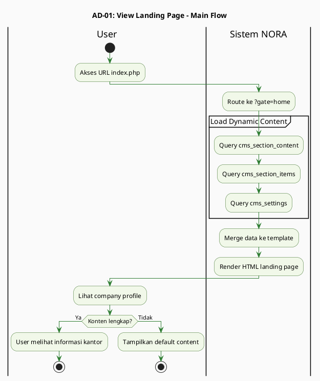

### Alternative Flows (Testable)

| **Scenario** | **Trigger** | **Expected Result** | **Test Case** |
|--------------|-------------|---------------------|---------------|
| Konten CMS kosong | cms_section_content NULL | Tampil placeholder | AD-01-ALT-01 |
| Database down | Connection failed | Error 500 | AD-01-EX-01 |

---

## AD-02: Track Berkas (Self-Service)

### Deskripsi
Aktivitas klien melacak status berkas menggunakan nomor resi secara mandiri tanpa login.

### Main Flow (Testable Steps)

| **Step** | **Actor** | **Action** | **System Response** | **Expected Result** | **Test Data** |
|----------|-----------|------------|---------------------|---------------------|---------------|
| 1 | Klien | Buka `?gate=lacak` | Form tracking tampil | Input field visible | URL: `?gate=lacak` |
| 2 | Klien | Input nomor resi | Input: `NP-20240101-001` | Text terisi | NP-20240101-001 |
| 3 | Klien | Klik "Cari Berkas" | Submit form | Request dikirim | - |
| 4 | System | Sanitize input | Remove XSS/SQL chars | Input aman | - |
| 5 | System | Validate format resi | Regex validation | Format valid | - |
| 6 | System | Query `registrasi WHERE nomor_resi` | Get data berkas | Data ditemukan | registrasi |
| 7 | System | Query `registrasi_history` | Get timeline | History lengkap | registrasi_history |
| 8 | System | Query `kendala WHERE flag_active=1` | Check active flags | Kendala status | kendala |
| 9 | System | Render timeline 15 status | Highlight current_step | Timeline tampil | workflow_steps |
| 10 | System | Render tabel riwayat | Show history | History table | - |
| 11 | System | Check red flag | Conditional display | Red/Green message | kendala |
| 12 | Klien | Lihat hasil tracking | Timeline + history | Informasi lengkap | - |

### Activity Diagram PlantUML - Main Flow

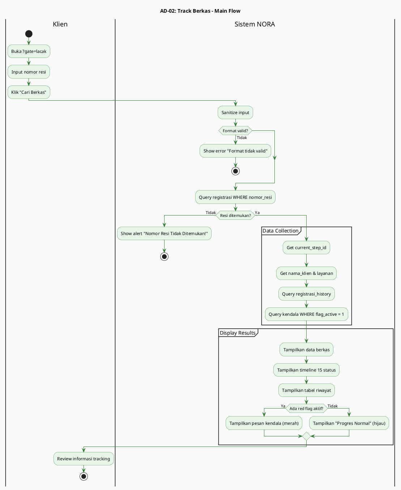

### Alternative Flows (Testable)

| **Scenario** | **Trigger** | **Expected Result** | **Test Case** |
|--------------|-------------|---------------------|---------------|
| Resi tidak ditemukan | Input: `NP-INVALID` | Alert "Tidak Ditemukan" | AD-02-ALT-01 |
| Format resi salah | Input: `ABC123` | Error "Format tidak valid" | AD-02-ALT-02 |
| Berkas selesai | Status = 14 | Pesan "Berkas selesai" | AD-02-ALT-03 |

---

## AD-03: Login Staff/Notaris

### Deskripsi
Aktivitas autentikasi Admin/Notaris dengan role-based access control dan brute force protection.

### Main Flow (Testable Steps)

| **Step** | **Actor** | **Action** | **System Response** | **Expected Result** | **Test Data** |
|----------|-----------|------------|---------------------|---------------------|---------------|
| 1 | User | Klik "Staf Login" | Redirect ke `?gate=login` | Form login tampil | - |
| 2 | User | Input email | `admin@notaris.com` | Text terisi | admin@notaris.com |
| 3 | User | Input password | `password123` | Masked input | password123 |
| 4 | User | Klik "Login" | Submit form | Request dikirim | - |
| 5 | System | Sanitize input | Trim & escape | Input bersih | - |
| 6 | System | Validate tidak kosong | Check empty fields | Validasi lolos | - |
| 7 | System | Query `users WHERE email` | Get user record | User ditemukan | users |
| 8 | System | Check `is_active = true` | Verify account status | Akun aktif | users |
| 9 | System | `password_verify(input, hash)` | BCRYPT verification | Hash match | password_hash |
| 10 | System | Reset `login_attempts` | Set attempt_count = 0 | Counter reset | login_attempts |
| 11 | System | Create session | Store user data & role | Session aktif | $_SESSION |
| 12 | System | Log ke `audit_log` | Record LOGIN_SUCCESS | Audit tercatat | audit_log |
| 13 | System | Check role | Role-based redirect | Redirect sukses | - |
| 14 | User | Masuk ke dashboard | Akses sistem | Login sukses | - |

### Activity Diagram PlantUML - Main Flow

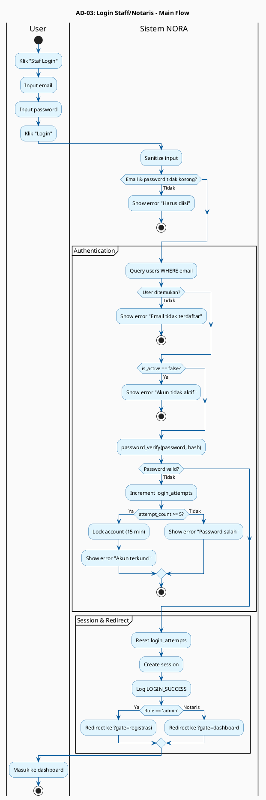

### Alternative Flows (Testable)

| **Scenario** | **Trigger** | **Expected Result** | **Test Case** |
|--------------|-------------|---------------------|---------------|
| Email kosong | Input: `""` | Error "Harus diisi" | AD-03-ALT-01 |
| Email tidak terdaftar | Wrong email | Error "Tidak terdaftar" | AD-03-ALT-02 |
| Password salah (1-4x) | Wrong password | Error "Password salah" | AD-03-ALT-03 |
| Password salah (5x) | 5 wrong attempts | Account locked | AD-03-ALT-04 |

---

## AD-04: Registrasi Berkas Baru

### Deskripsi
Aktivitas Admin mendaftarkan berkas klien dengan auto-generate resi dan WhatsApp notification.

### Main Flow (Testable Steps)

| **Step** | **Actor** | **Action** | **System Response** | **Expected Result** | **Test Data** |
|----------|-----------|------------|---------------------|---------------------|---------------|
| 1 | Admin | Buka `?gate=registrasi` | List registrasi tampil | Halaman terbuka | - |
| 2 | Admin | Klik "Tambah Data" | Form registrasi tampil | Input form | - |
| 3 | Admin | Input nama_klien | `Budi Santoso` | Text terisi | Budi Santoso |
| 4 | Admin | Input hp_klien | `081234567890` | Text terisi | 081234567890 |
| 5 | Admin | Pilih layanan | Dropdown selected | Selected | layanan_id = 1 |
| 6 | Admin | Klik "Simpan" | Submit form | Request dikirim | - |
| 7 | System | Sanitize all inputs | Trim & escape | Input bersih | - |
| 8 | System | Validate required fields | Check kosong | Validasi lolos | - |
| 9 | System | Generate unique resi | `NP-20240101-001` | Resi unik | NP-20240101-001 |
| 10 | System | BEGIN TRANSACTION | Start DB transaction | Transaction open | - |
| 11 | System | INSERT INTO registrasi | current_step_id = 1 | Data tersimpan | registrasi |
| 12 | System | INSERT INTO audit_log | Action: REGISTER_NEW | Audit tercatat | audit_log |
| 13 | System | COMMIT TRANSACTION | Commit DB changes | Data permanent | - |
| 14 | System | Call sendWhatsApp() | Async WA send | WA queued | message_templates |
| 15 | System | Display success | "Data tersimpan" | Feedback sukses | - |
| 16 | Admin | Lihat list refresh | Berkas baru muncul | List updated | - |

### Activity Diagram PlantUML - Main Flow

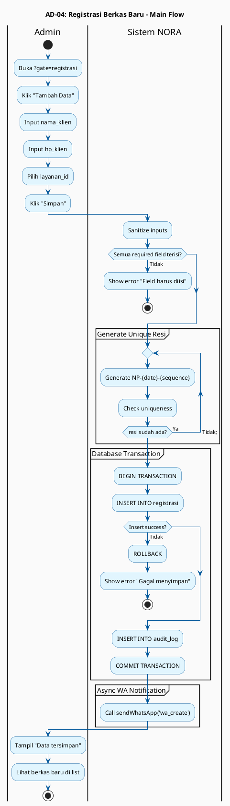

### Alternative Flows (Testable)

| **Scenario** | **Trigger** | **Expected Result** | **Test Case** |
|--------------|-------------|---------------------|---------------|
| Nama kosong | Input: `""` | Error "Nama harus diisi" | AD-04-ALT-01 |
| HP format salah | Input: `ABC123` | Error "Format HP tidak valid" | AD-04-ALT-02 |
| DB insert gagal | Connection error | Rollback + error | AD-04-EX-01 |

---

## AD-05: Edit Data Registrasi

### Deskripsi
Aktivitas Admin mengoreksi data klien dengan validation dan audit trail.

### Main Flow (Testable Steps)

| **Step** | **Actor** | **Action** | **System Response** | **Expected Result** | **Test Data** |
|----------|-----------|------------|---------------------|---------------------|---------------|
| 1 | Admin | Buka `?gate=registrasi` | List registrasi tampil | Halaman terbuka | - |
| 2 | Admin | Cari berkas | Filter/search | Berkas ditemukan | - |
| 3 | Admin | Klik "Edit" | Form edit tampil | Form populated | - |
| 4 | System | Query registrasi | Get current data | Data loaded | registrasi |
| 5 | System | Check status < 14 | Verify editable | Edit allowed | - |
| 6 | Admin | Ubah nama_klien | `Budi Santoso Jr.` | Text berubah | Budi Santoso Jr. |
| 7 | Admin | Ubah hp_klien | `081234567899` | Text berubah | 081234567899 |
| 8 | Admin | Klik "Update" | Submit form | Request dikirim | - |
| 9 | System | Sanitize inputs | Trim & escape | Input bersih | - |
| 10 | System | Check ada perubahan | Compare old vs new | Changes detected | - |
| 11 | System | BEGIN TRANSACTION | Start DB transaction | Transaction open | - |
| 12 | System | UPDATE registrasi | Set new values | Data terupdate | registrasi |
| 13 | System | INSERT audit_log | old_value & new_value | Audit tercatat | audit_log |
| 14 | System | COMMIT TRANSACTION | Commit changes | Data permanent | - |
| 15 | Admin | Lihat feedback | "Data diperbarui" | Success message | - |

### Activity Diagram PlantUML - Main Flow

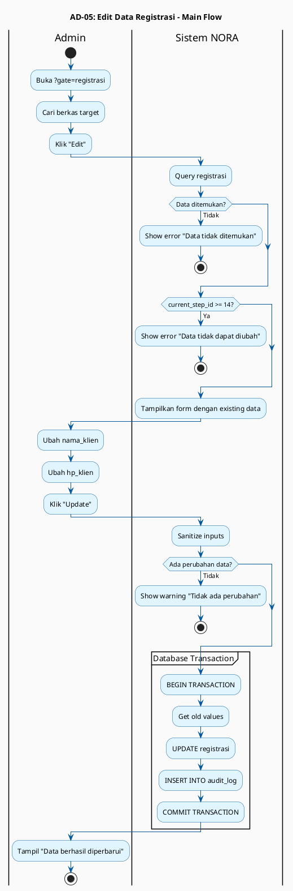

### Alternative Flows (Testable)

| **Scenario** | **Trigger** | **Expected Result** | **Test Case** |
|--------------|-------------|---------------------|---------------|
| Data tidak ditemukan | Invalid ID | Error "Tidak ditemukan" | AD-05-ALT-01 |
| Status >= 14 | Finalized case | Error "Tidak dapat diubah" | AD-05-ALT-02 |
| Tidak ada perubahan | Same data | Warning "Tidak ada perubahan" | AD-05-ALT-03 |

---

## AD-06: Update Status Berkas (15 Status)

### Deskripsi
Aktivitas core sistem NORA dengan sequential logic dan one-click automation.

### Main Flow (Testable Steps)

| **Step** | **Actor** | **Action** | **System Response** | **Expected Result** | **Test Data** |
|----------|-----------|------------|---------------------|---------------------|---------------|
| 1 | Admin | Buka Dashboard | List berkas tampil | Halaman terbuka | - |
| 2 | Admin | Pilih berkas | Klik baris berkas | Detail terbuka | registrasi_id = 1 |
| 3 | Admin | Klik "Update Progres" | Load progress form | Form tampil | - |
| 4 | System | Query current_step_id | Get status saat ini | Status loaded | current_step_id = 3 |
| 5 | System | Render tombol n+1 | Only show next status | Tombol status 4 aktif | workflow_steps |
| 6 | System | Check status <= 4 | Safe point check | Enable/disable Batal | - |
| 7 | System | Load note_templates | Get default note | Note populated | note_templates |
| 8 | Admin | Review note | Lihat catatan default | Note tampil | - |
| 9 | Admin | Klik tombol status 4 | Select next status | Status selected | to_step_id = 4 |
| 10 | Admin | Edit catatan (opsional) | Add custom note | Note updated | - |
| 11 | Admin | Klik "Simpan & Kirim Notif" | Submit update | Request dikirim | - |
| 12 | System | Validate sequential | Check 3→4 valid | Validation pass | - |
| 13 | System | BEGIN TRANSACTION | Start DB transaction | Transaction open | - |
| 14 | System | UPDATE registrasi | current_step_id = 4 | Status updated | registrasi |
| 15 | System | INSERT registrasi_history | Log transition | History recorded | registrasi_history |
| 16 | System | COMMIT TRANSACTION | Commit changes | Data permanent | - |
| 17 | System | Update web tracking | Invalidate cache | Real-time update | - |
| 18 | System | Call sendWhatsApp() | Async WA send | WA queued | message_templates |
| 19 | System | Partial refresh | HTMX reload | Dashboard updated | - |
| 20 | Admin | Lihat status baru | Status 4 aktif | Update sukses | - |

### Activity Diagram PlantUML - Main Flow

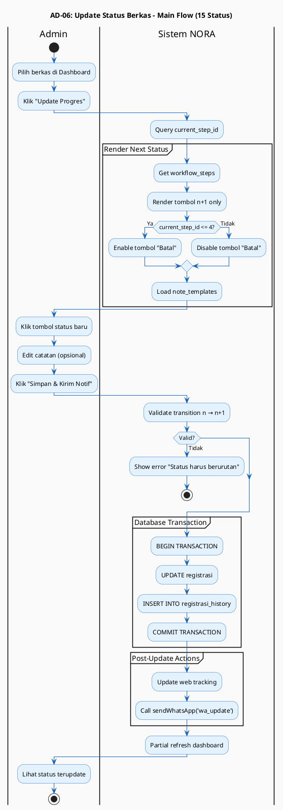

### 15 Status Workflow (Testable Transitions)

| **From** | **To** | **Status Name** | **Batal?** | **Test Case** |
|----------|--------|-----------------|------------|---------------|
| 0 | 1 | Persyaratan | ✓ | AD-06-TR-01 |
| 1 | 2 | Administrasi | ✓ | AD-06-TR-02 |
| 2 | 3 | Validasi Sertifikat | ✓ | AD-06-TR-03 |
| 3 | 4 | Pengecekan Sertifikat | ✓ | AD-06-TR-04 |
| 4 | 5 | Pembayaran Pajak | ✗ **Safe Point** | AD-06-TR-05 |
| 5 | 6 | Validasi Pajak | ✗ | AD-06-TR-06 |
| 6 | 7 | Penomoran Akta | ✗ | AD-06-TR-07 |
| 7 | 8 | Pendaftaran | ✗ | AD-06-TR-08 |
| 8 | 9 | Pembayaran PNBP | ✗ | AD-06-TR-09 |
| 9 | 10 | Pemeriksaan Pertanahan | ✗ | AD-06-TR-10 |
| 10 | 11 | Perbaikan (Opsional) | ✗ | AD-06-TR-11 |
| 11 | 12 | Selesai | ✗ | AD-06-TR-12 |
| 12 | 13 | Diserahkan | ✗ | AD-06-TR-13 |
| 13 | 14 | Kasus Ditutup | ✗ | AD-06-TR-14 |

### Alternative Flows (Testable)

| **Scenario** | **Trigger** | **Expected Result** | **Test Case** |
|--------------|-------------|---------------------|---------------|
| Skip status (1→3) | Invalid transition | Error "Status harus berurutan" | AD-06-ALT-01 |
| Status 14/15 | Finished case | Error "Berkas sudah selesai" | AD-06-ALT-02 |

---

## AD-07: Manage CMS Content

### Deskripsi
Aktivitas Notaris mengelola konten landing page, template, layanan, dan identitas kantor.

### Main Flow (Testable Steps)

| **Step** | **Actor** | **Action** | **System Response** | **Expected Result** | **Test Data** |
|----------|-----------|------------|---------------------|---------------------|---------------|
| 1 | Notaris | Buka `?gate=cms_editor` | CMS modules tampil | Halaman terbuka | - |
| 2 | System | Load CMS modules | Show 4 modul options | Menu lengkap | - |
| 3 | Notaris | Pilih "Edit Beranda" | Load CMS editor | Editor tampil | - |
| 4 | System | Query cms_section_content | Get current content | Data loaded | cms_section_content |
| 5 | Notaris | Edit hero_text | Update text | Text berubah | - |
| 6 | Notaris | Upload gambar baru | Select JPG file | File selected | image.jpg (<2MB) |
| 7 | Notaris | Klik "Simpan" | Submit form | Request dikirim | - |
| 8 | System | Validate upload | Check format & size | Validation pass | - |
| 9 | System | Sanitize HTML | XSS prevention | Clean HTML | - |
| 10 | System | UPDATE cms_section_content | Save changes | Content updated | cms_section_content |
| 11 | System | INSERT audit_log | Log changes | Audit recorded | audit_log |
| 12 | System | Display success | "Sukses Diperbarui" | Feedback tampil | - |
| 13 | Notaris | Refresh landing page | See updated content | Changes visible | - |

### Activity Diagram PlantUML - Main Flow

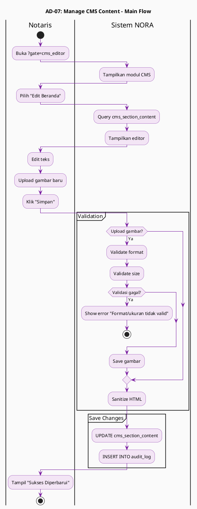

### Alternative Flows (Testable)

| **Scenario** | **Trigger** | **Expected Result** | **Test Case** |
|--------------|-------------|---------------------|---------------|
| Upload format salah | File: `.pdf` | Error "Format tidak valid" | AD-07-ALT-01 |
| Upload terlalu besar | File: `5MB` | Error "Ukuran melebihi 2MB" | AD-07-ALT-02 |

---

## AD-08: Manage Workflow Steps

### Deskripsi
Aktivitas Notaris mengkonfigurasi logika 15 status termasuk SLA dan behavior role.

### Main Flow (Testable Steps)

| **Step** | **Actor** | **Action** | **System Response** | **Expected Result** | **Test Data** |
|----------|-----------|------------|---------------------|---------------------|---------------|
| 1 | Notaris | Akses CMS Workflow | Load workflow config | Halaman terbuka | - |
| 2 | System | Query workflow_steps | Get 15 status | Data loaded | workflow_steps |
| 3 | Notaris | Pilih status 5 | "Pembayaran Pajak" | Detail tampil | status_id = 5 |
| 4 | System | Load form config | Show current settings | Form populated | - |
| 5 | Notaris | Edit sla_days | `7` (hari) | Value changed | sla_days = 7 |
| 6 | Notaris | Edit behavior_role | Select "Normal" | Role changed | behavior_role |
| 7 | Notaris | Klik "Simpan" | Submit changes | Request dikirim | - |
| 8 | System | Validate config | Check logic rules | Validation pass | - |
| 9 | System | BEGIN TRANSACTION | Start DB transaction | Transaction open | - |
| 10 | System | UPDATE workflow_steps | Save new config | Config updated | workflow_steps |
| 11 | System | INSERT audit_log | Log changes | Audit recorded | audit_log |
| 12 | System | COMMIT TRANSACTION | Commit changes | Data permanent | - |
| 13 | System | Invalidate cache | Refresh rules | Cache cleared | - |
| 14 | Notaris | Lihat feedback | "Workflow diperbarui" | Success message | - |

### Activity Diagram PlantUML - Main Flow

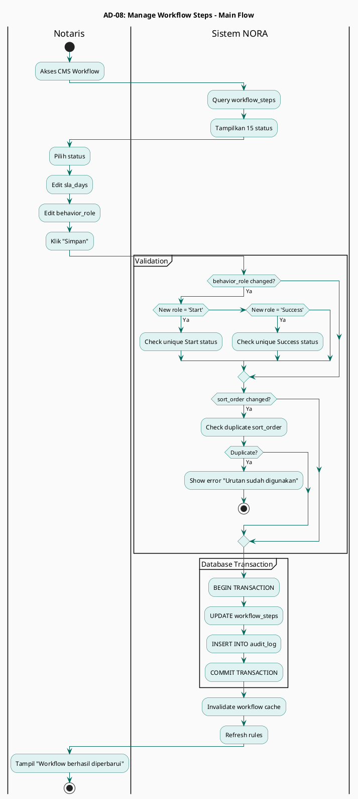

### Alternative Flows (Testable)

| **Scenario** | **Trigger** | **Expected Result** | **Test Case** |
|--------------|-------------|---------------------|---------------|
| Duplicate sort_order | Same order value | Error "Urutan sudah digunakan" | AD-08-ALT-01 |

---

## AD-09: Finalisasi & Tutup Kasus

### Deskripsi
Aktivitas Notaris melakukan review akhir dengan auto-cleanup red flag dan permanent lock.

### Main Flow (Testable Steps)

| **Step** | **Actor** | **Action** | **System Response** | **Expected Result** | **Test Data** |
|----------|-----------|------------|---------------------|---------------------|---------------|
| 1 | Notaris | Buka `?gate=tutup_registrasi` | Load finalisasi page | Halaman terbuka | - |
| 2 | System | Query status 13/15 | Filter berkas siap | List tampil | registrasi |
| 3 | Notaris | Pilih berkas | Klik baris berkas | Detail loaded | registrasi_id = 1 |
| 4 | System | Load full history | Get timeline & notes | History lengkap | registrasi_history |
| 5 | System | Load kendala | Get active & resolved | Kendala info | kendala |
| 6 | Notaris | Review riwayat | Baca timeline | Review done | - |
| 7 | Notaris | Klik "Konfirmasi Tutup" | Show confirmation | Warning tampil | - |
| 8 | System | Show irreversible warning | "Data terkunci permanen" | Warning displayed | - |
| 9 | Notaris | Klik "Ya, Tutup Kasus" | Confirm finalization | Request dikirim | - |
| 10 | System | BEGIN TRANSACTION | Start DB transaction | Transaction open | - |
| 11 | System | UPDATE kendala | flag_active = 0 | Red flags cleared | kendala |
| 12 | System | UPDATE registrasi | status = 14 | Status updated | registrasi |
| 13 | System | INSERT registrasi_history | Log finalization | History recorded | registrasi_history |
| 14 | System | INSERT audit_log | Log FINALIZE_CASE | Audit recorded | audit_log |
| 15 | System | COMMIT TRANSACTION | Commit all changes | Data permanent | - |
| 16 | System | Set read-only state | Disable edit buttons | Data locked | - |
| 17 | System | Display summary | "Kasus Ditutup" | Success message | - |
| 18 | Notaris | Lihat summary | Finalization done | Process complete | - |

### Activity Diagram PlantUML - Main Flow

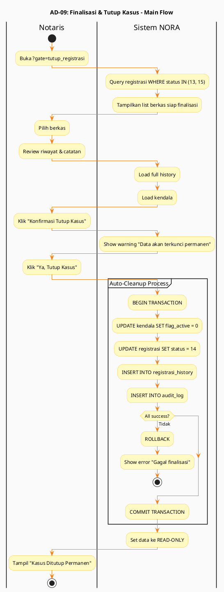

### Alternative Flows (Testable)

| **Scenario** | **Trigger** | **Expected Result** | **Test Case** |
|--------------|-------------|---------------------|---------------|
| Re-open case | Klik "Tinjau Ulang" | Status kembali ke 11 | AD-09-ALT-01 |
| No berkas siap | All status < 13 | Message "Tidak ada berkas" | AD-09-ALT-02 |
| Cancel finalization | Click "Tidak" | Back to list | AD-09-ALT-03 |

---

## AD-10: Manage Red Flag (Kendala)

### Deskripsi
Aktivitas Admin menandai dan menyelesaikan kendala berkas.

### Main Flow (Testable Steps)

| **Step** | **Actor** | **Action** | **System Response** | **Expected Result** | **Test Data** |
|----------|-----------|------------|---------------------|---------------------|---------------|
| 1 | Admin | Buka detail berkas | Load detail page | Halaman terbuka | registrasi_id = 1 |
| 2 | System | Check status < 14 | Verify editable | Add allowed | - |
| 3 | Admin | Klik "Tambah Kendala" | Show form kendala | Form tampil | - |
| 4 | Admin | Input keterangan | `Sertifikat belum verifikasi` | Text terisi | - |
| 5 | Admin | Klik "Simpan" | Submit kendala | Request dikirim | - |
| 6 | System | Validate keterangan | Check not empty | Validation pass | - |
| 7 | System | BEGIN TRANSACTION | Start DB transaction | Transaction open | - |
| 8 | System | INSERT INTO kendala | flag_active = 1 | Red flag created | kendala |
| 9 | System | INSERT INTO audit_log | Log ADD_KENDALA | Audit recorded | audit_log |
| 10 | System | COMMIT TRANSACTION | Commit changes | Data permanent | - |
| 11 | Admin | Lihat red flag | Flag muncul merah | Visual feedback | - |

### Activity Diagram PlantUML - Main Flow

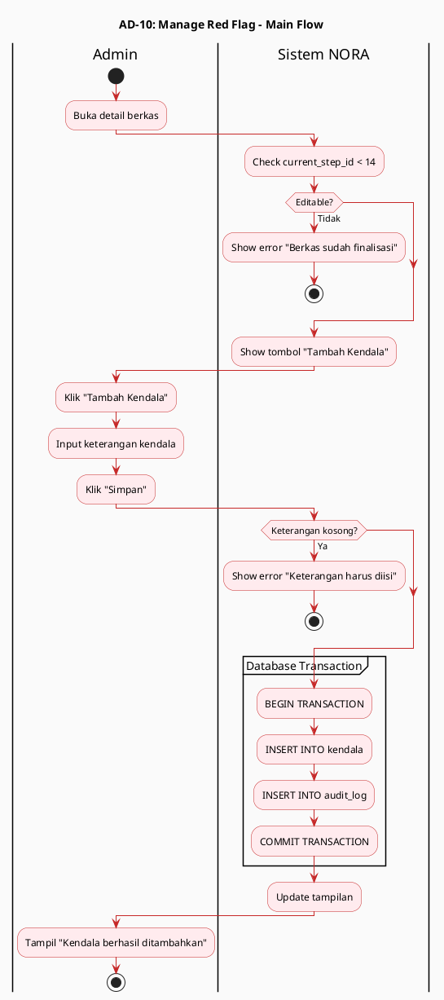

### Alternative Flows (Testable)

| **Scenario** | **Trigger** | **Expected Result** | **Test Case** |
|--------------|-------------|---------------------|---------------|
| Keterangan kosong | Empty input | Error "Harus diisi" | AD-10-ALT-01 |
| Status >= 14 | Finalized case | Error "Tidak bisa tambah kendala" | AD-10-ALT-02 |

---

## AD-11: View Dashboard Performance

### Deskripsi
Aktivitas Notaris memantau performa operasional dengan metrik dan SLA tracking.

### Main Flow (Testable Steps)

| **Step** | **Actor** | **Action** | **System Response** | **Expected Result** | **Test Data** |
|----------|-----------|------------|---------------------|---------------------|---------------|
| 1 | Notaris | Login ke sistem | Authenticated session | Login sukses | - |
| 2 | Notaris | Akses `?gate=dashboard` | Load dashboard | Halaman terbuka | - |
| 3 | System | Query registrasi aktif | Get active cases | Data loaded | registrasi |
| 4 | System | Query registrasi_history | Get full timeline | History loaded | registrasi_history |
| 5 | System | Query workflow_steps | Get SLA config | SLA loaded | workflow_steps |
| 6 | System | Calculate metrics | Count, avg time, SLA% | Metrics calculated | - |
| 7 | System | Render chart | Status distribution | Chart tampil | - |
| 8 | System | Render table | Longest processing files | Table tampil | - |
| 9 | Notaris | Review metrics | Analyze bottlenecks | Dashboard visible | - |

### Activity Diagram PlantUML - Main Flow

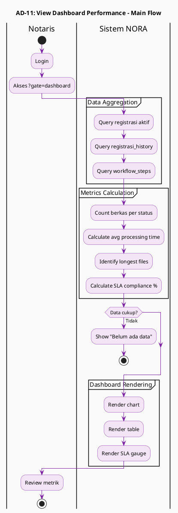

### Alternative Flows (Testable)

| **Scenario** | **Trigger** | **Expected Result** | **Test Case** |
|--------------|-------------|---------------------|---------------|
| No data | Empty database | Message "Belum ada data" | AD-11-ALT-01 |

---

## AD-12: Auto-Kirim WhatsApp Notification

### Deskripsi
Aktivitas sistem mengirim WA otomatis dengan template dan retry logic (async process).

### Main Flow (Testable Steps)

| **Step** | **Actor** | **Action** | **System Response** | **Expected Result** | **Test Data** |
|----------|-----------|------------|---------------------|---------------------|---------------|
| 1 | System | Trigger dari UC-04/UC-06 | Start async process | Function called | - |
| 2 | System | Determine template_key | UC-04 → wa_create | Key set | - |
| 3 | System | Query message_templates | Get template content | Template loaded | message_templates |
| 4 | System | Query registrasi | Get nama, hp, resi | Data loaded | registrasi |
| 5 | System | Query layanan | Get nama_layanan | Layanan loaded | layanan |
| 6 | System | Replace [Nama_Klien] | Variable replacement | Replaced | - |
| 7 | System | Replace [Nama_Layanan] | Variable replacement | Replaced | - |
| 8 | System | Replace [Nomor_Resi] | Variable replacement | Replaced | - |
| 9 | System | Call WA Gateway API | HTTP POST request | API called | API endpoint |
| 10 | System | Check API response | If success → done | Response 200 | - |
| 11 | System | If fail → retry | Wait 30 seconds | Retry attempt | - |
| 12 | System | Retry (max 3x) | Repeat API call | Retry 2/3 | - |
| 13 | System | INSERT wa_logs | Log status | Log recorded | wa_logs |
| 14 | System | Return to caller | Continue main flow | Async complete | - |

### Activity Diagram PlantUML - Main Flow

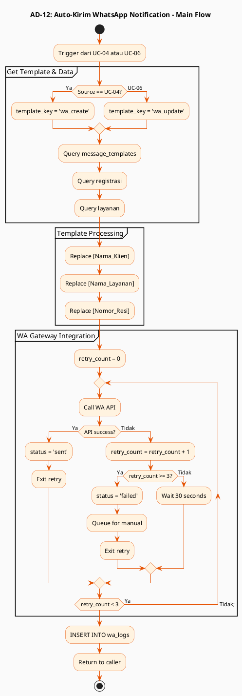

### Alternative Flows (Testable)

| **Scenario** | **Trigger** | **Expected Result** | **Test Case** |
|--------------|-------------|---------------------|---------------|
| Template not found | Invalid key | Log error, use default | AD-12-ALT-01 |
| API fail (1-2x) | Gateway timeout | Retry after 30s | AD-12-ALT-02 |
| API fail (3x) | Max retries | Queue for manual | AD-12-ALT-03 |

---

## AD-13: Overall System Activity Flow

### Deskripsi
Aktivitas lengkap seluruh sistem NORA dengan synchronous & asynchronous flows.

### Activity Diagram PlantUML

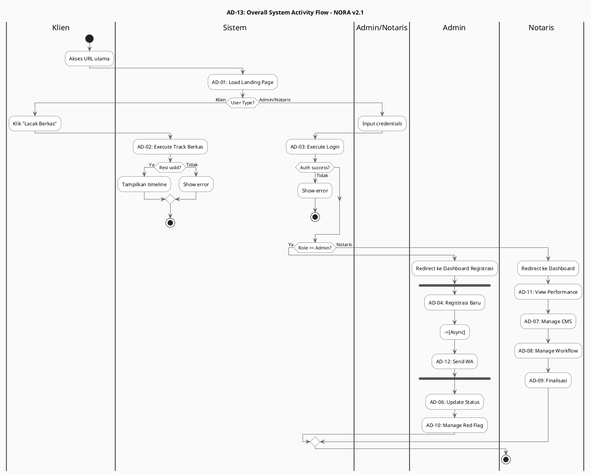

---

## 📊 Testing Summary

### Test Coverage Matrix

| **Activity Diagram** | **Main Flow** | **Alt Flows** | **Exception Flows** | **Total Test Cases** |
|---------------------|---------------|---------------|---------------------|---------------------|
| AD-01 | 6 steps | 2 | 1 | 9 |
| AD-02 | 12 steps | 3 | 0 | 15 |
| AD-03 | 14 steps | 4 | 0 | 18 |
| AD-04 | 16 steps | 3 | 1 | 20 |
| AD-05 | 12 steps | 3 | 0 | 15 |
| AD-06 | 20 steps | 2 | 0 | 36 (14 transitions) |
| AD-07 | 13 steps | 2 | 0 | 15 |
| AD-08 | 11 steps | 1 | 0 | 12 |
| AD-09 | 18 steps | 3 | 0 | 21 |
| AD-10 | 10 steps | 2 | 0 | 12 |
| AD-11 | 9 steps | 1 | 0 | 10 |
| AD-12 | 14 steps | 3 | 0 | 17 |
| **TOTAL** | **155 steps** | **29 scenarios** | **2 scenarios** | **200 test cases** |

### Sync vs Async Activities

| **Activity** | **Type** | **Blocking?** | **Wait Time** | **Test Method** |
|--------------|----------|---------------|---------------|-----------------|
| AD-01 to AD-11 | Sync | Yes | Immediate | Manual click & verify |
| AD-12 (WA Send) | **Async** | **No** | 0-90 seconds | Check wa_logs table |

### Database Transaction Summary

| **Activity** | **Transaction** | **Tables Affected** | **Rollback Tested?** |
|--------------|-----------------|---------------------|----------------------|
| AD-04 | BEGIN...COMMIT | registrasi, audit_log | Yes |
| AD-05 | BEGIN...COMMIT | registrasi, audit_log | No |
| AD-06 | BEGIN...COMMIT | registrasi, registrasi_history | No |
| AD-08 | BEGIN...COMMIT | workflow_steps, audit_log | No |
| AD-09 | BEGIN...COMMIT | registrasi, kendala, history, audit_log | Yes |
| AD-10 | BEGIN...COMMIT | kendala, audit_log | No |

---

*Dibuat untuk dokumentasi teknis Sistem NORA v2.1 - Kantor Notaris Sri Anah, S.H., M.Kn.*