# 📐 Application Modeling Documentation - Sistem NORA v2.1

## Kantor Notaris Sri Anah, S.H., M.Kn.

---

## 1. Class Diagram

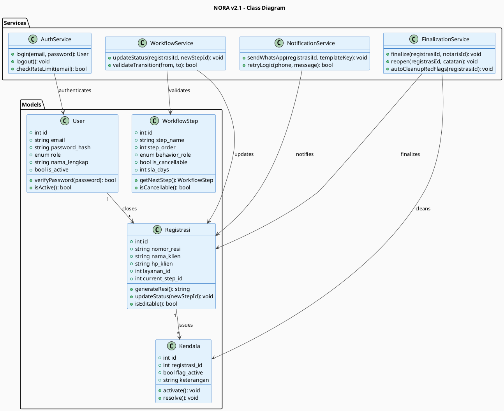

---

## 2. Sequence Diagrams

### 2.1 Sequence: Login User

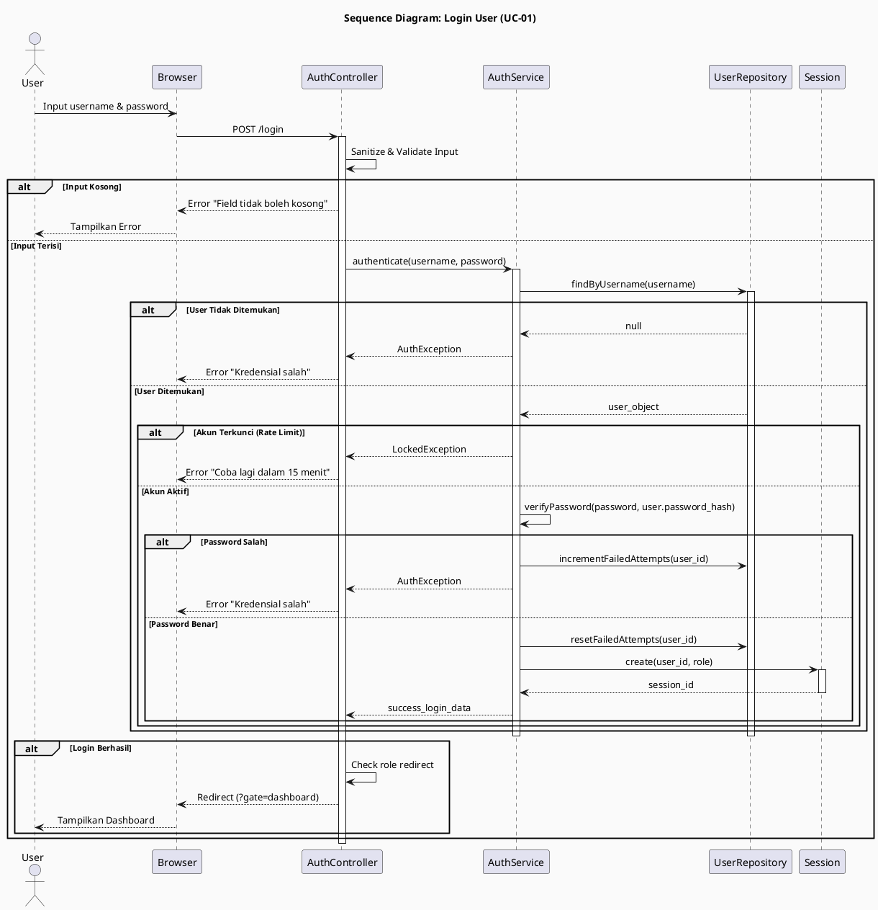

### 2.2 Sequence: Registrasi Berkas Baru

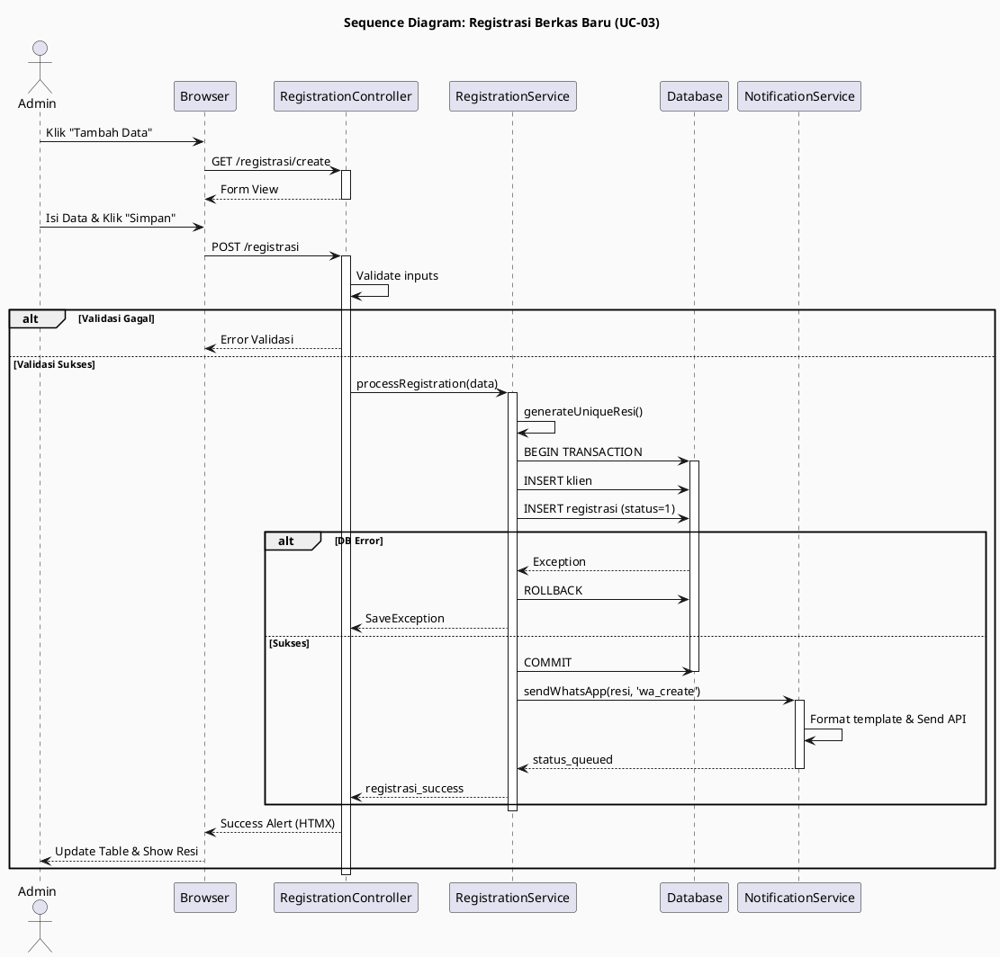

### 2.3 Sequence: Update Status Berkas

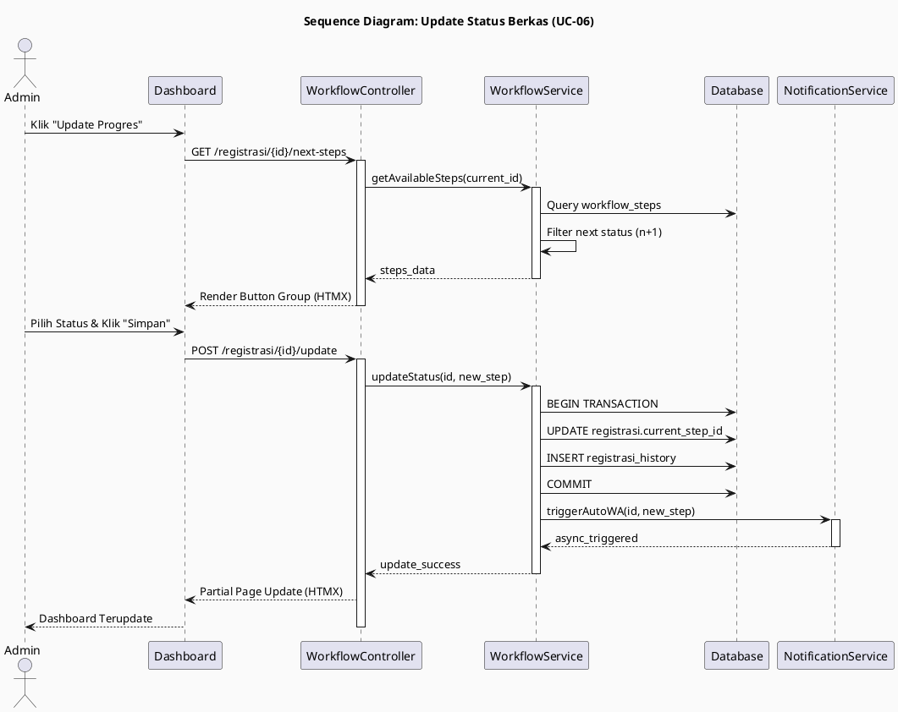

### 2.4 Sequence: Track Berkas

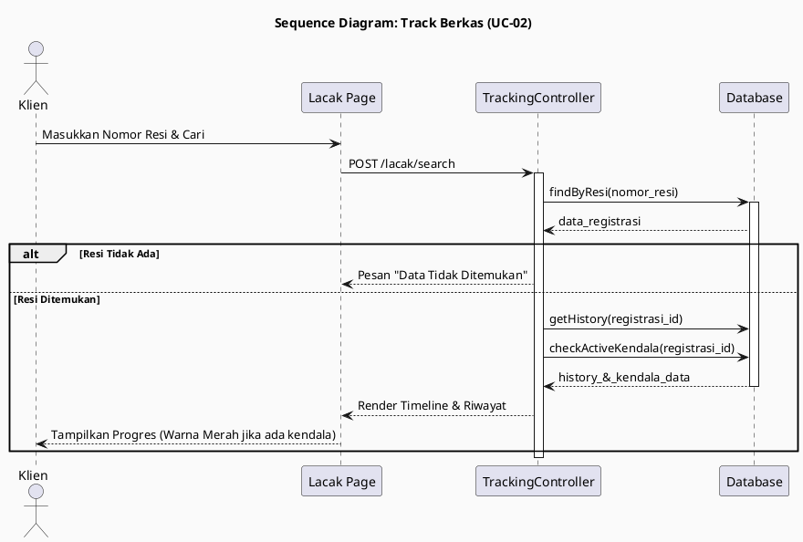

### 2.5 Sequence: Finalisasi

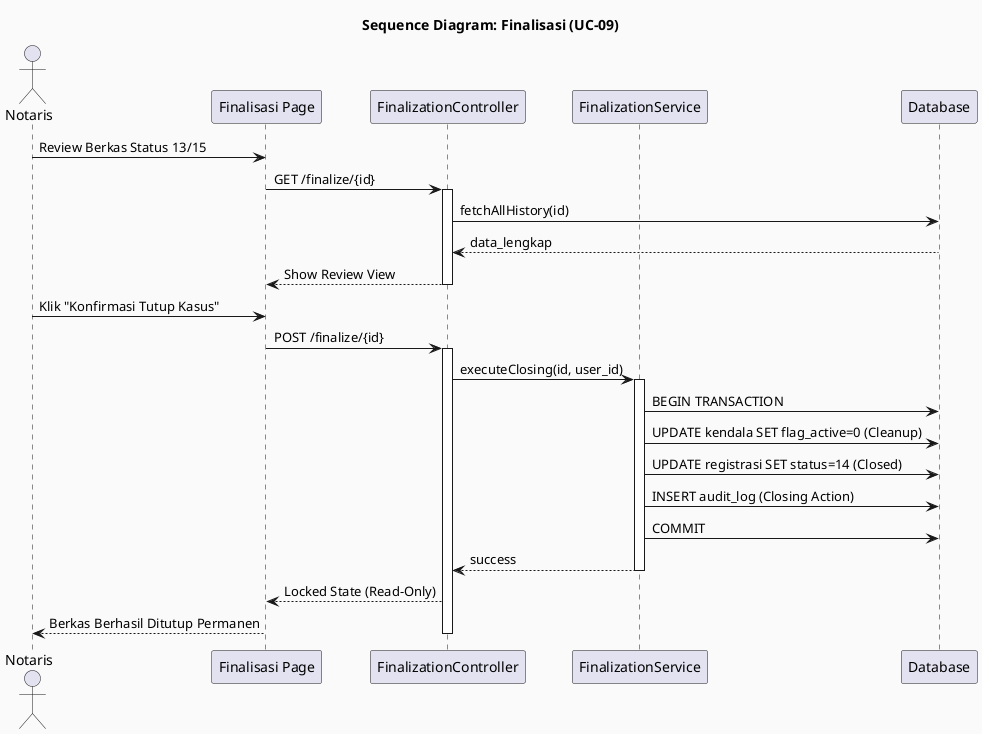

### 2.6 Sequence: WhatsApp Notification

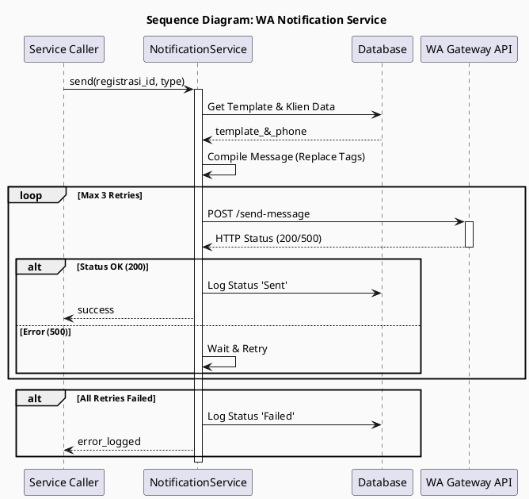

---

## 3. State Machine Diagram

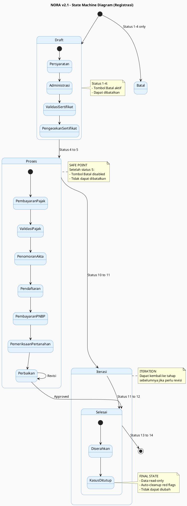

---

## 4. Component Diagram

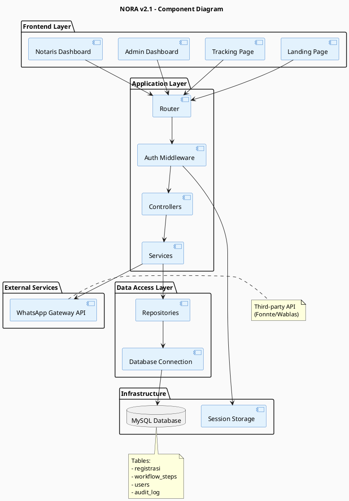

---

## 5. Deployment Diagram

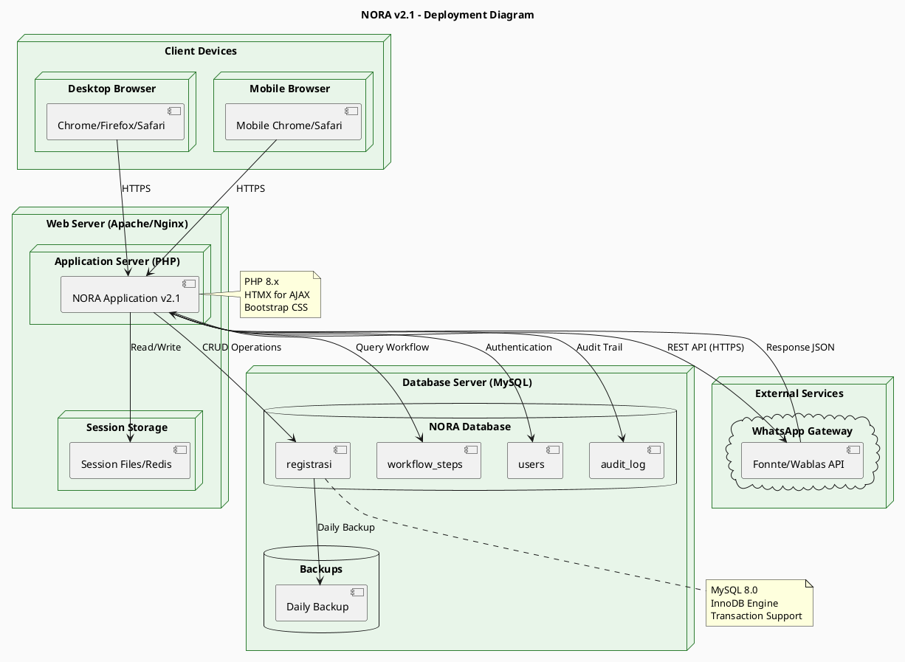

---

## 6. Screen Flow Diagram

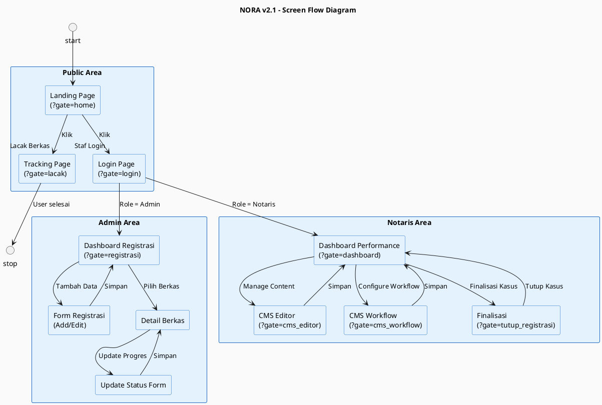

---

## 7. Authentication Flow

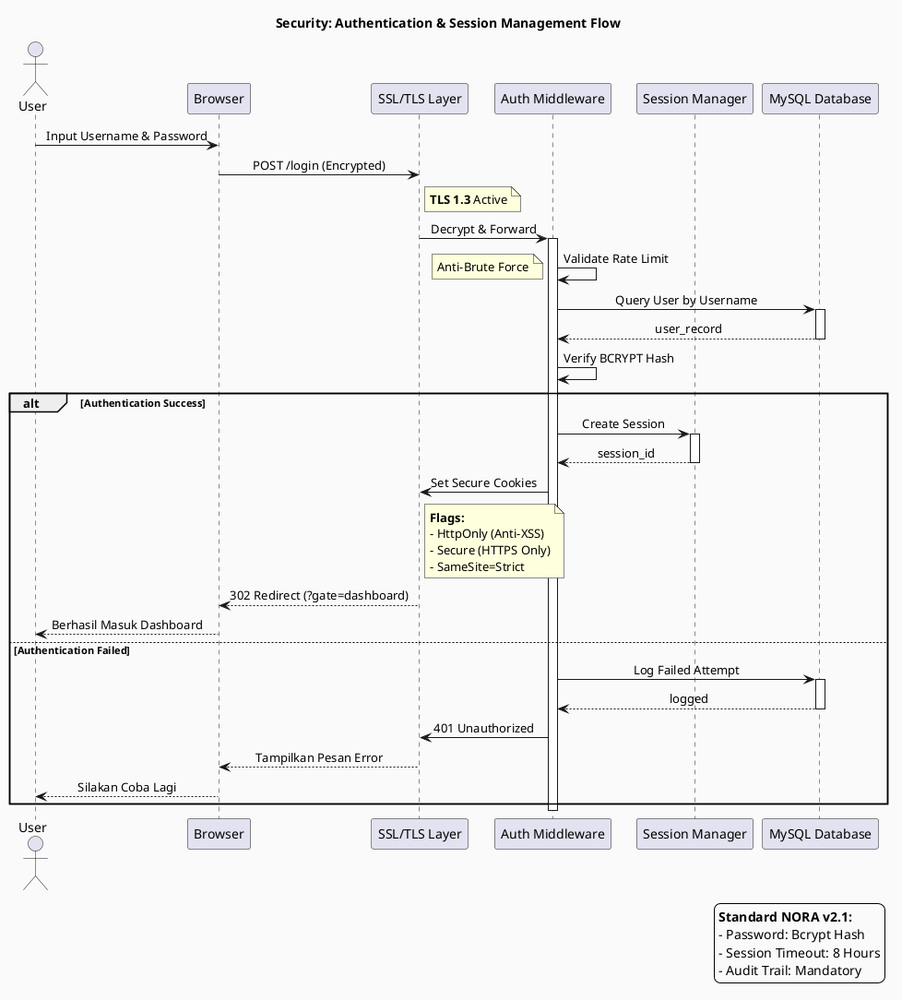

---

## 8. Caching Strategy

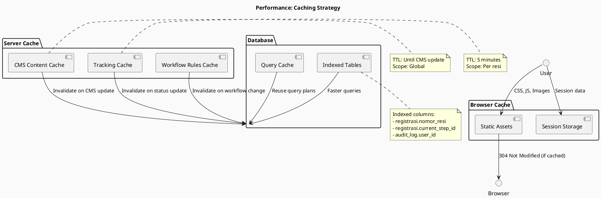

---

## 9. Error Handling Strategy

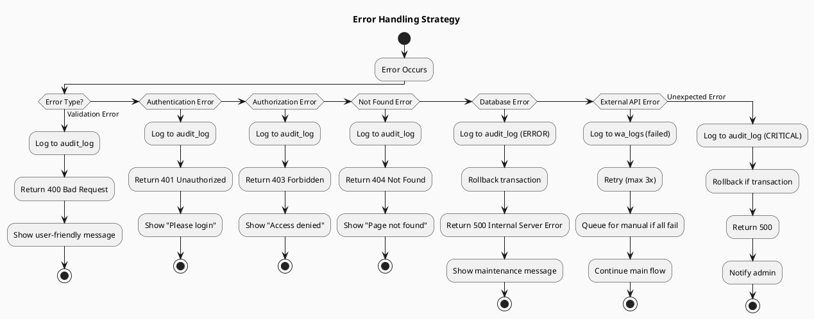

---

*Dibuat untuk dokumentasi teknis Sistem NORA v2.1 - Kantor Notaris Sri Anah, S.H., M.Kn.*
