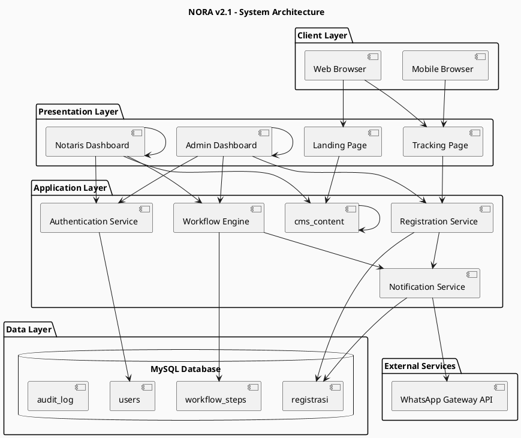
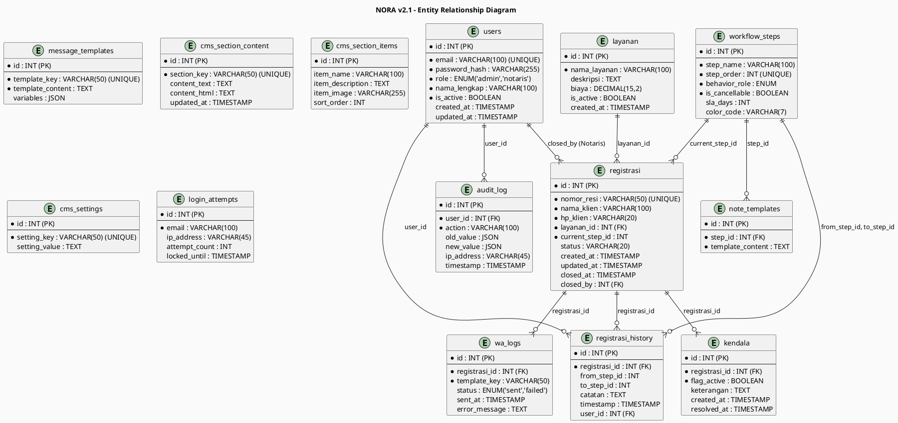
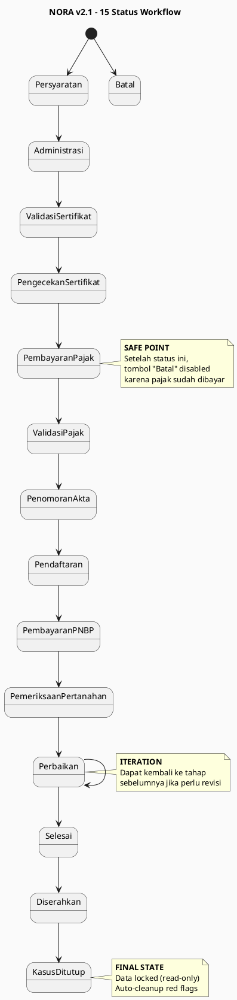
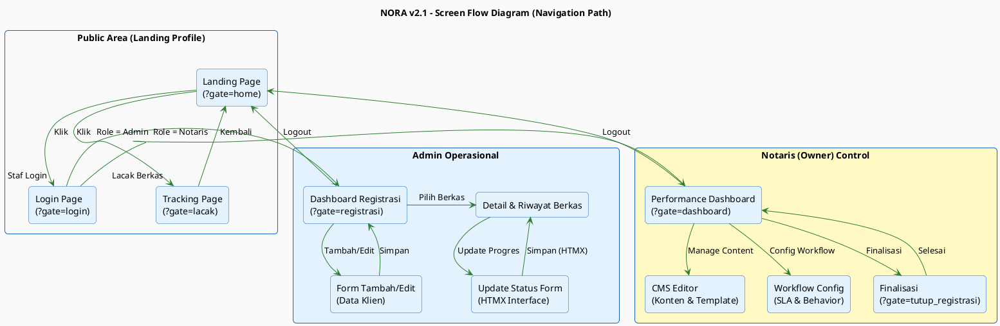

# 📋 Product Requirements Document (PRD) - Sistem NORA v2.1

## Kantor Notaris Sri Anah, S.H., M.Kn.

---

## 📑 Document Information

| **Item**             | **Detail**                                          |
| -------------------------- | --------------------------------------------------------- |
| **Product Name**     | NORA (Notaris Online Registration & Tracking Application) |
| **Version**          | 2.1                                                       |
| **Document Version** | 1.0                                                       |
| **Date**             | April 2026                                                |
| **Author**           | Development Team                                          |
| **Stakeholders**     | Notaris Sri Anah, S.H., M.Kn. (Owner), Admin Staff, Klien |
| **Status**           | Final                                                     |

---

## 1. Executive Summary

### 1.1 Product Vision

Sistem NORA adalah platform digital untuk Kantor Notaris Sri Anah yang mengubah proses manual pencatatan berkas menjadi sistem terintegrasi dengan tracking real-time, automasi WhatsApp notification, dan workflow 15 status yang terstruktur.

### 1.2 Problem Statement

**Before (AS-IS):**

- Admin mencatat berkas di buku besar secara manual
- Klien harus menghubungi admin untuk cek status (interruptive)
- Tidak ada tracking sistematis
- Rawan human error dan kehilangan data

**After (TO-BE):**

- Semua data terdigitalisasi dalam satu dashboard
- Klien dapat tracking mandiri via web (self-service)
- 15 status workflow terstruktur dengan automasi
- WhatsApp notification otomatis setiap update

### 1.3 Business Objectives

| **Objective**   | **KPI**            | **Target**      |
| --------------------- | ------------------------ | --------------------- |
| Efisiensi Operasional | Waktu update status      | < 30 detik per berkas |
| Transparansi          | Klien cek status mandiri | 90% tracking via web  |
| Otomasi               | WhatsApp notification    | 100% otomatis         |
| Akurasi               | Error rate               | < 1%                  |
| Kepuasan Klien        | NPS Score                | > 70                  |

---

## 2. Product Overview

### 2.1 System Architecture Overview



### 2.2 User Roles & Permissions

| **Role**            | **Access Level** | **Key Permissions**                      | **Restrictions**                 |
| ------------------------- | ---------------------- | ---------------------------------------------- | -------------------------------------- |
| **Klien (Public)**  | Read-only              | Track berkas via resi                          | No login, no edit                      |
| **Admin**           | Write                  | CRUD registrasi, update status, manage kendala | Cannot finalize cases, cannot edit CMS |
| **Notaris (Owner)** | Full                   | All admin + CMS, workflow config, finalisasi   | None                                   |

### 2.3 Core Features

| **Feature**       | **Priority** | **UC Reference** | **Business Value**      |
| ----------------------- | ------------------ | ---------------------- | ----------------------------- |
| Self-Service Tracking   | P0 (Critical)      | UC-02                  | Reduce admin interruption 90% |
| 15 Status Workflow      | P0 (Critical)      | UC-06                  | Standardize legal procedure   |
| WhatsApp Automation     | P0 (Critical)      | UC-12                  | Instant client notification   |
| Registration Management | P0 (Critical)      | UC-04, UC-05           | Digital record keeping        |
| CMS Editor              | P1 (High)          | UC-07                  | Dynamic content management    |
| Workflow Configuration  | P1 (High)          | UC-08                  | Flexible process adaptation   |
| Case Finalization       | P1 (High)          | UC-09                  | Audit & compliance            |
| Red Flag Management     | P1 (High)          | UC-10                  | Issue tracking                |
| Performance Dashboard   | P2 (Medium)        | UC-11                  | Business intelligence         |

---

## 3. Functional Requirements

### 3.1 Public Features

#### FR-01: Landing Page

- **ID:** FR-01
- **Priority:** P0
- **Description:** Halaman utama menampilkan company profile dinamis
- **Acceptance Criteria:**
  - [ ] Konten loaded dari database (cms_section_content)
  - [ ] Responsive design (desktop & mobile)
  - [ ] Load time < 2 seconds
  - [ ] Navigation ke Tracking & Login
- **Test Case:** AD-01

#### FR-02: Self-Service Tracking

- **ID:** FR-02
- **Priority:** P0
- **Description:** Klien track berkas via nomor resi tanpa login
- **Acceptance Criteria:**
  - [ ] Input nomor resi valid (format NP-xxxx)
  - [ ] Timeline 15 status dengan highlight current
  - [ ] History tabel chronological
  - [ ] Red flag display jika ada kendala
  - [ ] Response time < 1 second
- **Test Case:** AD-02

### 3.2 Admin Features

#### FR-03: Authentication

- **ID:** FR-03
- **Priority:** P0
- **Description:** Login system dengan role-based access
- **Acceptance Criteria:**
  - [ ] Email & password validation
  - [ ] BCRYPT password hashing
  - [ ] Max 5 failed attempts → lock 15 min
  - [ ] Session timeout 8 hours
  - [ ] Role-based redirect (Admin/Notaris)
- **Test Case:** AD-03

#### FR-04: Registration Management

- **ID:** FR-04
- **Priority:** P0
- **Description:** CRUD data registrasi berkas
- **Acceptance Criteria:**
  - [ ] Auto-generate unique resi (NP-xxxx)
  - [ ] Form validation (required fields, HP format)
  - [ ] Edit blocked after status 14
  - [ ] Audit trail for all changes
  - [ ] WA notification on create
- **Test Case:** AD-04, AD-05

#### FR-05: Status Update (15 Workflow)

- **ID:** FR-05
- **Priority:** P0
- **Description:** Update progres berkas melalui 15 status terstruktur
- **Acceptance Criteria:**
  - [ ] Sequential progression only (n → n+1)
  - [ ] Safe point: Batal button disabled after status 5
  - [ ] Auto-load note templates
  - [ ] One-click automation (DB update + WA + timeline)
  - [ ] Partial page refresh (HTMX)
  - [ ] Real-time tracking update
- **Test Case:** AD-06

#### FR-06: Red Flag Management

- **ID:** FR-06
- **Priority:** P1
- **Description:** Tandai dan selesaikan kendala berkas
- **Acceptance Criteria:**
  - [ ] Multiple flags per berkas allowed
  - [ ] Keterangan required
  - [ ] Blocked after status 14
  - [ ] Visual indicator (red highlight)
  - [ ] Auto-cleanup on finalization
- **Test Case:** AD-10

### 3.3 Notaris Features

#### FR-07: CMS Content Management

- **ID:** FR-07
- **Priority:** P1
- **Description:** Edit landing page content & templates
- **Acceptance Criteria:**
  - [ ] Edit beranda (hero, about, services)
  - [ ] Upload images (max 2MB, JPG/PNG/WEBP)
  - [ ] XSS prevention on HTML content
  - [ ] Template placeholder validation
  - [ ] CRUD layanan with usage check
- **Test Case:** AD-07

#### FR-08: Workflow Configuration

- **ID:** FR-08
- **Priority:** P1
- **Description:** Configure 15 status logic & SLA
- **Acceptance Criteria:**
  - [ ] Edit label, order, SLA days
  - [ ] Set behavior_role (Normal/Start/Iteration/Success/Fail)
  - [ ] Toggle is_cancellable flag
  - [ ] Validation: unique Start/Success roles
  - [ ] Validation: no duplicate sort_order
- **Test Case:** AD-08

#### FR-09: Case Finalization

- **ID:** FR-09
- **Priority:** P1
- **Description:** Review & permanently close cases
- **Acceptance Criteria:**
  - [ ] Filter only status 13 or 15
  - [ ] Full history review
  - [ ] Re-open option (back to status 11)
  - [ ] Irreversible confirmation dialog
  - [ ] Auto-cleanup all red flags
  - [ ] Set status 14 & lock data
- **Test Case:** AD-09

#### FR-10: Performance Dashboard

- **ID:** FR-10
- **Priority:** P2
- **Description:** Monitor operational metrics & SLA
- **Acceptance Criteria:**
  - [ ] Total berkas per status
  - [ ] Average processing time
  - [ ] Longest files per stage
  - [ ] SLA compliance percentage
  - [ ] Visual charts & tables
- **Test Case:** AD-11

### 3.4 System Features

#### FR-11: WhatsApp Automation

- **ID:** FR-11
- **Priority:** P0
- **Description:** Auto-send WA notifications
- **Acceptance Criteria:**
  - [ ] Template-based messages
  - [ ] Variable replacement ([Nama_Klien], etc.)
  - [ ] Async non-blocking process
  - [ ] Retry logic (max 3x, 30s interval)
  - [ ] Log all attempts (wa_logs)
  - [ ] Queue failed messages for manual
- **Test Case:** AD-12

#### FR-12: Audit Trail

- **ID:** FR-12
- **Priority:** P0
- **Description:** Log all system activities
- **Acceptance Criteria:**
  - [ ] Log all CRUD operations
  - [ ] Record old & new values
  - [ ] Timestamp & user_id
  - [ ] IP address logging
  - [ ] Immutable audit records
- **Test Case:** All ADs

---

## 4. Non-Functional Requirements

### 4.1 Performance Requirements

| **Metric**    | **Requirement** | **Measurement** |
| ------------------- | --------------------- | --------------------- |
| Page Load Time      | < 2 seconds           | Lighthouse            |
| API Response Time   | < 500ms               | Server logs           |
| Concurrent Users    | 50 users              | Load testing          |
| Database Query Time | < 100ms               | EXPLAIN analysis      |
| WA Send Time        | < 3 seconds           | wa_logs               |

### 4.2 Security Requirements

| **Requirement** | **Implementation** | **Verification** |
| --------------------- | ------------------------ | ---------------------- |
| Password Security     | BCRYPT hashing (cost 12) | Code review            |
| SQL Injection         | Prepared statements      | Penetration test       |
| XSS Prevention        | HTML sanitization        | OWASP ZAP scan         |
| CSRF Protection       | Token validation         | Security audit         |
| Session Security      | HTTPS, timeout 8h        | Configuration review   |
| Rate Limiting         | 5 attempts/15min         | Load testing           |
| Data Encryption       | TLS 1.3 for transit      | SSL Labs test          |

### 4.3 Availability Requirements

| **Metric**   | **Target**   | **Monitoring** |
| ------------------ | ------------------ | -------------------- |
| Uptime             | 99.5% monthly      | Uptime monitoring    |
| Backup Frequency   | Daily              | Backup logs          |
| Recovery Time      | < 4 hours          | DR plan              |
| Maintenance Window | Sunday 02:00-04:00 | Schedule             |

### 4.4 Compatibility Requirements

| **Platform** | **Version** | **Support Level** |
| ------------------ | ----------------- | ----------------------- |
| Chrome             | 90+               | Full                    |
| Firefox            | 88+               | Full                    |
| Safari             | 14+               | Full                    |
| Mobile Chrome      | 90+               | Full                    |
| Mobile Safari      | 14+               | Full                    |

---

## 5. Data Model

### 5.1 Entity Relationship Diagram



### 5.2 Database Schema Summary

| **Table**    | **Records (Est.)** | **Growth Rate** | **Retention** |
| ------------------ | ------------------------ | --------------------- | ------------------- |
| users              | 10                       | Static                | Permanent           |
| layanan            | 20                       | Low                   | Permanent           |
| registrasi         | 500/year                 | 500/year              | Permanent           |
| workflow_steps     | 15                       | Static                | Permanent           |
| registrasi_history | 7500/year                | 15x registrasi        | Permanent           |
| kendala            | 100/year                 | Variable              | Permanent           |
| message_templates  | 15                       | Low                   | Permanent           |
| wa_logs            | 8000/year                | 16x registrasi        | 2 years             |
| audit_log          | 10000/year               | High                  | 5 years             |
| cms_* tables       | 50                       | Low                   | Permanent           |
| login_attempts     | 100/month                | Medium                | 30 days             |

---

## 6. Workflow Diagram

### 6.1 15 Status Workflow



### 6.2 Business Rules Summary

| **Rule ID** | **Rule**                   | **Enforcement** | **UC Reference** |
| ----------------- | -------------------------------- | --------------------- | ---------------------- |
| BR-01             | Sequential status progression    | System validation     | UC-06                  |
| BR-02             | Safe point at status 5           | Disable Batal button  | UC-06                  |
| BR-03             | Unique resi number               | Database constraint   | UC-04                  |
| BR-04             | Edit blocked after status 14     | System check          | UC-05                  |
| BR-05             | Only Notaris can finalize        | Role check            | UC-09                  |
| BR-06             | Auto-cleanup red flags           | Transaction trigger   | UC-09                  |
| BR-07             | WA notification on create/update | Async process         | UC-12                  |
| BR-08             | Audit all changes                | Mandatory logging     | All UC                 |
| BR-09             | Password hash BCRYPT             | Application layer     | UC-03                  |
| BR-10             | Session timeout 8 hours          | Session management    | UC-03                  |

---

## 7. Integration Requirements

### 7.1 WhatsApp Gateway Integration

| **Aspect** | **Specification**  |
| ---------------- | ------------------------ |
| Provider         | Fonnte / Wablas / Other  |
| API Type         | REST API (HTTPS)         |
| Authentication   | API Key (Bearer token)   |
| Rate Limit       | 100 messages/hour        |
| Retry Policy     | 3 attempts, 30s interval |
| Timeout          | 10 seconds per request   |
| Message Format   | JSON payload             |
| Error Handling   | Log & queue for manual   |

**API Request Format:**

```json
POST https://api.whatsapp-gateway.com/send
Headers:
  Authorization: Bearer {API_KEY}
  Content-Type: application/json

Body:
{
  "phone": "6281234567890",
  "message": "Template content with variables replaced",
  "countryCode": "62"
}
```

### 7.2 Template Variables

| **Variable**   | **Source Table** | **Source Field** | **Example**     |
| -------------------- | ---------------------- | ---------------------- | --------------------- |
| `[Nama_Klien]`     | registrasi             | nama_klien             | Budi Santoso          |
| `[Nama_Layanan]`   | layanan                | nama_layanan           | Akta Jual Beli        |
| `[Nomor_Resi]`     | registrasi             | nomor_resi             | NP-20240101-001       |
| `[Status_Terbaru]` | workflow_steps         | step_name              | Pengecekan Sertifikat |

---

## 8. User Interface Specifications

### 8.1 Screen Flow Diagram



### 8.2 Responsive Design Requirements

| **Breakpoint** | **Width** | **Layout**                 |
| -------------------- | --------------- | -------------------------------- |
| Mobile               | < 768px         | Single column, hamburger menu    |
| Tablet               | 768px - 1024px  | Two columns, collapsible sidebar |
| Desktop              | > 1024px        | Full layout, fixed sidebar       |

---

## 9. Testing Strategy

### 9.1 Test Coverage Requirements

| **Test Type** | **Coverage Target** | **Method** |
| ------------------- | ------------------------- | ---------------- |
| Unit Tests          | 80% code coverage         | PHPUnit          |
| Integration Tests   | All API endpoints         | Postman/Newman   |
| E2E Tests           | Critical user journeys    | Cypress          |
| Performance Tests   | < 2s page load            | Lighthouse CI    |
| Security Tests      | OWASP Top 10              | OWASP ZAP        |

### 9.2 Test Environment

| **Environment** | **Purpose**  | **URL**      |
| --------------------- | ------------------ | ------------------ |
| Development           | Active development | localhost          |
| Staging               | UAT & testing      | staging.nora.local |
| Production            | Live system        | nora.notaris.com   |

---

## 10. Deployment & Release

### 10.1 Deployment Checklist

- [ ] Database migration executed
- [ ] Environment variables configured
- [ ] WhatsApp API key set
- [ ] SSL certificate installed
- [ ] Backup created
- [ ] Smoke tests passed
- [ ] Monitoring configured
- [ ] Rollback plan ready

### 10.2 Release Notes Template

```
Version: 2.1.0
Date: April 2026

New Features:
- Self-service tracking
- 15 status workflow
- WhatsApp automation

Bug Fixes:
- [List fixes]

Known Issues:
- [List issues]

Migration Notes:
- [Database changes]
```

---

## 11. Glossary

| **Term**       | **Definition**                    |
| -------------------- | --------------------------------------- |
| **Resi**       | Nomor registrasi unik (format: NP-xxxx) |
| **Red Flag**   | Tanda kendala pada berkas               |
| **Safe Point** | Batas pembatalan (status 5)             |
| **SLA**        | Service Level Agreement (target hari)   |
| **HTMX**       | Technology untuk partial page refresh   |
| **BCRYPT**     | Password hashing algorithm              |

---

## 12. Approval

| **Role** | **Name**        | **Signature** | **Date** |
| -------------- | --------------------- | ------------------- | -------------- |
| Product Owner  | Sri Anah, S.H., M.Kn. |                     |                |
| Lead Developer |                       |                     |                |
| QA Lead        |                       |                     |                |

---

*Document End - PRD NORA v2.1*
