# 📑 Use Case Documentation - Sistem NORA v2.1

## Kantor Notaris Sri Anah, S.H., M.Kn.

---

## Daftar Use Case

| **Use Case ID** | **Use Case Name**          | **Actor**       | **Priority** |
| --------------------- | -------------------------------- | --------------------- | ------------------ |
| UC-01                 | View Landing Page                | Klien, Admin, Notaris | High               |
| UC-02                 | Track Berkas (Self-Service)      | Klien                 | High               |
| UC-03                 | Login Staff/Notaris              | Admin, Notaris        | High               |
| UC-04                 | Registrasi Berkas Baru           | Admin                 | High               |
| UC-05                 | Edit Data Registrasi             | Admin                 | Medium             |
| UC-06                 | Update Status Berkas (15 Status) | Admin                 | High               |
| UC-07                 | Manage CMS Content               | Notaris               | Medium             |
| UC-08                 | Manage Workflow Steps            | Notaris               | Medium             |
| UC-09                 | Finalisasi & Tutup Kasus         | Notaris               | High               |
| UC-10                 | Manage Red Flag (Kendala)        | Admin                 | Medium             |
| UC-11                 | View Dashboard Performance       | Notaris               | Medium             |
| UC-12                 | Auto-Kirim WhatsApp Notification | System                | High               |

---

## UC-01: View Landing Page

### 1. Use Case Identification

- **Use Case ID:** UC-01
- **Use Case Name:** View Landing Page
- **Actor(s):** Klien, Admin, Notaris (Public)
- **Description:** Pengguna mengakses halaman utama sistem NORA yang menampilkan company profile dinamis dari CMS
- **Priority:** High
- **Frequency of Use:** Sangat Tinggi (setiap kali user akses URL utama)
- **Trigger:** User membuka URL utama aplikasi
- **Success Criteria:** Halaman landing page ter-load dengan konten dinamis dari database
- **Failure Criteria:** Halaman error atau konten tidak tampil

### 2. Preconditions

- Server NORA dalam kondisi online
- Database terhubung dan tabel `cms_section_content` serta `cms_section_items` tersedia
- Konten CMS sudah diinisialisasi

### 3. Postconditions

- Halaman landing page berhasil ditampilkan dengan konten dinamis
- User dapat menavigasi ke fitur Lacak Berkas atau Login

### 4. Main Flow (Alur Utama)

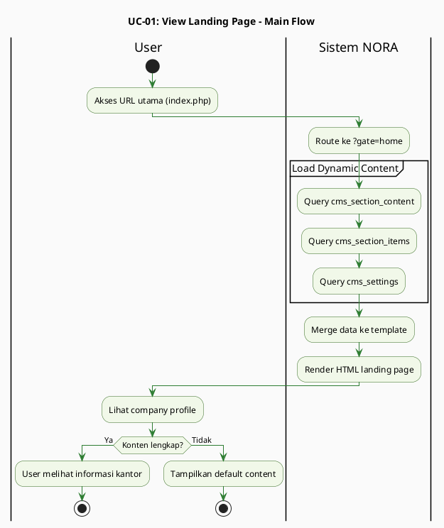

### 5. Alternative Flow

- **3A:** Konten CMS belum diisi → Sistem menampilkan placeholder/default content
- **3B:** Database tidak responsif → Sistem menampilkan fallback static content

### 6. Exception Flow

- **E1:** Server down → User melihat error page (500 Internal Server Error)
- **E2:** Koneksi database gagal → Sistem menampilkan maintenance mode

### 7. Business Rules

- Konten landing page harus dapat diedit oleh Notaris via CMS Editor
- Gambar yang diupload harus dalam format JPG/PNG/WEBP
- Tidak ada autentikasi required untuk akses public page

### 8. Data Requirements

- `cms_section_content` (hero_text, about_content, services_content)
- `cms_section_items` (item_name, item_description, item_image)
- `cms_settings` (office_name, office_address, contact_info)

### 9. Frequency of Use

Sangat Tinggi - setiap ada visitor akses URL utama

### 10. Related Use Cases

- UC-02: Track Berkas (via tombol "Lacak Berkas")
- UC-03: Login Staff/Notaris (via link "Staf Login")
- UC-07: Manage CMS Content (Notaris mengedit konten)

### 11. Notes / Assumptions

- Landing page adalah entry point default (`?gate=home`)
- User belum login dianggap sebagai public visitor

### 12. Security Consideration

- Public page tidak memerlukan autentikasi
- Database queries tetap menggunakan prepared statements untuk mencegah SQL injection

### 13. PlantUML Diagram

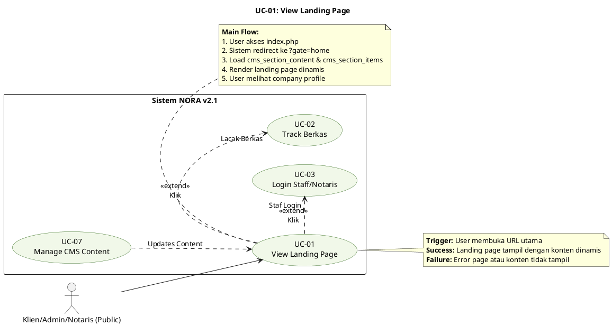

---

## UC-02: Track Berkas (Self-Service)

### 1. Use Case Identification

- **Use Case ID:** UC-02
- **Use Case Name:** Track Berkas (Self-Service)
- **Actor(s):** Klien
- **Description:** Klien dapat melacak status berkas secara mandiri menggunakan nomor resi tanpa perlu login
- **Priority:** High
- **Frequency of Use:** Tinggi (beberapa kali per hari)
- **Trigger:** Klien menginput nomor resi dan klik "Cari Berkas"
- **Success Criteria:** Timeline status berkas dan riwayat ditampilkan dengan akurat
- **Failure Criteria:** Nomor resi tidak ditemukan atau sistem gagal mengambil data

### 2. Preconditions

- Berkas sudah teregistrasi di sistem (memiliki nomor resi)
- Sistem NORA dalam kondisi online
- Klien memiliki nomor resi (format: NP-xxxx) yang diberikan saat registrasi

### 3. Postconditions

- Klien dapat melihat timeline 15 status berkas
- Jika ada kendala aktif, klien melihat pesan red flag
- Klien mengetahui posisi terkini berkas mereka

### 4. Main Flow (Alur Utama)

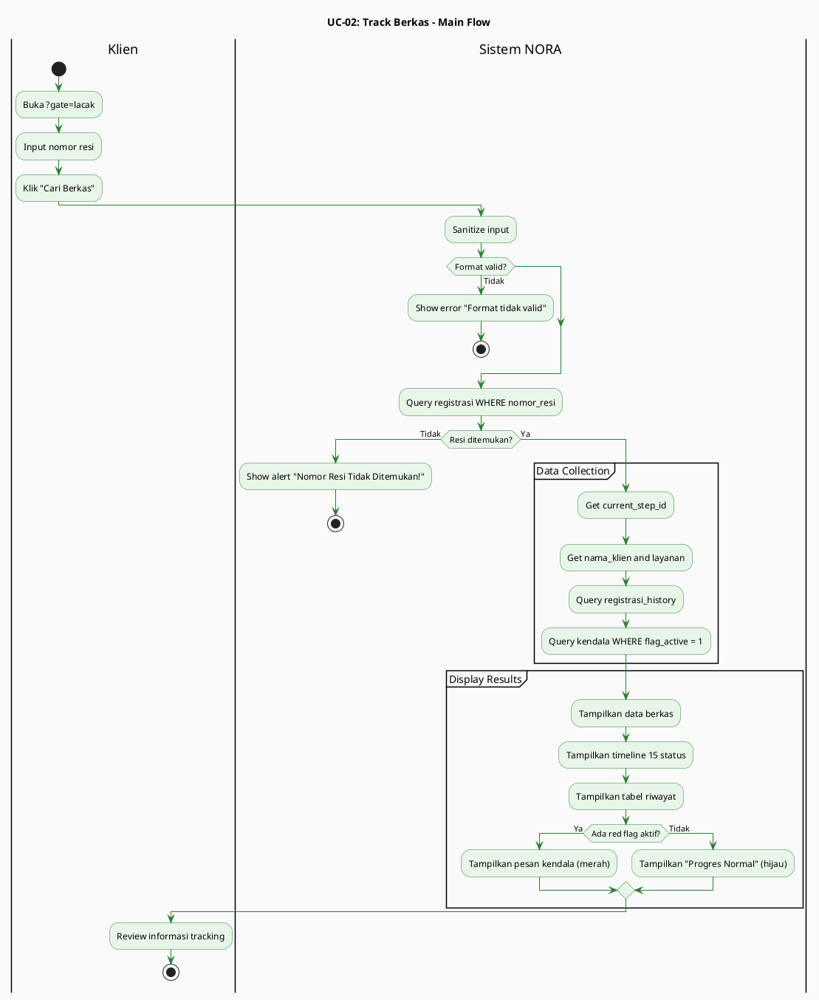

### 5. Alternative Flow

- **4A:** Nomor resi tidak valid/tidak ditemukan
  - Sistem menampilkan alert: "Nomor Resi Tidak Ditemukan!"
  - Klien diminta memeriksa kembali nomor resi
- **8A:** Berkas sudah selesai (status 14: Kasus Ditutup)
  - Sistem menampilkan pesan "Berkas telah selesai dan diserahkan"
- **8B:** Berkas dalam status batal
  - Sistem menampilkan pesan "Berkas dibatalkan"

### 6. Exception Flow

- **E1:** Database query timeout → Sistem menampilkan error message
- **E2:** Server overload → Halaman loading timeout

### 7. Business Rules

- Nomor resi bersifat unik (format: NP-xxxx)
- Tracking bersifat read-only, klien tidak dapat mengubah data
- Red flag menampilkan informasi kendala yang sedang aktif
- Riwayat status ditampilkan secara kronologis (terlama ke terbaru)

### 8. Data Requirements

- `registrasi` (id, nomor_resi, nama_klien, current_step_id, layanan_id)
- `registrasi_history` (id, registrasi_id, from_step_id, to_step_id, timestamp, catatan)
- `workflow_steps` (id, step_name, step_order, color_code)
- `kendala` (id, registrasi_id, flag_active, keterangan)

### 9. Frequency of Use

Tinggi - beberapa kali per hari saat klien mengecek progres berkas

### 10. Related Use Cases

- UC-04: Registrasi Berkas Baru (sumber nomor resi)
- UC-06: Update Status Berkas (mengubah current_step_id)
- UC-10: Manage Red Flag (mempengaruhi tampilan tracking)

### 11. Notes / Assumptions

- Klien tidak perlu login untuk tracking
- Tracking bersifat self-service untuk mengurangi beban admin

### 12. Security Consideration

- Input nomor resi harus di-sanitize untuk mencegah XSS dan SQL injection
- Tidak ada data sensitif klien yang ditampilkan selain nama dan status

### 13. PlantUML Diagram

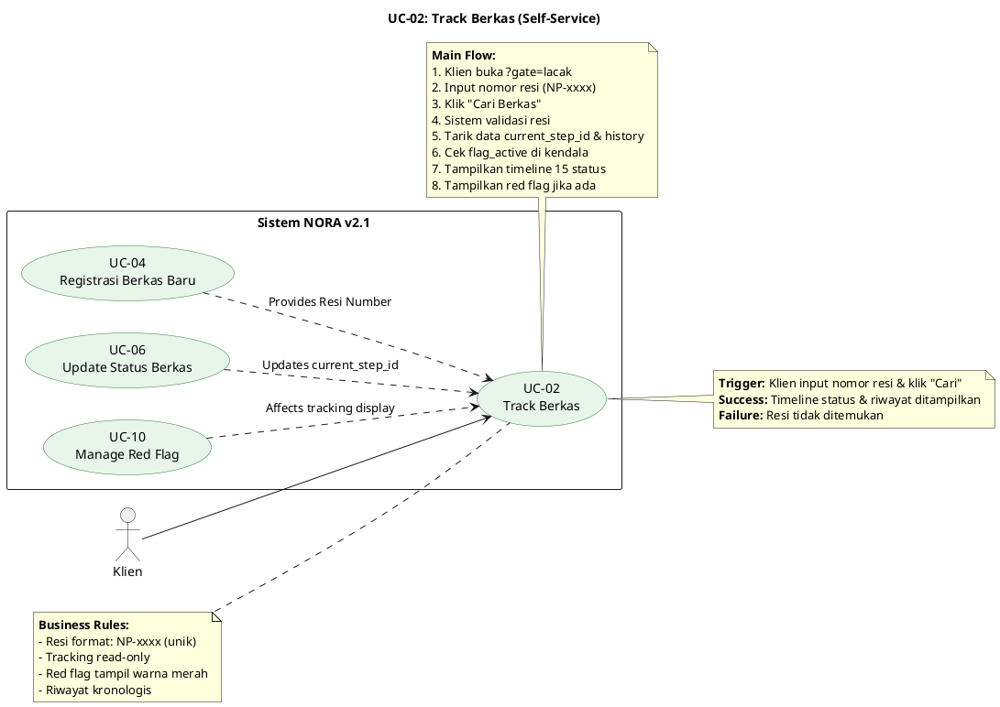

---

## UC-03: Login Staff/Notaris

### 1. Use Case Identification

- **Use Case ID:** UC-03
- **Use Case Name:** Login Staff/Notaris
- **Actor(s):** Admin, Notaris
- **Description:** Staff (Admin/Notaris) melakukan autentikasi untuk mengakses sistem internal NORA
- **Priority:** High
- **Frequency of Use:** Tinggi (setiap hari kerja)
- **Trigger:** User mengklik "Staf Login" dan submit form login
- **Success Criteria:** User terautentikasi dan diarahkan ke dashboard sesuai role
- **Failure Criteria:** Autentikasi gagal karena credential invalid atau akun terkunci

### 2. Preconditions

- User sudah terdaftar di tabel `users` dengan role yang sesuai
- Password sudah di-hash menggunakan `password_hash()`
- Sistem dalam kondisi online

3. Postconditions

- User berhasil terautentikasi
- Session aktif dengan role-based access control (RBAC)
- User diarahkan ke dashboard sesuai role (Admin/Notaris)
- Log aktivitas tercatat di `audit_log`

### 4. Main Flow (Alur Utama)

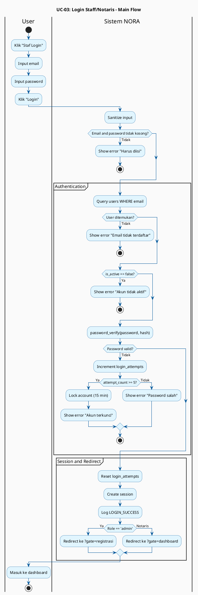

### 5. Alternative Flow

- **5A:** Username atau password kosong
  - Sistem menampilkan error: "Username dan password harus diisi"
- **6A:** Usernamel tidak terdaftar
  - Sistem menampilkan error: "Username tidak terdaftar"
- **7A:** Password salah
  - Sistem menampilkan error: "Password salah"
  - Sistem mencatat percobaan gagal di `login_attempts`
- **7B:** Akun terkunci (terlalu banyak percobaan gagal)
  - Sistem menampilkan error: "Akun terkunci, hubungi administrator"
  - User harus menunggu cooldown period atau reset manual

### 6. Exception Flow

- **E1:** Database connection lost → Sistem menampilkan error "Gagal terhubung ke database"
- **E2:** Session storage penuh → Sistem gagal membuat session
- **E3:** Brute force attack detected → Sistem meng-IP block sementara

### 7. Business Rules

- Password minimal 8 karakter
- Maksimum 5 percobaan login gagal → akun dikunci sementara (15 menit)
- Password harus di-hash menggunakan `password_hash()` dengan algoritma BCRYPT/ARGON2
- Session timeout setelah 8 jam tidak aktif
- Setiap login berhasil/gagal dicatat di `audit_log`

### 8. Data Requirements

- `users` (id, Username, password_hash, role, nama_lengkap, is_active)
- `login_attempts` (id, Username, ip_address, attempt_count, locked_until)
- `audit_log` (id, user_id, action, timestamp, ip_address)
- Session data (user_id, role, last_activity)

### 9. Frequency of Use

Tinggi - setiap hari kerja saat staff mulai shift

### 10. Related Use Cases

- UC-01: View Landing Page (entry point)
- UC-04: Registrasi Berkas Baru (akses setelah login)
- UC-06: Update Status Berkas (akses setelah login)
- UC-07: Manage CMS Content (akses Notaris setelah login)

### 11. Notes / Assumptions

- Role-based redirect: Admin ke Dashboard Registrasi, Notaris ke Dashboard Performance
- Password reset tidak termasuk dalam use case ini (manual process via admin)

### 12. Security Consideration

- Password di-hash dengan BCRYPT/ARGON2
- Prepared statements untuk prevent SQL injection
- Rate limiting untuk prevent brute force
- Session management dengan timeout
- HTTPS recommended untuk production

### 13. PlantUML Diagram

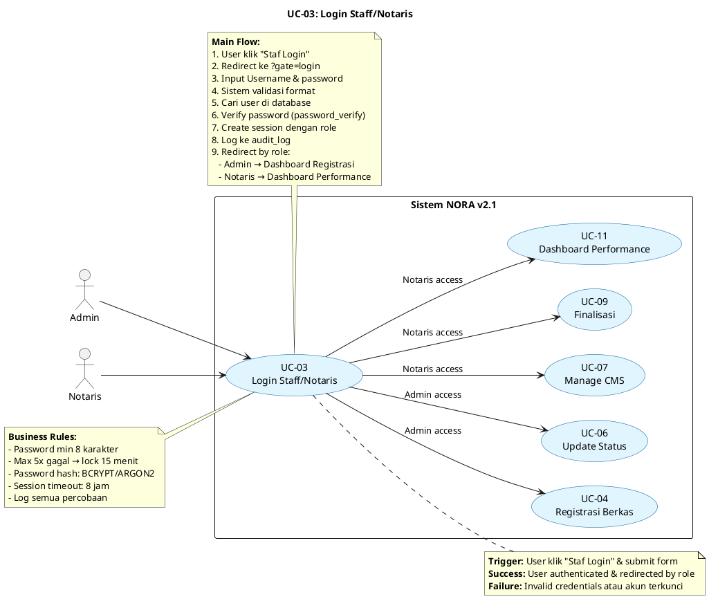

---

## UC-04: Registrasi Berkas Baru

### 1. Use Case Identification

- **Use Case ID:** UC-04
- **Use Case Name:** Registrasi Berkas Baru
- **Actor(s):** Admin
- **Description:** Admin mendaftarkan berkas klien baru ke sistem NORA dengan mengisi data awal dan memilih jenis layanan
- **Priority:** High
- **Frequency of Use:** Tinggi (setiap ada berkas baru masuk)
- **Trigger:** Admin klik "Tambah Data" dan submit form registrasi
- **Success Criteria:** Data tersimpan, nomor resi ter-generate, WA notification terkirim
- **Failure Criteria:** Validasi gagal atau database insert gagal

### 2. Preconditions

- Admin sudah login ke sistem
- Jenis layanan sudah tersedia di tabel `layanan`
- Database dalam kondisi normal

### 3. Postconditions

- Data berkas berhasil disimpan di tabel `registrasi`
- Nomor resi otomatis digenerate (format: NP-xxxx)
- Status awal berkas = 1 (Persyaratan)
- WhatsApp notification otomatis terkirim ke klien
- Log aktivitas tercatat di `audit_log`

### 4. Main Flow (Alur Utama)

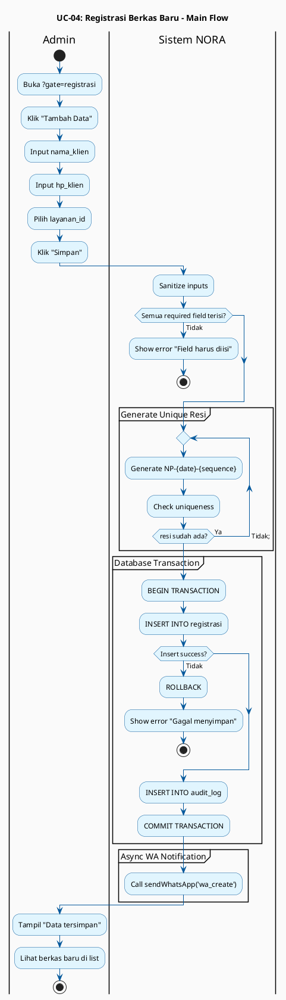

### 5. Alternative Flow

- **5A:** Admin batal menambah data
  - Admin klik "Batal" → Sistem kembali ke list registrasi tanpa menyimpan
- **6A:** Data tidak lengkap
  - Sistem menampilkan error pada field yang kosong
- **6B:** Nomor HP format tidak valid
  - Sistem menampilkan error: "Format nomor HP tidak valid"
- **8A:** Generate nomor resi duplikat (sangat jarang)
  - Sistem retry generate dengan suffix berbeda

### 6. Exception Flow

- **E1:** Database gagal insert → Sistem menampilkan error dan rollback
- **E2:** WhatsApp gateway down → Sistem mencatat log error, data tetap tersimpan
- **E3:** Duplicate entry detected → Sistem menampilkan error unique constraint

### 7. Business Rules

- Nomor resi harus unik (auto-generate dengan pattern NP-xxxx)
- Nomor HP harus dalam format valid (untuk WhatsApp notification)
- Jenis layanan harus dipilih dari daftar yang tersedia
- Status awal berkas selalu = 1 (Persyaratan)
- Nama klien tidak boleh kosong
- Setiap registrasi baru otomatis mengirim WA notification

### 8. Data Requirements

- `registrasi` (id, nomor_resi, nama_klien, hp_klien, layanan_id, current_step_id, created_at, status)
- `layanan` (id, nama_layanan, deskripsi, biaya)
- `audit_log` (id, user_id, action, timestamp, details)
- `message_templates` (id, template_key, template_content) - untuk wa_create

### 9. Frequency of Use

Tinggi - setiap ada berkas baru masuk dari klien

### 10. Related Use Cases

- UC-03: Login (prerequisite)
- UC-05: Edit Data Registrasi (koreksi data setelah registrasi)
- UC-06: Update Status Berkas (progres berkas selanjutnya)
- UC-12: Auto-Kirim WhatsApp Notification (otomatis trigger)

### 11. Notes / Assumptions

- Nomor resi unik dan tidak dapat diubah setelah generate
- WA notification bersifat otomatis dan tidak dapat di-skip
- Admin dapat langsung meng-edit data jika ada kesalahan input

### 12. Security Consideration

- Input sanitization untuk semua field
- Prepared statements untuk prevent SQL injection
- Authorization check: hanya Admin yang dapat akses
- Validasi nomor HP untuk prevent injection via WhatsApp gateway

### 13. PlantUML Diagram

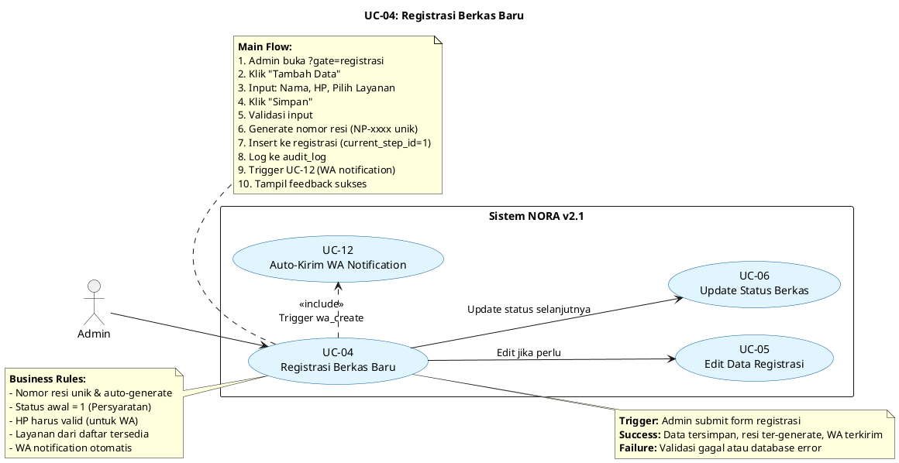

---

## UC-05: Edit Data Registrasi

### 1. Use Case Identification

- **Use Case ID:** UC-05
- **Use Case Name:** Edit Data Registrasi
- **Actor(s):** Admin
- **Description:** Admin mengoreksi atau memperbarui data klien yang sudah terdaftar
- **Priority:** Medium
- **Frequency of Use:** Medium (saat ada kesalahan input atau perubahan data klien)
- **Trigger:** Admin klik "Edit" pada berkas yang sudah terdaftar
- **Success Criteria:** Data berhasil di-update dan log perubahan tercatat
- **Failure Criteria:** Validasi gagal atau data dalam status read-only (status 14)

### 2. Preconditions

- Admin sudah login ke sistem
- Data registrasi sudah ada di database
- Berkas belum dalam status "Kasus Ditutup" (status 14)

### 3. Postconditions

- Data klien berhasil diperbarui di tabel `registrasi`
- Log perubahan tercatat di `audit_log`
- Dashboard registrasi menampilkan data terbaru

### 4. Main Flow (Alur Utama)

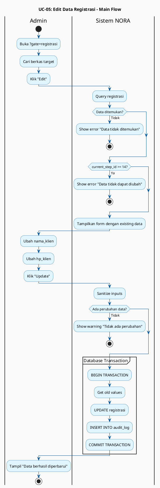

### 5. Alternative Flow

- **5A:** Admin tidak mengubah data apapun
  - Sistem menampilkan warning: "Tidak ada perubahan data"
- **6A:** Admin batal edit
  - Admin klik "Batal" → Sistem kembali ke list tanpa menyimpan
- **7A:** Data tidak valid
  - Sistem menampilkan error pada field yang tidak valid

### 6. Exception Flow

- **E1:** Database update gagal → Sistem rollback dan tampilkan error
- **E2:** Data sudah di-lock (status 14) → Sistem menampilkan error: "Data tidak dapat diubah"

### 7. Business Rules

- Data hanya dapat diedit jika status < 14 (Kasus Ditutup)
- Nomor resi tidak dapat diubah
- Perubahan layanan dapat mempengaruhi workflow yang berjalan
- Setiap perubahan dicatat di `audit_log` dengan old_value dan new_value

### 8. Data Requirements

- `registrasi` (id, nama_klien, hp_klien, layanan_id)
- `layanan` (id, nama_layanan)
- `audit_log` (id, user_id, action, old_value, new_value, timestamp)

### 9. Frequency of Use

Medium - saat ada kesalahan input atau perubahan data klien

### 10. Related Use Cases

- UC-04: Registrasi Berkas Baru (data yang diedit berasal dari sini)
- UC-06: Update Status Berkas (berkas yang sedang diproses)
- UC-09: Finalisasi & Tutup Kasus (data tidak dapat diedit setelah status 14)

### 11. Notes / Assumptions

- Edit data tidak mempengaruhi history status berkas
- Jika layanan diubah, sistem dapat menyesuaikan workflow

### 12. Security Consideration

- Authorization check: hanya Admin yang dapat edit
- Audit trail lengkap untuk accountability
- Validasi input untuk prevent injection

### 13. PlantUML Diagram

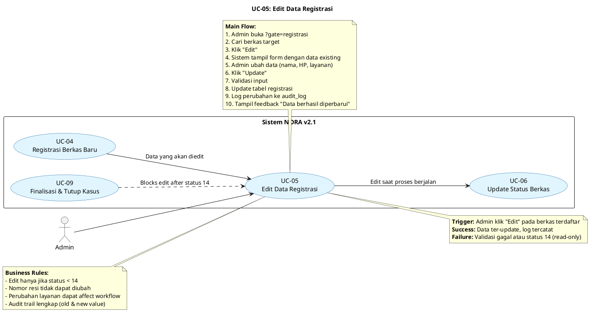

---

## UC-06: Update Status Berkas (15 Status)

### 1. Use Case Identification

- **Use Case ID:** UC-06
- **Use Case Name:** Update Status Berkas (15 Status)
- **Actor(s):** Admin
- **Description:** Admin mengupdate progres berkas melalui 15 tahapan status dengan sistem one-click automation
- **Priority:** High
- **Frequency of Use:** Sangat Tinggi (aktivitas utama operasional harian)
- **Trigger:** Admin klik "Update Progres" dan pilih status baru
- **Success Criteria:** Status terupdate, history tercatat, WA notification terkirim
- **Failure Criteria:** Database error, invalid status transition, atau berkas sudah selesai/batal

### 2. Preconditions

- Admin sudah login ke sistem
- Berkas sudah teregistrasi (minimal status 1)
- Berkas tidak dalam status "Kasus Ditutup" (status 14) atau "Batal" (status 15)
- Database dan WhatsApp gateway dalam kondisi normal

### 3. Postconditions

- Status berkas berhasil diupdate di tabel `registrasi`
- Riwayat perubahan tercatat di `registrasi_history`
- Timeline tracking di web update secara real-time
- WhatsApp notification otomatis terkirim ke klien
- Dashboard Admin mengalami partial refresh

### 4. Main Flow (Alur Utama)

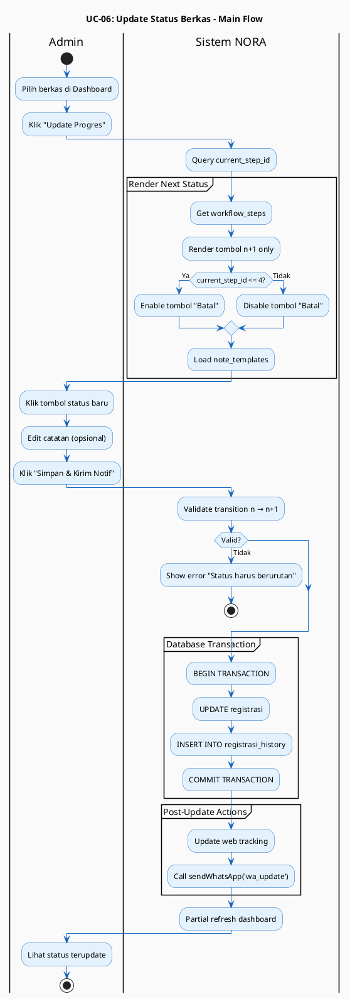

### 5. Alternative Flow

- **5A:** Status saat ini = 4 (Pengecekan Sertifikat)
  - Sistem menonaktifkan tombol "15. Batal" (safe point logic)
- **7A:** Admin memilih status yang tidak sesuai urutan
  - Sistem menolak dan hanya mengizinkan status n+1
- **8A:** Note template tidak ditemukan
  - Sistem menggunakan catatan kosong, Admin wajib input manual
- **10A:** Admin hanya simpan tanpa kirim notif
  - Sistem update status tapi skip WhatsApp notification (jika ada opsi)

### 6. Exception Flow

- **E1:** Database update gagal → Sistem rollback dan tampilkan error
- **E2:** WhatsApp gateway down → Status tetap terupdate, log error tercatat
- **E3:** Concurrent update (2 admin update berkas sama) → Sistem menggunakan lock mechanism
- **E4:** Berkas sudah status 14/15 → Sistem menampilkan error: "Berkas sudah selesai/batal"

### 7. Business Rules

- **Sequential Logic:** Status harus berurutan (tidak boleh melompat)
- **Safe Point:** Tombol "15. Batal" hanya aktif pada status 1-4
- **Lock Point:** Setelah status >= 5 (Pembayaran Pajak), pembatalan tidak dapat dilakukan
- **Behavior Role:**
  - Normal: Status berjalan maju (1→2→3...)
  - Iteration: Status dapat berputar kembali (status 11: Perbaikan → status sebelumnya)
  - Success: Status 12 (Selesai)
  - Fail: Status 15 (Batal)
- **One-Click Automation:** Satu aksi update memicu multiple system actions
- Setiap update wajib tercatat di `registrasi_history`

### 8. Data Requirements

- `registrasi` (id, current_step_id, updated_at)
- `registrasi_history` (id, registrasi_id, from_step_id, to_step_id, catatan, timestamp, user_id)
- `workflow_steps` (id, step_name, step_order, behavior_role, is_cancellable, sla_days)
- `note_templates` (id, step_id, template_content)
- `message_templates` (id, template_key, template_content) - untuk wa_update
- `audit_log` (id, user_id, action, timestamp)

### 9. Frequency of Use

Sangat Tinggi - aktivitas utama operasional harian

### 10. Related Use Cases

- UC-04: Registrasi Berkas Baru (berkas yang diupdate)
- UC-02: Track Berkas (timeline update real-time)
- UC-10: Manage Red Flag (dapat ditambahkan saat update status)
- UC-12: Auto-Kirim WhatsApp Notification (otomatis trigger)
- UC-09: Finalisasi & Tutup Kasus (status akhir 13→14)

### 11. Notes / Assumptions

- Ini adalah core feature sistem NORA
- Sistem menggunakan HTMX untuk partial refresh (tanpa reload halaman)
- Admin tidak dapat melompat status (mencegah kesalahan prosedur hukum)

### 12. Security Consideration

- Authorization: hanya Admin yang dapat update status
- Sequential validation untuk mencegah status skipping
- Audit trail lengkap di `registrasi_history` dan `audit_log`
- HTMX request validation untuk prevent CSRF
- Concurrent update handling dengan lock mechanism

### 13. PlantUML Diagram

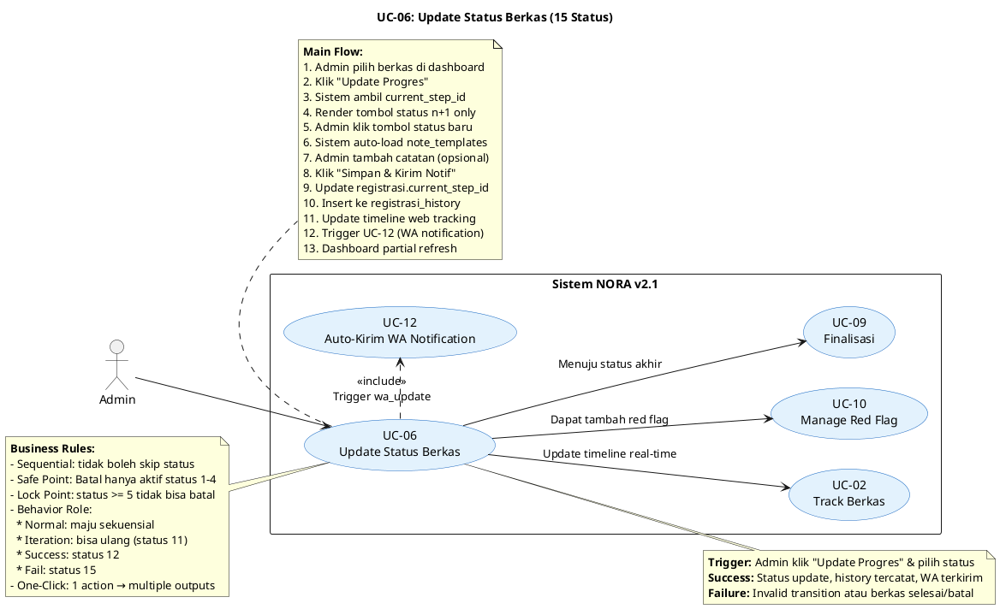

---

## UC-07: Manage CMS Content

### 1. Use Case Identification

- **Use Case ID:** UC-07
- **Use Case Name:** Manage CMS Content
- **Actor(s):** Notaris (Owner)
- **Description:** Notaris mengelola konten landing page, template pesan, template catatan, dan identitas kantor
- **Priority:** Medium
- **Frequency of Use:** Rendah-Medium (saat ada perubahan konten atau konfigurasi)
- **Trigger:** Notaris membuka menu CMS Editor dan melakukan perubahan
- **Success Criteria:** Konten CMS terupdate dan perubahan tercatat di audit log
- **Failure Criteria:** Validasi gagal, upload gagal, atau database error

### 2. Preconditions

- Notaris sudah login ke sistem
- Notaris memiliki akses ke menu CMS Editor (`?gate=cms_editor`)
- Database tabel CMS tersedia

### 3. Postconditions

- Konten CMS berhasil diperbarui
- Perubahan tercatat di `audit_log`
- Landing page menampilkan konten terbaru (saat di-refresh)

### 4. Main Flow (Alur Utama)

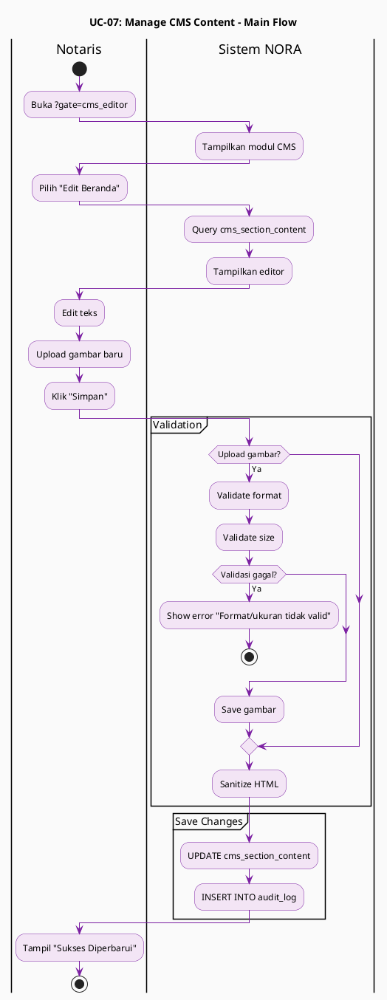

### 5. Alternative Flow

- **3A:** Notaris batal mengedit
  - Klik "Batal" → Sistem discard perubahan
- **4A:** Gambar upload gagal
  - Sistem menampilkan error format/size
- **5A:** Template tidak valid (placeholder salah)
  - Sistem menampilkan error validation

### 6. Exception Flow

- **E1:** Database save gagal → Sistem rollback dan tampilkan error
- **E2:** File upload gagal (permission issue) → Sistem tampilkan error
- **E3:** Concurrent edit (2 session edit konten sama) → Sistem menggunakan last-write-wins atau lock

### 7. Business Rules

- Hanya Notaris (Owner) yang dapat mengakses CMS Editor
- Perubahan konten langsung efektif di landing page
- Template pesan harus menggunakan placeholder valid: `[Nama_Klien]`, `[Nama_Layanan]`, `[Nomor_Resi]`
- Gambar upload dibatasi max 2MB, format JPG/PNG/WEBP
- Semua perubahan tercatat di `audit_log`

### 8. Data Requirements

- `cms_section_content` (id, section_key, content_text, content_html, updated_at)
- `cms_section_items` (id, item_name, item_description, item_image, sort_order)
- `cms_settings` (id, setting_key, setting_value)
- `message_templates` (id, template_key, template_content, variables)
- `note_templates` (id, step_id, template_content)
- `layanan` (id, nama_layanan, deskripsi, biaya, is_active)
- `audit_log` (id, user_id, action, old_value, new_value, timestamp)

### 9. Frequency of Use

Rendah-Medium - saat ada perubahan konten atau konfigurasi

### 10. Related Use Cases

- UC-01: View Landing Page (konten yang dikelola)
- UC-12: Auto-Kirim WhatsApp Notification (template yang digunakan)
- UC-04: Registrasi Berkas Baru (layanan yang dipilih)

### 11. Notes / Assumptions

- CMS Editor adalah pusat kontrol estetika dan otomasi
- Notaris dapat mengatur pesan otomatis sesuai kebutuhan bisnis

### 12. Security Consideration

- Authorization: hanya Notaris (role=owner) yang dapat akses
- XSS prevention pada konten HTML
- File upload validation (type, size, dimension)
- Audit trail untuk accountability

### 13. PlantUML Diagram

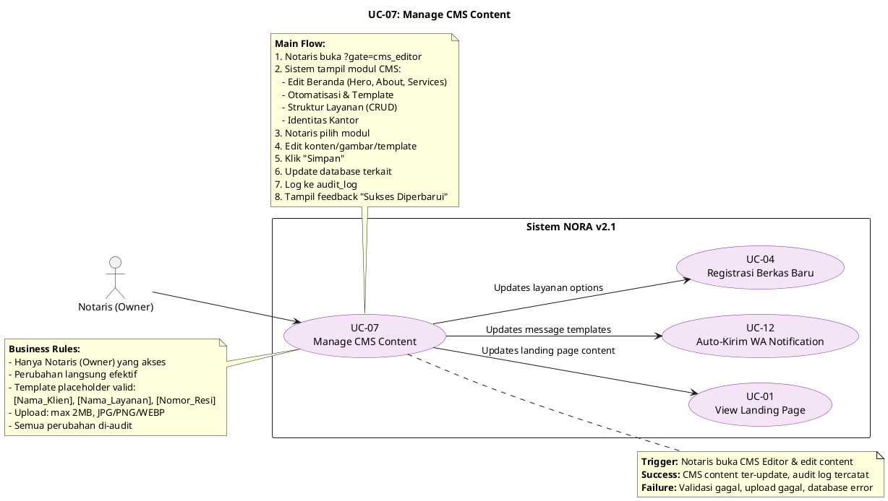

---

## UC-08: Manage Workflow Steps

### 1. Use Case Identification

- **Use Case ID:** UC-08
- **Use Case Name:** Manage Workflow Steps
- **Actor(s):** Notaris (Owner)
- **Description:** Notaris mengkonfigurasi logika 15 status, termasuk label, urutan, SLA, dan behavior role
- **Priority:** Medium
- **Frequency of Use:** Rendah (hanya saat ada perubahan prosedur bisnis)
- **Trigger:** Notaris membuka menu CMS Workflow dan melakukan perubahan konfigurasi
- **Success Criteria:** Workflow configuration terupdate dan dashboard Admin menggunakan aturan baru
- **Failure Criteria:** Validasi gagal atau database error

### 2. Preconditions

- Notaris sudah login ke sistem
- Notaris memiliki akses ke menu CMS Workflow
- Tabel `workflow_steps` sudah terisi dengan default 15 status

### 3. Postconditions

- Konfigurasi workflow berhasil diperbarui
- Perubahan mempengaruhi Dashboard Admin (tombol progres, validasi)
- Perubahan tercatat di `audit_log`

### 4. Main Flow (Alur Utama)

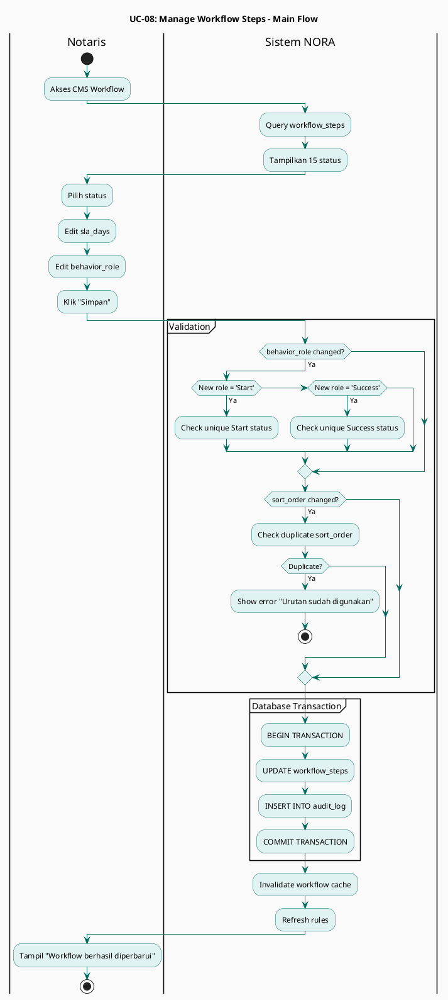

### 5. Alternative Flow

- **4A:** Notaris mengubah `is_cancellable` pada status >= 5
  - Sistem menampilkan warning: "Pembatalan setelah status 5 tidak disarankan (sudah ada pembayaran pajak)"
- **5A:** Notaris batal menyimpan
  - Klik "Batal" → Sistem discard perubahan

### 6. Exception Flow

- **E1:** Database update gagal → Sistem rollback dan tampilkan error
- **E2:** Invalid behavior role → Sistem validasi dan tampilkan error
- **E3:** Duplicate sort_order → Sistem menampilkan error unique constraint

### 7. Business Rules

- Minimal harus ada 1 status dengan behavior_role = "Start"
- Minimal harus ada 1 status dengan behavior_role = "Success"
- Status dengan `is_cancellable = false` akan menonaktifkan tombol "Batal"
- `sla_days` digunakan untuk mengukur kinerja (SLA tracking di dashboard Notaris)
- Behavior Role:
  - **Normal:** Status berjalan maju secara sekuensial
  - **Start:** Status awal (biasanya status 1: Persyaratan)
  - **Iteration:** Status yang dapat mengulang ke tahap sebelumnya (status 11: Perbaikan)
  - **Success:** Status berhasil (status 12: Selesai)
  - **Fail:** Status gagal/batal (status 15: Batal)

### 8. Data Requirements

- `workflow_steps` (id, step_name, step_order, behavior_role, is_cancellable, sla_days, color_code)
- `audit_log` (id, user_id, action, old_value, new_value, timestamp)

### 9. Frequency of Use

Rendah - hanya saat ada perubahan prosedur bisnis

### 10. Related Use Cases

- UC-06: Update Status Berkas (workflow yang dijalankan)
- UC-09: Finalisasi & Tutup Kasus (logic guard berdasarkan workflow)
- UC-11: View Dashboard Performance (SLA tracking berdasarkan sla_days)

### 11. Notes / Assumptions

- Perubahan workflow dapat mempengaruhi operasional berjalan
- Notaris harus hati-hati mengubah `is_cancellable` dan `behavior_role`

### 12. Security Consideration

- Authorization: hanya Notaris (role=owner) yang dapat akses
- Audit trail lengkap untuk perubahan kritis
- Validation untuk mencegah konfigurasi yang tidak valid

### 13. PlantUML Diagram

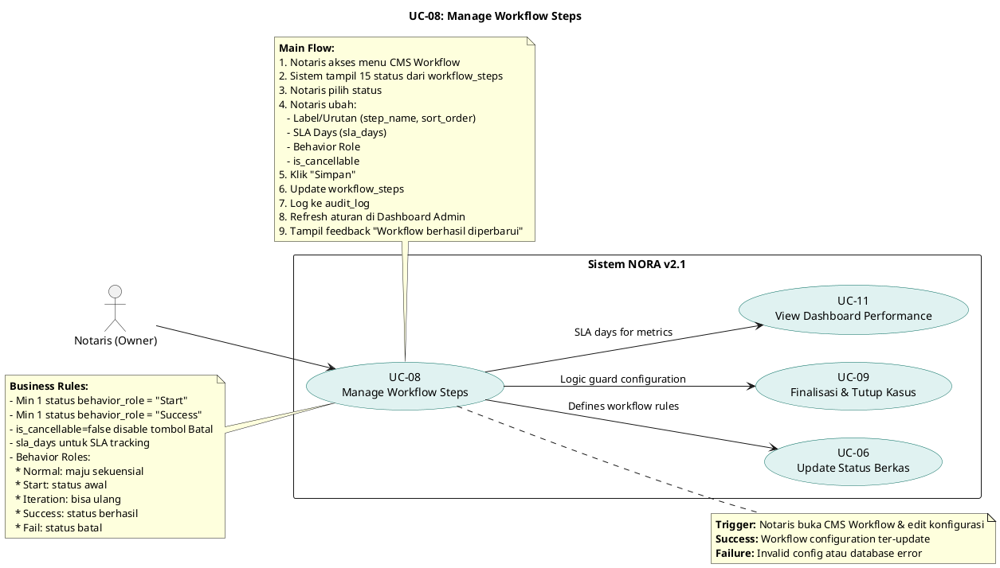

---

## UC-09: Finalisasi & Tutup Kasus

### 1. Use Case Identification

- **Use Case ID:** UC-09
- **Use Case Name:** Finalisasi & Tutup Kasus
- **Actor(s):** Notaris (Owner)
- **Description:** Notaris melakukan review akhir berkas sebelum menutup kasus secara permanen (status 14)
- **Priority:** High
- **Frequency of Use:** Medium (setiap ada berkas siap tutup)
- **Trigger:** Notaris membuka menu Finalisasi dan konfirmasi tutup kasus
- **Success Criteria:** Kasus ditutup (status 14), red flag cleanup, data read-only
- **Failure Criteria:** Database error atau berkas tidak memenuhi syarat finalisasi

### 2. Preconditions

- Notaris sudah login ke sistem
- Berkas sudah dalam status 13 (Diserahkan) atau 15 (Batal)
- Berkas belum dalam status 14 (Kasus Ditutup)

### 3. Postconditions

- Kasus berhasil ditutup (status 14) atau dikembalikan ke status 11 (Perbaikan)
- Auto-cleanup red flag dijalankan (jika kasus ditutup)
- Data menjadi read-only (tidak dapat diubah lagi)
- Log finalisasi tercatat di `audit_log`

### 4. Main Flow (Alur Utama)

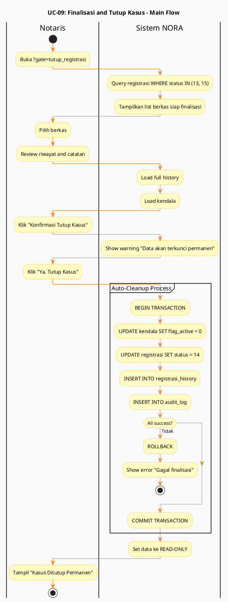

### 5. Alternative Flow

- **2A:** Tidak ada berkas siap finalisasi
  - Sistem menampilkan pesan: "Tidak ada berkas untuk difinalisasi"
- **5A:** Notaris batal finalisasi
  - Klik "Batal" → Sistem kembali ke list tanpa perubahan

### 6. Exception Flow

- **E1:** Database update gagal → Sistem rollback dan tampilkan error
- **E2:** Auto-cleanup gagal → Sistem tetap update status, log error untuk manual cleanup
- **E3:** Concurrent finalisasi → Sistem menggunakan lock mechanism

### 7. Business Rules

- Hanya Notaris (Owner) yang dapat melakukan finalisasi
- Hanya berkas status 13 (Diserahkan) atau 15 (Batal) yang dapat difinalisasi
- Finalisasi bersifat irreversible (tidak dapat di-undo)
- **Auto-Cleanup Process:**
  - Semua red flag aktif dimatikan (`flag_active = 0`)
  - Data menjadi read-only (tidak dapat diedit oleh Admin)
- Jika berkas dikembalikan (review ulang), status = 11 (Perbaikan)
- Finalisasi tercatat permanen di `audit_log`

### 8. Data Requirements

- `registrasi` (id, current_step_id, status, closed_at, closed_by)
- `registrasi_history` (id, catatan_finalisasi)
- `kendala` (id, registrasi_id, flag_active, keterangan)
- `audit_log` (id, user_id, action, details, timestamp)

### 9. Frequency of Use

Medium - setiap ada berkas siap tutup

### 10. Related Use Cases

- UC-06: Update Status Berkas (status 13→14 atau 13→11)
- UC-10: Manage Red Flag (auto-cleanup saat finalisasi)
- UC-05: Edit Data Registrasi (data menjadi read-only setelah finalisasi)

### 11. Notes / Assumptions

- Finalisasi adalah proses kritis yang memerlukan otoritas Notaris
- Auto-cleanup menjaga kebersihan database (minimalis)

### 12. Security Consideration

- Authorization: hanya Notaris (role=owner) yang dapat finalisasi
- Irreversible action warning sebelum konfirmasi
- Audit trail lengkap untuk compliance
- Lock mechanism untuk prevent concurrent finalisasi
- Data encryption untuk archived records (jika ada)

### 13. PlantUML Diagram

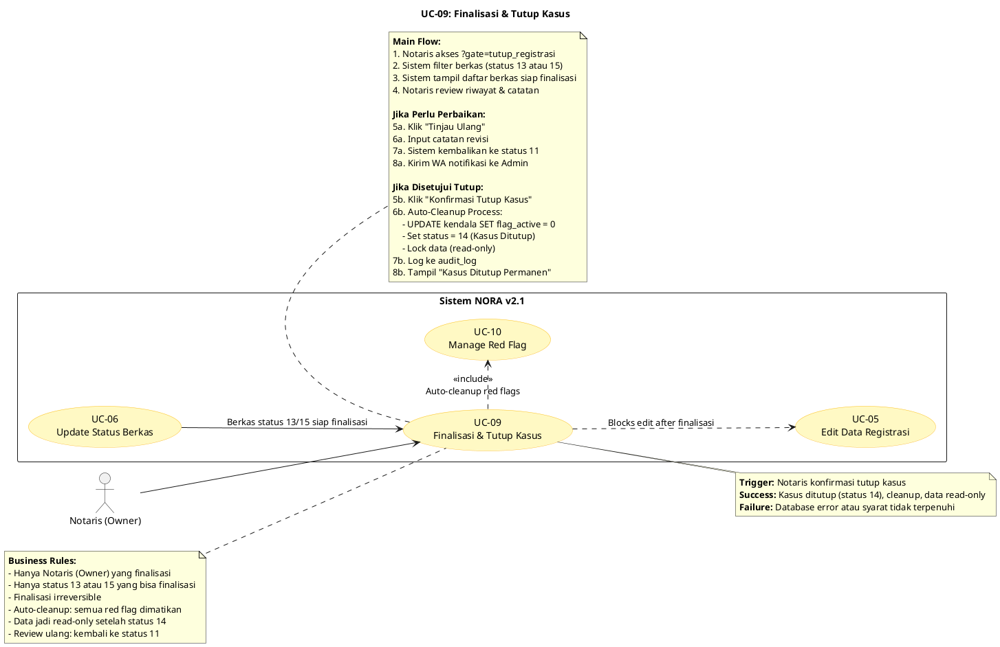

---

## UC-10: Manage Red Flag (Kendala)

### 1. Use Case Identification

- **Use Case ID:** UC-10
- **Use Case Name:** Manage Red Flag (Kendala)
- **Actor(s):** Admin
- **Description:** Admin menandai berkas bermasalah dengan Red Flag dan menyelesaikannya
- **Priority:** Medium
- **Frequency of Use:** Medium (saat ada kendala dalam proses)
- **Trigger:** Admin klik "Tambah Kendala" pada berkas bermasalah
- **Success Criteria:** Red Flag aktif tercatat dan tampil di dashboard/tracking
- **Failure Criteria:** Database error atau berkas sudah finalisasi

### 2. Preconditions

- Admin sudah login ke sistem
- Berkas sedang dalam proses (status 1-13)
- Ada kendala yang perlu dicatat (misal: sertifikat belum terverifikasi)

### 3. Postconditions

- Red Flag aktif tercatat di tabel `kendala`
- Red Flag tampil di tracking web dan dashboard Admin
- Saat finalisasi, Red Flag otomatis dimatikan (auto-cleanup)

### 4. Main Flow (Alur Utama)

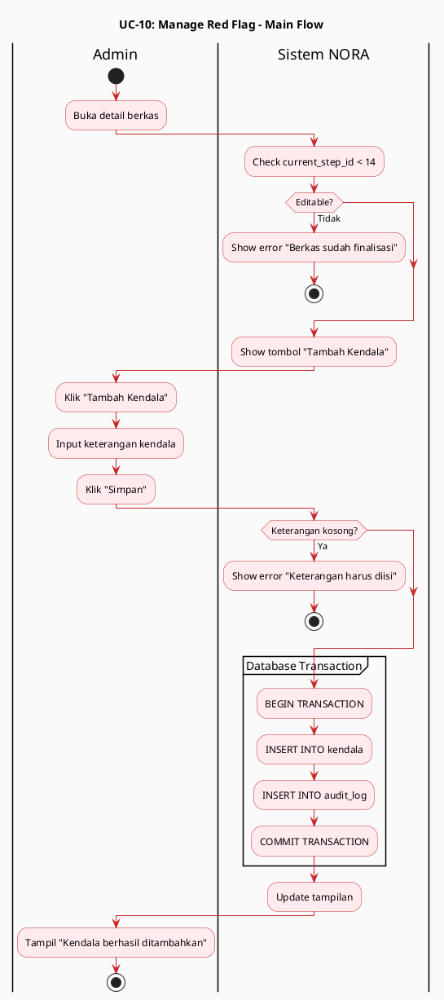

### 5. Alternative Flow

- **6A:** Sudah ada red flag aktif untuk berkas sama
  - Sistem menampilkan warning: "Berkas sudah memiliki kendala aktif"
  - Admin dapat update kendala existing atau tambah baru (multiple flags)

### 6. Exception Flow

- **E1:** Database insert gagal → Sistem rollback dan tampilkan error
- **E2:** Auto-cleanup saat finalisasi gagal → Red Flag tetap aktif, perlu manual cleanup

### 7. Business Rules

- Satu berkas dapat memiliki multiple red flags
- Red Flag hanya dapat ditambah jika berkas status < 14
- Red Flag aktif mempengaruhi tampilan di tracking (pesan error merah)
- Auto-cleanup saat finalisasi (status 14) mematikan semua red flags
- Admin wajib input keterangan kendala (tidak boleh kosong)

### 8. Data Requirements

- `kendala` (id, registrasi_id, flag_active, keterangan, created_at, resolved_at)
- `registrasi` (id, current_step_id)
- `audit_log` (id, user_id, action, timestamp)

### 9. Frequency of Use

Medium - saat ada kendala dalam proses berkas

### 10. Related Use Cases

- UC-06: Update Status Berkas (red flag dapat ditambah saat update)
- UC-09: Finalisasi & Tutup Kasus (auto-cleanup red flags)
- UC-02: Track Berkas (red flag tampil di web tracking)

### 11. Notes / Assumptions

- Red Flag membantu monitoring berkas bermasalah
- Auto-cleanup menjaga kebersihan data

### 12. Security Consideration

- Authorization: hanya Admin yang dapat tambah/selesaikan kendala
- Audit trail untuk accountability
- Input validation untuk prevent XSS

### 13. PlantUML Diagram

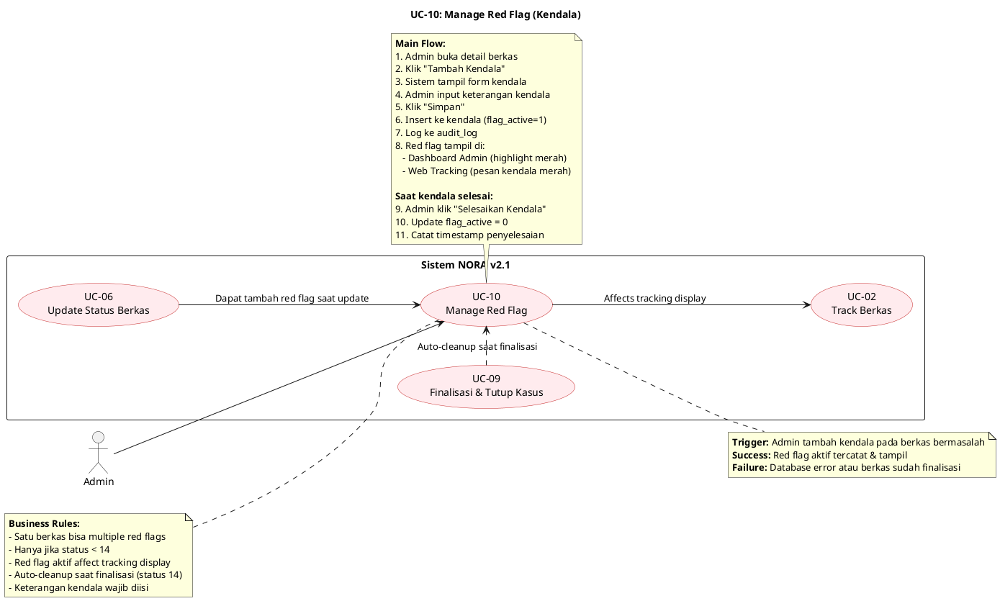

---

## UC-11: View Dashboard Performance

### 1. Use Case Identification

- **Use Case ID:** UC-11
- **Use Case Name:** View Dashboard Performance
- **Actor(s):** Notaris (Owner)
- **Description:** Notaris memantau performa operasional, termasuk berkas paling lama di BPN dan SLA tracking
- **Priority:** Medium
- **Frequency of Use:** Medium-Rendah (monitoring berkala)
- **Trigger:** Notaris login atau membuka menu Dashboard Performance
- **Success Criteria:** Dashboard performa ditampilkan dengan metrik lengkap
- **Failure Criteria:** Database error atau tidak ada data cukup

### 2. Preconditions

- Notaris sudah login ke sistem
- Ada data berkas di sistem (registrasi, history, workflow)
- Database dalam kondisi normal

### 3. Postconditions

- Dashboard performa ditampilkan dengan metrik:
  - Total berkas aktif
  - Rata-rata waktu pemrosesan
  - Berkas paling lama di BPN
  - SLA compliance rate
- Notaris dapat mengidentifikasi bottleneck

### 4. Main Flow (Alur Utama)

```plantuml
@startuml
skinparam backgroundColor #FAFAFA
skinparam activityBackgroundColor #F3E5F5
skinparam activityBorderColor #7B1FA2
skinparam ArrowColor #7B1FA2

title UC-11: View Dashboard Performance - Main Flow

|Notaris|
start
:Login;
:Akses ?gate=dashboard;

|Sistem NORA|
partition "Data Aggregation" {
  :Query registrasi aktif;
  :Query registrasi_history;
  :Query workflow_steps;
}

partition "Metrics Calculation" {
  :Count berkas per status;
  :Calculate avg processing time;
  :Identify longest files;
  :Calculate SLA compliance %;
}

if (Data cukup?) then (Tidak)
  :Show "Belum ada data";
  stop
endif

partition "Dashboard Rendering" {
  :Render chart;
  :Render table;
  :Render SLA gauge;
}

|Notaris|
:Review metrik;
stop

@enduml
```

### 5. Alternative Flow

- **3A:** Tidak ada data cukup untuk analisis
  - Sistem menampilkan pesan: "Belum ada data untuk analisis"
- **5A:** Notaris klik berkas tertentu
  - Sistem redirect ke detail berkas

### 6. Exception Flow

- **E1:** Query timeout (data terlalu besar) → Sistem tampilkan partial data atau error
- **E2:** Database connection lost → Dashboard gagal load

### 7. Business Rules

- Hanya Notaris (Owner) yang dapat akses Dashboard Performance
- SLA compliance dihitung berdasarkan `sla_days` di `workflow_steps`
- Waktu pemrosesan dihitung dari selisih timestamp di `registrasi_history`
- Data real-time (tidak ada caching yang terlalu lama)

### 8. Data Requirements

- `registrasi` (id, current_step_id, created_at, status)
- `registrasi_history` (id, registrasi_id, from_step_id, to_step_id, timestamp)
- `workflow_steps` (id, step_name, sla_days)
- `users` (id, nama_lengkap, role)

### 9. Frequency of Use

Medium-Rendah - monitoring berkala oleh Notaris

### 10. Related Use Cases

- UC-03: Login (entry point ke dashboard)
- UC-08: Manage Workflow Steps (SLA days yang digunakan)
- UC-09: Finalisasi & Tutup Kasus (berkas selesai mempengaruhi metrics)

### 11. Notes / Assumptions

- Dashboard membantu Notaris mengidentifikasi bottleneck
- Data dapat di-export untuk laporan (fitur tambahan)

### 12. Security Consideration

- Authorization: hanya Notaris (role=owner) yang dapat akses
- Query optimization untuk prevent timeout pada data besar
- Data aggregation tanpa expose informasi sensitif klien

### 13. PlantUML Diagram

```plantuml
@startuml
left to right direction
skinparam packageStyle rectangle
skinparam usecaseBackgroundColor #F3E5F5
skinparam usecaseBorderColor #7B1FA2

title UC-11: View Dashboard Performance

actor "Notaris (Owner)" as Notaris

rectangle "Sistem NORA v2.1" {
  usecase "UC-11\nView Dashboard Performance" as UC11
  
  usecase "UC-03\nLogin Staff/Notaris" as UC03
  usecase "UC-08\nManage Workflow Steps" as UC08
  usecase "UC-09\nFinalisasi & Tutup Kasus" as UC09
}

Notaris --> UC03
UC03 --> UC11 : Redirect after login

UC08 --> UC11 : Provides SLA days config
UC09 --> UC11 : Completed cases affect metrics

note right of UC11
  **Trigger:** Notaris login atau buka menu Dashboard
  **Success:** Dashboard performa tampil dengan metrik lengkap
  **Failure:** Database error atau tidak ada data cukup
end note

note bottom of UC11
  **Main Flow:**
  1. Notaris login → Dashboard Performance
  2. Sistem query data:
     - registrasi (berkas aktif)
     - registrasi_history (timestamp)
     - workflow_steps (SLA days)
  3. Sistem hitung metrik:
     - Total berkas per status
     - Rata-rata waktu pemrosesan
     - Berkas terlama per tahap
     - SLA compliance rate
  4. Sistem tampil dashboard:
     - Chart berkas per status
     - Tabel berkas paling lama
     - SLA compliance percentage
  5. Notaris lihat detail berkas (opsional)
end note

note left of UC11
  **Business Rules:**
  - Hanya Notaris (Owner) yang akses
  - SLA compliance berdasarkan sla_days
  - Waktu = selisih timestamp di history
  - Data real-time (no long cache)
  - Identifikasi bottleneck
end note

@enduml
```

---

## UC-12: Auto-Kirim WhatsApp Notification

### 1. Use Case Identification

- **Use Case ID:** UC-12
- **Use Case Name:** Auto-Kirim WhatsApp Notification
- **Actor(s):** System (dipicu oleh UC-04, UC-06)
- **Description:** Sistem secara otomatis mengirim pesan WhatsApp ke klien menggunakan template yang sudah dikonfigurasi
- **Priority:** High
- **Frequency of Use:** Sangat Tinggi (setiap ada registrasi baru atau update status)
- **Trigger:** UC-04 atau UC-06 berhasil save data
- **Success Criteria:** Pesan WhatsApp terkirim dan log tercatat
- **Failure Criteria:** Gateway down, nomor invalid, atau semua retry gagal

### 2. Preconditions

- WhatsApp gateway terhubung dan aktif
- Template pesan sudah dikonfigurasi di `message_templates`
- Klien memiliki nomor HP valid di database
- Variabel template tersedia: `[Nama_Klien]`, `[Nama_Layanan]`, `[Nomor_Resi]`, `[Status_Terbaru]`

### 3. Postconditions

- Pesan WhatsApp berhasil terkirim ke klien
- Log pengiriman tercatat di `wa_logs`
- Jika gagal, sistem retry atau log error

### 4. Main Flow (Alur Utama)

```plantuml
@startuml
skinparam backgroundColor #FAFAFA
skinparam activityBackgroundColor #FFF3E0
skinparam activityBorderColor #E65100
skinparam ArrowColor #E65100

title UC-12: Auto-Kirim WhatsApp Notification - Main Flow

start

:Trigger dari UC-04 atau UC-06;

partition "Get Template and Data" {
  if (Source == UC-04?) then (Ya)
    :template_key = 'wa_create';
  else (UC-06)
    :template_key = 'wa_update';
  endif
  
  :Query message_templates;
  :Query registrasi;
  :Query layanan;
}

partition "Template Processing" {
  :Replace [Nama_Klien];
  :Replace [Nama_Layanan];
  :Replace [Nomor_Resi];
}

partition "WA Gateway Integration" {
  :retry_count = 0;
  
  repeat
    :Call WA API;
    
    if (API success?) then (Ya)
      :status = 'sent';
      :Exit retry;
    else (Tidak)
      :retry_count = retry_count + 1;
      
      if (retry_count >= 3?) then (Ya)
        :status = 'failed';
        :Queue for manual;
        :Exit retry;
      else (Tidak)
        :Wait 30 seconds;
      endif
    endif
  repeat while (retry_count < 3) is (Ya) -> Tidak;
}

:INSERT INTO wa_logs;

:Return to caller;
stop

@enduml
```

### 5. Alternative Flow

- **5A:** WhatsApp gateway timeout
  - Sistem retry setelah 30 detik (maks 3x)
- **5B:** Nomor HP tidak valid (format WhatsApp)
  - Sistem log error: "Nomor HP tidak valid untuk WhatsApp"
- **5C:** Template tidak ditemukan
  - Sistem log error: "Template tidak ditemukan", kirim pesan default

### 6. Exception Flow

- **E1:** WhatsApp gateway down → Sistem log error, use case pemanggil tetap lanjut (async)
- **E2:** Rate limit exceeded → Sistem queue pesan dan kirim saat limit reset
- **E3:** Invalid API response → Sistem log error untuk debugging

### 7. Business Rules

- Pengiriman WA bersifat asynchronous (tidak blocking use case pemanggil)
- Template pesan harus profesional dan sesuai standar Notaris
- Maksimal retry: 3x dengan interval 30 detik
- Jika semua retry gagal, pesan di-queue untuk pengiriman manual
- Log pengiriman tercatat untuk audit trail
- Klien dapat opt-out (fitur tambahan)

### 8. Data Requirements

- `message_templates` (id, template_key, template_content, variables)
- `registrasi` (id, nama_klien, hp_klien, layanan_id, nomor_resi, current_step_id)
- `layanan` (id, nama_layanan)
- `workflow_steps` (id, step_name)
- `wa_logs` (id, registrasi_id, template_key, status, sent_at, error_message)

### 9. Frequency of Use

Sangat Tinggi - setiap ada registrasi baru atau update status

### 10. Related Use Cases

- UC-04: Registrasi Berkas Baru (trigger wa_create)
- UC-06: Update Status Berkas (trigger wa_update)
- UC-07: Manage CMS Content (edit template pesan)

### 11. Notes / Assumptions

- WhatsApp gateway menggunakan third-party API (misal: Fonnte, Wablas, dll)
- Pengiriman bersifat fire-and-forget (tidak blocking proses utama)

### 12. Security Consideration

- API key WhatsApp gateway disimpan di environment variable (bukan di code)
- Rate limiting untuk prevent abuse
- Log tanpa expose isi pesan penuh (privacy)
- Error handling tanpa leak sensitive data

### 13. PlantUML Diagram

```plantuml
@startuml
left to right direction
skinparam packageStyle rectangle
skinparam usecaseBackgroundColor #FFF3E0
skinparam usecaseBorderColor #E65100

title UC-12: Auto-Kirim WhatsApp Notification

actor "System" as System

rectangle "Sistem NORA v2.1" {
  usecase "UC-12\nAuto-Kirim WA Notification" as UC12
  
  usecase "UC-04\nRegistrasi Berkas Baru" as UC04
  usecase "UC-06\nUpdate Status Berkas" as UC06
  usecase "UC-07\nManage CMS Content" as UC07
}

System --> UC12

UC04 .> UC12 : <<include>>\nTrigger wa_create
UC06 .> UC12 : <<include>>\nTrigger wa_update
UC07 --> UC12 : Updates message templates

note right of UC12
  **Trigger:** UC-04 atau UC-06 berhasil save
  **Success:** WA terkirim & log tercatat
  **Failure:** Gateway down, nomor invalid, retry habis
end note

note bottom of UC12
  **Main Flow:**
  1. Trigger dari UC-04 atau UC-06
  2. Ambil template dari message_templates:
     - UC-04 → wa_create
     - UC-06 → wa_update
  3. Replace variabel template:
     - [Nama_Klien]
     - [Nama_Layanan]
     - [Nomor_Resi]
     - [Status_Terbaru] (UC-06 only)
  4. Kirim via WhatsApp gateway API
  5. Log pengiriman ke wa_logs
  6. Jika sukses → return ke caller
  7. Jika gagal → retry (max 3x, interval 30s)
  8. Jika retry habis → queue untuk manual
end note

note left of UC12
  **Business Rules:**
  - Async (tidak blocking caller)
  - Template profesional sesuai standar
  - Max retry: 3x, interval 30s
  - Gagal semua → queue manual
  - Log untuk audit trail
  - Klien bisa opt-out (fitur tambahan)
  
  **Security:**
  - API key di environment variable
  - Rate limiting
  - Log tanpa expose isi pesan penuh
end note

@enduml
```

---

## 📋 Ringkasan Matriks Use Case & Actor

| Use Case                          | Klien | Admin | Notaris | System |
| --------------------------------- | ----- | ----- | ------- | ------ |
| UC-01: View Landing Page          | ✓    | ✓    | ✓      |        |
| UC-02: Track Berkas               | ✓    |       |         |        |
| UC-03: Login Staff/Notaris        |       | ✓    | ✓      |        |
| UC-04: Registrasi Berkas Baru     |       | ✓    |         |        |
| UC-05: Edit Data Registrasi       |       | ✓    |         |        |
| UC-06: Update Status Berkas       |       | ✓    |         |        |
| UC-07: Manage CMS Content         |       |       | ✓      |        |
| UC-08: Manage Workflow Steps      |       |       | ✓      |        |
| UC-09: Finalisasi & Tutup Kasus   |       |       | ✓      |        |
| UC-10: Manage Red Flag            |       | ✓    |         |        |
| UC-11: View Dashboard Performance |       |       | ✓      |        |
| UC-12: Auto-Kirim WA Notification |       |       |         | ✓     |

---

## 🛡️ Guard Logic Summary

| **Aturan**              | **Deskripsi**                                        | **Use Case Terkait** |
| ----------------------------- | ---------------------------------------------------------- | -------------------------- |
| **Safe Point**          | Tombol "15. Batal" hanya aktif status 1-4                  | UC-06                      |
| **Owner Authority**     | Hanya Notaris dapat memicu Auto-Cleanup via Finalisasi     | UC-09                      |
| **Behavior Role**       | Notaris atur peran status (Iteration untuk Perbaikan)      | UC-08                      |
| **Finalisasi Berlapis** | Admin serahkan → Owner audit → Data terkunci             | UC-09                      |
| **Sequential Logic**    | Status tidak boleh melompat (n → n+1 only)                | UC-06                      |
| **Auto-Cleanup**        | Red Flag otomatis dimatikan saat status 14                 | UC-09, UC-10               |
| **Audit Trail**         | Semua perubahan tercatat di audit_log & registrasi_history | All UC                     |

---

*Dibuat untuk dokumentasi teknis Sistem NORA v2.1 - Kantor Notaris Sri Anah, S.H., M.Kn.*
