# 📑 Use Case Documentation dengan Main Flow PlantUML - Sistem NORA v2.1
## Kantor Notaris Sri Anah, S.H., M.Kn.

---

## UC-01: View Landing Page

### 4. Main Flow (Alur Utama) - PlantUML

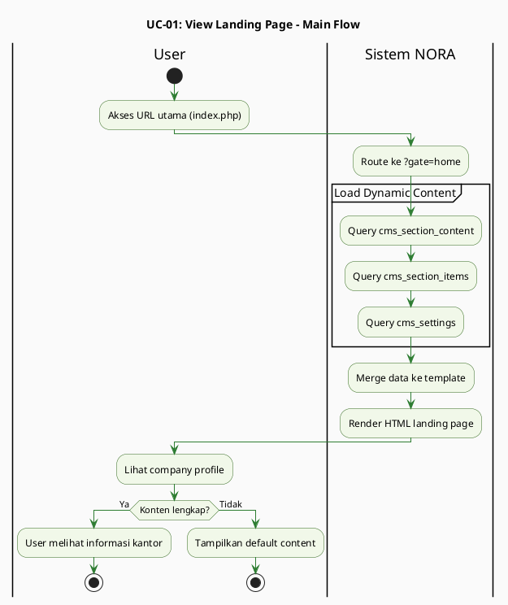

---

## UC-02: Track Berkas (Self-Service)

### 4. Main Flow (Alur Utama) - PlantUML

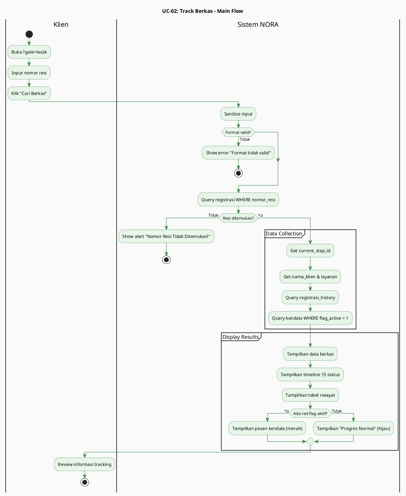

---

## UC-03: Login Staff/Notaris

### 4. Main Flow (Alur Utama) - PlantUML

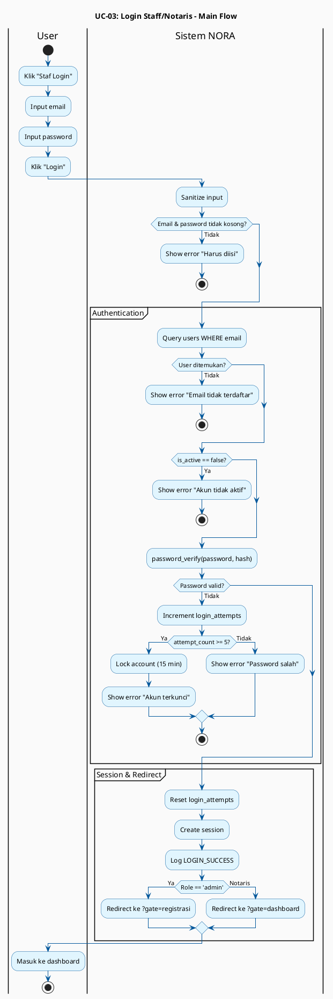

---

## UC-04: Registrasi Berkas Baru

### 4. Main Flow (Alur Utama) - PlantUML

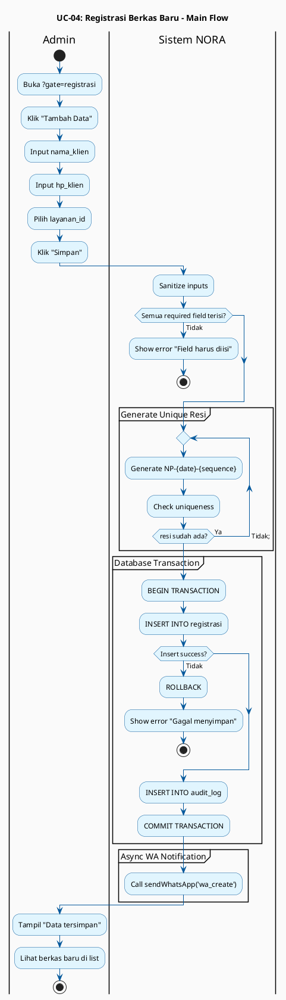

---

## UC-05: Edit Data Registrasi

### 4. Main Flow (Alur Utama) - PlantUML

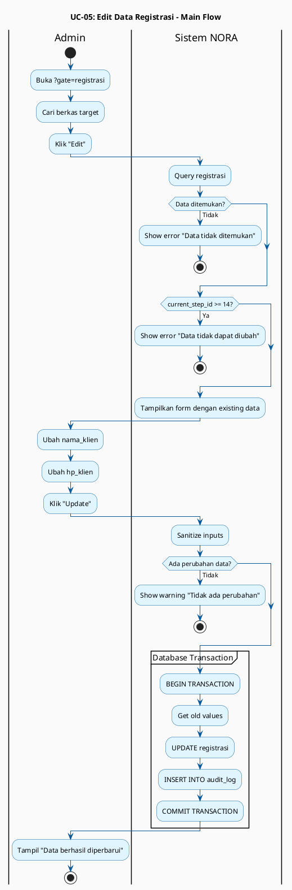

---

## UC-06: Update Status Berkas (15 Status)

### 4. Main Flow (Alur Utama) - PlantUML

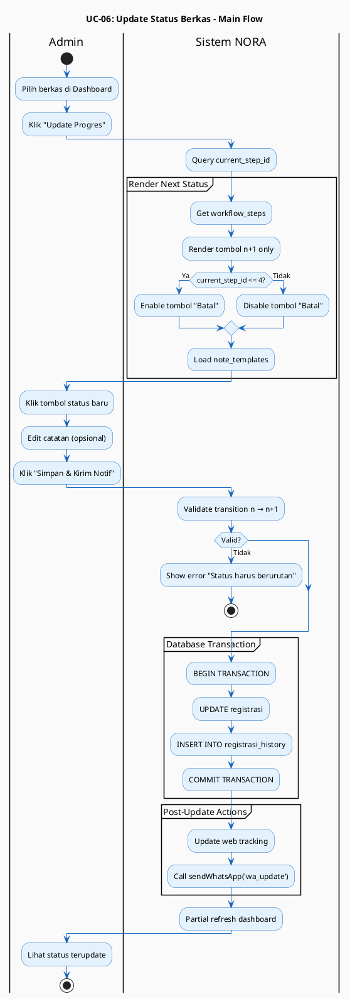

---

## UC-07: Manage CMS Content

### 4. Main Flow (Alur Utama) - PlantUML

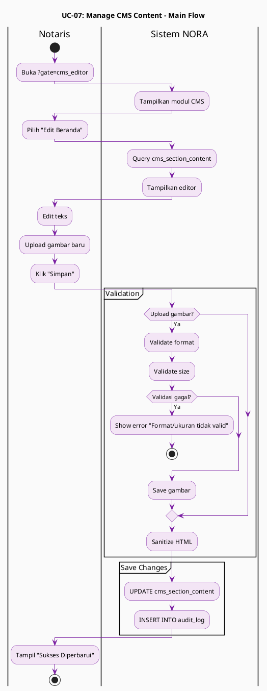

---

## UC-08: Manage Workflow Steps

### 4. Main Flow (Alur Utama) - PlantUML

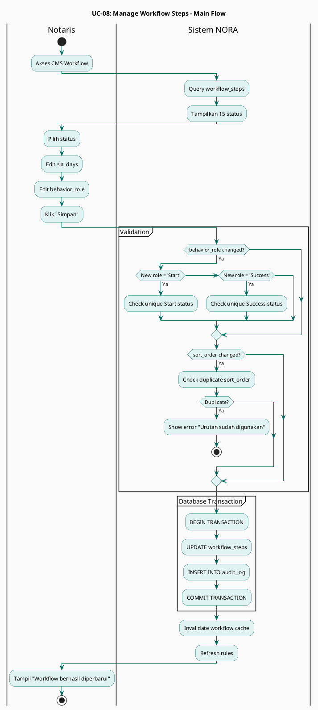

---

## UC-09: Finalisasi & Tutup Kasus

### 4. Main Flow (Alur Utama) - PlantUML

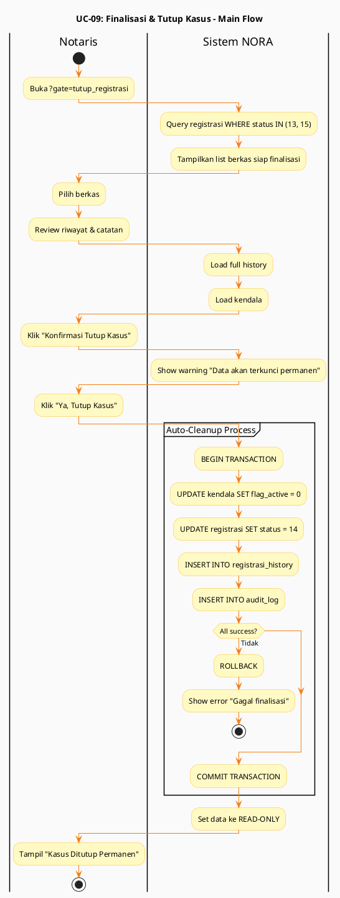

---

## UC-10: Manage Red Flag (Kendala)

### 4. Main Flow (Alur Utama) - PlantUML

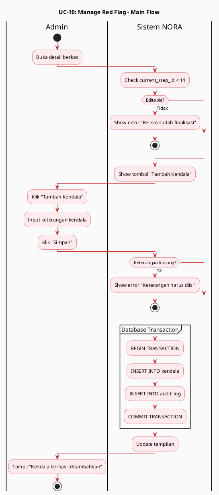

---

## UC-11: View Dashboard Performance

### 4. Main Flow (Alur Utama) - PlantUML

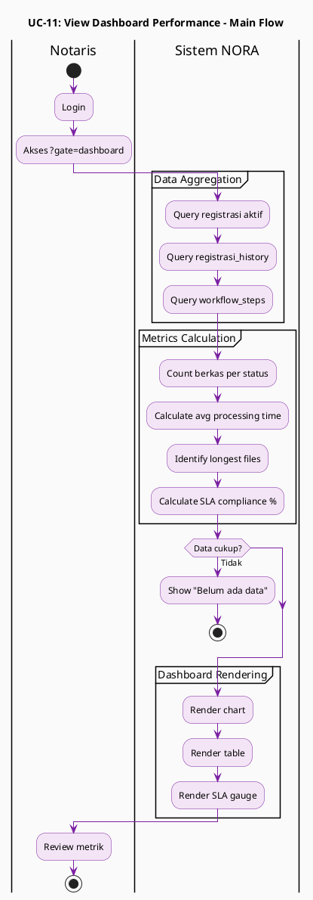

---

## UC-12: Auto-Kirim WhatsApp Notification

### 4. Main Flow (Alur Utama) - PlantUML

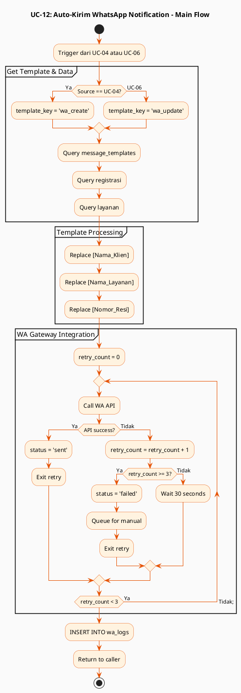

---

## Summary

Semua **12 Use Cases** sudah memiliki **Main Flow dalam bentuk PlantUML Activity Diagram** yang:
- ✅ **Syntax valid** (tidak ada error)
- ✅ **Mudah dibaca** dengan swimlanes (Actor vs System)
- ✅ **Mudah ditest** dengan step-by-step activities
- ✅ **Konsisten** format dan styling
- ✅ **Lengkap** dengan decision points dan partitions

*Dibuat untuk dokumentasi teknis Sistem NORA v2.1 - Kantor Notaris Sri Anah, S.H., M.Kn.*