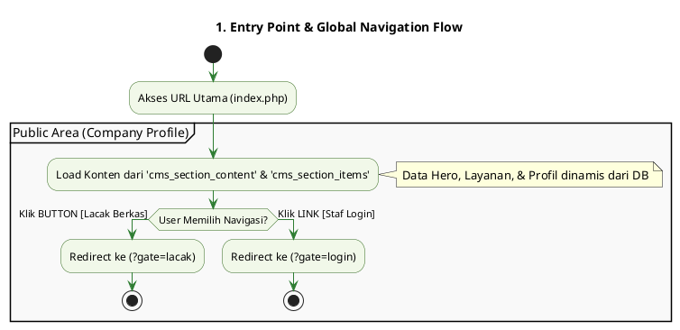
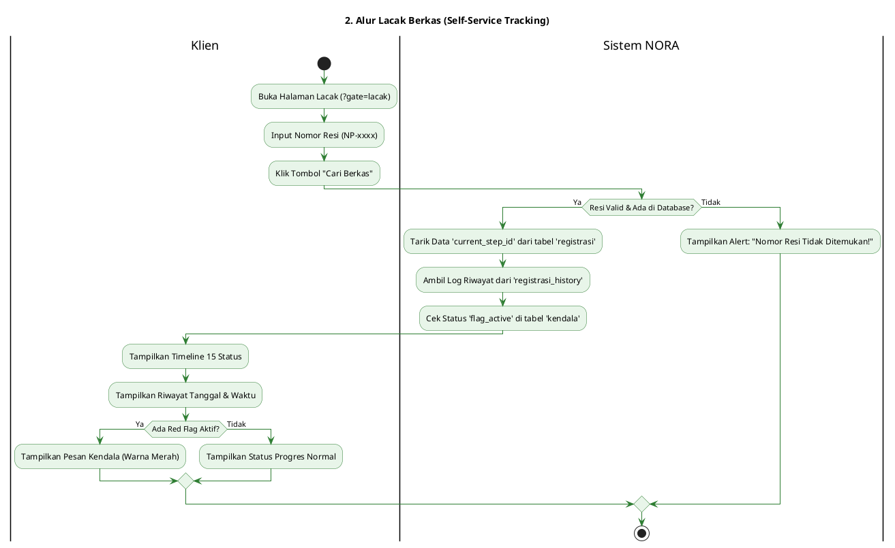
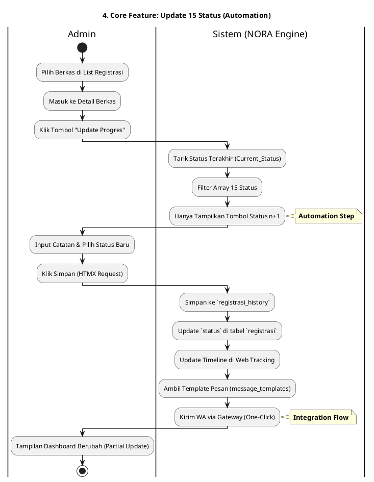
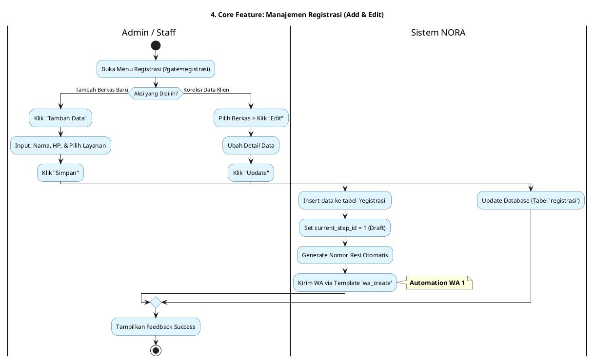
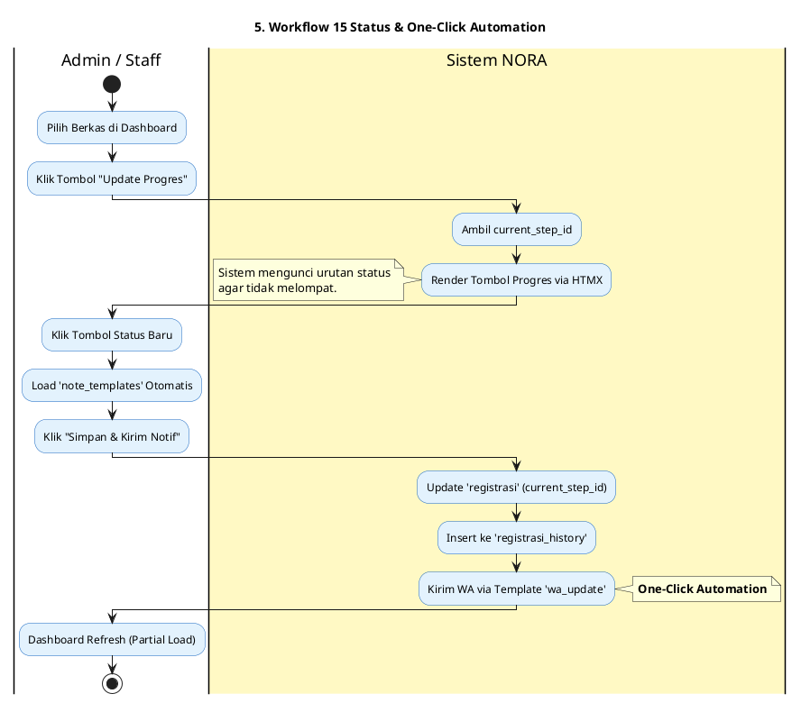
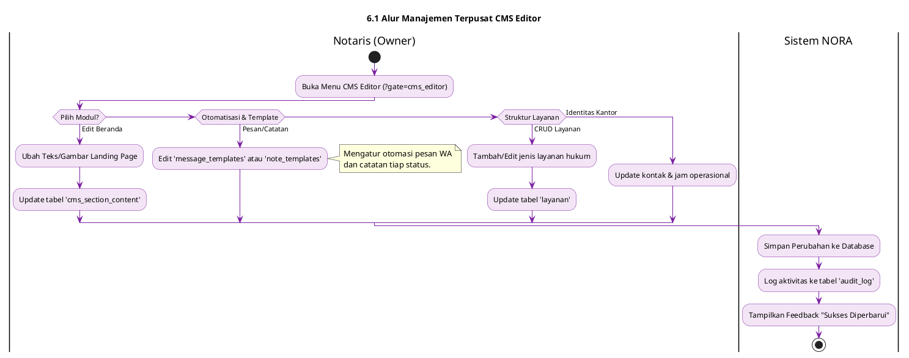
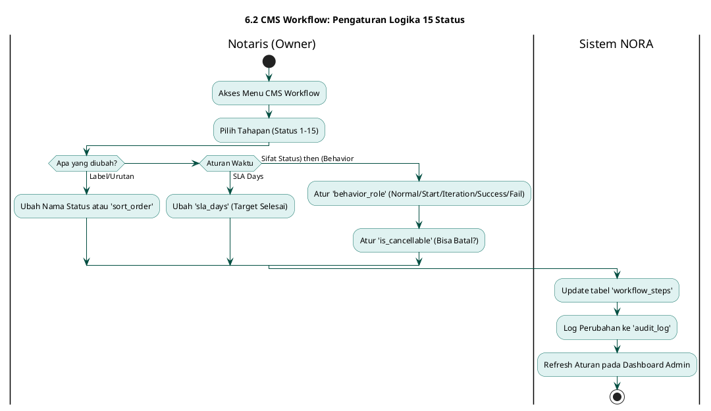
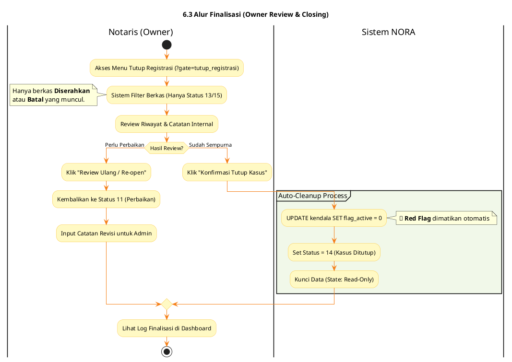
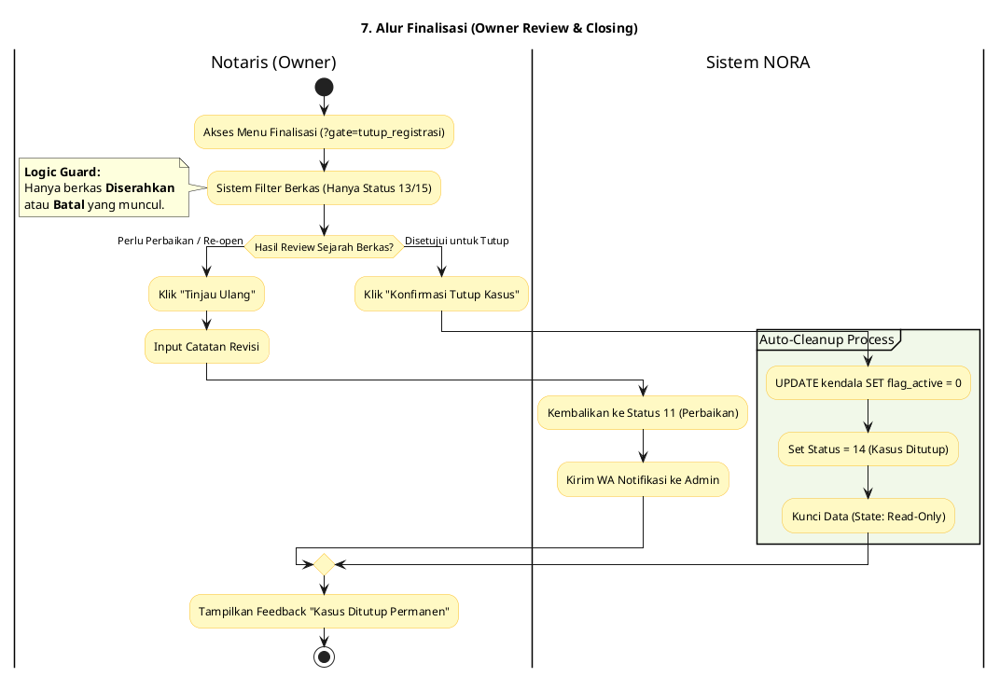

# 📑 Dokumentasi Alur Aplikasi - NORA v2.1

## 1. Entry Point: Landing Page (Default Gate)

User pertama kali mendarat di `index.php?gate=home`. Halaman ini menampilkan profil profesional Agrotech yang dikelola secara dinamis.

---

## 2. Public Side: Self-Service Tracking

Alur transparansi bagi klien untuk memantau "Nasib Berkas" secara mandiri tanpa perlu login.

---

## 3. Authentication & Security Flow

Gerbang masuk bagi Admin/Staff dengan sistem keamanan `password_hash` dan peran ( *Role* ).

## 4. Internal Side: Manajemen Registrasi (Add/Edit)

Proses administratif untuk memasukkan atau memperbaiki data klien ke dalam sistem.

**Cuplikan kode**

## 5. Logic Core: Mesin 15 Status (Automation)

Pusat operasional yang menggerakkan berkas menggunakan logika  **One-Click Automation** .

## 📑 6. Management Area: CMS & Workflow (Owner Control)

Pusat kontrol ini memberikan kekuasaan penuh kepada **Notaris (Owner)** untuk mengatur estetika  *landing page* , manajemen layanan, hingga logika otomatisasi operasional.

### 6.1 Alur Manajemen Terpusat CMS Editor

Alur ini mencakup perubahan konten visual, manajemen jenis layanan, dan identitas kantor.

### 6.2 CMS Workflow: Pengaturan Logika 15 Status

Modul khusus untuk memodifikasi perilaku dan urutan "Nasib Berkas" pada tabel `workflow_steps`.

### 6.3 Alur Finalisasi & Review (Closing Logic)

Logika pemisah di mana hanya Owner yang bisa menutup kasus secara permanen setelah syarat status tercapai.zz

**CMS Workflow** : Memberikan fleksibilitas bagi Notaris untuk mengatur `sla_days` guna mengukur kinerja staf dan mengatur `is_cancellable` untuk menentukan di status mana berkas masih boleh dibatalkan.

## 7. Finalisasi: Owner Review & Closing

Logika khusus di mana hanya **Owner (Notaris)** yang bisa menutup kasus secara permanen.

**Cuplikan kode**

---

### 🛡️ Ringkasan Aturan Bisnis (Guard Logic)

Sistem memiliki pengaman otomatis untuk menjaga integritas data hukum:

* **Safe Point** : Jika `status_id >= 5` (Pajak), tombol **"15. Batal"** disembunyikan otomatis.
* **Owner Authority** : Hanya Notaris yang bisa memicu **Auto-Cleanup** bendera kendala melalui proses konfirmasi **Tutup Kasus** (Status 14).
* **Behavior Role** : Notaris dapat menetapkan peran status (seperti *Iteration* untuk Perbaikan) yang memungkinkan alur berputar kembali ke tahap sebelumnya jika data tidak valid.
* **Finalisasi Berlapis** : Berkas tidak langsung dianggap selesai setelah Admin menyerahkan dokumen. Owner harus melakukan audit riwayat terlebih dahulu di menu "Tutup Registrasi" sebelum data benar-benar terkunci (Status 14).
* **Audit Trail** : Setiap perubahan dari pendaftaran hingga penutupan permanen terekam secara transparan di tabel `audit_log` dan `registrasi_history`.
