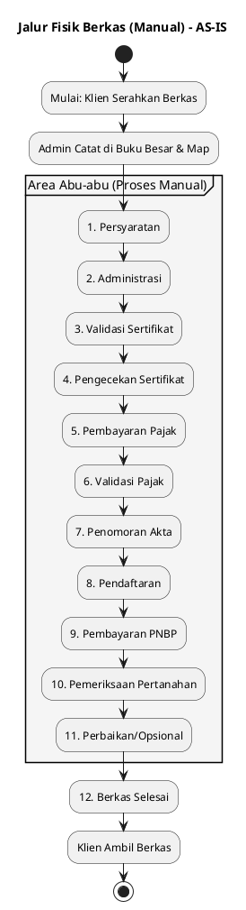
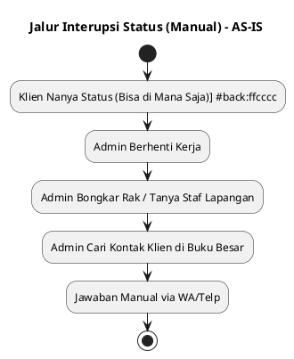
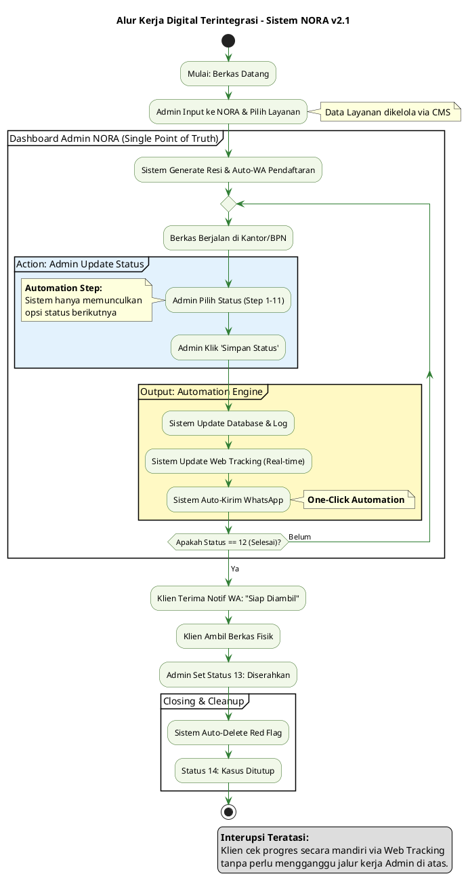

# 📑 Gambaran Proses Bisnis - Kantor Notaris Sri Anah, S.H., M.Kn.

## 1. Proses Manual (AS-IS)

### 1.1 Konteks Bisnis

Proses manual saat ini bersifat  **Linear tapi Gelap** . Admin mencatat di buku, dan informasi tertahan di sana. Jika ada interupsi (klien nanya), alur kerja fisik terhenti total.

### 1.2 Alur Kerja Manual Sebelum Sistem (AS-IS)

**A. Jalur Fisik Berkas (Jalur Utama)**

**Cuplikan kode**

**B. Jalur Interupsi Status (Jalur Terpisah)**

## 2. Solusi Digital: Sistem NORA (TO-BE)

### 2.1 Transformasi Proses Bisnis Digital (Relevan & Terintegrasi)

Inilah inti sistemmu. **Sistem NORA adalah pusatnya.** Admin hanya perlu melakukan satu aksi (Update), dan sistem melakukan semua sisanya secara otomatis. Klien tidak perlu nanya karena "nanya" sudah dijawab oleh sistem secara  *real-time* .

## 3. Analisis Perbandingan (AS-IS vs TO-BE)

| **Aspek**             | **Manual (AS-IS)**          | **Sistem NORA (TO-BE)**                   |
| --------------------------- | --------------------------------- | ----------------------------------------------- |
| **Keterhubungan**     | **Terpisah**(Fisik vs Info) | **Menyatu**(Satu Dashboard untuk Semua)   |
| **Pengecekan Status** | Admin bongkar rak (Repetitif)     | Self-Service (Cek Web via Resi)                 |
| **Pesan WhatsApp**    | Ketik manual satu per satu        | **Auto-Generated**dari Template           |
| **Workflow**          | Hafalan Staf                      | **Sistem yang Mengarahkan**(Step-by-step) |

## 4. Fitur Unggulan & Business Rules (Detail Lengkap)

### 4.1 Aturan 15 Status & Workflow Automation

Sistem NORA memandu Admin melalui urutan logis layanan Notaris/PPAT yang terdiri dari 15 tahapan status sebagai berikut:

1. **Persyaratan** **$\rightarrow$** 2. **Administrasi** **$\rightarrow$** 3. **Validasi Sertifikat** **$\rightarrow$** 4. **Pengecekan Sertifikat** **$\rightarrow$** 5. **Pembayaran Pajak** **$\rightarrow$** 6. **Validasi Pajak** **$\rightarrow$** 7. **Penomoran Akta** **$\rightarrow$** 8. **Pendaftaran** **$\rightarrow$** 9. **Pembayaran PNBP** **$\rightarrow$** 10. **Pemeriksaan Pertanahan** **$\rightarrow$** 11. **Perbaikan (Opsional)** **$\rightarrow$** 12. **Selesai** **$\rightarrow$** 13. **Diserahkan** **$\rightarrow$** 14. **Kasus Ditutup** **$\rightarrow$** 15.  **Batal** .

* **Automation Step (Logika Berurutan):** Sistem menggunakan  *logic-gate* . Jika posisi berkas saat ini berada di status  **3. Validasi Sertifikat** , maka pada Dashboard Admin secara otomatis hanya akan menonjolkan (highlight) opsi tombol untuk menuju status  **4. Pengecekan Sertifikat** . Hal ini mencegah Admin melompati tahapan prosedur hukum yang wajib.
* **Safe Point (Batas Pembatalan):** Tombol **"15. Batal"** hanya aktif secara sistem selama berkas berada di antara status **1** sampai  **4** . Begitu Admin melakukan *update* ke status  **5. Pembayaran Pajak** , sistem secara permanen akan mengunci (disable) opsi pembatalan. Hal ini karena secara operasional, dana pajak sudah disetorkan ke kas negara dan proses tidak dapat ditarik kembali secara sepihak.
* **Finalization & Cleanup:**
  Status **13. Diserahkan** menandai berkas telah "Pulang" ke tangan klien. Selanjutnya, pada status  **14. Kasus Ditutup** , sistem menjalankan skrip otomatis untuk melakukan **Auto-Delete Red Flag** (membersihkan tanda kendala) agar database tetap bersih dan minimalis.

### 4.2 Otomatisasi WhatsApp (One-Click)

Sesuai database `message_templates`, Admin hanya butuh  **satu klik simpan** .

* Sistem mengambil variabel `[Nama_Klien]` dan `[Nama_Layanan]`.
* Mengirimkan pesan profesional tanpa perlu Admin membuka HP/WA Web.

### 4.3 Flag Kendala (🚩 Red Flag) & Auto-Cleanup

Setiap berkas bermasalah ditandai  **Red Flag** .

* **Auto-Cleanup:** Untuk menjaga kebersihan data (minimalis), sistem menjalankan skrip penghapusan flag secara otomatis saat Admin mengubah status menjadi  **14. Kasus Ditutup** .

## 5. Stakeholder & Hak Akses

* **Notaris (Owner):** Memantau dashboard performa (melihat berkas mana yang paling lama di BPN).
* **Admin/Staff:** Mengelola 15 status, manajemen kendala, dan update informasi layanan di CMS.
* **Klien:** Melakukan tracking mandiri secara mandiri (Self-Service).

## 6. Kesimpulan

Sistem NORA memindahkan "beban informasi" dari pundak Admin ke dalam sistem. Dengan integrasi 15 tahapan yang menyatu dengan otomasi WhatsApp, nasib berkas dari **Datang** hingga **Pulang** menjadi sangat transparan dan profesional.

*Dibuat untuk dokumentasi teknis Sistem NORA v2.1*
