# 📑 Dokumentasi Alur Aplikasi

# Sistem NORA v2.1 (Structured + Layered + PlantUML)

# 1. **Entry Point & Public Access Flow**

Fokus: titik masuk user ke sistem

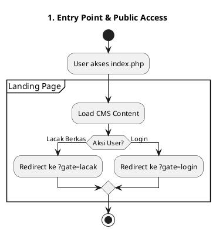

# 2. **Public Feature Flow (Client Side)**

Fokus: fitur tanpa login

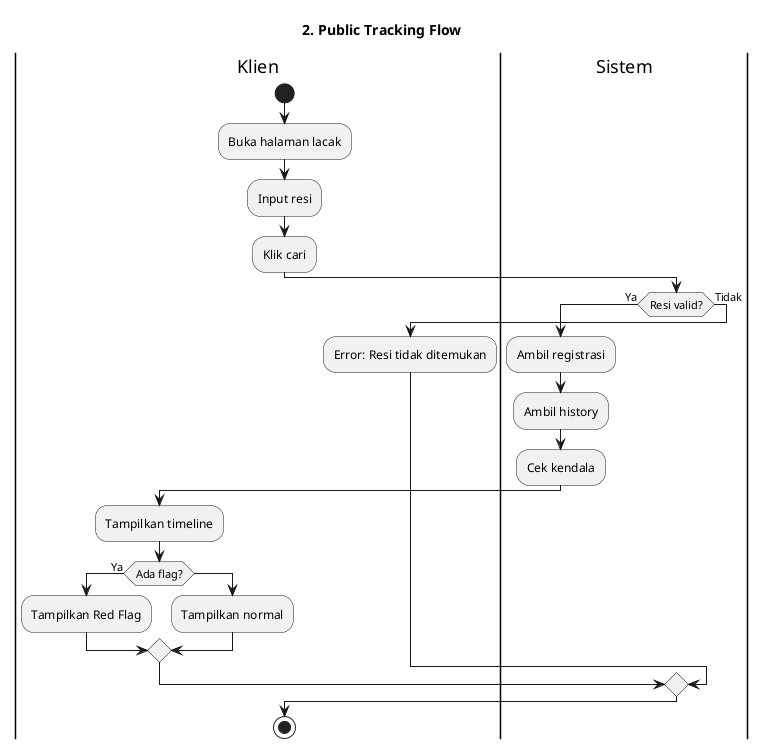

# 3. **Authentication & Authorization Flow**

Fokus: login + role

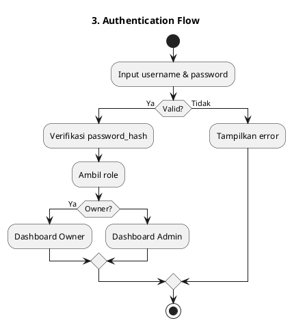

# 4. **Main Navigation Flow (Post-Login System)**

Fokus: struktur navigasi setelah login

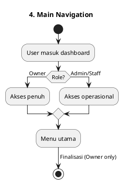

# 5. **Core Feature Flow (Operational Engine)**

## 5.1 Manajemen Registrasi

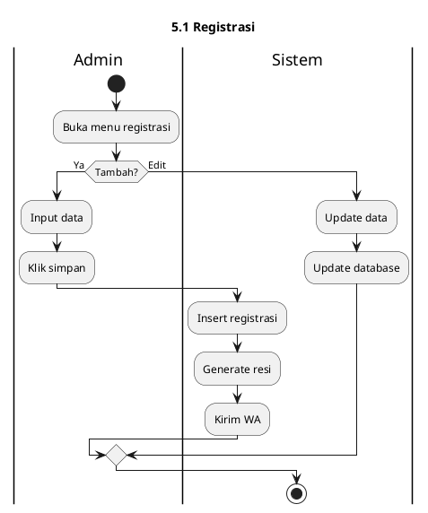

## 5.2 Update Status Berkas

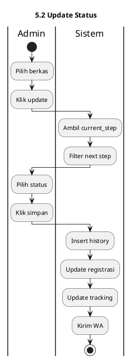

## 5.3 Workflow Engine (15 Status Logic)

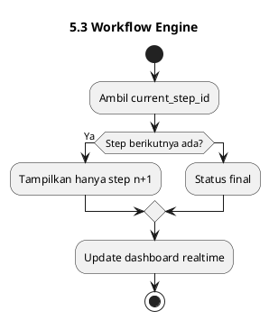

# 6. **Management Flow (Owner Control)**

## 6.1 CMS Editor

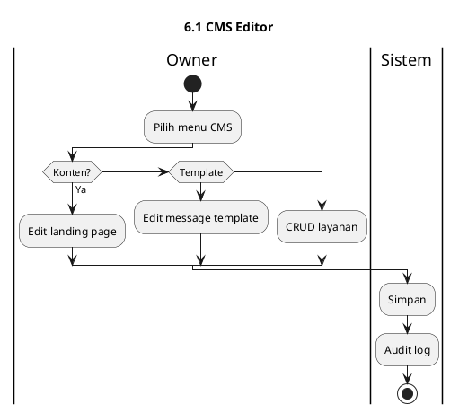

## 6.2 Workflow Configuration

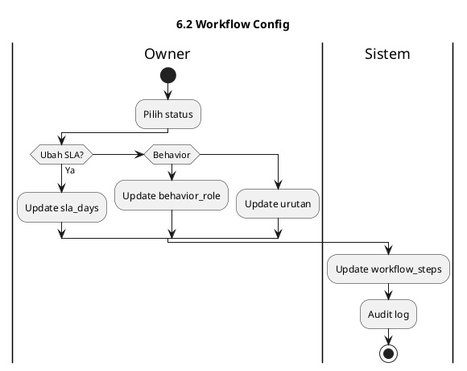

# 7. **Finalization Flow (Closing System)**

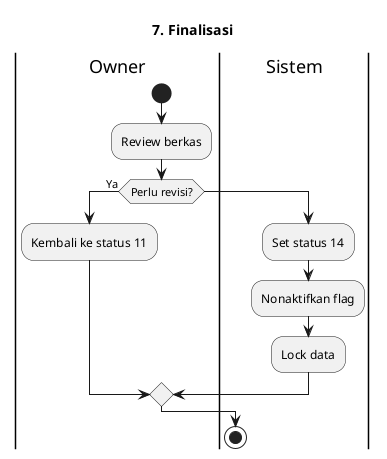

# 8. **System-Wide Behavior (Global Logic)**

## 8.1 Error Handling

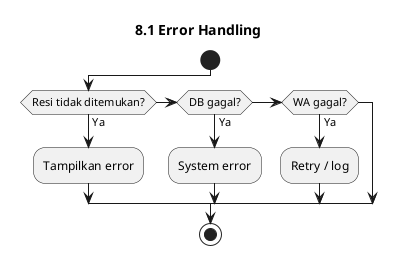

## 8.2 State Management

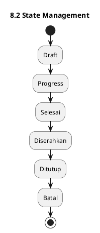

## 8.3 Integration Flow

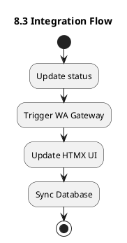

# 9. **Business Rules (Guard Logic)**

* Status ≥ 5 → tidak bisa batal
* Status harus berurutan (no skip)
* Hanya Owner bisa finalisasi
* Auto-cleanup saat status 14
* Semua aktivitas tercatat (`audit_log`, `registrasi_history`)
* WhatsApp otomatis tiap update
