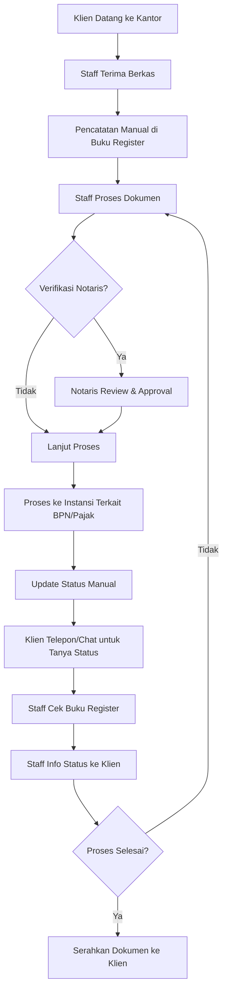
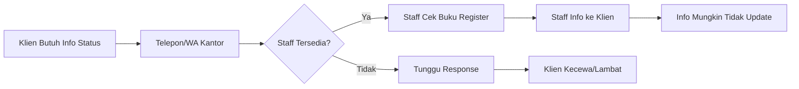
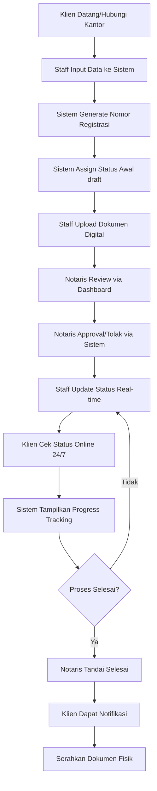
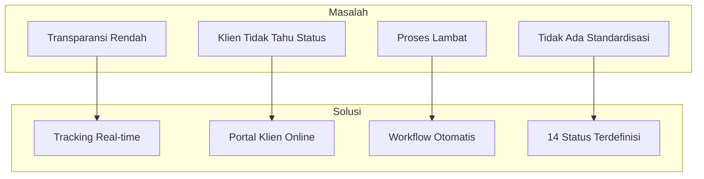

# Gambaran Proses Bisnis - Kantor Notaris Sri Anah, S.H., M.Kn.

## 1. Proses Manual (AS-IS)

### 1.1 Konteks Bisnis Notaris

Kantor Notaris Sri Anah, S.H., M.Kn. merupakan lembaga hukum yang menyediakan layanan pembuatan akta, pengurusan sertifikat tanah, dan layanan notaris lainnya. Dalam operasional sehari-hari, kantor notaris menangani berbagai jenis dokumen hukum yang memerlukan proses bertahap dengan melibatkan multiple pihlaak.

### 1.2 Alur Kerja Manual Sebelum Implementasi Sistem

### 1.3 Detail Proses Manual

#### 1.3.1 Pendaftaran Berkas Masuk

- Klien datang langsung ke kantor notaris
- Staff menerima berkas fisik dokumen
- Pencatatan dilakukan secara manual dalam buku register/buku besar
- Informasi yang dicatat: nama klien, jenis layanan, tanggal masuk, nomor berkas

#### 1.3.2 Proses Validasi Internal

- Staff melakukan validasi kelengkapan dokumen
- Notaris melakukan review dan approval terhadap dokumen hukum
- Catatan perbaikan disampaikan ke klien secara langsung (telepon/WA)

#### 1.3.3 Proses Eksternal (BPN/Pajak)

- Staff mengantarkan berkas ke BPN (Badan Pertanahan Nasional)
- Staff mengurus pembayaran pajak dan PNBP
- Proses pengecekan sertifikat memerlukan waktu 7-14 hari kerja
- Setiap tahap dicatat manual dan sulit dilacak

#### 1.3.4 Monitoring Status oleh Klien

- **Klien harus menghubungi kantor notaris** untuk mengetahui status
- Komunikasi melalui telepon atau WhatsApp
- Staff harus mencari catatan manual di buku register
- Informasi yang diberikan tidak real-time dan bergantung pada ketersediaan staff

#### 1.3.5 Penyelesaian dan Penyerahan

- Setelah proses selesai, klien diinformasikan melalui telepon/WA
- Klien datang ke kantor untuk mengambil dokumen
- Pencatatan penyerahan dilakukan manual

---

## 2. Permasalahan dalam Proses Manual

### 2.1 Transparansi Rendah

| Masalah                                           | Dampak                                       |
| ------------------------------------------------- | -------------------------------------------- |
| Klien tidak dapat mengakses status secara mandiri | Ketergantungan tinggi pada staff             |
| Informasi hanya tersedia saat jam kerja           | Klien tidak bisa cek di luar jam operasional |
| Tidak ada riwayat progress yang tercatat rapi     | Sulit melacak hambatan/kendala               |

### 2.2 Klien Tidak Mengetahui Status Dokumen

**Dampak:**

- Klien merasa tidak mendapat kepastian
- Banyaknya pertanyaan berulang memberatkan staff
- Citra kantor notaris kurang profesional di mata klien

### 2.3 Proses Lambat dan Manual

| Aktivitas                               | Waktu Terbuang           |
| --------------------------------------- | ------------------------ |
| Pencatatan manual di buku register      | 5-10 menit per berkas    |
| Mencari status saat klien bertanya      | 3-5 menit per pertanyaan |
| Koordinasi staff-notaris untuk approval | 1-2 hari (tatap muka)    |
| Update status setelah proses eksternal  | Sering terlupa/tunda     |

### 2.4 Tidak Ada Standardisasi Workflow

- Setiap staff memiliki cara pencatatan berbeda
- Tidak ada tracking tahapan yang konsisten
- Sulit melakukan monitoring performa
- Kendala/hambatan tidak terdokumentasi dengan baik

---

## 3. Solusi: Sistem Informasi Tracking Status Dokumen

### 3.1 Transformasi Proses Bisnis (TO-BE)

### 3.2 Peningkatan yang Diharapkan

| Aspek                      | Sebelum (AS-IS)                     | Sesudah (TO-BE)             |
| -------------------------- | ----------------------------------- | --------------------------- |
| **Akses Status**     | Harus telepon/datang                | Online 24/7 via web         |
| **Transparansi**     | Rendah (manual)                     | Tinggi (real-time tracking) |
| **Effisiensi Staff** | Banyak waktu untuk jawab pertanyaan | Fokus ke proses dokumen     |
| **Workflow**         | Tidak terstandardisasi              | 14 status terdefinisi jelas |
| **Audit Trail**      | Tidak ada                           | Lengkap (history log)       |
| **Approval Notaris** | Tatap muka/fisik                    | Via dashboard digital       |

### 3.3 Fitur Utama Sistem

#### 3.3.1 Tracking Status Real-time untuk Klien

- Klien dapat mengecek status dokumen kapan saja
- Cukup input nomor registrasi dan verifikasi 4 digit terakhir nomor HP
- Tampilan progress bar dengan 14 tahapan status
- Estimasi waktu penyelesaian per tahap

#### 3.3.2 Workflow Internal Terstruktur

- **Staff**: Input registrasi, update status, upload dokumen
- **Notaris**: Review, approval, monitoring dashboard
- **Sistem**: Validasi transisi status, logging otomatis

#### 3.3.3 CMS & Manajemen Data

- Homepage company profile dengan CMS
- Manajemen layanan notaris
- Template pesan WhatsApp untuk notifikasi klien

---

## 4. Mapping Masalah → Solusi Sistem

### 4.1 Hubungan Langsung Masalah-Solusi

| Masalah                 | Solusi Sistem       | Implementasi                                   |
| ----------------------- | ------------------- | ---------------------------------------------- |
| Transparansi rendah     | Tracking real-time  | Status update langsung tampil di portal klien  |
| Klien harus telepon     | Portal self-service | Klien cek sendiri via web 24/7                 |
| Proses lambat           | Workflow otomatis   | Transisi status tervalidasi, tidak bisa mundur |
| Tidak ada standardisasi | 14 status baku      | Draft → Selesai/Ditutup dengan aturan jelas   |

---

## 5. Stakeholder yang Terlibat

### 5.1 Internal Kantor Notaris

| Role                  | Tanggung Jawab                                    | Akses Sistem                                        |
| --------------------- | ------------------------------------------------- | --------------------------------------------------- |
| **Notaris**     | Approval dokumen, monitoring, user management     | Full access (dashboard, users, CMS, finalisasi)     |
| **Admin/Staff** | Input registrasi, update status, komunikasi klien | Dashboard (registrasi, status update, klien update) |

### 5.2 Eksternal

| Role             | Kebutuhan                 | Akses Sistem                  |
| ---------------- | ------------------------- | ----------------------------- |
| **Klien**  | Tracking status dokumen   | Public tracking (tanpa login) |
| **Publik** | Informasi layanan notaris | Homepage company profile      |

---

## 6. Kesimpulan

Implementasi Sistem Informasi Tracking Status Dokumen berbasis web memberikan solusi komprehensif terhadap permasalahan transparansi dan efisiensi pada Kantor Notaris Sri Anah, S.H., M.Kn.

**Manfaat Utama:**

1. **Transparansi meningkat** - Klien dapat memantau progress 24/7
2. **Efisiensi operasional** - Staff tidak lagi dibebani pertanyaan status berulang
3. **Standardisasi workflow** - 14 status dengan aturan transisi yang jelas
4. **Audit trail lengkap** - Semua perubahan tercatat dalam history log
5. **Citra profesional** - Sistem modern meningkatkan kepercayaan klien

Sistem ini dirancang khusus untuk domain notaris dengan business rules yang ketat, termasuk batasan pembatalan setelah tahap pembayaran pajak dan validasi workflow untuk mencegah kemunduran status yang tidak logis.
