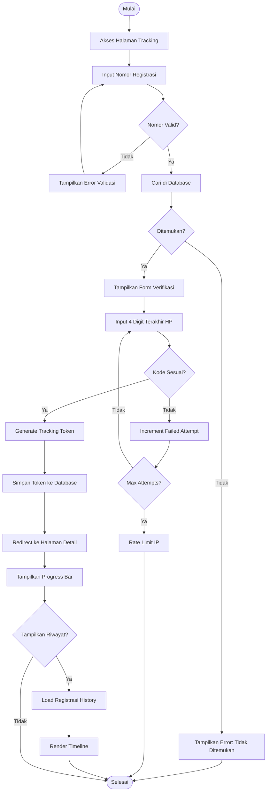
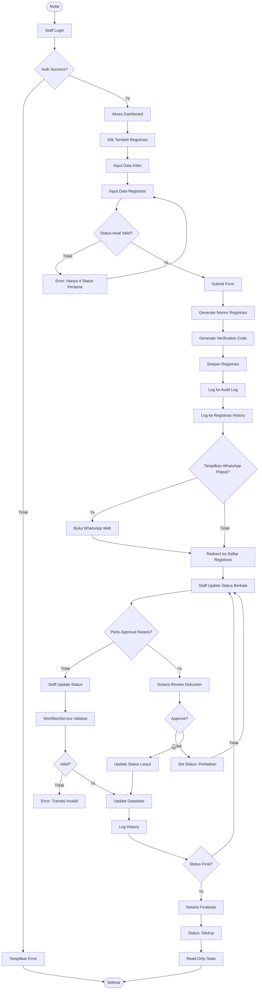
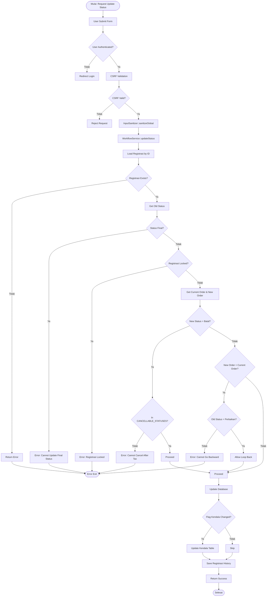
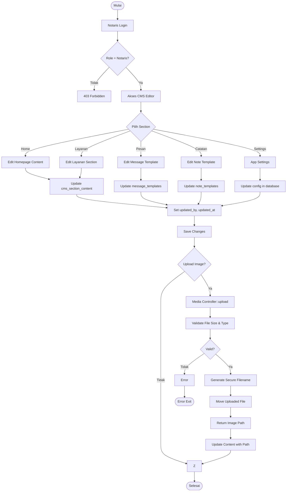
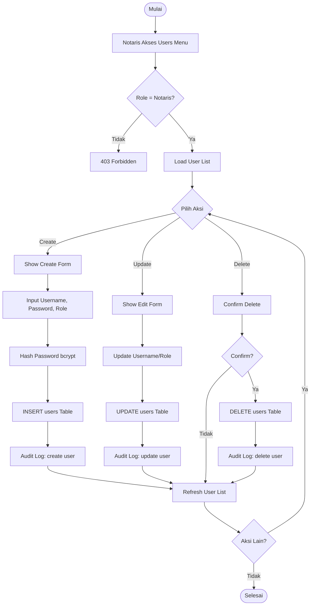
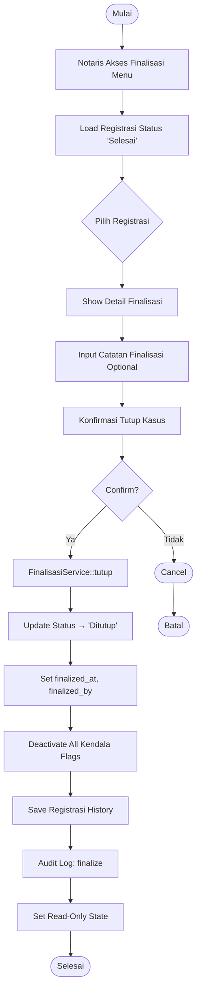
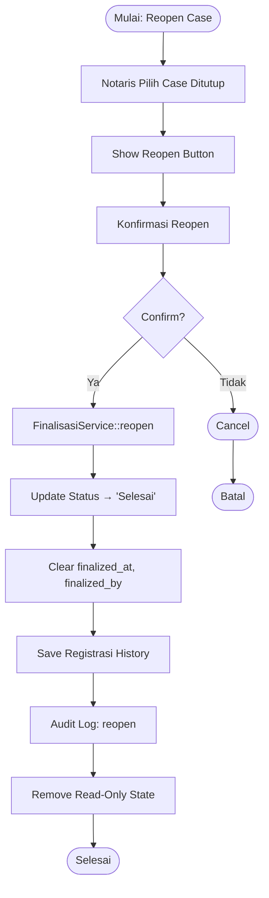
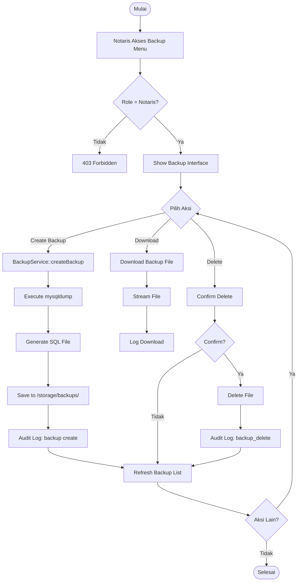
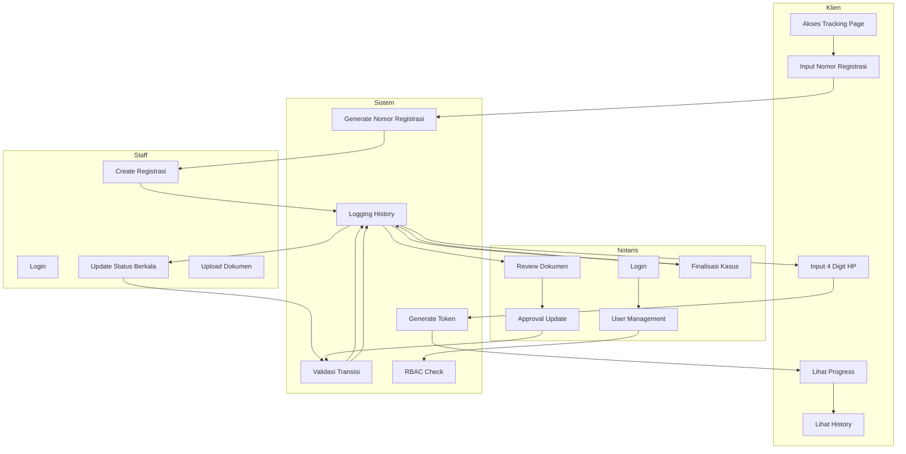

# Activity Diagram - Sistem Tracking Status Dokumen Notaris

## 1. Activity Diagram: Tracking Dokumen oleh Klien

### 1.1 Deskripsi

Activity diagram ini menggambarkan alur klien dalam melakukan tracking status dokumen dari awal hingga berhasil melihat progress dan riwayat perubahan.

### 1.2 Detail Aktivitas

| Aktivitas              | Deskripsi                            | Komponen                             |
| ---------------------- | ------------------------------------ | ------------------------------------ |
| Akses Halaman Tracking | Klien membuka `?gate=lacak`        | Main\Controller::tracking()          |
| Input Nomor Registrasi | Klien input nomor registrasi         | Form POST                            |
| Validasi Format        | Sistem validasi format input         | InputSanitizer                       |
| Cari di Database       | Query registrasi by nomor_registrasi | Registrasi::findByNomorRegistrasi()  |
| Form Verifikasi        | Sistem minta 4 digit HP              | tracking.php view                    |
| Verifikasi Kode        | Bandingkan input dengan data klien   | Main\Controller::verifyTracking()    |
| Generate Token         | Buat secure tracking token           | generateTrackingToken()              |
| Tampilkan Progress     | Render progress bar                  | registrasi_detail.php                |
| Load History           | Query registrasi_history             | RegistrasiHistory::getByRegistrasi() |

### 1.3 Business Rules

1. **Rate Limiting**: Maksimal 5 percobaan verifikasi per menit per IP
2. **Token Expiry**: Tracking token expired setelah 24 jam
3. **No Phone Exposure**: Nomor HP lengkap tidak pernah ditampilkan ke klien
4. **Secure Token**: Token menggunakan HMAC-SHA256 signature

---

## 2. Activity Diagram: Workflow Approval Notaris

### 2.1 Deskripsi

Activity diagram ini menggambarkan alur workflow internal dari staff input registrasi hingga approval oleh notaris.

### 2.2 Detail Aktivitas

| Aktivitas                 | Deskripsi                | Komponen                                 |
| ------------------------- | ------------------------ | ---------------------------------------- |
| Staff Login               | Autentikasi staff        | Auth\Controller::login()                 |
| Input Data Klien          | Nama, HP, Email          | Form registrasi_create.php               |
| Input Data Registrasi     | Layanan, Status, Catatan | Form registrasi_create.php               |
| Validasi Status Awal      | Cek 4 status pertama     | allowedCreateStatuses array              |
| Generate Nomor Registrasi | NP-YYYYMMDD-XXXX         | Auto-increment + date                    |
| Simpan Registrasi         | INSERT ke registrasi     | Registrasi::create()                     |
| Update Status Berkala     | Staff update progress    | Dashboard\Controller::updateStatus()     |
| Validasi Transisi         | Workflow validation      | WorkflowService::updateStatus()          |
| Notaris Review            | Approval dokumen         | Implicit via update status               |
| Finalisasi                | Tutup kasus              | Finalisasi\Controller::tutupRegistrasi() |

### 2.3 Business Rules

1. **Status Awal Terbatas**: Hanya `draft`, `pembayaran_admin`, `validasi_sertifikat`, `pencecekan_sertifikat`
2. **Tidak Bisa Mundur**: Status tidak dapat mundur (kecuali dari `perbaikan`)
3. **Batas Pembatalan**: Tidak bisa batal setelah `pembayaran_pajak`
4. **Lock Mechanism**: Registrasi locked tidak dapat diupdate
5. **Final Status**: `selesai`, `ditutup`, `batal` adalah read-only

---

## 3. Activity Diagram: Update Status dengan Validasi

### 3.1 Deskripsi

Activity diagram detail untuk proses update status dengan validasi workflow.

### 3.2 Decision Points

| Decision                   | Condition                    | True Branch       | False Branch   |
| -------------------------- | ---------------------------- | ----------------- | -------------- |
| User Authenticated?        | Session exists               | Proceed           | Redirect login |
| CSRF Valid?                | Token match                  | Proceed           | Reject         |
| Registrasi Exists?         | ID found                     | Proceed           | Error          |
| Status Final?              | In [selesai, ditutup, batal] | Error             | Proceed        |
| Registrasi Locked?         | is_locked = 1                | Error             | Proceed        |
| New Status = Batal?        | status == 'batal'            | Check cancellable | Check order    |
| In CANCELLABLE_STATUSES?   | status in array              | Proceed           | Error          |
| New Order < Current Order? | backward transition          | Check perbaikan   | Proceed        |
| Old Status = Perbaikan?    | status == 'perbaikan'        | Allow loop        | Error          |

---

## 4. Activity Diagram: CMS Management

### 4.1 Deskripsi

Activity diagram untuk manajemen konten CMS oleh notaris.

---

## 5. Activity Diagram: User Management

### 5.1 Deskripsi

Activity diagram untuk manajemen user (hanya notaris).

---

## 6. Activity Diagram: Finalisasi Kasus

### 6.1 Deskripsi

Activity diagram untuk proses finalisasi (tutup) kasus.

### 6.2 Reopen Case Flow

---

## 7. Activity Diagram: Backup & Restore

### 7.1 Deskripsi

Activity diagram untuk backup database.

---

## 8. Swimlane Activity Diagram: End-to-End Process

### 8.1 Deskripsi

Swimlane diagram yang menunjukkan interaksi antara Klien, Staff, Notaris, dan Sistem dalam satu alur lengkap.

---

## 9. Kesimpulan

Activity Diagram yang telah diuraikan mencakup:

1. **Tracking oleh Klien** - Alur lengkap dari input nomor registrasi hingga viewing progress
2. **Workflow Internal** - Staff input → notaris approval → finalisasi
3. **Update Status Validation** - Decision tree validasi transisi status
4. **CMS Management** - Content editing dan image upload
5. **User Management** - CRUD user dengan audit logging
6. **Finalisasi** - Tutup dan reopen kasus
7. **Backup** - Database backup management
8. **End-to-End Swimlane** - Interaksi semua aktor dalam satu flow

Semua diagram mengikuti business rules yang ketat untuk domain notaris, termasuk batasan pembatalan, validasi workflow, dan security measures.
