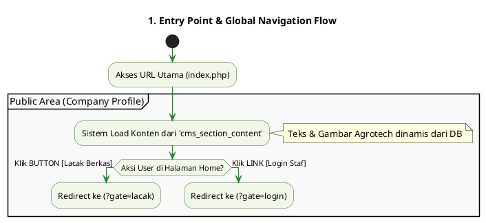
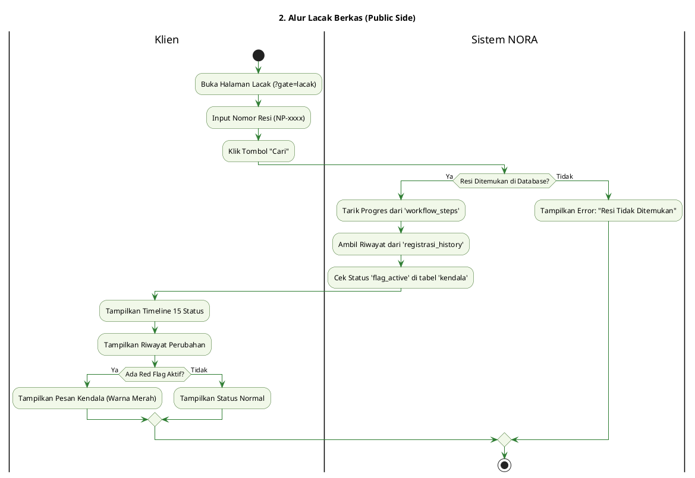
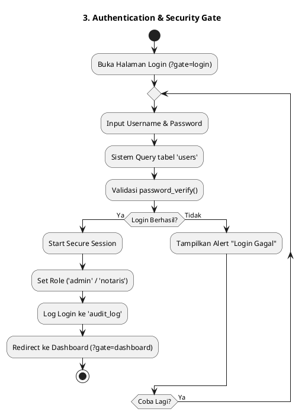
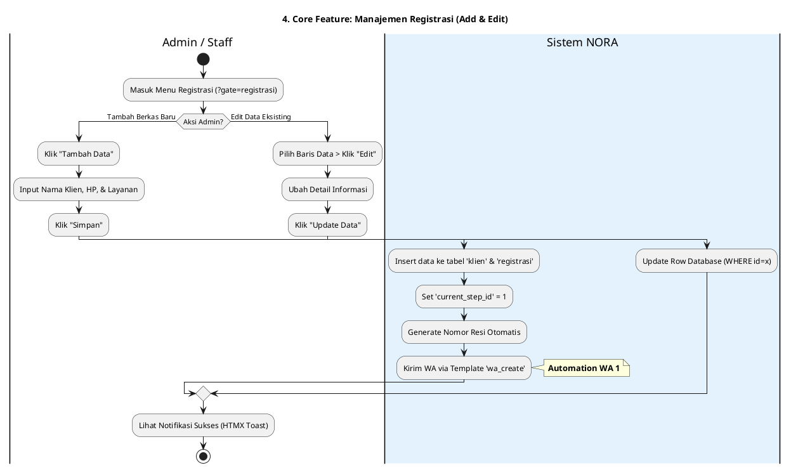
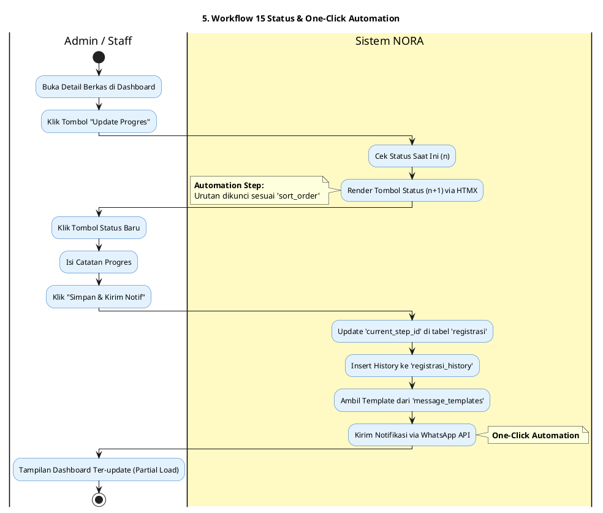
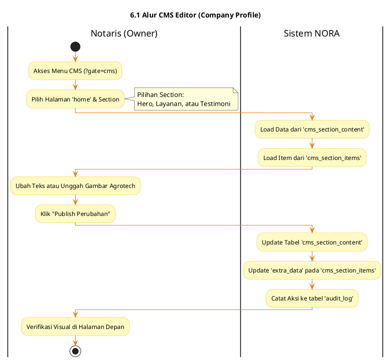
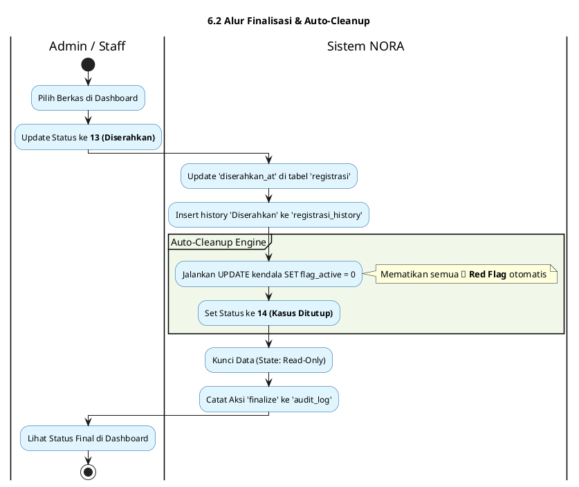
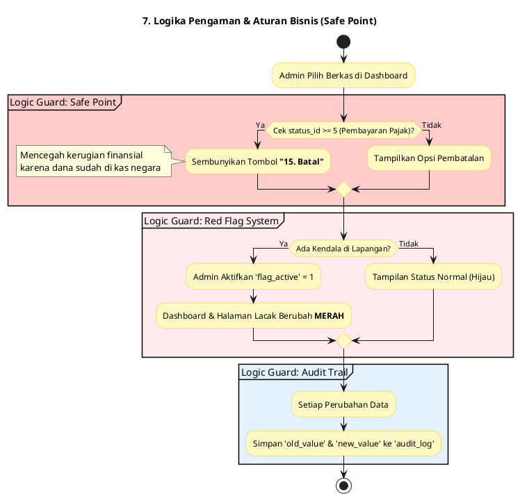

Mohon maaf atas ketidaknyamanannya. Sepertinya terdapat kendala teknis pada rendering diagram sebelumnya. Berikut adalah **Master App Flow (Alur Aplikasi) NORA v2.1** yang disusun ulang secara sangat detail, teknis, dan bersih menggunakan  **PlantUML** , sesuai dengan struktur database `norasblmupdate2.sql` dan logika bisnis yang kita diskusikan.

---

# 📑 Master App Flow - Sistem NORA v2.1

## 1. Titik Masuk Utama (Entry Point & Home)

User pertama kali mengakses `index.php?gate=home`. Halaman ini adalah **Company Profile Agrotech** yang dikelola melalui database.

**Cuplikan kode**

---

## 2. Alur Lacak Berkas (Public Side)

Klien melakukan pemantauan mandiri tanpa login untuk melihat "Nasib Berkas" secara  *real-time* .

**Cuplikan kode**

---

## 3. Alur Login & Keamanan (Gatekeeper)

Proses autentikasi menggunakan `password_hash` dan pembagian peran ( *RBAC* ).

**Cuplikan kode**

---

## 4. Alur Manajemen Data: Registrasi (Add & Edit)

Admin memasukkan atau memperbaiki data klien sebelum menjalankan proses hukum.

**Cuplikan kode**

---

## 5. Alur Mesin 15 Status & Otomasi WhatsApp

Proses inti menggerakkan berkas menggunakan logika  *Step-by-step* .

**Cuplikan kode**

---

## 📑 6. Alur CMS & Finalisasi (Notaris Area)

Bagaimana Notaris mengelola konten profesional Agrotech dan menutup riwayat berkas secara permanen di database `norasblmupdate2`.

### 6.1 CMS Editor Flow (Agrotech Profile)

Alur bagi Notaris untuk mengubah tampilan Landing Page tanpa menyentuh kode.

**Cuplikan kode**

### 6.2 Finalisasi & Auto-Cleanup Flow

Proses otomatisasi saat berkas telah diserahkan kepada klien agar database tetap bersih.

**Cuplikan kode**

---

## 📑 7. Aturan Bisnis & Logika Pengaman (Safe Point)

Sistem NORA v2.1 memiliki logika *Guard* otomatis untuk menjaga integritas proses hukum di kantor Notaris.

**Cuplikan kode**

---

### Penjelasan Detail Teknis:

* **Penyelesaian Sintaks Warna** : Saya telah memperbaiki sintaks warna menggunakan format terbaru (seperti `#back:f1f8e9`) untuk menghindari eror *deprecated* yang kamu alami sebelumnya.
* **CMS Management** : Notaris dapat mengelola 8 section utama (Hero, Layanan, Alur, dsb) melalui tabel `cms_page_sections` dan `cms_section_content` secara dinamis.
* **Safe Point (Status 5)** : Berdasarkan aturan bisnis, setelah memasuki tahap  **5. Pembayaran Pajak** , sistem mengunci fitur pembatalan untuk melindungi transaksi yang sudah melibatkan setoran negara.
* **Auto-Cleanup** : Fungsi ini sangat krusial di sistem kamu untuk memastikan saat berkas sudah di tahap  **14 (Kasus Ditutup)** , tidak ada lagi bendera kendala (Red Flag) yang menggantung di dashboard.
* **Audit Trail** : Setiap langkah dari status 1 sampai 14 terekam permanen di tabel `audit_log` dan `registrasi_history` untuk keperluan transparansi hukum kantor Notaris.
