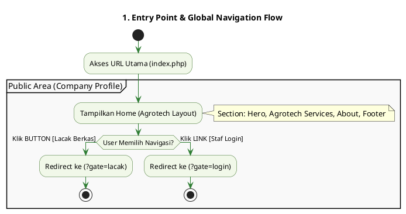
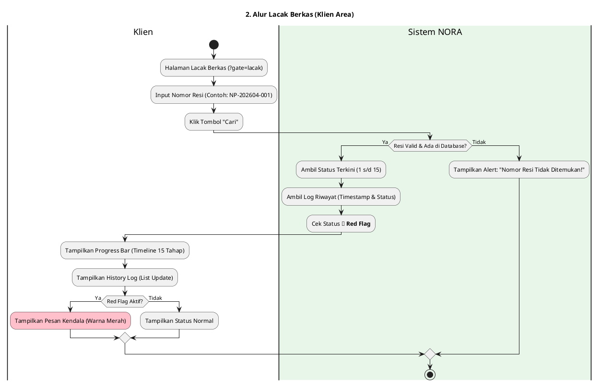
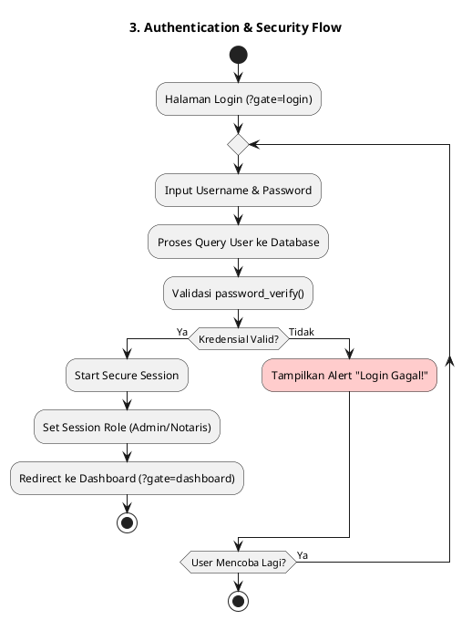
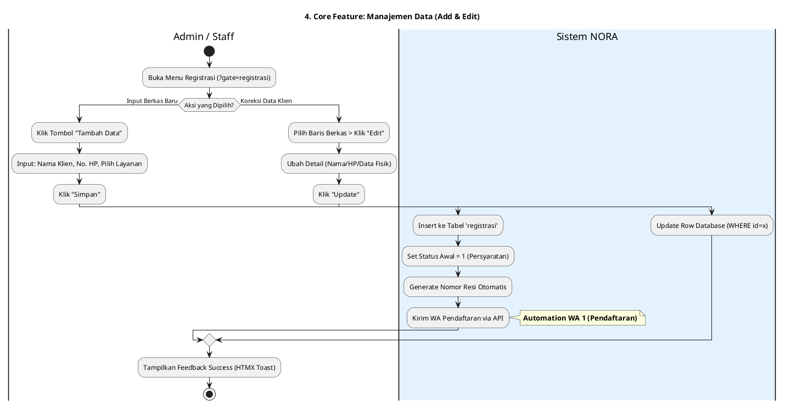
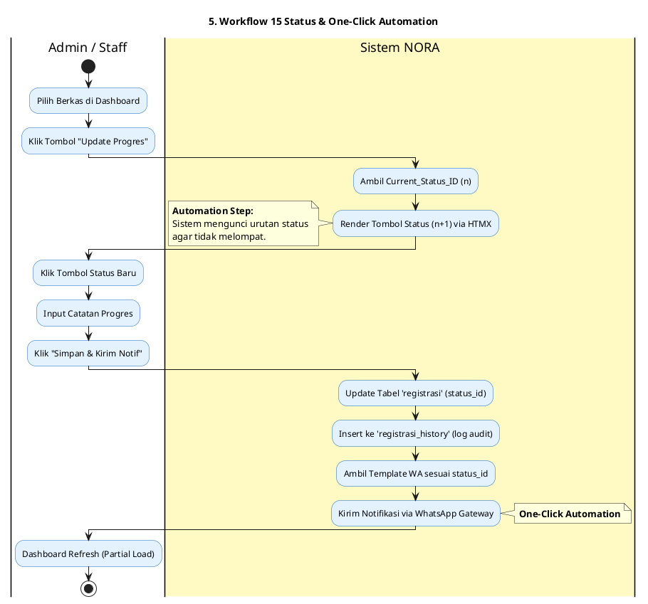

Siap, ini adalah **Master App Flow (Alur Aplikasi)** paling detail, teknis, dan komprehensif untuk  **NORA v2.1** . Dokumen ini dirancang mengikuti struktur *Gate* Vanilla PHP kamu, memisahkan area publik (Agrotech Profile) dengan area privat (Dashboard), serta mengunci logika **15 Status** dan  **One-Click Automation** .

---

# 📑 Master App Flow - Sistem NORA v2.1

## 1. Entry Point: Landing Page (Default Gate)

User pertama kali mendarat di `index.php?gate=home`. Halaman ini menampilkan **Company Profile** dengan gaya Agrotech yang bersih.

**Cuplikan kode**

---

## 2. Public Side: Self-Service Tracking (Via Button)

Alur ini menangani transparansi "Nasib Berkas" bagi klien tanpa perlu login.

---

## 3. Authentication Gate (Via Link)

Alur masuk bagi Admin/Staff untuk mengelola area manajemen berkas.

**Cuplikan kode**

---

## 4. Internal Side: Manajemen Registrasi (Add & Edit)

Alur saat Admin pertama kali memasukkan atau memperbaiki data berkas fisik ke sistem digital.

**Cuplikan kode**

---

## 5. Logic Core: Mesin 15 Status (Workflow Automation)

Inilah jantung sistem yang menggerakkan "Nasib Berkas" dengan logika **Automation Step** dan  **One-Click WA** .

**Cuplikan kode**

---

## 6. Management Area: CMS & Finalisasi (Notaris Area)

Bagaimana Notaris mengelola konten agrotech dan menutup kasus secara permanen.

* **CMS Editor (`?gate=cms`):** Notaris mengubah teks, judul, dan gambar pada halaman Home (Landing Page) agar tetap relevan tanpa menyentuh kode PHP.
* **Finalisasi & Cleanup Flow:**
  1. Admin mengubah status ke  **13 (Diserahkan)** .
  2. Sistem memicu  **Auto-Cleanup** : Menghapus/menonaktifkan semua **Red Flag** secara otomatis.
  3. Status dikunci ke **14 (Kasus Ditutup)** **$\rightarrow$** Data menjadi  *Read-Only* .

---

## 7. Business Rules & Guard Logic (Decision Flow)

Aturan otomatis yang berjalan di balik layar untuk menjaga integritas data:

* **Safe Point Logic:**
  * Sistem mengecek variabel `status_id`.
  * Jika `status_id >= 5` (Sudah Bayar Pajak) **$\rightarrow$** Sistem menyembunyikan opsi/tombol  **"15. Batal"** .
* **Red Flag Logic:**
  * Jika Admin klik tombol kendala **$\rightarrow$** `is_kendala = 1`.
  * Halaman Lacak Klien otomatis berubah warna (Alert State).
* **Gate Security:**
  * Setiap file di folder `app/` diproteksi. Jika diakses tanpa session, otomatis mental ke `?gate=login`.

---

### Kesimpulan Alur Lengkap:

1. **Entry:** Mendarat di **Home** (Profile).
2. **Navigation:** Ke **Lacak** via Button, ke **Login** via Link.
3. **Process:** Login **$\rightarrow$** Dashboard **$\rightarrow$** **Add Berkas** **$\rightarrow$** **Update 15 Status** (Auto WA).
4. **Closing:** Serah terima **$\rightarrow$** **Auto-Cleanup Red Flag** **$\rightarrow$** Kasus Tutup.

Apakah alur super detail ini sudah mencakup seluruh skenario yang ingin kamu bangun di NORA v2.1?
