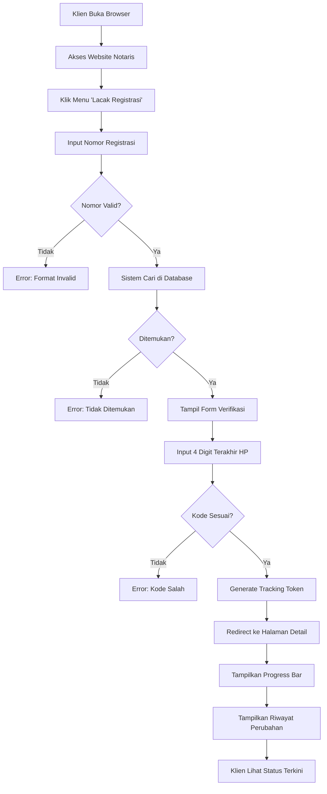
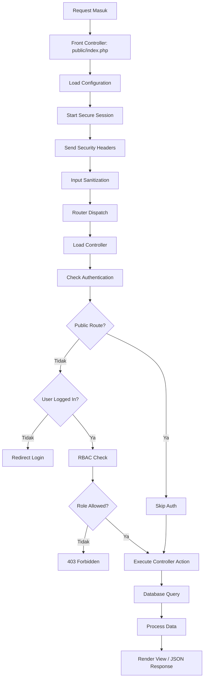
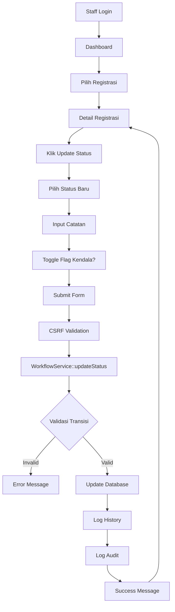
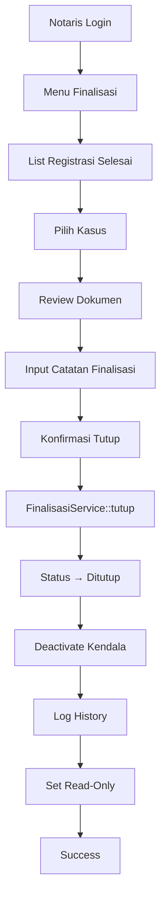
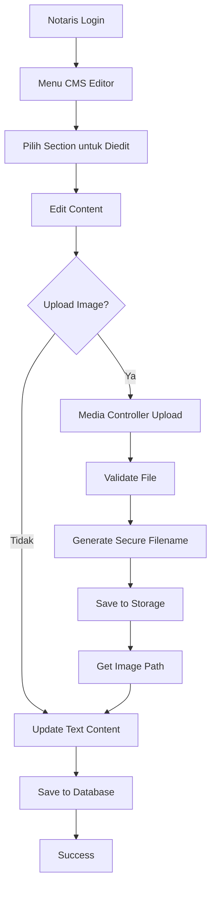

# Alur Aplikasi - Sistem Tracking Status Dokumen Notaris

## 1. Overview Alur Aplikasi

Dokumen ini menjelaskan alur aplikasi secara naratif untuk tiga use case utama:
1. Klien cek status dokumen
2. Sistem ambil data dan validasi
3. Notaris/staff update status

---

## 2. Alur 1: Klien Cek Status Dokumen

### 2.1 Narasi Lengkap

**Aktor:** Klien (pengguna layanan notaris)

**Tujuan:** Klien ingin mengetahui status progress dokumen mereka secara mandiri tanpa harus menghubungi kantor notaris.

**Precondition:** Klien memiliki nomor registrasi yang diberikan saat pendaftaran dokumen.



### 2.2 Step-by-Step Detail

#### Step 1: Akses Halaman Tracking
```
User Action: Klien membuka browser dan mengakses website Kantor Notaris Sri Anah
System Response: Homepage ditampilkan dengan menu navigasi
Navigation: Klien klik menu "Lacak Registrasi" di navigation bar
URL: /index.php?gate=lacak
```

#### Step 2: Input Nomor Registrasi
```
User Action: Klien mengetik nomor registrasi pada form search
Example Input: NP-20260326-1234
System Action: Validasi format (harus NP-YYYYMMDD-XXXX)
```

#### Step 3: Validasi Nomor Registrasi
```
System Process:
1. Sanitasi input (hapus karakter berbahaya)
2. Query database: SELECT * FROM registrasi WHERE nomor_registrasi = 'NP-20260326-1234'
3. Check hasil query
```

**Kemungkinan Hasil:**
- **Tidak Valid Format:** Error "Format nomor registrasi tidak valid"
- **Tidak Ditemukan:** Error "Nomor registrasi tidak ditemukan"
- **Ditemukan:** Lanjut ke verifikasi

#### Step 4: Verifikasi 4 Digit HP
```
System Response: Form verifikasi ditampilkan
User Action: Klien input 4 digit terakhir nomor HP mereka
Example: Jika HP klien 0812-3456-7890, input: 7890
```

**Security Measure:**
- Rate limiting: Maksimal 5 percobaan per menit
- Logging failed attempts untuk deteksi brute force

#### Step 5: Validasi Kode Verifikasi
```
System Process:
1. Ambil data klien dari registrasi
2. Extract 4 digit terakhir dari nomor HP (remove non-numeric first)
3. Bandingkan dengan input klien
4. Jika match → generate token
5. Jika tidak match → error
```

**Contoh:**
```
HP di Database: 081234567890
Clean HP: 081234567890
Last 4: 7890
Input Klien: 7890
Result: MATCH ✅
```

#### Step 6: Generate Tracking Token
```
System Process:
1. Create payload: {id: registrasi_id, code: verification_code, exp: time + 24h}
2. Encode base64
3. Generate HMAC-SHA256 signature
4. Format: base64Payload.signature
5. Simpan token di database (registrasi.tracking_token)
```

**Token Example:**
```
eyJpZCI6MTIzLCJjb2RlIjoiYTFiMmMzZDQiLCJleHAiOjE3MTY5ODc2NTR9.abc123def456...
```

#### Step 7: Tampilkan Progress Tracking
```
System Response: Redirect ke halaman detail dengan token
URL: /index.php?gate=detail&token=eyJpZCI6...
Page Content:
- Nomor registrasi
- Nama klien (disamarkan sebagian)
- Layanan
- Status saat ini
- Progress bar 14 status
- Estimasi waktu
- Riwayat perubahan (timeline)
```

#### Step 8: Lihat Riwayat (Process Log)
```
System Query: SELECT * FROM registrasi_history WHERE registrasi_id = ? ORDER BY created_at DESC
Display Format:
┌─────────────────────────────────────────────────┐
│ 26 Mar 2026, 14:30                              │
│ Status: Pembayaran Admin → Validasi Sertifikat  │
│ Catatan: Berkas lengkap, lanjut validasi        │
│ Oleh: Admin                                     │
└─────────────────────────────────────────────────┘
```

---

## 3. Alur 2: Sistem Ambil Data dan Validasi

### 3.1 Narasi Lengkap

**Aktor:** Sistem (Backend)

**Tujuan:** Mengambil data registrasi dari database dan melakukan validasi keamanan.



### 3.2 Request Lifecycle Detail

#### Phase 1: Front Controller (public/index.php)

```php
// 1. Define BASE_PATH
define('BASE_PATH', dirname(__DIR__));

// 2. Register Autoloader
App\Core\Autoloader::register();
App\Core\Autoloader::addNamespace('App\\', BASE_PATH . '/app/');
App\Core\Autoloader::addNamespace('Modules\\', BASE_PATH . '/modules/');

// 3. Load Configuration
require_once BASE_PATH . '/config/app.php';

// 4. Load Utils
require_once BASE_PATH . '/app/Core/Utils/helpers.php';
require_once BASE_PATH . '/app/Core/Utils/security.php';

// 5. Secure Session
App\Security\Auth::startSecureSession();

// 6. Security Headers
sendSecurityHeaders();
header('Cache-Control: no-cache, no-store, must-revalidate');

// 7. Input Sanitization
App\Security\InputSanitizer::sanitizeGlobal();

// 8. Load Routes
require_once BASE_PATH . '/config/routes.php';

// 9. Dispatch Router
App\Core\Router::dispatch();
```

#### Phase 2: Router Dispatch

```php
// Router::dispatch()
$gate = $_GET['gate'] ?? 'home';
$method = $_SERVER['REQUEST_METHOD'];

// Lookup route
$route = self::$routes[$gate][$method] ?? null;

if ($route) {
    // Check auth requirement
    if ($route['auth'] && !Auth::check()) {
        redirect('/index.php?gate=login');
        exit;
    }
    
    // Check RBAC
    if (isset($route['role'])) {
        RBAC::enforce($route['role']);
    }
    
    // Execute controller
    [$controllerClass, $action] = $route['handler'];
    $controller = new $controllerClass();
    $controller->$action();
}
```

#### Phase 3: Database Query

```php
// Example: Tracking search
public function findByNomorRegistrasi($nomor) {
    return Database::selectOne(
        "SELECT p.id, p.klien_id, p.nomor_registrasi, p.status,
                k.nama AS klien_nama, k.hp AS klien_hp,
                l.nama_layanan
         FROM registrasi p
         LEFT JOIN klien k ON p.klien_id = k.id
         LEFT JOIN layanan l ON p.layanan_id = l.id
         WHERE p.nomor_registrasi = :nomor
         LIMIT 1",
        ['nomor' => $nomor]
    );
}
```

#### Phase 4: Token Validation

```php
// verifyTrackingToken()
function verifyTrackingToken($token) {
    // 1. Parse token
    $parts = explode('.', $token);
    if (count($parts) !== 2) return false;
    
    // 2. Decode payload
    $payload = base64_decode($parts[0]);
    $data = json_decode($payload, true);
    if (!$data) return false;
    
    // 3. Verify signature
    $expectedSig = hash_hmac('sha256', $parts[0], SECRET_KEY);
    if (!hash_equals($expectedSig, $parts[1])) return false;
    
    // 4. Check expiration
    if (isset($data['exp']) && $data['exp'] < time()) return false;
    
    return $data;
}
```

---

## 4. Alur 3: Notaris/Staff Update Status

### 4.1 Narasi Lengkap

**Aktor:** Staff Admin / Notaris

**Tujuan:** Update status progress dokumen dengan validasi workflow.



### 4.2 Step-by-Step Detail

#### Step 1: Authentication

```
User Action: Staff login dengan username dan password
System Process:
1. Query user by username
2. password_verify() dengan bcrypt hash
3. Start secure session dengan fingerprinting
4. Log audit: 'login'
5. Redirect ke dashboard
```

**Session Security:**
```php
// Session fingerprinting
$fingerprint = hash('sha256', $_SERVER['HTTP_USER_AGENT'] . $_SERVER['REMOTE_ADDR']);
$_SESSION['user_fingerprint'] = $fingerprint;

// Validate on each request
if ($_SESSION['user_fingerprint'] !== $currentFingerprint) {
    session_destroy(); // Hijacking detected!
}
```

#### Step 2: Akses Detail Registrasi

```
Navigation: Dashboard → Registrasi → Klik nomor registrasi
URL: /index.php?gate=registrasi_detail&id=123
Controller: Dashboard\Controller::showRegistrasi()
Database Query:
  SELECT registrasi.*, klien.*, layanan.*
  FROM registrasi
  LEFT JOIN klien ON registrasi.klien_id = klien.id
  LEFT JOIN layanan ON registrasi.layanan_id = layanan.id
  WHERE registrasi.id = 123
```

#### Step 3: Update Status Form

```html
<!-- Simplified form structure -->
<form method="POST" action="/index.php?gate=update_status">
    <input type="hidden" name="csrf_token" value="abc123...">
    <input type="hidden" name="registrasi_id" value="123">
    
    <select name="status">
        <option value="draft">Draft</option>
        <option value="pembayaran_admin">Pembayaran Admin</option>
        <!-- ... other statuses ... -->
    </select>
    
    <textarea name="catatan"></textarea>
    
    <label>
        <input type="checkbox" name="flag_kendala">
        Flag Kendala
    </label>
    
    <button type="submit">Update Status</button>
</form>
```

#### Step 4: Workflow Validation

```php
// WorkflowService::updateStatus()

// 1. Load registrasi
$registrasi = $this->registrasiModel->findById($registrasiId);

// 2. Check final status
if (in_array($registrasi['status'], ['selesai', 'ditutup', 'batal'])) {
    return ['success' => false, 'message' => 'Status final tidak bisa diubah'];
}

// 3. Check locked
if ($registrasi['is_locked']) {
    return ['success' => false, 'message' => 'Registrasi sedang dikunci'];
}

// 4. Get status order
$currentOrder = STATUS_ORDER[$registrasi['status']];
$newOrder = STATUS_ORDER[$newStatus];

// 5. Check backward transition
if ($newOrder < $currentOrder && $newStatus !== 'batal') {
    if ($registrasi['status'] !== 'perbaikan') {
        return ['success' => false, 'message' => 'Status tidak bisa mundur'];
    }
}

// 6. Check cancellation
if ($newStatus === 'batal') {
    if (!in_array($registrasi['status'], CANCELLABLE_STATUSES)) {
        return ['success' => false, 'message' => 'Tidak bisa batal setelah pajak'];
    }
}

// 7. Update database
$this->registrasiModel->updateStatus($registrasiId, $newStatus, $keterangan, $catatan);

// 8. Handle flag kendala
if ($flagKendala !== null) {
    // Toggle kendala logic
}

// 9. Save history
$this->registrasiHistoryModel->create([
    'registrasi_id' => $registrasiId,
    'status_old' => $registrasi['status'],
    'status_new' => $newStatus,
    'catatan' => $catatan,
    'user_id' => $userId,
    'user_name' => $userName,
    'user_role' => $role,
    'ip_address' => $_SERVER['REMOTE_ADDR'],
]);

// 10. Audit log
AuditLog::create([
    'user_id' => $userId,
    'role' => $role,
    'action' => 'update',
    'old_value' => json_encode(['status' => $registrasi['status']]),
    'new_value' => json_encode(['status' => $newStatus]),
]);
```

#### Step 5: Status Transition Examples

**Valid Transitions:**
```
✅ draft → pembayaran_admin (forward)
✅ pembayaran_admin → validasi_sertifikat (forward)
✅ draft → batal (cancellable)
✅ perbaikan → pembayaran_pajak (loop back allowed)
```

**Invalid Transitions:**
```
❌ validasi_sertifikat → draft (backward not allowed)
❌ pembayaran_pajak → batal (past cancellation limit)
❌ selesai → pendaftaran (final status read-only)
```

---

## 5. Alur 4: Notaris Finalisasi Kasus

### 5.1 Narasi Lengkap



### 5.2 Detail Process

```php
// FinalisasiService::tutupRegistrasi()

public function tutupRegistrasi($registrasiId, $userId, $role, $notes = null) {
    // 1. Load registrasi
    $registrasi = $this->registrasiModel->findById($registrasiId);
    
    // 2. Check status must be 'selesai'
    if ($registrasi['status'] !== 'selesai') {
        return ['success' => false, 'message' => 'Status harus selesai untuk finalisasi'];
    }
    
    // 3. Update status to 'ditutup'
    $this->registrasiModel->update($registrasiId, [
        'status' => 'ditutup',
        'is_finalized' => 1,
        'finalized_at' => date('Y-m-d H:i:s'),
        'finalized_by' => $userId,
        'finalization_notes' => $notes,
    ]);
    
    // 4. Deactivate all kendala flags
    $this->kendalaModel->deactivateAll($registrasiId);
    
    // 5. Save history
    $this->registrasiHistoryModel->create([
        'registrasi_id' => $registrasiId,
        'status_old' => 'selesai',
        'status_new' => 'ditutup',
        'catatan' => $notes,
        'user_id' => $userId,
        'user_name' => $userName,
        'user_role' => $role,
    ]);
    
    // 6. Audit log
    AuditLog::create([
        'user_id' => $userId,
        'role' => $role,
        'action' => 'finalize',
        'old_value' => json_encode(['status' => 'selesai']),
        'new_value' => json_encode(['status' => 'ditutup']),
    ]);
    
    return ['success' => true, 'message' => 'Kasus berhasil ditutup'];
}
```

---

## 6. Alur 5: CMS Management

### 6.1 Narasi



### 6.2 Upload Flow

```php
// Media\Controller::upload()

public function upload() {
    // 1. Check auth
    RBAC::enforce('notaris');
    
    // 2. Validate file
    if (!isset($_FILES['image'])) {
        return json(['success' => false, 'message' => 'No file']);
    }
    
    $file = $_FILES['image'];
    
    // 3. Check size (max 5MB)
    if ($file['size'] > MAX_UPLOAD_SIZE) {
        return json(['success' => false, 'message' => 'File too large']);
    }
    
    // 4. Check extension
    $ext = strtolower(pathinfo($file['name'], PATHINFO_EXTENSION));
    if (!in_array($ext, ['jpg', 'jpeg', 'png', 'pdf'])) {
        return json(['success' => false, 'message' => 'Invalid file type']);
    }
    
    // 5. Generate secure filename
    $secureName = 'img_' . bin2hex(random_bytes(16)) . '.' . $ext;
    
    // 6. Move file
    $destination = PUBLIC_PATH . '/assets/images/' . $secureName;
    move_uploaded_file($file['tmp_name'], $destination);
    
    // 7. Return path
    return json([
        'success' => true,
        'path' => '/assets/images/' . $secureName,
    ]);
}
```

---

## 7. Kesimpulan

Alur aplikasi yang telah diuraikan mencakup:

1. **Tracking Klien** - Full flow dari search hingga viewing progress
2. **System Processing** - Request lifecycle dari front controller hingga database
3. **Update Status** - Workflow validation dengan business rules
4. **Finalisasi** - Tutup kasus dengan auto-deactivate kendala
5. **CMS Management** - Content editing dan image upload

Setiap alur mengikuti prinsip:
- **Security First** - CSRF, RBAC, input sanitization
- **Business Rules** - Workflow validation, status order
- **Audit Trail** - Logging semua aksi penting
- **User Experience** - Clear error messages, success feedback
