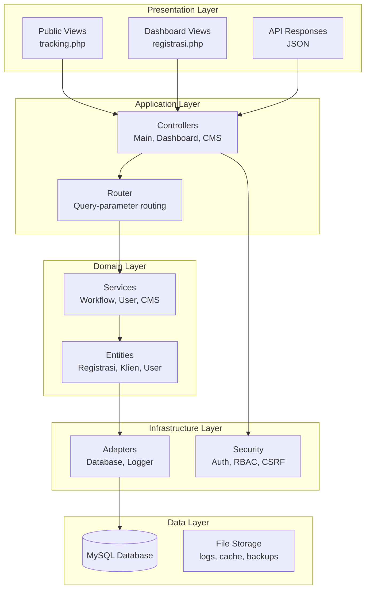
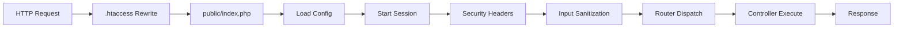
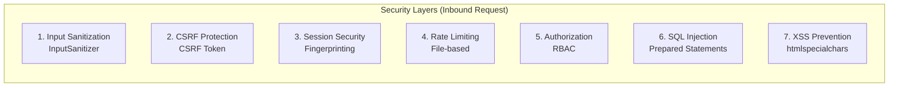
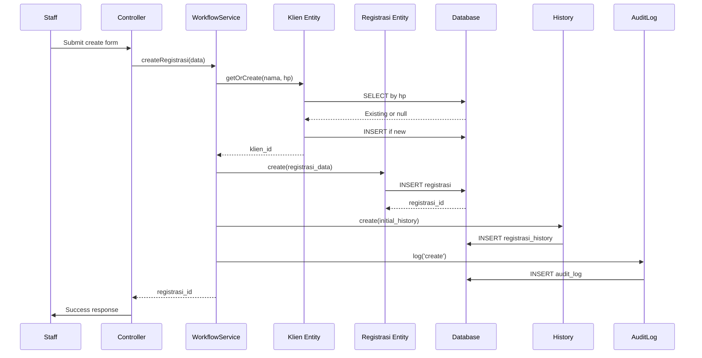
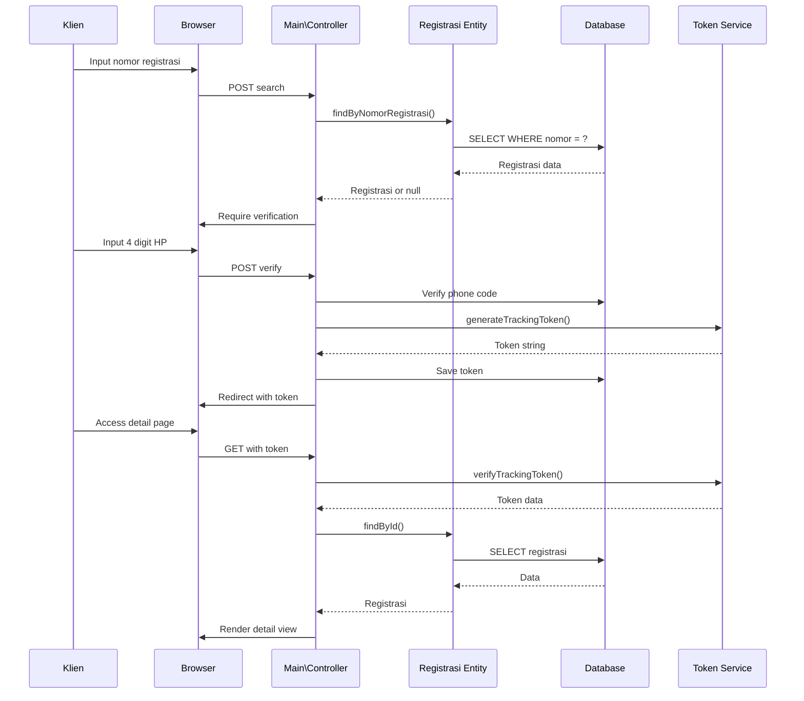
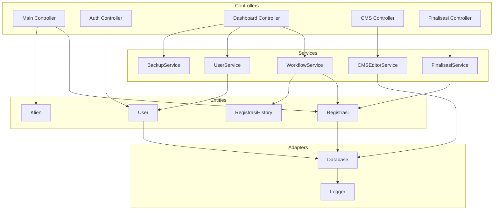

# Architecture - Arsitektur Sistem Tracking Status Dokumen

## 1. Arsitektur Overview

### 1.1 Arsitektur Sistem

Sistem menggunakan arsitektur **Layered Architecture** dengan prinsip **Separation of Concerns**, mengimplementasikan pola **Model-View-Controller (MVC)** yang dimodifikasi dengan **Domain-Driven Design** principles.



---

## 2. Layer Architecture Detail

### 2.1 Presentation Layer

**Tanggung Jawab:** User interface dan interaksi

**Komponen:**

- **Public Views**: Halaman tracking untuk klien (tanpa login)
- **Dashboard Views**: Admin interface untuk staff/notaris
- **API Responses**: JSON responses untuk AJAX requests

**Teknologi:**

- HTML5, CSS3, JavaScript vanilla
- PHP untuk server-side rendering
- CSS Grid/Flexbox untuk layout

**Security:**

- XSS prevention via `htmlspecialchars()`
- CSRF token pada semua form
- Input sanitization sebelum render

### 2.2 Application Layer

**Tanggung Jawab:** Request handling, routing, controller execution

**Komponen:**

- **Front Controller** (`public/index.php`): Single entry point
- **Router** (`App\Core\Router`): Query-parameter routing
- **Controllers** (`Modules\*`): Request handlers

**Routing Pattern:**

```php
// Query-parameter routing
URL: /index.php?gate=registrasi_detail&id=123
Route: Router::dispatch() → Dashboard\Controller::showRegistrasi()
```

**Request Lifecycle:**



### 2.3 Domain Layer

**Tanggung Jawab:** Business logic dan domain rules

**Komponen:**

- **Services**: Business use cases (WorkflowService, UserService)
- **Entities**: Domain models dengan business logic

**Domain-Driven Design:**

```
App/Domain/Entities/
├── Registrasi.php         # Registration aggregate root
├── Klien.php              # Client entity
├── Layanan.php            # Service type entity
├── RegistrasiHistory.php  # History ledger (immutable)
└── Kendala.php            # Obstacle flag entity

App/Services/
├── WorkflowService.php    # Status transition logic
├── UserService.php        # User management
├── FinalisasiService.php  # Case finalization
└── CMSEditorService.php   # CMS content management
```

**Business Rules Enforcement:**

```php
// WorkflowService::updateStatus()
// Enforces:
// 1. No backward transition (except perbaikan)
// 2. No cancellation after pembayaran_pajak
// 3. No update on locked registrasi
// 4. No update on final status (selesai/ditutup/batal)
```

### 2.4 Infrastructure Layer

**Tanggung Jawab:** Technical concerns (database, logging, security)

**Komponen:**

- **Adapters**: Database connection, logging
- **Security**: Authentication, authorization, CSRF, rate limiting

**Singleton Pattern:**

```php
// Database adapter (Singleton)
class Database {
    private static ?PDO $instance = null;
  
    public static function getInstance(): PDO {
        if (self::$instance === null) {
            self::$instance = new PDO(...);
        }
        return self::$instance;
    }
}
```

### 2.5 Data Layer

**Tanggung Jawab:** Data persistence

**Komponen:**

- **MySQL Database**: Relational data storage
- **File System**: Logs, cache, backups, uploaded files

**Database Tables:**

- Core: `users`, `registrasi`, `klien`, `layanan`
- Workflow: `registrasi_history`, `kendala`
- Audit: `audit_log`
- CMS: `cms_pages`, `cms_page_sections`, `cms_section_content`, `cms_section_items`
- Templates: `message_templates`, `note_templates`

---

## 3. Design Patterns

### 3.1 Front Controller Pattern

**Implementation:** `public/index.php`

```php
// All requests go through this single entry point
define('BASE_PATH', dirname(__DIR__));
require_once BASE_PATH . '/app/Core/Autoloader.php';
require_once BASE_PATH . '/config/app.php';
require_once BASE_PATH . '/config/routes.php';
App\Core\Router::dispatch();
```

**Benefits:**

- Centralized security (headers, session, sanitization)
- Consistent request handling
- Easy routing management

### 3.2 Singleton Pattern

**Implementation:** `App\Adapters\Database`

```php
class Database {
    private static ?PDO $instance = null;
  
    private function __construct() {
        // Private constructor prevents direct instantiation
    }
  
    public static function getInstance(): PDO {
        if (self::$instance === null) {
            self::$instance = new PDO(
                "mysql:host=" . DB_HOST . ";dbname=" . DB_NAME,
                DB_USER,
                DB_PASS,
                [PDO::ATTR_ERRMODE => PDO::ERRMODE_EXCEPTION]
            );
        }
        return self::$instance;
    }
}
```

**Benefits:**

- Single database connection per request
- Global access point
- Lazy loading

### 3.3 Repository Pattern

**Implementation:** Entity classes

```php
class Registrasi {
    public function findById(int $id): ?array {
        return Database::selectOne(
            "SELECT * FROM registrasi WHERE id = :id",
            ['id' => $id]
        );
    }
  
    public function create(array $data): int {
        return Database::insert(
            "INSERT INTO registrasi (...) VALUES (...)",
            $data
        );
    }
}
```

**Benefits:**

- Encapsulated data access
- Testable data layer
- Consistent query patterns

### 3.4 Service Layer Pattern

**Implementation:** Service classes

```php
class WorkflowService {
    public function updateStatus(
        int $registrasiId,
        string $newStatus,
        int $userId,
        string $role,
        ?string $catatan = null
    ): array {
        // Business logic orchestration
        // 1. Load registrasi
        // 2. Validate transition
        // 3. Update database
        // 4. Save history
        // 5. Log audit
    }
}
```

**Benefits:**

- Business logic isolation
- Transaction management
- Reusable use cases

### 3.5 Role-Based Access Control (RBAC)

**Implementation:** `App\Security\RBAC`

```php
class RBAC {
    private static array $permissions = [
        'notaris' => ['*'], // Full access
        'admin'   => [
            'dashboard.view',
            'registrasi.view', 'registrasi.create', 'registrasi.edit',
            'status.update', 'klien.update',
        ],
        'publik'  => [
            'home.view', 'tracking.view', 'detail.view',
        ],
    ];
  
    public static function can(string $role, string $permission): bool {
        if (in_array('*', self::$permissions[$role])) {
            return true;
        }
        return in_array($permission, self::$permissions[$role]);
    }
  
    public static function enforce(string $permission): void {
        $role = Auth::getSession()['role'] ?? 'guest';
        if (!self::can($role, $permission)) {
            http_response_code(403);
            exit('Forbidden');
        }
    }
}
```

**Benefits:**

- Fine-grained access control
- Easy permission management
- Security by default

---

## 4. Security Architecture

### 4.1 Seven-Layer Security



### 4.2 Layer Implementation

| Layer              | Class/Function                          | File                                |
| ------------------ | --------------------------------------- | ----------------------------------- |
| Input Sanitization | `InputSanitizer::sanitizeGlobal()`    | `app/Security/InputSanitizer.php` |
| CSRF Protection    | `CSRF::token()`, `CSRF::validate()` | `app/Security/CSRF.php`           |
| Session Security   | `Auth::startSecureSession()`          | `app/Security/Auth.php`           |
| Rate Limiting      | `RateLimiter::check()`                | `app/Security/RateLimiter.php`    |
| Authorization      | `RBAC::enforce()`                     | `app/Security/RBAC.php`           |
| SQL Injection      | `Database::prepare()`, `execute()`  | `app/Adapters/Database.php`       |
| XSS Prevention     | `htmlspecialchars()` in View          | `app/Core/View.php`               |

### 4.3 Session Fingerprinting

```php
// Auth::startSecureSession()
public static function startSecureSession(): void {
    if (session_status() === PHP_SESSION_NONE) {
        session_name(SESSION_NAME);
        session_start();
      
        // Generate fingerprint
        $fingerprint = hash('sha256', 
            $_SERVER['HTTP_USER_AGENT'] . 
            $_SERVER['REMOTE_ADDR']
        );
      
        // Store or validate
        if (!isset($_SESSION['user_fingerprint'])) {
            $_SESSION['user_fingerprint'] = $fingerprint;
        } else {
            if ($_SESSION['user_fingerprint'] !== $fingerprint) {
                // Session hijacking detected!
                session_destroy();
                throw new SecurityException('Session hijacking detected');
            }
        }
    }
}
```

---

## 5. Data Flow Architecture

### 5.1 Create Registrasi Flow



### 5.2 Tracking Flow



---

## 6. Module Interaction

###### 6.1 Dependency Graph



---

## 7. Kesesuaian dengan Sistem Notaris

### 7.1 Domain-Specific Design

**Workflow 14 Status:**

- Mencerminkan proses notaris sebenarnya
- Urutan status sesuai praktik BPN
- Business rules enforcement untuk validasi

**Batas Pembatalan:**

```php
// After pembayaran_pajak, cannot cancel
// Business reason: Tax paid to state, legal consequences
CANCELLABLE_STATUSES = [
    'draft',
    'pembayaran_admin',
    'validasi_sertifikat',
    'pencecekan_sertifikat',
    'perbaikan'
];
```

**Perbaikan Loop:**

```php
// Special case: perbaikan can go back to previous status
// Business reason: BPN correction requires re-verification
if ($oldStatus === 'perbaikan' && $newOrder < $currentOrder) {
    // Allowed: loop back for correction
}
```

### 7.2 Audit Trail Requirements

**Notaris Domain Requirements:**

- Semua perubahan status harus tercatat (legal compliance)
- User actions harus di-audit (accountability)
- History immutable (integrity)

**Implementation:**

```php
// Every status change creates:
// 1. registrasi_history record (immutable ledger)
// 2. audit_log record (security audit)
```

---

## 8. Scalability Considerations

### 8.1 Current Architecture

- **Vertical Scaling**: Single server with Apache + PHP + MySQL
- **Session Storage**: File-based (default PHP)
- **Cache**: File-based (storage/cache/)
- **Rate Limiting**: File-based

### 8.2 Future Improvements

| Component    | Current       | Future                           |
| ------------ | ------------- | -------------------------------- |
| Session      | File-based    | Redis/Memcached                  |
| Cache        | File-based    | Redis                            |
| Database     | Single MySQL  | Master-Slave replication         |
| Web Server   | Single Apache | Load balancer + multiple servers |
| File Storage | Local         | Cloud storage (S3)               |

---

## 9. Performance Optimization

### 9.1 Database Indexing

```sql
-- Indexed columns for performance
CREATE INDEX idx_registrasi_nomor ON registrasi(nomor_registrasi);
CREATE INDEX idx_registrasi_status ON registrasi(status);
CREATE INDEX idx_registrasi_token ON registrasi(tracking_token);
CREATE INDEX idx_history_registrasi ON registrasi_history(registrasi_id);
CREATE INDEX idx_history_created ON registrasi_history(created_at);
CREATE INDEX idx_audit_user ON audit_log(user_id);
CREATE INDEX idx_audit_timestamp ON audit_log(timestamp);
```

### 9.2 Caching Strategy

| Data            | Cache TTL | Storage         |
| --------------- | --------- | --------------- |
| Homepage CMS    | 1 hour    | Database/Memory |
| Tracking search | 5 minutes | Session         |
| User session    | 2 hours   | PHP Session     |
| Rate limit      | 1 minute  | File            |

---

## 10. Kesimpulan

Arsitektur sistem mengikuti best practices:

1. **Layered Architecture** - Clear separation of concerns
2. **Design Patterns** - Front Controller, Singleton, Repository, Service Layer, RBAC
3. **Domain-Driven Design** - Business logic in Entities and Services
4. **Security by Design** - 7-layer security architecture
5. **Audit Trail** - Complete logging untuk compliance
6. **Scalability** - Ready for future improvements

Arsitektur ini production-ready untuk skala UMKU kantor notaris dengan kemungkinan scaling horizontal di masa depan.
