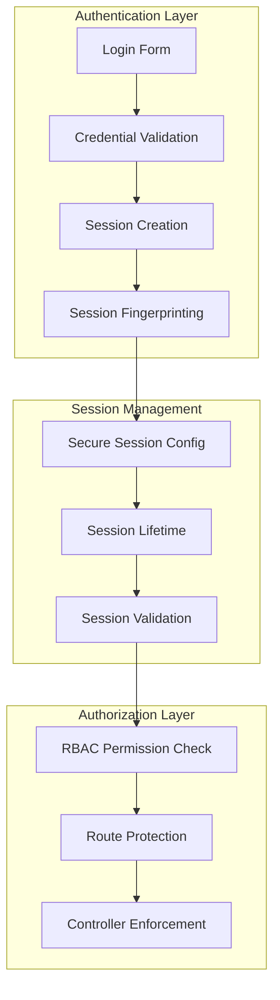
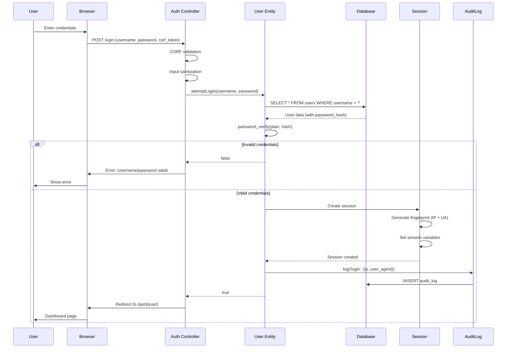
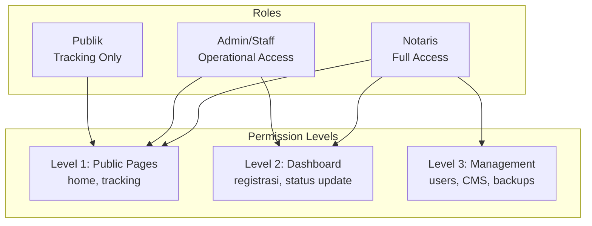

# Authentication & Authorization - Role-Based Access Control (RBAC)

## 1. Overview Authentication & Authorization

Sistem menggunakan **Session-Based Authentication** dengan **Role-Based Access Control (RBAC)** untuk mengelola akses pengguna berdasarkan role mereka (notaris, admin, publik).

### 1.1 Arsitektur Keamanan



---

## 2. Authentication System

### 2.1 Login Process

#### Flow Diagram



#### Implementation

```php
// modules/Auth/Controller.php
namespace Modules\Auth;

use App\Security\Auth;
use App\Security\CSRF;
use App\Domain\Entities\User;
use App\Domain\Entities\AuditLog;

class Controller {
    public function login(): void {
        // Only accept POST
        if ($_SERVER['REQUEST_METHOD'] !== 'POST') {
            redirect('/index.php?gate=login');
            exit;
        }
        
        // CSRF validation
        if (!CSRF::validate($_POST['csrf_token'] ?? null)) {
            http_response_code(403);
            echo json_encode(['success' => false, 'message' => 'CSRF token invalid']);
            exit;
        }
        
        // Rate limiting
        if (!RateLimiter::check('login', 5, 300)) { // 5 attempts per 5 minutes
            http_response_code(429);
            echo json_encode([
                'success' => false,
                'message' => 'Terlalu banyak percobaan. Silakan tunggu beberapa saat.'
            ]);
            exit;
        }
        
        $username = $_POST['username'] ?? '';
        $password = $_POST['password'] ?? '';
        
        if (empty($username) || empty($password)) {
            echo json_encode(['success' => false, 'message' => 'Username dan password wajib diisi']);
            exit;
        }
        
        // Attempt login
        $userEntity = new User();
        $success = $userEntity->attemptLogin($username, $password);
        
        if (!$success) {
            // Log failed attempt
            logSecurityEvent('FAILED_LOGIN', [
                'username' => $username,
                'ip' => $_SERVER['REMOTE_ADDR'],
            ]);
            
            echo json_encode(['success' => false, 'message' => 'Username atau password salah']);
            exit;
        }
        
        // Success - redirect to dashboard
        echo json_encode([
            'success' => true,
            'message' => 'Login berhasil',
            'redirect' => '/index.php?gate=dashboard'
        ]);
    }
}
```

---

### 2.2 User Entity Authentication

```php
// app/Domain/Entities/User.php
namespace App\Domain\Entities;

use App\Adapters\Database;
use App\Security\Auth;

class User {
    public function attemptLogin(string $username, string $password): bool {
        // Find user by username
        $user = Database::selectOne(
            "SELECT id, username, password_hash, role FROM users WHERE username = :username",
            ['username' => $username]
        );
        
        if (!$user) {
            return false; // User not found
        }
        
        // Verify password
        if (!password_verify($password, $user['password_hash'])) {
            return false; // Wrong password
        }
        
        // Create session
        Auth::createSession([
            'user_id' => $user['id'],
            'username' => $user['username'],
            'role' => $user['role'],
        ]);
        
        // Audit log
        AuditLog::create([
            'user_id' => $user['id'],
            'role' => $user['role'],
            'action' => 'login',
            'new_value' => json_encode(['ip' => $_SERVER['REMOTE_ADDR']]),
        ]);
        
        return true;
    }
    
    public function findByUsername(string $username): ?array {
        return Database::selectOne(
            "SELECT * FROM users WHERE username = :username",
            ['username' => $username]
        );
    }
}
```

---

### 2.3 Session Management

#### Secure Session Configuration

```php
// app/Security/Auth.php
namespace App\Security;

class Auth {
    public static function startSecureSession(): void {
        if (session_status() === PHP_SESSION_NONE) {
            // Secure session configuration
            ini_set('session.cookie_httponly', 1);      // JavaScript cannot access
            ini_set('session.cookie_secure', 1);        // HTTPS only (set in production)
            ini_set('session.cookie_samesite', 'Strict'); // CSRF protection
            ini_set('session.use_strict_mode', 1);      // Prevent session fixation
            ini_set('session.use_only_cookies', 1);     // Cookies only, no URL sessions
            
            // Session name
            session_name(SESSION_NAME); // 'notaris_session'
            
            // Session lifetime
            ini_set('session.gc_maxlifetime', SESSION_LIFETIME); // 7200 seconds (2 hours)
            
            session_start();
            
            // Generate/regenerate session ID
            if (empty($_SESSION['session_created'])) {
                session_regenerate_id(true);
                $_SESSION['session_created'] = time();
            }
            
            // Session fingerprinting (anti-hijacking)
            self::validateFingerprint();
            
            // Session timeout check
            self::validateLifetime();
            
            // Update last activity
            $_SESSION['last_activity'] = time();
        }
    }
    
    private static function validateFingerprint(): void {
        $currentFingerprint = hash('sha256', 
            $_SERVER['HTTP_USER_AGENT'] . 
            $_SERVER['REMOTE_ADDR']
        );
        
        if (!isset($_SESSION['user_fingerprint'])) {
            // First request, store fingerprint
            $_SESSION['user_fingerprint'] = $currentFingerprint;
        } else {
            // Validate fingerprint
            if (!hash_equals($_SESSION['user_fingerprint'], $currentFingerprint)) {
                // Session hijacking detected!
                session_destroy();
                logSecurityEvent('SESSION_HIJACK_ATTEMPT', [
                    'ip' => $_SERVER['REMOTE_ADDR'],
                    'user_agent' => $_SERVER['HTTP_USER_AGENT'],
                ]);
                throw new SecurityException('Session hijacking detected');
            }
        }
    }
    
    private static function validateLifetime(): void {
        if (isset($_SESSION['last_activity']) && 
            (time() - $_SESSION['last_activity'] > SESSION_LIFETIME)) {
            // Session expired
            session_destroy();
            throw new SecurityException('Session expired');
        }
    }
    
    public static function createSession(array $userData): void {
        $_SESSION['user_id'] = $userData['user_id'];
        $_SESSION['username'] = $userData['username'];
        $_SESSION['role'] = $userData['role'];
        $_SESSION['logged_in'] = true;
        
        // Regenerate session ID after login (prevent fixation)
        session_regenerate_id(true);
    }
    
    public static function check(): bool {
        return isset($_SESSION['logged_in']) && $_SESSION['logged_in'] === true;
    }
    
    public static function getSession(): array {
        return [
            'user_id' => $_SESSION['user_id'] ?? null,
            'username' => $_SESSION['username'] ?? 'guest',
            'role' => $_SESSION['role'] ?? 'guest',
            'logged_in' => $_SESSION['logged_in'] ?? false,
        ];
    }
    
    public static function logout(): void {
        // Audit log before destroying session
        if (isset($_SESSION['user_id'])) {
            AuditLog::create([
                'user_id' => $_SESSION['user_id'],
                'role' => $_SESSION['role'] ?? 'guest',
                'action' => 'logout',
            ]);
        }
        
        // Destroy session
        session_destroy();
    }
}
```

---

## 3. Role-Based Access Control (RBAC)

### 3.1 Permission Matrix



### 3.2 RBAC Implementation

```php
// app/Security/RBAC.php
namespace App\Security;

use App\Adapters\Logger;

class RBAC {
    /**
     * Permission mapping: role => array of permissions
     * '*' grants full access (wildcard)
     */
    private static array $permissions = [
        'notaris' => ['*'], // Full access to everything
        'admin'   => [
            'dashboard.view',
            'registrasi.view',
            'registrasi.create',
            'registrasi.edit',
            'registrasi.history',
            'finalisasi.view',
            'finalisasi.tutup',
            'finalisasi.reopen',
            'status.update',
            'klien.update',
            'kendala.toggle',
            'lock.toggle',
        ],
        'publik'  => [
            'home.view',
            'tracking.view',
            'tracking.verify',
            'detail.view',
        ],
        'guest'   => [], // No permissions
    ];
    
    /**
     * Check if a role has a specific permission
     */
    public static function can(string $role, string $permission): bool {
        if (!isset(self::$permissions[$role])) {
            return false;
        }
        
        $perms = self::$permissions[$role];
        
        // Wildcard = full access (for notaris)
        if (in_array('*', $perms, true)) {
            return true;
        }
        
        return in_array($permission, $perms, true);
    }
    
    /**
     * Enforce a permission - dies with 403 if unauthorized
     */
    public static function enforce(string $permission): void {
        $session = Auth::getSession();
        $role = $session['role'] ?? 'guest';
        
        if (!self::can($role, $permission)) {
            // Log access denied
            Logger::security('RBAC_ACCESS_DENIED', [
                'permission' => $permission,
                'role'       => $role,
                'user_id'    => $session['user_id'] ?? 'guest',
                'uri'        => $_SERVER['REQUEST_URI'] ?? '',
                'ip'         => $_SERVER['REMOTE_ADDR'] ?? 'unknown',
            ]);
            
            // Handle AJAX vs regular request
            if (self::isAjax()) {
                http_response_code(403);
                echo json_encode(['success' => false, 'message' => 'Forbidden']);
                exit;
            }
            
            // Show 403 page
            http_response_code(403);
            if (defined('VIEWS_PATH') && file_exists(VIEWS_PATH . '/errors/403.php')) {
                require VIEWS_PATH . '/errors/403.php';
            } else {
                echo '<h1>403 - Forbidden</h1>';
                echo '<p>You do not have permission to access this resource.</p>';
            }
            exit;
        }
    }
    
    /**
     * Check if current request is AJAX
     */
    private static function isAjax(): bool {
        return !empty($_SERVER['HTTP_X_REQUESTED_WITH'])
            && strtolower($_SERVER['HTTP_X_REQUESTED_WITH']) === 'xmlhttprequest';
    }
}
```

---

### 3.3 Route-Level Protection

```php
// config/routes.php
use App\Core\Router;
use Modules\Main\Controller as PublicController;
use Modules\Auth\Controller as AuthController;
use Modules\Dashboard\Controller as DashboardController;
use Modules\Finalisasi\Controller as FinalisasiController;
use Modules\CMS\Controller as CMSEditorController;
use Modules\Media\Controller as ImageMediaController;

// ═══════════════════════════════════════════════════════════════
// PUBLIC ROUTES (no auth required)
// ═══════════════════════════════════════════════════════════════
Router::add('home',      'GET',  [PublicController::class, 'home'],        []);
Router::add('lacak',     'GET',  [PublicController::class, 'tracking'],    []);
Router::add('lacak',     'POST', [PublicController::class, 'tracking'],    []);
Router::add('detail',    'GET',  [PublicController::class, 'showRegistrasi'], []);
Router::add('verify_tracking', 'POST', [PublicController::class, 'verifyTracking'], []);

// ═══════════════════════════════════════════════════════════════
// AUTH ROUTES
// ═══════════════════════════════════════════════════════════════
Router::add('login',  'GET',  [AuthController::class, 'showLoginPage'], []);
Router::add('login',  'POST', [AuthController::class, 'login'],         []);
Router::add('logout', 'GET',  [AuthController::class, 'logout'],        []);

// ═══════════════════════════════════════════════════════════════
// DASHBOARD ROUTES (auth required)
// ═══════════════════════════════════════════════════════════════
Router::add('dashboard',         'GET',  [DashboardController::class, 'index'],           
    ['auth' => true]);
Router::add('registrasi',       'GET',  [DashboardController::class, 'registrasi'],       
    ['auth' => true]);
Router::add('registrasi_store', 'POST', [DashboardController::class, 'storeRegistrasi'],  
    ['auth' => true]);
Router::add('update_status',    'POST', [DashboardController::class, 'updateStatus'],     
    ['auth' => true]);

// ═══════════════════════════════════════════════════════════════
// USERS (notaris only)
// ═══════════════════════════════════════════════════════════════
Router::add('users', 'GET',  [DashboardController::class, 'users'],       
    ['auth' => true, 'role' => 'notaris']);
Router::add('users', 'POST', [DashboardController::class, 'handleUserPost'],
    ['auth' => true, 'role' => 'notaris']);

// ═══════════════════════════════════════════════════════════════
// CMS EDITOR (notaris only)
// ═══════════════════════════════════════════════════════════════
Router::add('cms_editor',       'GET',  [CMSEditorController::class, 'index'],             
    ['auth' => true, 'role' => 'notaris']);
Router::add('cms_edit_home',    'GET',  [CMSEditorController::class, 'editHome'],          
    ['auth' => true, 'role' => 'notaris']);
Router::add('cms_update_content','POST',[CMSEditorController::class, 'updateContent'],     
    ['auth' => true, 'role' => 'notaris']);

// ═══════════════════════════════════════════════════════════════
// FINALISASI (notaris only)
// ═══════════════════════════════════════════════════════════════
Router::add('finalisasi',      'GET',  [FinalisasiController::class, 'index'],           
    ['auth' => true, 'role' => 'notaris']);
Router::add('tutup_registrasi','POST', [FinalisasiController::class, 'tutupRegistrasi'], 
    ['auth' => true, 'role' => 'notaris']);
Router::add('reopen_case',     'POST', [FinalisasiController::class, 'reopen'],          
    ['auth' => true, 'role' => 'notaris']);

// ═══════════════════════════════════════════════════════════════
// BACKUPS (notaris only)
// ═══════════════════════════════════════════════════════════════
Router::add('backups', 'GET',  [DashboardController::class, 'backups'],         
    ['auth' => true, 'role' => 'notaris']);
Router::add('backups', 'POST', [DashboardController::class, 'handleBackupPost'],
    ['auth' => true, 'role' => 'notaris']);

// ═══════════════════════════════════════════════════════════════
// AUDIT LOG (notaris only)
// ═══════════════════════════════════════════════════════════════
Router::add('audit', 'GET', [DashboardController::class, 'auditLogs'], 
    ['auth' => true, 'role' => 'notaris']);
```

---

### 3.4 Router with Auth/RBAC Check

```php
// app/Core/Router.php
namespace App\Core;

use App\Security\Auth;
use App\Security\RBAC;

class Router {
    private static array $routes = [];
    
    public static function add(string $gate, string $method, callable $handler, array $options = []): void {
        self::$routes[$gate][$method] = [
            'handler' => $handler,
            'options' => $options,
        ];
    }
    
    public static function dispatch(): void {
        $gate = $_GET['gate'] ?? 'home';
        $method = $_SERVER['REQUEST_METHOD'];
        
        // Lookup route
        $route = self::$routes[$gate][$method] ?? null;
        
        if (!$route) {
            http_response_code(404);
            echo '<h1>404 - Not Found</h1>';
            exit;
        }
        
        $options = $route['options'];
        
        // Check authentication requirement
        if (isset($options['auth']) && $options['auth']) {
            if (!Auth::check()) {
                // Not logged in, redirect to login
                if (self::isAjax()) {
                    http_response_code(401);
                    echo json_encode(['success' => false, 'message' => 'Unauthorized']);
                } else {
                    redirect('/index.php?gate=login');
                }
                exit;
            }
        }
        
        // Check RBAC requirement
        if (isset($options['role'])) {
            RBAC::enforce($options['role']);
        }
        
        // Check rate limiting
        if (isset($options['rateType'])) {
            if (!RateLimiter::check($options['rateType'])) {
                http_response_code(429);
                echo json_encode(['success' => false, 'message' => 'Too many requests']);
                exit;
            }
        }
        
        // Execute controller
        [$controllerClass, $action] = $route['handler'];
        $controller = new $controllerClass();
        
        if (method_exists($controller, $action)) {
            $controller->$action();
        } else {
            throw new \Exception("Action {$action} not found in {$controllerClass}");
        }
    }
    
    private static function isAjax(): bool {
        return !empty($_SERVER['HTTP_X_REQUESTED_WITH'])
            && strtolower($_SERVER['HTTP_X_REQUESTED_WITH']) === 'xmlhttprequest';
    }
}
```

---

## 4. User Management

### 4.1 User CRUD (Notaris Only)

```php
// modules/Dashboard/Controller.php
public function handleUserPost(): void {
    // RBAC enforcement (notaris only)
    RBAC::enforce('users.manage');
    
    $action = $_POST['action'] ?? '';
    
    switch ($action) {
        case 'create':
            $this->createUser();
            break;
        case 'update':
            $this->updateUser();
            break;
        case 'delete':
            $this->deleteUser();
            break;
        default:
            echo json_encode(['success' => false, 'message' => 'Invalid action']);
    }
}

private function createUser(): void {
    $username = $_POST['username'] ?? '';
    $password = $_POST['password'] ?? '';
    $role = $_POST['role'] ?? 'admin';
    
    // Validation
    if (empty($username) || empty($password)) {
        echo json_encode(['success' => false, 'message' => 'Username dan password wajib diisi']);
        return;
    }
    
    // Validate role
    if (!in_array($role, ['notaris', 'admin'])) {
        echo json_encode(['success' => false, 'message' => 'Role tidak valid']);
        return;
    }
    
    // Hash password
    $passwordHash = password_hash($password, PASSWORD_BCRYPT, ['cost' => 12]);
    
    // Create user
    $userId = Database::insert(
        "INSERT INTO users (username, password_hash, role) VALUES (:username, :password, :role)",
        [
            'username' => $username,
            'password' => $passwordHash,
            'role' => $role,
        ]
    );
    
    // Audit log
    AuditLog::create([
        'user_id' => Auth::getSession()['user_id'],
        'role' => Auth::getSession()['role'],
        'action' => 'create',
        'new_value' => json_encode([
            'user_created' => $username,
            'role' => $role,
        ]),
    ]);
    
    echo json_encode(['success' => true, 'message' => 'User berhasil dibuat']);
}
```

---

## 5. Permission Matrix

### 5.1 Complete Permission Table

| Permission | Publik | Admin | Notaris | Description |
|------------|--------|-------|---------|-------------|
| `home.view` | ✅ | ✅ | ✅ | View homepage |
| `tracking.view` | ✅ | ✅ | ✅ | View tracking page |
| `tracking.verify` | ✅ | ✅ | ✅ | Verify tracking code |
| `detail.view` | ✅ | ✅ | ✅ | View registration detail |
| `dashboard.view` | ❌ | ✅ | ✅ | View dashboard |
| `registrasi.view` | ❌ | ✅ | ✅ | View registration list |
| `registrasi.create` | ❌ | ✅ | ✅ | Create new registration |
| `registrasi.edit` | ❌ | ✅ | ✅ | Edit registration |
| `registrasi.history` | ❌ | ✅ | ✅ | View registration history |
| `status.update` | ❌ | ✅ | ✅ | Update registration status |
| `klien.update` | ❌ | ✅ | ✅ | Update client data |
| `kendala.toggle` | ❌ | ✅ | ✅ | Toggle obstacle flag |
| `lock.toggle` | ❌ | ✅ | ✅ | Lock/unlock registration |
| `finalisasi.view` | ❌ | ✅ | ✅ | View finalization list |
| `finalisasi.tutup` | ❌ | ❌ | ✅ | Close case |
| `finalisasi.reopen` | ❌ | ❌ | ✅ | Reopen case |
| `users.manage` | ❌ | ❌ | ✅ | User management |
| `cms.manage` | ❌ | ❌ | ✅ | CMS management |
| `backups.manage` | ❌ | ❌ | ✅ | Backup management |
| `audit.view` | ❌ | ❌ | ✅ | View audit logs |

---

## 6. Security Best Practices

### 6.1 Password Security

```php
// Password hashing with bcrypt cost 12
$options = ['cost' => 12];
$passwordHash = password_hash($plainPassword, PASSWORD_BCRYPT, $options);

// Password verification
if (password_verify($plainPassword, $hash)) {
    // Password correct
}

// Check if rehash needed (for future-proofing)
if (password_needs_rehash($hash, PASSWORD_BCRYPT, ['cost' => 12])) {
    $newHash = password_hash($plainPassword, PASSWORD_BCRYPT, ['cost' => 12]);
    // Update database with new hash
}
```

### 6.2 Session Security Checklist

- [x] HTTP-only cookies (JavaScript cannot access)
- [x] Secure cookies (HTTPS only in production)
- [x] SameSite=Strict (CSRF protection)
- [x] Session fingerprinting (IP + User Agent)
- [x] Session timeout (2 hours)
- [x] Session regeneration on login
- [x] Strict mode (prevent fixation)

### 6.3 Audit Logging

```php
// All authentication events logged
AuditLog::create([
    'user_id' => $userId,
    'role' => $role,
    'action' => 'login', // or 'logout', 'create', 'update', 'delete'
    'old_value' => json_encode($oldData),
    'new_value' => json_encode($newData),
]);

// Query audit logs
SELECT * FROM audit_log 
WHERE user_id = ? 
ORDER BY timestamp DESC;
```

---

## 7. Kesimpulan

Sistem RBAC yang diimplementasikan:

1. **Session-Based Authentication** - Secure session dengan fingerprinting
2. **Role-Based Access Control** - Permission mapping per role
3. **Route-Level Protection** - Auth dan RBAC check dalam router
4. **Defense in Depth** - Multiple layers of authorization check
5. **Audit Trail** - Complete logging untuk accountability
6. **Security Best Practices** - Password hashing, secure cookies, rate limiting

Implementasi ini memastikan bahwa hanya user yang terautentikasi dan terautorasi yang dapat mengakses fitur sistem sesuai dengan role mereka, melindungi data dokumen hukum yang sensitif.
