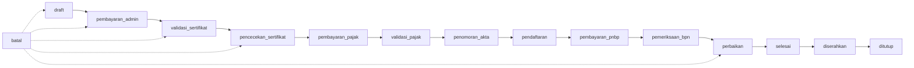
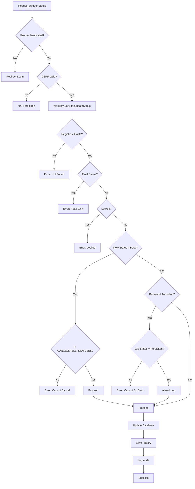

# Business Rules - Aturan Bisnis Sistem Tracking Notaris

## 1. Overview Business Rules

Dokumen ini menjelaskan aturan bisnis yang diimplementasikan dalam Sistem Tracking Status Dokumen Notaris. Rules ini enforcement dalam kode untuk memastikan integritas proses bisnis notaris.

---

## 2. Status Workflow Rules

### 2.1 Status Order (14 Status)



### 2.2 Status Order Mapping

| Order | Status Key | Label | Estimasi | Cancellable? |
|-------|------------|-------|----------|--------------|
| 1 | `draft` | Draft / Pengumpulan Persyaratan | 2 hari | ✅ Ya |
| 2 | `pembayaran_admin` | Pembayaran Administrasi | 2 hari | ✅ Ya |
| 3 | `validasi_sertifikat` | Validasi Sertifikat | 7 hari | ✅ Ya |
| 4 | `pencecekan_sertifikat` | Pengecekan Sertifikat | 7 hari | ✅ Ya |
| 5 | `pembayaran_pajak` | Pembayaran Pajak | 1 hari | ❌ **TIDAK** |
| 6 | `validasi_pajak` | Validasi Pajak | 5 hari | ❌ Tidak |
| 7 | `penomoran_akta` | Penomoran Akta | 1 hari | ❌ Tidak |
| 8 | `pendaftaran` | Pendaftaran | 5-7 hari | ❌ Tidak |
| 9 | `pembayaran_pnbp` | Pembayaran PNBP | 1-2 hari | ❌ Tidak |
| 10 | `pemeriksaan_bpn` | Pemeriksaan BPN | 7-10 hari | ❌ Tidak |
| 11 | `perbaikan` | Perbaikan | 3-5 hari | ✅ Ya* |
| 12 | `selesai` | Selesai | 1 hari | ❌ Tidak |
| 13 | `diserahkan` | Diserahkan | 1-3 hari | ❌ Tidak |
| 14 | `ditutup` | Ditutup | 1 hari | ❌ Tidak |
| 15 | `batal` | Batal | - | ❌ Tidak (final) |

**\* Note:** Perbaikan bisa batal karena merupakan koreksi dari BPN, belum ada biaya baru yang keluar.

---

## 3. Core Business Rules

### 3.1 BR-001: Status Transition Validation

**Rule:** Status hanya dapat bergerak maju (forward) dalam urutan yang telah ditentukan, dengan pengecualian khusus untuk status `perbaikan`.

**Implementation:**
```php
// WorkflowService::updateStatus()

$currentOrder = STATUS_ORDER[$oldStatus];
$newOrder = STATUS_ORDER[$newStatus];

// Rule: Cannot go backward (except from perbaikan)
if ($newOrder < $currentOrder && $newStatus !== 'batal') {
    if ($oldStatus !== 'perbaikan') {
        return [
            'success' => false,
            'message' => 'Status tidak dapat mundur dari ' . 
                STATUS_LABELS[$oldStatus] . ' ke ' . STATUS_LABELS[$newStatus]
        ];
    }
}
```

**Rationale:**
- Setiap status mewakili progress fisik yang sudah dilakukan
- Tidak mungkin "un-do" progress fisik (contoh: sudah bayar pajak tidak bisa "un-pay")
- Pengecualian untuk `perbaikan` karena merupakan loop koreksi dari BPN

**Examples:**
```
✅ VALID:
  draft → pembayaran_admin (forward)
  pembayaran_admin → validasi_sertifikat (forward)
  perbaikan → pembayaran_pajak (loop back allowed)
  
❌ INVALID:
  validasi_sertifikat → draft (backward not allowed)
  pembayaran_pajak → pencecekan_sertifikat (backward not allowed)
```

---

### 3.2 BR-002: Cancellation Limit

**Rule:** Registrasi hanya dapat dibatalkan sebelum status mencapai `pembayaran_pajak`.

**Implementation:**
```php
// Config
define('CANCELLABLE_STATUSES', [
    'draft',
    'pembayaran_admin',
    'validasi_sertifikat',
    'pencecekan_sertifikat',
    'perbaikan',
]);

// WorkflowService::updateStatus()
if ($newStatus === 'batal') {
    if (!in_array($oldStatus, CANCELLABLE_STATUSES)) {
        return [
            'success' => false,
            'message' => 'Status sudah melewati tahap pembatalan'
        ];
    }
}
```

**Rationale:**
- Setelah `pembayaran_pajak`, sudah ada biaya yang dibayarkan ke negara
- Pajak yang sudah dibayar tidak dapat refund
- Ada konsekuensi hukum (akta sudah terdaftar di sistem pajak)

**Examples:**
```
✅ VALID (Can Cancel):
  draft → batal
  pembayaran_admin → batal
  validasi_sertifikat → batal
  pencecekan_sertifikat → batal
  perbaikan → batal
  
❌ INVALID (Cannot Cancel):
  pembayaran_pajak → batal
  validasi_pajak → batal
  penomoran_akta → batal
  pendaftaran → batal
  selesai → batal
```

---

### 3.3 BR-003: Initial Status Restriction

**Rule:** Saat create registrasi baru, status awal hanya boleh salah satu dari 4 status pertama.

**Implementation:**
```php
// Dashboard\Controller::storeRegistrasi()

$allowedCreateStatuses = [
    STATUS_DRAFT,
    STATUS_PEMBAYARAN_ADMIN,
    STATUS_VALIDASI_SERTIFIKAT,
    STATUS_PENCECEKAN_SERTIFIKAT
];

if (!in_array($status, $allowedCreateStatuses)) {
    return json([
        'success' => false,
        'message' => 'Status awal hanya boleh: Draft, Pembayaran Admin, Validasi Sertifikat, atau Pengecekan Sertifikat'
    ]);
}
```

**Rationale:**
- Status setelah `pembayaran_pajak` tidak bisa dibatalkan
- Create registrasi dengan status setelah `pembayaran_pajak` dianggap tidak valid
- Sistem memaksa user memilih status awal yang "aman" (bisa masih dibatalkan)

**Examples:**
```
✅ VALID Initial Status:
  Create → draft
  Create → pembayaran_admin
  Create → validasi_sertifikat
  Create → pencecekan_sertifikat
  
❌ INVALID Initial Status:
  Create → pembayaran_pajak (sudah tidak bisa batal)
  Create → selesai (tidak logis)
  Create → batal (tidak masuk akal)
```

---

### 3.4 BR-004: Lock Mechanism

**Rule:** Registrasi yang di-lock tidak dapat diupdate statusnya.

**Implementation:**
```php
// WorkflowService::updateStatus()

if ($registrasi['is_locked']) {
    return [
        'success' => false,
        'message' => 'Registrasi sedang dikunci'
    ];
}
```

**Rationale:**
- Beberapa kasus sensitif memerlukan proteksi dari update tidak sah
- Lock mechanism memberikan kontrol ekstra untuk kasus khusus
- Hanya notaris yang dapat lock/unlock registrasi

**Use Cases:**
- Kasus sengketa
- Kasus dengan dokumen sensitif
- Kasus yang sedang dalam review khusus

---

### 3.5 BR-005: Final Status Read-Only

**Rule:** Status `selesai`, `ditutup`, dan `batal` adalah final dan read-only.

**Implementation:**
```php
// WorkflowService::updateStatus()

$finalStatuses = ['selesai', 'ditutup', 'batal'];
if (in_array($oldStatus, $finalStatuses)) {
    return [
        'success' => false,
        'message' => 'Status final tidak dapat diubah'
    ];
}
```

**Exception:**
- `ditutup` dapat di-reopen oleh notaris melalui FinalisasiService

**Rationale:**
- Status final menandakan akhir dari lifecycle dokumen
- Mencegah update tidak sah pada kasus yang sudah selesai
- Integritas data historis

---

### 3.6 BR-006: Perbaikan Loop Exception

**Rule:** Status `perbaikan` dapat kembali ke status sebelumnya (loop back).

**Implementation:**
```php
// WorkflowService::updateStatus()

$isPerbaikan = ($oldStatus === 'perbaikan');

if (!$isPerbaikan && $newOrder < $currentOrder && $newStatus !== 'batal') {
    return [
        'success' => false,
        'message' => 'Status tidak dapat mundur'
    ];
}

// If perbaikan, allow loop back
if ($isPerbaikan && $newOrder < $currentOrder) {
    // Allowed: loop back for correction
}
```

**Rationale:**
- `perbaikan` adalah koreksi dari BPN
- BPN menemukan kesalahan → berkas dikembalikan untuk diperbaiki
- Setelah diperbaiki → status kembali ke tahap sebelumnya untuk diverifikasi ulang
- Ini bukan kemunduran normal, tapi loop koreksi

**Examples:**
```
✅ VALID (Perbaikan Loop):
  perbaikan → pembayaran_pajak
  perbaikan → validasi_pajak
  perbaikan → penomoran_akta
  perbaikan → pendaftaran
  perbaikan → pembayaran_pnbp
  perbaikan → pemeriksaan_bpn
```

---

### 3.7 BR-007: Auto-Deactivate Kendala

**Rule:** Saat status berubah ke `selesai`, `ditutup`, atau `batal`, semua flag kendala auto-deactivate.

**Implementation:**
```php
// WorkflowService::updateStatus()

$flagsAutoDeleted = false;
if (in_array($newStatus, ['selesai', 'batal', 'ditutup'])) {
    $this->kendalaModel->deactivateAll($registrasiId);
    $flagsAutoDeleted = true;
}
```

**Rationale:**
- Kasus selesai/batal/ditutup tidak lagi memerlukan monitoring kendala
- Cleanup otomatis untuk data yang sudah tidak relevan
- Konsistensi data workflow

---

### 3.8 BR-008: History Logging Mandatory

**Rule:** Semua perubahan status WAJIB dicatat dalam registrasi_history.

**Implementation:**
```php
// WorkflowService::updateStatus()

$shouldSaveHistory = (bool)(
    $statusChanged || 
    $flagChanged || 
    ($catatan !== null && $catatan !== $oldCatatan)
);

if ($shouldSaveHistory) {
    $this->registrasiHistoryModel->create([
        'registrasi_id' => $registrasiId,
        'status_old' => $oldStatus,
        'status_new' => $newStatus,
        'catatan' => $catatan,
        'user_id' => $userId,
        'user_name' => $userName,
        'user_role' => $role,
        'ip_address' => $_SERVER['REMOTE_ADDR'],
    ]);
}
```

**Rationale:**
- Audit trail untuk compliance dan monitoring
- Business ledger immutable untuk integritas
- Tracking perubahan untuk evaluasi performa

---

### 3.9 BR-009: Klien GetOrCreate Pattern

**Rule:** Klien di-reuse berdasarkan nomor HP (getOrCreate pattern).

**Implementation:**
```php
// Klien Entity

public function getOrCreate($nama, $hp, $email = null) {
    $existing = $this->findByHp($hp);
    if ($existing) {
        return $existing['id']; // Reuse existing client
    }
    return $this->create([
        'nama' => $nama,
        'hp' => $hp,
        'email' => $email
    ]); // Create new client
}
```

**Rationale:**
- Mencegah duplikasi data klien
- Satu klien dapat memiliki multiple registrasi
- Konsistensi data klien

---

### 3.10 BR-010: Verification Code Security

**Rule:** Tracking akses memerlukan verifikasi 4 digit terakhir nomor HP.

**Implementation:**
```php
// Main\Controller::verifyTracking()

$cleanPhone = preg_replace('/[^0-9]/', '', $klien['hp']);
$last4Phone = substr($cleanPhone, -4);

if ($phoneCode !== $last4Phone) {
    logSecurityEvent('FAILED_VERIFICATION', [
        'registrasi_id' => $registrasiId,
        'attempted_code' => $phoneCode,
    ]);
    return json([
        'success' => false,
        'message' => 'Kode verifikasi salah'
    ]);
}
```

**Rationale:**
- Security tanpa password (passwordless authentication)
- Hanya klien yang tahu nomor HP mereka
- Mencegah akses tidak sah ke status dokumen

---

### 3.11 BR-011: Tracking Token Expiry

**Rule:** Tracking token expired setelah 24 jam.

**Implementation:**
```php
// security_helpers.php

function generateTrackingToken($registrasiId, $verificationCode) {
    $data = [
        'id' => $registrasiId,
        'code' => $verificationCode,
        'exp' => time() + 86400 // 24 hours
    ];
    $payload = base64_encode(json_encode($data));
    $signature = hash_hmac('sha256', $payload', SECRET_KEY);
    return $payload . '.' . $signature;
}

function verifyTrackingToken($token) {
    $parts = explode('.', $token);
    if (count($parts) !== 2) return false;
    
    $payload = base64_decode($parts[0]);
    $data = json_decode($payload, true);
    
    if (!$data) return false;
    if (isset($data['exp']) && $data['exp'] < time()) return false; // Expired
    
    // Verify signature...
    return $data;
}
```

**Rationale:**
- Security: Token tidak valid indefinitely
- Privacy: Akses tracking terbatas waktu
- Best practice untuk token-based authentication

---

### 3.12 BR-012: Finalisasi by Notaris Only

**Rule:** Hanya notaris yang dapat melakukan finalisasi (tutup) kasus.

**Implementation:**
```php
// routes.php
Router::add('tutup_registrasi', 'POST', [
    FinalisasiController::class, 'tutupRegistrasi'
], ['auth' => true, 'role' => 'notaris']);

// FinalisasiService::tutupRegistrasi()
if ($registrasi['status'] !== 'selesai') {
    return [
        'success' => false,
        'message' => 'Status harus selesai untuk finalisasi'
    ];
}
```

**Rationale:**
- Finalisasi adalah keputusan hukum yang memerlukan otoritas notaris
- Staff/admin tidak memiliki otoritas untuk menutup kasus
- Separation of duties

---

### 3.13 BR-013: WhatsApp Notification Template

**Rule:** Notifikasi WhatsApp menggunakan template yang telah didefinisikan.

**Implementation:**
```php
// message_templates table

[
    'template_key' => 'registrasi_baru',
    'template_body' => 'Halo {nama_klien}, registrasi Anda dengan nomor {nomor_registrasi} telah terdaftar. Status saat ini: {status}.'
]

// Usage
$message = str_replace(
    ['{nama_klien}', '{nomor_registrasi}', '{status}'],
    [$klienNama, $nomorRegistrasi, $statusLabel],
    $templateBody
);
```

**Rationale:**
- Konsistensi komunikasi dengan klien
- Professional branding
- Easy update tanpa code change

---

### 3.14 BR-014: Internal Note Template

**Rule:** Catatan internal untuk setiap status menggunakan template.

**Implementation:**
```php
// note_templates table

[
    'status_key' => 'draft',
    'template_body' => 'Perkara Anda telah terdaftar dan saat ini sedang dalam tahap pengumpulan serta pemeriksaan awal persyaratan.'
]

// Auto-fill saat create registrasi
$noteTemplate = NoteTemplate::findByStatusKey($status);
$catatanInternal = $noteTemplate['template_body'];
```

**Rationale:**
- Konsistensi catatan internal
- Efisiensi input untuk staff
- Standardisasi komunikasi

---

## 4. Business Rules Matrix

### 4.1 Status Transition Matrix

| From \ To | draft | pembayaran_admin | validasi_sertifikat | pencecekan_sertifikat | pembayaran_pajak | ... | batal |
|-----------|-------|------------------|---------------------|----------------------|------------------|-----|-------|
| **draft** | - | ✅ | ❌ | ❌ | ❌ | ... | ✅ |
| **pembayaran_admin** | ❌ | - | ✅ | ❌ | ❌ | ... | ✅ |
| **validasi_sertifikat** | ❌ | ❌ | - | ✅ | ❌ | ... | ✅ |
| **pencecekan_sertifikat** | ❌ | ❌ | ❌ | - | ✅ | ... | ✅ |
| **pembayaran_pajak** | ❌ | ❌ | ❌ | ❌ | - | ... | ❌ |
| **...** | ❌ | ❌ | ❌ | ❌ | ❌ | ... | ❌ |
| **perbaikan** | ❌ | ❌ | ❌ | ❌ | ✅ | ... | ✅ |
| **selesai** | ❌ | ❌ | ❌ | ❌ | ❌ | ... | ❌ |

### 4.2 Role Permission Matrix

| Action | Publik | Admin | Notaris |
|--------|--------|-------|---------|
| View Homepage | ✅ | ✅ | ✅ |
| Tracking Status | ✅ | ✅ | ✅ |
| Create Registrasi | ❌ | ✅ | ✅ |
| Update Status | ❌ | ✅ | ✅ |
| Update Klien | ❌ | ✅ | ✅ |
| Toggle Kendala | ❌ | ✅ | ✅ |
| Lock Registrasi | ❌ | ❌ | ✅ |
| User Management | ❌ | ❌ | ✅ |
| CMS Management | ❌ | ❌ | ✅ |
| Finalisasi | ❌ | ❌ | ✅ |
| Audit Log View | ❌ | ❌ | ✅ |
| Backup Management | ❌ | ❌ | ✅ |

---

## 5. Validation Flow

### 5.1 Update Status Validation Flow



---

## 6. Kesimpulan

Business rules yang diimplementasikan mencakup:

1. **Workflow Validation** - Status order enforcement dengan exception handling
2. **Cancellation Policy** - Batas pembatalan setelah pembayaran pajak
3. **Initial Status** - Restriksi status awal untuk create registrasi
4. **Lock Mechanism** - Proteksi kasus sensitif
5. **Final Status** - Read-only untuk status final
6. **Perbaikan Loop** - Special case untuk koreksi BPN
7. **Auto-Cleanup** - Deactivate kendala saat finalisasi
8. **Mandatory Logging** - Audit trail untuk semua perubahan
9. **Data Integrity** - GetOrCreate pattern untuk klien
10. **Security** - Verification code dan token expiry
11. **Authorization** - Role-based permissions

Semua rules ini enforcement dalam kode untuk memastikan integritas proses bisnis notaris dan compliance dengan praktik terbaik domain notaris Indonesia.
