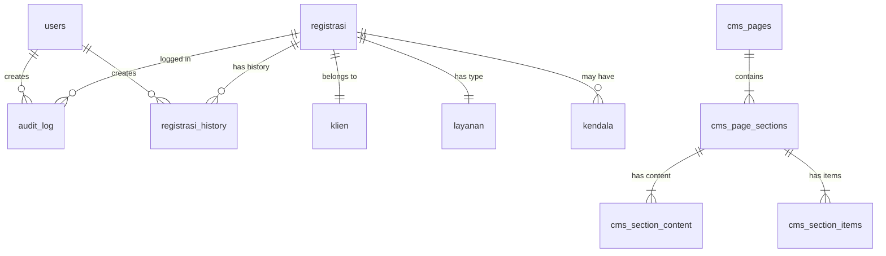
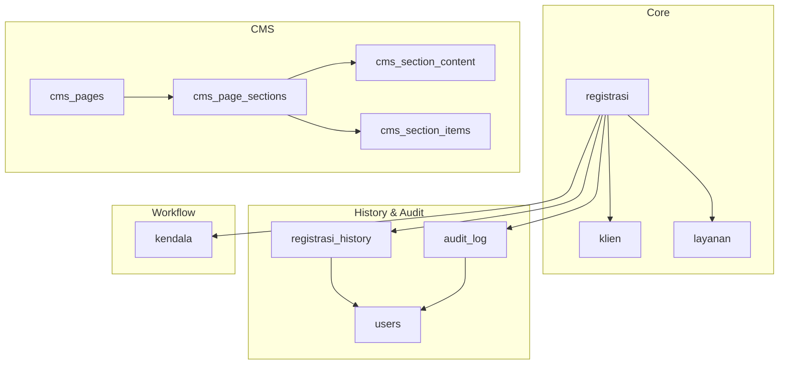

# Database Schema - Skema Basis Data Sistem Tracking

## 1. Overview Database

Database sistem menggunakan MySQL/MariaDB dengan normalisasi tingkat 3 (3NF) untuk memastikan integritas data dan efisiensi query.

### 1.1 Entity Relationship Diagram



---

## 2. Core Tables

### 2.1 Table: users

**Deskripsi:** Menyimpan data pengguna sistem (notaris dan admin/staff)

```sql
CREATE TABLE `users` (
  `id` int(10) UNSIGNED NOT NULL AUTO_INCREMENT,
  `username` varchar(50) NOT NULL,
  `password_hash` varchar(255) NOT NULL,
  `role` enum('notaris','admin') NOT NULL,
  `created_at` timestamp NOT NULL DEFAULT current_timestamp(),
  `updated_at` timestamp NOT NULL DEFAULT current_timestamp() ON UPDATE current_timestamp(),
  PRIMARY KEY (`id`),
  UNIQUE KEY `unique_username` (`username`)
) ENGINE=InnoDB DEFAULT CHARSET=utf8mb4 COLLATE=utf8mb4_unicode_ci;
```

**Columns:**

| Column | Type | Constraints | Description |
|--------|------|-------------|-------------|
| `id` | int(10) UNSIGNED | PRIMARY KEY, AUTO_INCREMENT | User ID |
| `username` | varchar(50) | NOT NULL, UNIQUE | Username untuk login |
| `password_hash` | varchar(255) | NOT NULL | Bcrypt password hash (cost 12) |
| `role` | enum('notaris','admin') | NOT NULL | Role untuk RBAC |
| `created_at` | timestamp | DEFAULT current_timestamp() | Waktu pembuatan user |
| `updated_at` | timestamp | ON UPDATE current_timestamp() | Waktu update terakhir |

**Sample Data:**
```sql
INSERT INTO `users` (`id`, `username`, `password_hash`, `role`) VALUES
(1, 'admin', '$2y$12$abc123...', 'admin'),
(2, 'notaris', '$2y$12$def456...', 'notaris');
```

**Indexes:**
```sql
CREATE INDEX idx_users_username ON users(username);
CREATE INDEX idx_users_role ON users(role);
```

---

### 2.2 Table: klien

**Deskripsi:** Menyimpan data klien/pengguna layanan notaris

```sql
CREATE TABLE `klien` (
  `id` int(10) UNSIGNED NOT NULL AUTO_INCREMENT,
  `nama` varchar(100) NOT NULL,
  `hp` varchar(20) NOT NULL,
  `email` varchar(100) DEFAULT NULL,
  `created_at` timestamp NOT NULL DEFAULT current_timestamp(),
  `updated_at` timestamp NOT NULL DEFAULT current_timestamp() ON UPDATE current_timestamp(),
  PRIMARY KEY (`id`)
) ENGINE=InnoDB DEFAULT CHARSET=utf8mb4 COLLATE=utf8mb4_unicode_ci;
```

**Columns:**

| Column | Type | Constraints | Description |
|--------|------|-------------|-------------|
| `id` | int(10) UNSIGNED | PRIMARY KEY, AUTO_INCREMENT | Klien ID |
| `nama` | varchar(100) | NOT NULL | Nama lengkap klien |
| `hp` | varchar(20) | NOT NULL | Nomor handphone (untuk verifikasi) |
| `email` | varchar(100) | NULL | Email (optional) |
| `created_at` | timestamp | DEFAULT current_timestamp() | Waktu registrasi |
| `updated_at` | timestamp | ON UPDATE current_timestamp() | Update terakhir |

**Business Logic:**
- GetOrCreate pattern: Klien di-reuse berdasarkan nomor HP
- HP digunakan untuk verifikasi tracking (4 digit terakhir)

**Indexes:**
```sql
CREATE INDEX idx_klien_hp ON klien(hp);
CREATE INDEX idx_klien_nama ON klien(nama);
```

---

### 2.3 Table: layanan

**Deskripsi:** Jenis layanan notaris yang tersedia

```sql
CREATE TABLE `layanan` (
  `id` int(10) UNSIGNED NOT NULL AUTO_INCREMENT,
  `nama_layanan` varchar(100) NOT NULL,
  `deskripsi` text DEFAULT NULL,
  `created_at` timestamp NOT NULL DEFAULT current_timestamp(),
  `updated_at` timestamp NOT NULL DEFAULT current_timestamp() ON UPDATE current_timestamp(),
  PRIMARY KEY (`id`)
) ENGINE=InnoDB DEFAULT CHARSET=utf8mb4 COLLATE=utf8mb4_unicode_ci;
```

**Columns:**

| Column | Type | Constraints | Description |
|--------|------|-------------|-------------|
| `id` | int(10) UNSIGNED | PRIMARY KEY, AUTO_INCREMENT | Layanan ID |
| `nama_layanan` | varchar(100) | NOT NULL | Nama layanan |
| `deskripsi` | text | NULL | Deskripsi layanan |
| `created_at` | timestamp | DEFAULT current_timestamp() | Waktu pembuatan |
| `updated_at` | timestamp | ON UPDATE current_timestamp() | Update terakhir |

**Sample Data:**
```sql
INSERT INTO `layanan` (`id`, `nama_layanan`, `deskripsi`) VALUES
(1, 'Akta Jual Beli', 'Pembuatan akta jual beli tanah/bangunan'),
(2, 'Akta Hibah', 'Pembuatan akta hibah'),
(3, 'Surat Kuasa', 'Pembuatan surat kuasa'),
(4, 'Akta Perkawinan', 'Perjanjian pra-nikah'),
(5, 'Waris', 'Pembuatan akta waris'),
(6, 'Sertifikat Tanah', 'Pengurusan sertifikat tanah'),
(7, 'Legalization', 'Legalisasi dokumen'),
(8, 'Lainnya', 'Layanan notaris lainnya');
```

---

### 2.4 Table: registrasi

**Deskripsi:** Table utama untuk tracking registrasi dokumen

```sql
CREATE TABLE `registrasi` (
  `id` int(10) UNSIGNED NOT NULL AUTO_INCREMENT,
  `klien_id` int(10) UNSIGNED NOT NULL,
  `layanan_id` int(10) UNSIGNED NOT NULL,
  `nomor_registrasi` varchar(20) NOT NULL,
  `status` enum('draft','pembayaran_admin','validasi_sertifikat','pencecekan_sertifikat','pembayaran_pajak','validasi_pajak','penomoran_akta','pendaftaran','pembayaran_pnbp','pemeriksaan_bpn','perbaikan','selesai','diserahkan','ditutup','batal') NOT NULL DEFAULT 'draft',
  `keterangan` text DEFAULT NULL,
  `catatan_internal` text DEFAULT NULL,
  `tracking_token` varchar(500) DEFAULT NULL,
  `verification_code` varchar(50) DEFAULT NULL,
  `batal_flag` tinyint(1) DEFAULT 0,
  `is_locked` tinyint(1) DEFAULT 0,
  `is_finalized` tinyint(1) DEFAULT 0,
  `finalized_at` timestamp NULL DEFAULT NULL,
  `finalized_by` int(10) UNSIGNED DEFAULT NULL,
  `finalization_notes` text DEFAULT NULL,
  `created_at` timestamp NOT NULL DEFAULT current_timestamp(),
  `updated_at` timestamp NOT NULL DEFAULT current_timestamp() ON UPDATE current_timestamp(),
  PRIMARY KEY (`id`),
  UNIQUE KEY `unique_nomor_registrasi` (`nomor_registrasi`),
  KEY `fk_registrasi_klien` (`klien_id`),
  KEY `fk_registrasi_layanan` (`layanan_id`),
  KEY `idx_status` (`status`),
  KEY `idx_tracking_token` (`tracking_token`),
  CONSTRAINT `fk_registrasi_klien` FOREIGN KEY (`klien_id`) REFERENCES `klien`(`id`),
  CONSTRAINT `fk_registrasi_layanan` FOREIGN KEY (`layanan_id`) REFERENCES `layanan`(`id`)
) ENGINE=InnoDB DEFAULT CHARSET=utf8mb4 COLLATE=utf8mb4_unicode_ci;
```

**Columns:**

| Column | Type | Constraints | Description |
|--------|------|-------------|-------------|
| `id` | int(10) UNSIGNED | PRIMARY KEY, AUTO_INCREMENT | Registrasi ID |
| `klien_id` | int(10) UNSIGNED | FOREIGN KEY → klien.id | Referensi klien |
| `layanan_id` | int(10) UNSIGNED | FOREIGN KEY → layanan.id | Referensi layanan |
| `nomor_registrasi` | varchar(20) | UNIQUE, NOT NULL | Nomor registrasi (NP-YYYYMMDD-XXXX) |
| `status` | enum(15 values) | NOT NULL, DEFAULT 'draft' | Status workflow |
| `keterangan` | text | NULL | Keterangan untuk klien |
| `catatan_internal` | text | NULL | Catatan internal staff/notaris |
| `tracking_token` | varchar(500) | NULL | Token untuk tracking publik |
| `verification_code` | varchar(50) | NULL | Kode verifikasi (random) |
| `batal_flag` | tinyint(1) | DEFAULT 0 | Flag status batal |
| `is_locked` | tinyint(1) | DEFAULT 0 | Lock mechanism |
| `is_finalized` | tinyint(1) | DEFAULT 0 | Finalization flag |
| `finalized_at` | timestamp | NULL | Waktu finalisasi |
| `finalized_by` | int(10) UNSIGNED | NULL → users.id | User yang finalize |
| `finalization_notes` | text | NULL | Catatan finalisasi |
| `created_at` | timestamp | DEFAULT current_timestamp() | Waktu pembuatan |
| `updated_at` | timestamp | ON UPDATE current_timestamp() | Update terakhir |

**Status Values (14 + 1):**
1. `draft` - Draft / Pengumpulan Persyaratan
2. `pembayaran_admin` - Pembayaran Administrasi
3. `validasi_sertifikat` - Validasi Sertifikat
4. `pencecekan_sertifikat` - Pengecekan Sertifikat
5. `pembayaran_pajak` - Pembayaran Pajak (BATAS PEMBATALAN)
6. `validasi_pajak` - Validasi Pajak
7. `penomoran_akta` - Penomoran Akta
8. `pendaftaran` - Pendaftaran
9. `pembayaran_pnbp` - Pembayaran PNBP
10. `pemeriksaan_bpn` - Pemeriksaan BPN
11. `perbaikan` - Perbaikan
12. `selesai` - Selesai
13. `diserahkan` - Diserahkan
14. `ditutup` - Ditutup (final read-only)
15. `batal` - Batal (final)

**Indexes:**
```sql
CREATE INDEX idx_registrasi_nomor ON registrasi(nomor_registrasi);
CREATE INDEX idx_registrasi_status ON registrasi(status);
CREATE INDEX idx_registrasi_klien ON registrasi(klien_id);
CREATE INDEX idx_registrasi_token ON registrasi(tracking_token);
CREATE INDEX idx_registrasi_created ON registrasi(created_at);
```

---

### 2.5 Table: registrasi_history

**Deskripsi:** Immutable ledger untuk semua perubahan status registrasi (business history)

```sql
CREATE TABLE `registrasi_history` (
  `id` int(10) UNSIGNED NOT NULL AUTO_INCREMENT,
  `registrasi_id` int(10) UNSIGNED NOT NULL,
  `status_old` varchar(50) DEFAULT NULL,
  `status_new` varchar(50) DEFAULT NULL,
  `catatan` text DEFAULT NULL,
  `keterangan` text DEFAULT NULL,
  `flag_kendala_active` tinyint(1) DEFAULT 0,
  `flag_kendala_tahap` varchar(100) DEFAULT NULL,
  `user_id` int(10) UNSIGNED DEFAULT NULL,
  `user_name` varchar(50) DEFAULT NULL,
  `user_role` enum('notaris','admin') DEFAULT NULL,
  `ip_address` varchar(45) DEFAULT NULL,
  `created_at` timestamp NOT NULL DEFAULT current_timestamp(),
  PRIMARY KEY (`id`),
  KEY `fk_history_registrasi` (`registrasi_id`),
  KEY `idx_history_created` (`created_at`),
  CONSTRAINT `fk_history_registrasi` FOREIGN KEY (`registrasi_id`) REFERENCES `registrasi`(`id`) ON DELETE CASCADE
) ENGINE=InnoDB DEFAULT CHARSET=utf8mb4 COLLATE=utf8mb4_unicode_ci;
```

**Columns:**

| Column | Type | Constraints | Description |
|--------|------|-------------|-------------|
| `id` | int(10) UNSIGNED | PRIMARY KEY, AUTO_INCREMENT | History ID |
| `registrasi_id` | int(10) UNSIGNED | FOREIGN KEY → registrasi.id | Referensi registrasi |
| `status_old` | varchar(50) | NULL | Status sebelum perubahan |
| `status_new` | varchar(50) | NULL | Status setelah perubahan |
| `catatan` | text | NULL | Catatan perubahan |
| `keterangan` | text | NULL | Keterangan |
| `flag_kendala_active` | tinyint(1) | DEFAULT 0 | Status flag kendala |
| `flag_kendala_tahap` | varchar(100) | NULL | Tahap kendala |
| `user_id` | int(10) UNSIGNED | NULL → users.id | User yang melakukan perubahan |
| `user_name` | varchar(50) | NULL | Username (denormalized) |
| `user_role` | enum('notaris','admin') | NULL | Role user |
| `ip_address` | varchar(45) | NULL | IP address user |
| `created_at` | timestamp | DEFAULT current_timestamp() | Waktu perubahan |

**Business Rules:**
- **IMMUTABLE**: Data tidak pernah di-update atau di-delete
- **CASCADE DELETE**: Jika registrasi dihapus, history ikut terhapus
- **Audit Trail**: Semua perubahan status tercatat di sini

**Indexes:**
```sql
CREATE INDEX idx_history_registrasi ON registrasi_history(registrasi_id);
CREATE INDEX idx_history_created ON registrasi_history(created_at);
CREATE INDEX idx_history_user ON registrasi_history(user_id);
```

---

### 2.6 Table: audit_log

**Deskripsi:** Security audit log untuk semua aksi penting dalam sistem

```sql
CREATE TABLE `audit_log` (
  `id` int(10) UNSIGNED NOT NULL AUTO_INCREMENT,
  `registrasi_id` int(10) UNSIGNED DEFAULT NULL,
  `user_id` int(10) UNSIGNED DEFAULT NULL,
  `role` enum('notaris','admin') NOT NULL,
  `action` varchar(50) NOT NULL,
  `old_value` text DEFAULT NULL,
  `new_value` text DEFAULT NULL,
  `timestamp` timestamp NOT NULL DEFAULT current_timestamp(),
  PRIMARY KEY (`id`),
  KEY `idx_audit_user` (`user_id`),
  KEY `idx_audit_registrasi` (`registrasi_id`),
  KEY `idx_audit_timestamp` (`timestamp`),
  KEY `idx_audit_action` (`action`)
) ENGINE=InnoDB DEFAULT CHARSET=utf8mb4 COLLATE=utf8mb4_unicode_ci;
```

**Columns:**

| Column | Type | Constraints | Description |
|--------|------|-------------|-------------|
| `id` | int(10) UNSIGNED | PRIMARY KEY, AUTO_INCREMENT | Audit log ID |
| `registrasi_id` | int(10) UNSIGNED | NULL → registrasi.id | Referensi registrasi (jika ada) |
| `user_id` | int(10) UNSIGNED | NULL → users.id | User yang melakukan aksi |
| `role` | enum('notaris','admin') | NOT NULL | Role user |
| `action` | varchar(50) | NOT NULL | Jenis aksi (create, update, delete, login, logout) |
| `old_value` | text | NULL | Data lama (JSON format) |
| `new_value` | text | NULL | Data baru (JSON format) |
| `timestamp` | timestamp | DEFAULT current_timestamp() | Waktu aksi |

**Logged Actions:**
- User login/logout
- Create registrasi
- Update status
- User CRUD (create, update, delete)
- Backup delete
- Finalisasi kasus
- Reopen kasus

**Sample Data:**
```sql
INSERT INTO `audit_log` (`user_id`, `role`, `action`, `old_value`, `new_value`) VALUES
(2, 'notaris', 'login', NULL, '{"ip":"::1"}'),
(2, 'notaris', 'create', NULL, '{"klien_id":3,"layanan_id":"5","nomor_registrasi":"NP-20260326-1234","status":"draft"}'),
(2, 'notaris', 'update', '{"status":"draft"}', '{"status":"pembayaran_admin"}');
```

**Indexes:**
```sql
CREATE INDEX idx_audit_user ON audit_log(user_id);
CREATE INDEX idx_audit_registrasi ON audit_log(registrasi_id);
CREATE INDEX idx_audit_timestamp ON audit_log(timestamp);
CREATE INDEX idx_audit_action ON audit_log(action);
```

---

## 3. Workflow Tables

### 3.1 Table: kendala

**Deskripsi:** Flag untuk menandai registrasi yang mengalami kendala/hambatan

```sql
CREATE TABLE `kendala` (
  `id` int(10) UNSIGNED NOT NULL AUTO_INCREMENT,
  `registrasi_id` int(10) UNSIGNED NOT NULL,
  `tahap` varchar(100) NOT NULL,
  `flag_active` tinyint(1) NOT NULL DEFAULT 1,
  `created_at` timestamp NOT NULL DEFAULT current_timestamp(),
  `updated_at` timestamp NOT NULL DEFAULT current_timestamp() ON UPDATE current_timestamp(),
  PRIMARY KEY (`id`),
  KEY `fk_kendala_registrasi` (`registrasi_id`),
  KEY `idx_kendala_active` (`flag_active`),
  CONSTRAINT `fk_kendala_registrasi` FOREIGN KEY (`registrasi_id`) REFERENCES `registrasi`(`id`) ON DELETE CASCADE
) ENGINE=InnoDB DEFAULT CHARSET=utf8mb4 COLLATE=utf8mb4_unicode_ci;
```

**Columns:**

| Column | Type | Constraints | Description |
|--------|------|-------------|-------------|
| `id` | int(10) UNSIGNED | PRIMARY KEY, AUTO_INCREMENT | Kendala ID |
| `registrasi_id` | int(10) UNSIGNED | FOREIGN KEY → registrasi.id | Referensi registrasi |
| `tahap` | varchar(100) | NOT NULL | Tahap dimana kendala terjadi |
| `flag_active` | tinyint(1) | DEFAULT 1 | Status aktif kendala |
| `created_at` | timestamp | DEFAULT current_timestamp() | Waktu pembuatan |
| `updated_at` | timestamp | ON UPDATE current_timestamp() | Update terakhir |

**Business Rules:**
- Auto-deactivate saat status → `selesai`, `ditutup`, `batal`
- Toggle flag untuk activate/deactivate
- Multiple kendala per registrasi dimungkinkan

---

## 4. CMS Tables

### 4.1 Table: cms_pages

**Deskripsi:** Definisi halaman CMS (homepage, layanan, dll)

```sql
CREATE TABLE `cms_pages` (
  `id` int(10) UNSIGNED NOT NULL AUTO_INCREMENT,
  `page_key` varchar(50) NOT NULL,
  `page_name` varchar(100) NOT NULL,
  `is_active` tinyint(1) NOT NULL DEFAULT 1,
  `version` int(11) NOT NULL DEFAULT 1,
  `updated_by` int(10) UNSIGNED DEFAULT NULL,
  `content_json` text DEFAULT NULL,
  `updated_at` timestamp NOT NULL DEFAULT current_timestamp() ON UPDATE current_timestamp(),
  PRIMARY KEY (`id`),
  UNIQUE KEY `unique_page_key` (`page_key`)
) ENGINE=InnoDB DEFAULT CHARSET=utf8mb4 COLLATE=utf8mb4_unicode_ci;
```

**Sample Data:**
```sql
INSERT INTO `cms_pages` (`page_key`, `page_name`, `is_active`) VALUES
('home', 'Homepage', 1),
('layanan', 'Layanan', 1),
('tentang', 'Tentang', 1),
('kontak', 'Kontak', 1),
('testimoni', 'Testimoni', 1);
```

---

### 4.2 Table: cms_page_sections

**Deskripsi:** Section dalam halaman CMS (hero, layanan, testimoni, dll)

```sql
CREATE TABLE `cms_page_sections` (
  `id` int(10) UNSIGNED NOT NULL AUTO_INCREMENT,
  `page_id` int(10) UNSIGNED NOT NULL,
  `section_key` varchar(50) NOT NULL,
  `section_name` varchar(100) NOT NULL,
  `section_order` int(11) NOT NULL DEFAULT 0,
  `is_active` tinyint(1) NOT NULL DEFAULT 1,
  `updated_at` timestamp NOT NULL DEFAULT current_timestamp() ON UPDATE current_timestamp(),
  PRIMARY KEY (`id`),
  KEY `fk_sections_page` (`page_id`),
  CONSTRAINT `fk_sections_page` FOREIGN KEY (`page_id`) REFERENCES `cms_pages`(`id`) ON DELETE CASCADE
) ENGINE=InnoDB DEFAULT CHARSET=utf8mb4 COLLATE=utf8mb4_unicode_ci;
```

**Sample Data:**
```sql
INSERT INTO `cms_page_sections` (`page_id`, `section_key`, `section_name`, `section_order`) VALUES
(1, 'hero', 'Hero Section', 1),
(1, 'layanan', 'Layanan Kami', 2),
(1, 'tentang', 'Tentang Kami', 3),
(1, 'testimoni', 'Testimoni', 4),
(1, 'cta', 'Call to Action', 5);
```

---

### 4.3 Table: cms_section_content

**Deskripsi:** Content text untuk setiap section

```sql
CREATE TABLE `cms_section_content` (
  `id` int(10) UNSIGNED NOT NULL AUTO_INCREMENT,
  `section_id` int(10) UNSIGNED NOT NULL,
  `content_key` varchar(50) NOT NULL,
  `content_value` text NOT NULL,
  `content_type` enum('text','html','image') NOT NULL DEFAULT 'text',
  `sort_order` int(11) NOT NULL DEFAULT 0,
  PRIMARY KEY (`id`),
  KEY `fk_content_section` (`section_id`),
  CONSTRAINT `fk_content_section` FOREIGN KEY (`section_id`) REFERENCES `cms_page_sections`(`id`) ON DELETE CASCADE
) ENGINE=InnoDB DEFAULT CHARSET=utf8mb4 COLLATE=utf8mb4_unicode_ci;
```

---

### 4.4 Table: cms_section_items

**Deskripsi:** Items dalam section (buttons, cards, list items)

```sql
CREATE TABLE `cms_section_items` (
  `id` int(10) UNSIGNED NOT NULL AUTO_INCREMENT,
  `section_id` int(10) UNSIGNED NOT NULL,
  `item_type` enum('button','card','list_item','testimonial','feature') NOT NULL,
  `title` varchar(100) NOT NULL,
  `description` text DEFAULT NULL,
  `extra_data` text DEFAULT NULL COMMENT 'JSON for additional data',
  `sort_order` int(11) NOT NULL DEFAULT 0,
  `is_active` tinyint(1) NOT NULL DEFAULT 1,
  `updated_at` timestamp NOT NULL DEFAULT current_timestamp() ON UPDATE current_timestamp(),
  PRIMARY KEY (`id`),
  KEY `fk_items_section` (`section_id`),
  CONSTRAINT `fk_items_section` FOREIGN KEY (`section_id`) REFERENCES `cms_page_sections`(`id`) ON DELETE CASCADE
) ENGINE=InnoDB DEFAULT CHARSET=utf8mb4 COLLATE=utf8mb4_unicode_ci;
```

---

## 5. Template Tables

### 5.1 Table: message_templates

**Deskripsi:** Template pesan WhatsApp untuk notifikasi klien

```sql
CREATE TABLE `message_templates` (
  `id` int(10) UNSIGNED NOT NULL AUTO_INCREMENT,
  `template_key` varchar(50) NOT NULL,
  `template_name` varchar(100) NOT NULL,
  `template_body` text NOT NULL,
  `description` text DEFAULT NULL,
  `updated_at` timestamp NOT NULL DEFAULT current_timestamp() ON UPDATE current_timestamp(),
  `updated_by` int(10) UNSIGNED DEFAULT NULL,
  PRIMARY KEY (`id`),
  UNIQUE KEY `unique_template_key` (`template_key`)
) ENGINE=InnoDB DEFAULT CHARSET=utf8mb4 COLLATE=utf8mb4_unicode_ci;
```

**Sample Data:**
```sql
INSERT INTO `message_templates` (`template_key`, `template_name`, `template_body`) VALUES
('registrasi_baru', 'Notifikasi Registrasi Baru', 'Halo {nama_klien}, registrasi Anda dengan nomor {nomor_registrasi} telah terdaftar. Status saat ini: {status}.'),
('status_update', 'Update Status', 'Halo {nama_klien}, status registrasi {nomor_registrasi} telah berubah menjadi {status_baru}.'),
('selesai', 'Dokumen Selesai', 'Halo {nama_klien}, dokumen Anda telah selesai dan siap untuk diambil.');
```

---

### 5.2 Table: note_templates

**Deskripsi:** Template catatan internal untuk staff/notaris

```sql
CREATE TABLE `note_templates` (
  `id` int(10) UNSIGNED NOT NULL AUTO_INCREMENT,
  `status_key` varchar(50) NOT NULL,
  `template_body` text NOT NULL,
  `updated_at` timestamp NOT NULL DEFAULT current_timestamp() ON UPDATE current_timestamp(),
  `updated_by` int(10) UNSIGNED DEFAULT NULL,
  PRIMARY KEY (`id`),
  UNIQUE KEY `unique_status_key` (`status_key`)
) ENGINE=InnoDB DEFAULT CHARSET=utf8mb4 COLLATE=utf8mb4_unicode_ci;
```

**Sample Data:**
```sql
INSERT INTO `note_templates` (`status_key`, `template_body`) VALUES
('draft', 'Perkara Anda telah terdaftar dan saat ini sedang dalam tahap pengumpulan serta pemeriksaan awal persyaratan.'),
('pembayaran_admin', 'Menunggu konfirmasi pembayaran administrasi.'),
('validasi_sertifikat', 'Sertifikat sedang dalam proses validasi.'),
('selesai', 'Dokumen telah selesai dan siap untuk diambil.');
```

---

## 6. Database Statistics

### 6.1 Table Summary

| Category | Tables | Purpose |
|----------|--------|---------|
| **User Management** | users, audit_log | Authentication & security audit |
| **Registration Core** | registrasi, klien, layanan | Main business data |
| **Workflow** | registrasi_history, kendala | Business process tracking |
| **CMS** | cms_pages, cms_page_sections, cms_section_content, cms_section_items | Content management |
| **Templates** | message_templates, note_templates | Communication templates |
| **Total** | **12 tables** | |

### 6.2 Foreign Key Relationships



---

## 7. Security Considerations

### 7.1 Sensitive Data Protection

| Data Type | Protection |
|-----------|------------|
| Passwords | Bcrypt hash (cost 12) |
| Phone Numbers | Never displayed in full (4 digit verification only) |
| Tracking Tokens | HMAC-SHA256 signed, 24h expiry |
| IP Addresses | Logged for audit, not exposed |

### 7.2 Data Integrity

- **Foreign Keys**: All relationships enforced with FK constraints
- **Cascade Delete**: History deleted with registrasi
- **Immutable History**: registrasi_history never updated
- **Timestamps**: All tables have created_at/updated_at

---

## 8. Performance Optimization

### 8.1 Indexes Summary

| Table | Indexed Columns | Purpose |
|-------|-----------------|---------|
| users | username, role | Login lookup, RBAC |
| klien | hp, nama | GetOrCreate pattern |
| registrasi | nomor_registrasi, status, tracking_token, klien_id | Tracking search, filtering |
| registrasi_history | registrasi_id, created_at, user_id | History lookup |
| audit_log | user_id, registrasi_id, timestamp, action | Audit queries |
| kendala | registrasi_id, flag_active | Kendala check |

### 8.2 Query Optimization

```sql
-- Use EXPLAIN to analyze queries
EXPLAIN SELECT * FROM registrasi 
WHERE nomor_registrasi = 'NP-20260326-1234';

-- Expected: Using index (idx_registrasi_nomor)
```

---

## 9. Kesimpulan

Database schema dirancang dengan prinsip:

1. **Normalization (3NF)** - Minimal redundancy, data integrity
2. **Foreign Keys** - Referential integrity enforced
3. **Immutable History** - registrasi_history untuk audit trail
4. **Comprehensive Audit** - audit_log untuk semua aksi penting
5. **Flexible CMS** - Normalized CMS structure
6. **Performance** - Strategic indexes pada frequently queried columns
7. **Security** - Sensitive data protected, FK constraints

Schema ini mendukung semua functional requirements sistem tracking status dokumen notaris dengan scalability untuk pertumbuhan data di masa depan.
