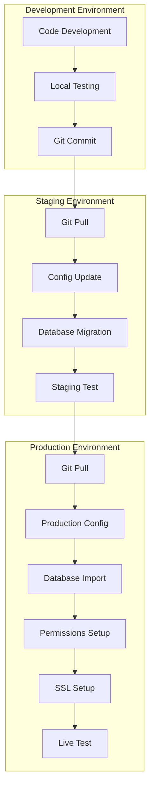

# Deployment - Panduan Penyebaran Sistem

## 1. Overview Deployment

Dokumen ini menjelaskan prosedur deployment Sistem Tracking Status Dokumen Notaris ke environment production.

---

## 2. Server Requirements

### 2.1 Minimum Requirements

| Component | Requirement | Recommended |
|-----------|-------------|-------------|
| **Web Server** | Apache 2.4+ | Apache 2.4+ with mod_rewrite |
| **PHP** | 7.4+ | PHP 8.0+ |
| **Database** | MySQL 5.7+ / MariaDB 10.4+ | MariaDB 10.6+ |
| **RAM** | 2 GB | 4 GB+ |
| **Storage** | 5 GB | 20 GB+ SSD |
| **SSL** | Optional | Required (Let's Encrypt) |

### 2.2 PHP Extensions Required

```bash
# Required extensions
php-mysql    # MySQL/MariaDB connection
php-pdo      # PDO database abstraction
php-json     # JSON handling
php-mbstring # Multibyte string handling
php-session  # Session management
php-fileinfo # File type detection

# Optional but recommended
php-opcache  # Performance optimization
php-zip      # Backup compression
```

---

## 3. Pre-Deployment Checklist

### 3.1 Configuration Changes

```php
// config/app.php - Production Settings

// 1. Set production mode
define('APP_ENV', 'production');
define('DEVELOPMENT_MODE', false);

// 2. Set production URL
define('APP_URL', 'https://notaris.example.com');

// 3. Update database credentials
define('DB_HOST', 'localhost');
define('DB_NAME', 'production_db_name');
define('DB_USER', 'production_db_user');
define('DB_PASS', 'strong_password_here');

// 4. Session settings
define('SESSION_LIFETIME', 7200); // 2 hours
define('SESSION_NAME', 'notaris_prod_session');

// 5. Security settings
define('CSRF_TOKEN_NAME', 'csrf_token_prod');
define('HASH_COST', 12); // Bcrypt cost
```

### 3.2 File Permissions

```bash
# Set correct permissions
chmod 755 /path/to/nora2.0
chmod 755 /path/to/nora2.0/app
chmod 755 /path/to/nora2.0/modules
chmod 755 /path/to/nora2.0/public
chmod 644 /path/to/nora2.0/config/app.php

# Writable directories
chmod 775 /path/to/nora2.0/storage
chmod 775 /path/to/nora2.0/storage/logs
chmod 775 /path/to/nora2.0/storage/cache
chmod 775 /path/to/nora2.0/storage/cache/data
chmod 775 /path/to/nora2.0/storage/cache/ratelimit
chmod 775 /path/to/nora2.0/public/assets/images

# Set ownership (www-data for Apache/Nginx)
chown -R www-data:www-data /path/to/nora2.0/storage
chown -R www-data:www-data /path/to/nora2.0/public/assets/images
```

### 3.3 Security Hardening

```bash
# 1. Remove development files
rm -rf /path/to/nora2.0/documentation
rm /path/to/nora2.0/check_history.php
rm /path/to/nora2.0/migrate_history.php

# 2. Protect sensitive directories
# Add to .htaccess files

# /storage/.htaccess
<IfModule mod_rewrite.c>
    RewriteEngine On
    RewriteRule ^ - [F]
</IfModule>
Deny from all

# /config/.htaccess
Deny from all

# /app/.htaccess
Deny from all
```

---

## 4. Deployment Steps

### 4.1 Database Setup

```bash
# 1. Create database
mysql -u root -p
CREATE DATABASE notaris_production CHARACTER SET utf8mb4 COLLATE utf8mb4_unicode_ci;
CREATE USER 'notaris_user'@'localhost' IDENTIFIED BY 'strong_password';
GRANT ALL PRIVILEGES ON notaris_production.* TO 'notaris_user'@'localhost';
FLUSH PRIVILEGES;
EXIT;

# 2. Import schema
mysql -u notaris_user -p notaris_production < /path/to/nora2.0/database.sql

# 3. Create indexes for performance
mysql -u notaris_user -p notaris_production << EOF
CREATE INDEX IF NOT EXISTS idx_registrasi_nomor ON registrasi(nomor_registrasi);
CREATE INDEX IF NOT EXISTS idx_registrasi_status ON registrasi(status);
CREATE INDEX IF NOT EXISTS idx_registrasi_token ON registrasi(tracking_token);
CREATE INDEX IF NOT EXISTS idx_history_registrasi ON registrasi_history(registrasi_id);
CREATE INDEX IF NOT EXISTS idx_audit_user ON audit_log(user_id);
CREATE INDEX IF NOT EXISTS idx_audit_timestamp ON audit_log(timestamp);
EOF
```

### 4.2 Application Deployment

```bash
# 1. Upload files via FTP/SFTP or Git
# Option A: Git deployment
cd /var/www/html
git clone https://github.com/username/nora2.0.git
cd nora2.0

# Option B: Manual upload
# Upload all files via SFTP to /var/www/html/nora2.0

# 2. Set permissions (see above)
# 3. Update config/app.php for production
# 4. Import database

# 5. Test database connection
php -r "
require 'config/app.php';
try {
    \$pdo = new PDO('mysql:host='.DB_HOST.';dbname='.DB_NAME, DB_USER, DB_PASS);
    echo 'Database connection successful!';
} catch (PDOException \$e) {
    echo 'Database connection failed: ' . \$e->getMessage();
}
"

# 6. Clear cache
rm -rf storage/cache/data/*
rm -rf storage/cache/ratelimit/*

# 7. Create initial backup
php -r "
// Run backup script or use mysqldump
"
mysqldump -u notaris_user -p notaris_production > storage/backups/initial_backup.sql
```

### 4.3 Apache Configuration

```apache
# /etc/apache2/sites-available/notaris.conf

<VirtualHost *:80>
    ServerName notaris.example.com
    DocumentRoot /var/www/html/nora2.0/public
    
    <Directory /var/www/html/nora2.0/public>
        Options -Indexes +FollowSymLinks
        AllowOverride All
        Require all granted
    </Directory>
    
    # Security headers
    Header always set X-Frame-Options "DENY"
    Header always set X-Content-Type-Options "nosniff"
    Header always set X-XSS-Protection "1; mode=block"
    Header always set Referrer-Policy "strict-origin-when-cross-origin"
    
    # Logging
    ErrorLog \${APACHE_LOG_DIR}/notaris_error.log
    CustomLog \${APACHE_LOG_DIR}/notaris_access.log combined
    
    # Redirect HTTP to HTTPS (after SSL setup)
    RewriteEngine On
    RewriteCond %{HTTPS} off
    RewriteRule ^(.*)$ https://%{HTTP_HOST}%{REQUEST_URI} [L,R=301]
</VirtualHost>

# Enable site and modules
a2ensite notaris.conf
a2enmod rewrite
a2enmod headers
a2enmod ssl
systemctl restart apache2
```

### 4.4 SSL Configuration (Let's Encrypt)

```bash
# Install Certbot
apt-get update
apt-get install certbot python3-certbot-apache

# Obtain SSL certificate
certbot --apache -d notaris.example.com

# Auto-renewal is configured automatically
# Test renewal
certbot renew --dry-run
```

---

## 5. Deployment Diagram



---

## 6. Environment Configuration

### 6.1 Development vs Production

| Setting | Development | Production |
|---------|-------------|------------|
| `APP_ENV` | development | production |
| `DEVELOPMENT_MODE` | true | false |
| `APP_URL` | http://localhost/nora2.0 | https://notaris.example.com |
| `DB_HOST` | localhost | localhost |
| `DB_NAME` | norasblmupdate | production_db |
| `DB_USER` | root | notaris_prod_user |
| `DB_PASS` | (empty) | strong_password |
| Error Display | Enabled | Disabled |
| Debug Logging | Verbose | Errors only |
| Session Timeout | 2 hours | 2 hours |

### 6.2 Environment-Specific Files

```bash
# Create environment-specific config copies
cp config/app.php config/app.production.php
cp config/app.php config/app.development.php

# Use .env file for sensitive data (optional)
# Create .env file
cat > .env << EOF
DB_HOST=localhost
DB_NAME=notaris_production
DB_USER=notaris_user
DB_PASS=strong_password
APP_URL=https://notaris.example.com
EOF

# Load .env in config/app.php
if (file_exists(BASE_PATH . '/.env')) {
    \$env = parse_ini_file(BASE_PATH . '/.env');
    // Use \$env['DB_HOST'], etc.
}
```

---

## 7. Post-Deployment Verification

### 7.1 Health Check

```bash
# 1. Check homepage
curl -I https://notaris.example.com

# Expected: HTTP/1.1 200 OK

# 2. Check health endpoint
curl https://notaris.example.com/index.php?gate=health

# Expected: {"status":"healthy","database":"up",...}

# 3. Check login page
curl -I https://notaris.example.com/index.php?gate=login

# Expected: HTTP/1.1 200 OK

# 4. Check tracking page
curl -I https://notaris.example.com/index.php?gate=lacak

# Expected: HTTP/1.1 200 OK
```

### 7.2 Functional Testing

```bash
# 1. Test login
curl -X POST https://notaris.example.com/index.php?gate=login \
  -d "username=admin&password=correct_password" \
  -c cookies.txt

# 2. Test dashboard access
curl -b cookies.txt https://notaris.example.com/index.php?gate=dashboard

# 3. Test tracking search
curl -X POST https://notaris.example.com/index.php?gate=lacak \
  -d "nomor_registrasi=NP-20260326-1234"

# 4. Test file upload (if applicable)
curl -X POST https://notaris.example.com/index.php?gate=cms_upload_image \
  -F "image=@test.jpg" \
  -b cookies.txt
```

### 7.3 Security Verification

```bash
# 1. Check security headers
curl -I https://notaris.example.com | grep -E "X-Frame-Options|X-Content-Type-Options|X-XSS-Protection"

# Expected output:
# X-Frame-Options: DENY
# X-Content-Type-Options: nosniff
# X-XSS-Protection: 1; mode=block

# 2. Check HTTPS redirect
curl -I http://notaris.example.com

# Expected: HTTP/1.1 301 Moved Permanently (to HTTPS)

# 3. Check directory listing protection
curl -I https://notaris.example.com/storage/

# Expected: HTTP/1.1 403 Forbidden

# 4. Check .sql file protection
curl -I https://notaris.example.com/database.sql

# Expected: HTTP/1.1 403 Forbidden or 404 Not Found
```

---

## 8. Backup & Recovery

### 8.1 Automated Backup Script

```bash
#!/bin/bash
# /usr/local/bin/nora-backup.sh

BACKUP_DIR="/var/www/html/nora2.0/storage/backups"
DB_NAME="notaris_production"
DB_USER="notaris_user"
DB_PASS="strong_password"
DATE=$(date +%Y-%m-%d_%H%M%S)

# Create backup directory if not exists
mkdir -p \$BACKUP_DIR

# Database backup
mysqldump -u \$DB_USER -p\$DB_PASS \$DB_NAME > \$BACKUP_DIR/backup_\$DATE.sql

# Compress backup
gzip \$BACKUP_DIR/backup_\$DATE.sql

# Delete backups older than 30 days
find \$BACKUP_DIR -name "backup_*.sql.gz" -mtime +30 -delete

# Log backup
echo "Backup created: backup_\$DATE.sql.gz" >> \$BACKUP_DIR/backup.log
```

### 8.2 Cron Job for Automated Backup

```bash
# Add to crontab (crontab -e)
# Daily backup at 2 AM
0 2 * * * /usr/local/bin/nora-backup.sh
```

### 8.3 Recovery Procedure

```bash
# 1. Stop application (maintenance mode)
# Create maintenance file
touch /var/www/html/nora2.0/storage/maintenance

# 2. Restore database
gunzip /path/to/backup_2026-03-26_020000.sql.gz
mysql -u notaris_user -p notaris_production < /path/to/backup_2026-03-26_020000.sql

# 3. Remove maintenance mode
rm /var/www/html/nora2.0/storage/maintenance

# 4. Verify restoration
curl https://notaris.example.com/index.php?gate=health
```

---

## 9. Monitoring

### 9.1 Log Monitoring

```bash
# View recent errors
tail -f /var/www/html/nora2.0/storage/logs/error.log

# View security events
tail -f /var/www/html/nora2.0/storage/logs/security.log

# View Apache errors
tail -f /var/log/apache2/notaris_error.log

# Search for specific errors
grep "ERROR" /var/www/html/nora2.0/storage/logs/error.log | tail -50
```

### 9.2 Performance Monitoring

```bash
# Check slow queries
mysql -u notaris_user -p notaris_production -e "SHOW PROCESSLIST;"

# Check disk usage
df -h /var/www/html/nora2.0

# Check memory usage
free -h

# Check Apache processes
ps aux | grep apache2 | wc -l
```

---

## 10. Maintenance

### 10.1 Regular Maintenance Tasks

| Task | Frequency | Command |
|------|-----------|---------|
| Clear cache | Weekly | `rm -rf storage/cache/data/*` |
| Clear rate limit files | Weekly | `rm -rf storage/cache/ratelimit/*` |
| Archive old logs | Monthly | Move logs older than 30 days |
| Database optimization | Monthly | `OPTIMIZE TABLE registrasi, audit_log, ...` |
| Update backup verification | Monthly | Test restore from backup |
| Security audit | Quarterly | Review logs, update dependencies |

### 10.2 Database Optimization

```sql
-- Optimize tables
OPTIMIZE TABLE registrasi;
OPTIMIZE TABLE registrasi_history;
OPTIMIZE TABLE audit_log;

-- Analyze tables for better query planning
ANALYZE TABLE registrasi;
ANALYZE TABLE klien;
ANALYZE TABLE layanan;

-- Check table status
SHOW TABLE STATUS LIKE 'registrasi';
```

---

## 11. Troubleshooting

### 11.1 Common Issues

| Issue | Possible Cause | Solution |
|-------|----------------|----------|
| 500 Internal Server Error | PHP syntax error, permissions | Check error logs, verify permissions |
| 403 Forbidden | .htaccess rules, permissions | Check .htaccess, file ownership |
| 404 Not Found | mod_rewrite not enabled, wrong base path | Enable mod_rewrite, check APP_URL |
| Database connection failed | Wrong credentials, MySQL down | Verify config, check MySQL status |
| Session not working | Session path not writable | Check storage folder permissions |
| Images not loading | Wrong path, permissions | Check image.php, file permissions |

### 11.2 Debug Mode

```php
// Temporarily enable debug in config/app.php
define('DEVELOPMENT_MODE', true);

// Add to public/index.php for detailed errors
ini_set('display_errors', 1);
ini_set('display_startup_errors', 1);
error_reporting(E_ALL);
```

---

## 12. Kesimpulan

Deployment checklist summary:

1. **Server Setup** - Apache, PHP 8+, MariaDB
2. **Configuration** - Update config/app.php for production
3. **Database** - Create database, import schema, add indexes
4. **Permissions** - Set correct file permissions
5. **Security** - SSL certificate, security headers, .htaccess protection
6. **Testing** - Health check, functional testing, security verification
7. **Backup** - Automated backup script with cron job
8. **Monitoring** - Log monitoring, performance monitoring
9. **Maintenance** - Regular optimization tasks

Follow this guide for successful production deployment of the Notaris Tracking System.
