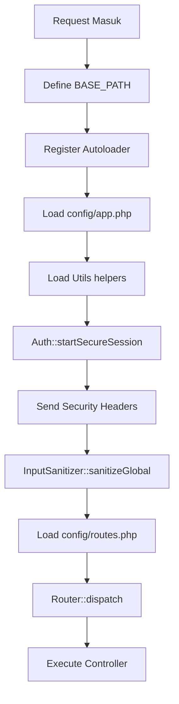
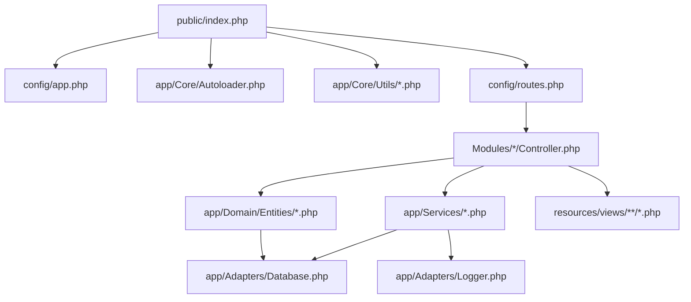

# Folder Blueprint - Struktur Folder dan Mapping Fungsi

## 1. Struktur Folder Lengkap

```mermaid
flowchart TD
    subgraph "Root: c:\xampp\htdocs\ppl\nora2.0\"
        R1[.htaccess]
        R2[database.sql]
        R3[public/]
        R4[app/]
        R5[modules/]
        R6[config/]
        R7[resources/]
        R8[storage/]
        R9[documentation/]
        R10[laporan/]
        R11[analisis_kritis/]
    end
    
    R3 --> P1[index.php]
    R3 --> P2[assets/]
    
    R4 --> A1[Core/]
    R4 --> A2[Domain/]
    R4 --> A3[Security/]
    R4 --> A4[Services/]
    R4 --> A5[Adapters/]
    
    R5 --> M1[Main/]
    R5 --> M2[Auth/]
    R5 --> M3[Dashboard/]
    R5 --> M4[CMS/]
    R5 --> M5[Finalisasi/]
    R5 --> M6[Media/]
    
    R6 --> C1[app.php]
    R6 --> C2[routes.php]
    
    R7 --> V1[views/]
    
    style R3 fill:#e1f5ff
    style R4 fill:#fff4e1
    style R5 fill:#e8f5e9
    style R6 fill:#fce4ec
    style R7 fill:#f3e5f5
```



---

## 2. Root Directory Files

### 2.1 File Konfigurasi Root

| File | Ukuran | Fungsi |
|------|--------|--------|
| `.htaccess` | ~100 bytes | URL rewriting ke /public |
| `database.sql` | 50+ KB | Complete database schema |
| `robots.txt` | ~500 bytes | SEO configuration |
| `sitemap.xml` | ~2 KB | SEO sitemap |

### 2.2 .htaccess (Root)

```apache
# URL Rewriting ke public folder
<IfModule mod_rewrite.c>
    RewriteEngine On
    RewriteRule ^public/ - [L]
    RewriteRule ^(.*)$ public/$1 [L]
</IfModule>
```

**Fungsi:** Semua request diarahkan ke folder `public/` untuk security (memisahkan public files dari application code)

---

## 3. Folder /public (Web Root)

### 3.1 Struktur

```
public/
├── .htaccess              # Security headers
├── index.php              # Front controller (entry point)
└── assets/
    ├── css/
    │   ├── auth.css
    │   ├── buttons.css
    │   ├── company-profile.css
    │   ├── dashboard.css
    │   ├── error.css
    │   ├── responsive.css
    │   └── tracking.css
    ├── images/
    │   └── img_*.jpg      # Uploaded CMS images
    └── js/
        ├── backups.js
        ├── company-profile.js
        ├── main.js
        ├── registrasi-detail.js
        ├── registrasi.js
        └── users.js
```

### 3.2 File Functions

| File | Fungsi |
|------|--------|
| `index.php` | Front controller - entry point semua request |
| `.htaccess` | Security headers, block direct access to certain files |
| `assets/css/*.css` | Styling untuk setiap section/modul |
| `assets/js/*.js` | Client-side interactivity |
| `assets/images/` | Uploaded images dengan secure naming |

### 3.3 Front Controller Lifecycle (public/index.php)



---

## 4. Folder /app (Application Core)

### 4.1 Struktur

```
app/
├── Adapters/
│   ├── Database.php           # Singleton PDO adapter
│   └── Logger.php             # Secure logger
├── Core/
│   ├── Autoloader.php         # PSR-4 autoloader
│   ├── Router.php             # Query-parameter router
│   ├── View.php               # XSS-safe view renderer
│   └── Utils/
│       ├── helpers.php        # Global helper functions
│       ├── security.php       # Security functions
│       ├── security_helpers.php
│       └── seo_helpers.php
├── Domain/
│   └── Entities/
│       ├── AuditLog.php
│       ├── CMSPage.php
│       ├── CMSPageSection.php
│       ├── CMSSectionContent.php
│       ├── CMSSectionItem.php
│       ├── Kendala.php
│       ├── Klien.php
│       ├── Layanan.php
│       ├── MessageTemplate.php
│       ├── NoteTemplate.php
│       ├── Registrasi.php
│       ├── RegistrasiHistory.php
│       └── User.php
├── Security/
│   ├── Auth.php               # Session & authentication
│   ├── CSRF.php               # CSRF protection
│   ├── InputSanitizer.php     # Input sanitization
│   ├── RateLimiter.php        # Rate limiting
│   └── RBAC.php               # Role-Based Access Control
└── Services/
    ├── BackupService.php
    ├── CMSEditorService.php
    ├── FinalisasiService.php
    ├── UserService.php
    └── WorkflowService.php
```

### 4.2 Mapping Fungsi per Subfolder

#### /app/Adapters/

| File | Class | Fungsi |
|------|-------|--------|
| `Database.php` | `Database` | Singleton PDO connection, prepared statements |
| `Logger.php` | `Logger` | Secure logging dengan PII redaction |

**Contoh Penggunaan:**
```php
// Database adapter
$db = Database::getInstance();
$stmt = $db->prepare("SELECT * FROM registrasi WHERE id = ?");
$stmt->execute([$id]);

// Logger
Logger::info('USER_LOGIN', ['user_id' => 1]);
Logger::error('DB_ERROR', ['error' => $e->getMessage()]);
```

#### /app/Core/

| File | Class/Function | Fungsi |
|------|----------------|--------|
| `Autoloader.php` | `Autoloader` | PSR-4 class autoloading |
| `Router.php` | `Router` | Query-parameter routing (?gate=xxx) |
| `View.php` | `View` | XSS-safe view rendering |
| `Utils/helpers.php` | Various | 40+ helper functions |
| `Utils/security.php` | Various | CSRF, session, rate limit |
| `Utils/security_helpers.php` | Various | Security headers |
| `Utils/seo_helpers.php` | Various | SEO meta generators |

#### /app/Domain/Entities/

| File | Class | Fungsi |
|------|-------|--------|
| `User.php` | `User` | User authentication & CRUD |
| `Klien.php` | `Klien` | Client management (getOrCreate pattern) |
| `Layanan.php` | `Layanan` | Service type management |
| `Registrasi.php` | `Registrasi` | Main registration CRUD |
| `RegistrasiHistory.php` | `RegistrasiHistory` | Immutable history ledger |
| `Kendala.php` | `Kendala` | Obstacle flag management |
| `AuditLog.php` | `AuditLog` | Security audit logging |
| `CMSPage.php` | `CMSPage` | CMS page entity |
| `MessageTemplate.php` | `MessageTemplate` | WhatsApp template entity |
| `NoteTemplate.php` | `NoteTemplate` | Internal note template entity |

#### /app/Security/

| File | Class | Fungsi |
|------|-------|--------|
| `Auth.php` | `Auth` | Session management, fingerprinting |
| `CSRF.php` | `CSRF` | Token generation/validation |
| `InputSanitizer.php` | `InputSanitizer` | Global input sanitization |
| `RateLimiter.php` | `RateLimiter` | File-based rate limiting |
| `RBAC.php` | `RBAC` | Role-Based Access Control |

#### /app/Services/

| File | Class | Fungsi |
|------|-------|--------|
| `UserService.php` | `UserService` | User CRUD dengan audit logging |
| `WorkflowService.php` | `WorkflowService` | Status transition engine |
| `FinalisasiService.php` | `FinalisasiService` | Case finalization logic |
| `CMSEditorService.php` | `CMSEditorService` | CMS content management |
| `BackupService.php` | `BackupService` | Database/site backups |

---

## 5. Folder /modules (Feature Modules)

### 5.1 Struktur

```
modules/
├── Auth/
│   └── Controller.php         # Login/logout
├── CMS/
│   └── Controller.php         # CMS editor
├── Dashboard/
│   └── Controller.php         # Main dashboard (821 lines)
├── Finalisasi/
│   └── Controller.php         # Case finalization
├── Main/
│   └── Controller.php         # Public homepage & tracking
└── Media/
    └── Controller.php         # Image upload
```

### 5.2 Module Functions

#### Main Controller (Public-Facing)
**File:** `modules/Main/Controller.php`

| Method | Route | Fungsi |
|--------|-------|--------|
| `home()` | `?gate=home` | Homepage company profile |
| `tracking()` | `?gate=lacak` | Tracking search page |
| `searchRegistrasiByNomor()` | POST `?gate=lacak` | Search by nomor |
| `verifyTracking()` | POST `?gate=verify_tracking` | Verify 4-digit HP |
| `showRegistrasi()` | GET `?gate=detail` | Public detail view (token) |
| `health()` | GET `?gate=health` | Health check endpoint |

#### Auth Controller
**File:** `modules/Auth/Controller.php`

| Method | Route | Fungsi |
|--------|-------|--------|
| `showLoginPage()` | GET `?gate=login` | Show login form |
| `login()` | POST `?gate=login` | Authentication handler |
| `logout()` | GET `?gate=logout` | Session destruction |

#### Dashboard Controller
**File:** `modules/Dashboard/Controller.php`

| Method | Route | Fungsi | Auth |
|--------|-------|--------|------|
| `index()` | `?gate=dashboard` | Dashboard home | Yes |
| `registrasi()` | `?gate=registrasi` | Registration list | Yes |
| `createRegistrasi()` | `?gate=registrasi_create` | Create form | Yes |
| `storeRegistrasi()` | POST `?gate=registrasi_store` | Store new | Yes |
| `showRegistrasi()` | `?gate=registrasi_detail` | Detail view | Yes |
| `updateStatus()` | POST `?gate=update_status` | Status update | Yes |
| `users()` | `?gate=users` | User management | Notaris only |
| `backups()` | `?gate=backups` | Backup management | Notaris only |
| `auditLogs()` | `?gate=audit` | Audit log viewer | Notaris only |

#### CMS Controller
**File:** `modules/CMS/Controller.php`

| Method | Route | Fungsi |
|--------|-------|--------|
| `index()` | `?gate=cms_editor` | CMS grid menu |
| `editHome()` | `?gate=cms_edit_home` | Edit homepage |
| `updateContent()` | POST `?gate=cms_update_content` | Update content |
| `saveMessageTemplate()` | POST `?gate=cms_save_message_tpl` | Save WA template |
| `addLayanan()` | POST `?gate=cms_add_layanan` | Add service |

#### Finalisasi Controller
**File:** `modules/Finalisasi/Controller.php`

| Method | Route | Fungsi |
|--------|-------|--------|
| `index()` | `?gate=finalisasi` | Finalized cases list |
| `tutupRegistrasi()` | POST `?gate=tutup_registrasi` | Close case |
| `reopen()` | POST `?gate=reopen_case` | Reopen case |

#### Media Controller
**File:** `modules/Media/Controller.php`

| Method | Route | Fungsi |
|--------|-------|--------|
| `upload()` | POST `?gate=cms_upload_image` | Upload image |
| `serve()` | Via `image.php` | Secure image serving |

---

## 6. Folder /config

### 6.1 Struktur

```
config/
├── .htaccess              # Directory protection
├── app.php                # Application configuration
└── routes.php             # Route registry
```

### 6.2 Configuration Details

#### app.php

**Konstanta Utama:**
```php
// Environment
APP_ENV = 'development'
APP_NAME = 'Notaris Sri Anah SH.M.Kn'
APP_VERSION = '1.1.1'

// Database
DB_HOST = 'localhost'
DB_NAME = 'norasblmupdate'
DB_USER = 'root'
DB_PASS = ''

// Status Workflow (14 status)
STATUS_DRAFT = 'draft'
STATUS_PEMBAYARAN_ADMIN = 'pembayaran_admin'
// ... (14 status total)

// Security
CSRF_TOKEN_NAME = 'csrf_token'
HASH_ALGO = 'bcrypt'
SESSION_LIFETIME = 7200

// Rate Limiting
RATE_LIMIT_REQUESTS = 10
RATE_LIMIT_WINDOW = 1 // minute
```

#### routes.php

**Route Registry:** 50+ routes dengan format:
```php
Router::add('gate_name', 'METHOD', [Controller::class, 'method'], [
    'auth' => true,
    'role' => 'notaris',
    'rateType' => 'tracking'
]);
```

---

## 7. Folder /resources/views

### 7.1 Struktur

```
resources/views/
├── auth/
│   ├── login.php
│   └── test_login.php
├── company_profile/
│   ├── home.php
│   ├── cms_helpers.php
│   └── partials/
│       ├── footer.php
│       ├── header_hero.php
│       └── ... (8 partials)
├── dashboard/
│   ├── index.php
│   ├── registrasi.php
│   ├── registrasi_create.php
│   ├── registrasi_detail.php
│   ├── users.php
│   ├── backups.php
│   ├── audit_logs.php
│   └── ... (15 files total)
├── public/
│   ├── tracking.php
│   └── registrasi_detail.php
├── errors/
│   ├── 403.php
│   └── error.php
└── templates/
    ├── header.php
    └── footer.php
```

### 7.2 View Functions

| Folder | Views | Purpose |
|--------|-------|---------|
| `auth/` | login.php | Authentication pages |
| `company_profile/` | home.php + partials | Public homepage |
| `dashboard/` | 15 files | Admin dashboard views |
| `public/` | tracking.php, detail.php | Public tracking views |
| `errors/` | 403.php, error.php | Error pages |
| `templates/` | header.php, footer.php | Layout components |

---

## 8. Folder /storage

### 8.1 Struktur

```
storage/
├── .htaccess              # Block direct access
├── cache/
│   ├── data/              # Data cache
│   └── ratelimit/         # Rate limit files (*.rl)
└── logs/
    ├── error.log          # Application errors
    └── security.log       # Security events
```

### 8.2 Security

- `.htaccess` blocks direct web access
- Logs writable by web server (775)
- Sensitive data stored outside web root

---

## 9. Folder /documentation

### 9.1 Files

| File | Size | Purpose |
|------|------|---------|
| `DOCS_RESMI.md` | ~1000 lines | Official 5-pillar documentation |
| `BUSINESS_LOGIC_LENGKAP.md` | 897 lines | Complete business logic |
| `DOKUMENTASI_SUPER_LENGKAP.md` | Extended | Extended docs |
| `bukupengguna.md` | User guide | End-user manual |
| `IMAGE_UPLOAD_SYSTEM.md` | Security docs | Image upload security |

---

## 10. Dependency Mapping

### 10.1 Request Flow Dependencies



### 10.2 Module Dependencies

| Module | Depends On |
|--------|------------|
| Dashboard | WorkflowService, UserService, BackupService |
| CMS | CMSEditorService, Layanan, MessageTemplate |
| Main | Registrasi, Klien, AuditLog |
| Auth | User, AuditLog |
| Finalisasi | FinalisasiService, Registrasi |
| Media | InputSanitizer, Filesystem |

---

## 11. File Size Analysis

| File | Estimated Lines | Category |
|------|-----------------|----------|
| `database.sql` | 1406 | Database Schema |
| `modules/Dashboard/Controller.php` | 821 | Controller |
| `app/Core/Utils/helpers.php` | 400+ | Utilities |
| `config/app.php` | 200+ | Configuration |
| `app/Security/Auth.php` | 250+ | Security |
| `app/Services/WorkflowService.php` | 300+ | Service |
| `documentation/DOCS_RESMI.md` | 1000+ | Documentation |

---

## 12. Kesimpulan

Struktur folder mengikuti prinsip:

1. **Separation of Concerns** - Pemisahan jelas antara public, application, modules
2. **Security First** - Sensitive files di luar web root
3. **MVC Pattern** - Model (Entities), View (resources), Controller (modules)
4. **Domain-Driven Design** - Business logic dalam Entities dan Services
5. **Maintainability** - Struktur terorganisir untuk easy navigation

Total file structure mendukung sistem production-ready dengan security, scalability, dan maintainability yang baik.
