# Module Interaction - Interaksi Modul dalam Sistem

## 1. Overview Module Interaction

Dokumen ini menjelaskan bagaimana modul-modul dalam Sistem Tracking Status Dokumen Notaris berinteraksi satu sama lain untuk membentuk sistem yang kohesif.

### 1.1 Module Architecture

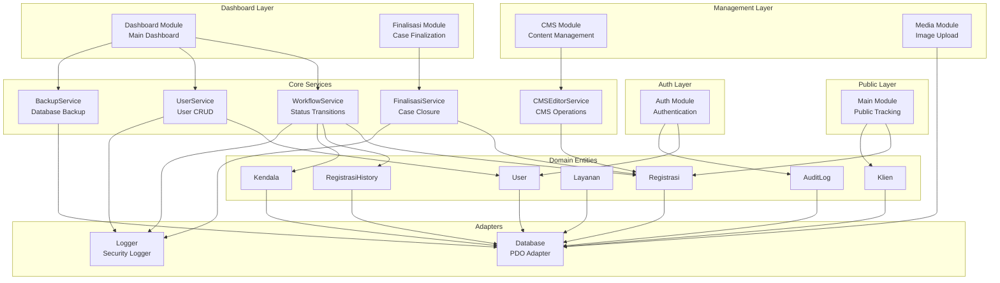

---

## 2. Module Dependencies

### 2.1 Main Module (Public-Facing)

**File:** `modules/Main/Controller.php`

**Dependencies:**
```php
namespace Modules\Main;

use App\Domain\Entities\Registrasi;
use App\Domain\Entities\Klien;
use App\Domain\Entities\AuditLog;
use App\Domain\Entities\RegistrasiHistory;

class Controller {
    private Registrasi $registrasiModel;
    private Klien $klienModel;
    private AuditLog $auditLogModel;
    
    public function __construct() {
        $this->registrasiModel = new Registrasi();
        $this->klienModel = new Klien();
        $this->auditLogModel = new AuditLog();
    }
    
    // Methods: home(), tracking(), searchRegistrasiByNomor(), 
    // verifyTracking(), showRegistrasi(), health()
}
```

**Interactions:**
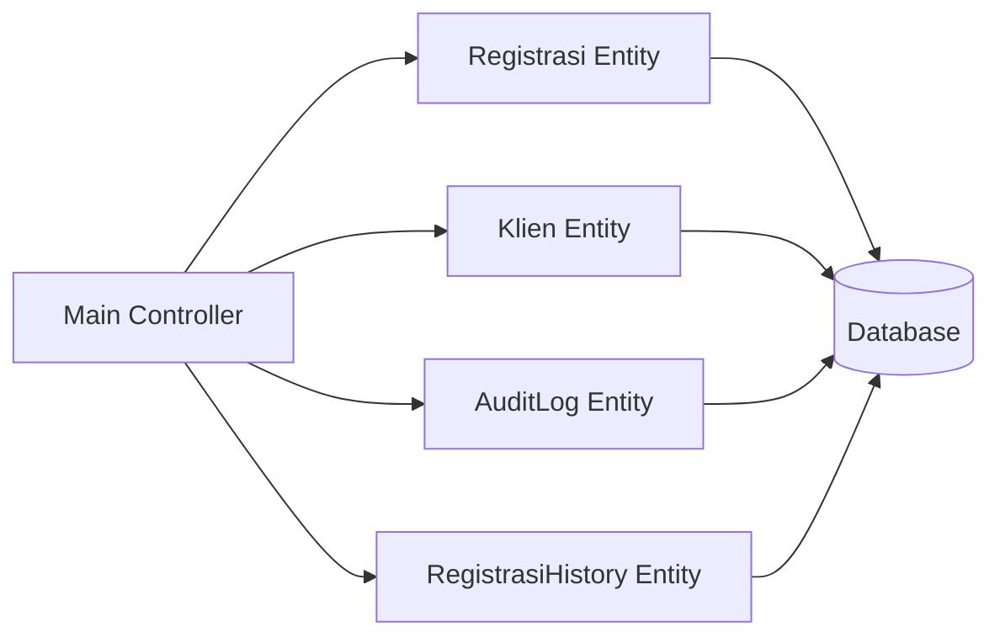

**Key Functions:**
- `home()` - Load homepage CMS content
- `tracking()` - Search registrasi by nomor
- `verifyTracking()` - Verify 4-digit phone code
- `showRegistrasi()` - Show detail with token validation

---

### 2.2 Auth Module

**File:** `modules/Auth/Controller.php`

**Dependencies:**
```php
namespace Modules\Auth;

use App\Domain\Entities\User;
use App\Domain\Entities\AuditLog;
use App\Security\Auth as AuthSecurity;
use App\Security\CSRF;
use App\Security\RateLimiter;

class Controller {
    public function login(): void {
        // Uses: User Entity, AuditLog, RateLimiter, CSRF
    }
    
    public function logout(): void {
        // Uses: AuthSecurity, AuditLog
    }
}
```

**Interactions:**
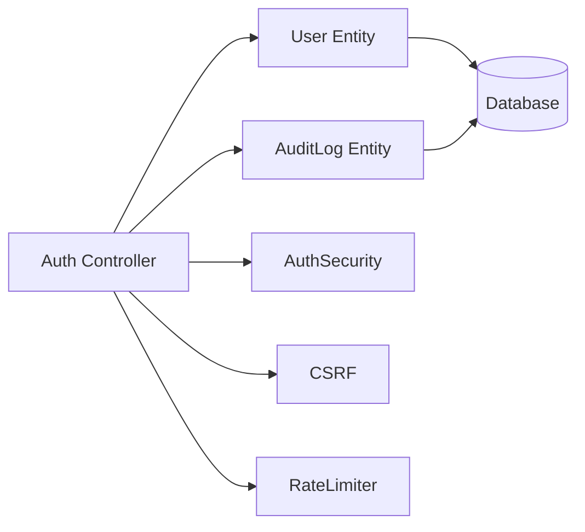

**Key Functions:**
- `showLoginPage()` - Display login form
- `login()` - Authenticate user
- `logout()` - Destroy session

---

### 2.3 Dashboard Module

**File:** `modules/Dashboard/Controller.php` (821 lines)

**Dependencies:**
```php
namespace Modules\Dashboard;

use App\Services\WorkflowService;
use App\Services\UserService;
use App\Services\BackupService;
use App\Domain\Entities\Registrasi;
use App\Domain\Entities\Klien;
use App\Domain\Entities\Layanan;
use App\Domain\Entities\AuditLog;
use App\Security\RBAC;

class Controller {
    private WorkflowService $workflowService;
    private UserService $userService;
    private BackupService $backupService;
    
    public function __construct() {
        $this->workflowService = new WorkflowService();
        $this->userService = new UserService();
        $this->backupService = new BackupService();
    }
    
    // 15+ methods for dashboard operations
}
```

**Interactions:**
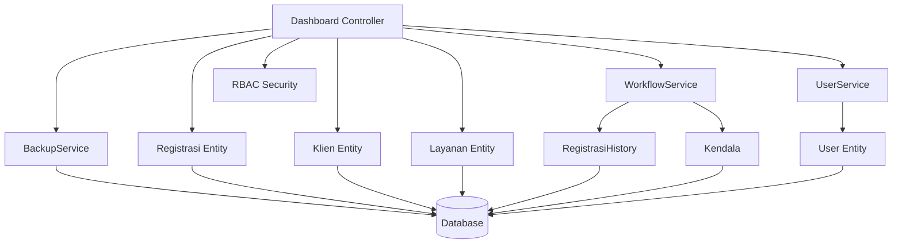

**Key Functions:**
- `index()` - Dashboard home with statistics
- `registrasi()` - Registration list with filters
- `createRegistrasi()` / `storeRegistrasi()` - Create new registration
- `showRegistrasi()` - Registration detail view
- `updateStatus()` - Update status (uses WorkflowService)
- `updateKlien()` - Update client data
- `toggleKendala()` - Toggle obstacle flag
- `toggleLock()` - Lock/unlock registration
- `users()` - User management (notaris only)
- `backups()` - Backup management (notaris only)
- `auditLogs()` - Audit log viewer (notaris only)

---

### 2.4 Finalisasi Module

**File:** `modules/Finalisasi/Controller.php`

**Dependencies:**
```php
namespace Modules\Finalisasi;

use App\Services\FinalisasiService;
use App\Domain\Entities\Registrasi;
use App\Security\RBAC;

class Controller {
    private FinalisasiService $finalisasiService;
    
    public function __construct() {
        $this->finalisasiService = new FinalisasiService();
    }
}
```

**Interactions:**
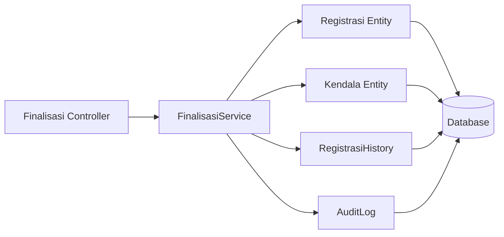

**Key Functions:**
- `index()` - List finalized cases
- `tutupRegistrasi()` - Close case (status → ditutup)
- `reopen()` - Reopen finalized case

---

### 2.5 CMS Module

**File:** `modules/CMS/Controller.php`

**Dependencies:**
```php
namespace Modules\CMS;

use App\Services\CMSEditorService;
use App\Domain\Entities\Layanan;
use App\Domain\Entities\MessageTemplate;
use App\Domain\Entities\NoteTemplate;
use App\Security\RBAC;

class Controller {
    private CMSEditorService $cmsService;
    
    public function __construct() {
        $this->cmsService = new CMSEditorService();
    }
}
```

**Interactions:**
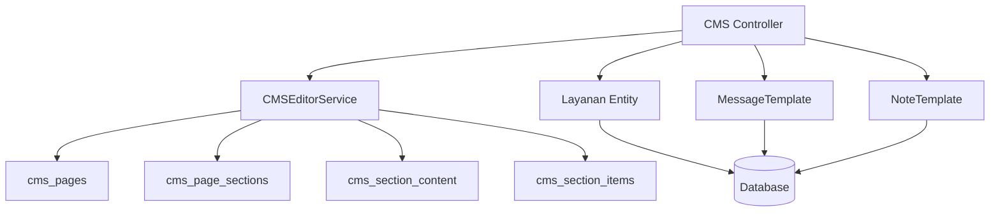

**Key Functions:**
- `index()` - CMS grid menu
- `editHome()` - Edit homepage content
- `editLayananPage()` - Edit services page
- `updateContent()` - Update CMS content
- `updateItem()` - Update CMS items
- `saveMessageTemplate()` - Save WhatsApp template
- `saveNoteTemplate()` - Save internal note template
- `addLayanan()` / `updateLayanan()` / `deleteLayanan()` - Service CRUD
- `saveAppSettings()` - Save application settings

---

### 2.6 Media Module

**File:** `modules/Media/Controller.php`

**Dependencies:**
```php
namespace Modules\Media;

use App\Security\RBAC;
use App\Security\InputSanitizer;

class Controller {
    public function upload(): void {
        // Handle image upload with validation
    }
    
    public function serve(): void {
        // Secure image serving via image.php
    }
}
```

**Interactions:**
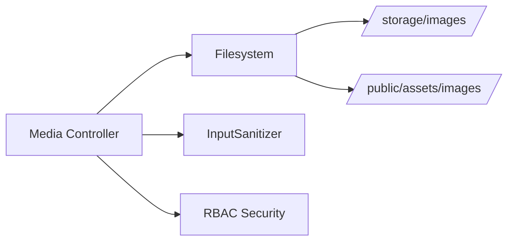

**Key Functions:**
- `upload()` - Upload image (max 5MB, jpg/jpeg/png/pdf)
- `serve()` - Secure image serving with token validation

---

## 3. Service Layer Interactions

### 3.1 WorkflowService

**File:** `app/Services/WorkflowService.php`

**Dependencies:**
```php
namespace App\Services;

use App\Domain\Entities\Registrasi;
use App\Domain\Entities\Kendala;
use App\Domain\Entities\AuditLog;
use App\Domain\Entities\RegistrasiHistory;
use App\Domain\Entities\User;

class WorkflowService {
    private Registrasi $registrasiModel;
    private Kendala $kendalaModel;
    private AuditLog $auditLogModel;
    private RegistrasiHistory $registrasiHistoryModel;
    private User $userModel;
    
    public function __construct() {
        $this->registrasiModel = new Registrasi();
        $this->kendalaModel = new Kendala();
        $this->auditLogModel = new AuditLog();
        $this->registrasiHistoryModel = new RegistrasiHistory();
        $this->userModel = new User();
    }
}
```

**Method Interactions:**
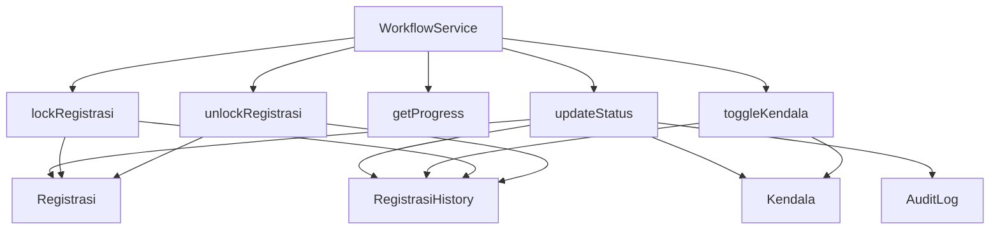

**Key Methods:**
- `updateStatus()` - Update status with validation + history logging
- `toggleKendala()` - Toggle obstacle flag
- `getProgress()` - Get progress tracking data
- `lockRegistrasi()` / `unlockRegistrasi()` - Lock/unlock registration

---

### 3.2 UserService

**File:** `app/Services/UserService.php`

**Dependencies:**
```php
namespace App\Services;

use App\Domain\Entities\User;
use App\Domain\Entities\AuditLog;

class UserService {
    private User $userModel;
    private AuditLog $auditLogModel;
    
    public function create(array $data): int {
        // Create user with audit logging
    }
    
    public function update(int $id, array $data): bool {
        // Update user with audit logging
    }
    
    public function delete(int $id): bool {
        // Delete user with audit logging
    }
}
```

---

### 3.3 FinalisasiService

**File:** `app/Services/FinalisasiService.php`

**Dependencies:**
```php
namespace App\Services;

use App\Domain\Entities\Registrasi;
use App\Domain\Entities\Kendala;
use App\Domain\Entities\RegistrasiHistory;
use App\Domain\Entities\AuditLog;

class FinalisasiService {
    public function tutupRegistrasi(int $id, int $userId, string $role, ?string $notes = null): array {
        // Close case with full audit trail
    }
    
    public function reopen(int $id, int $userId, string $role): array {
        // Reopen closed case
    }
}
```

---

### 3.4 CMSEditorService

**File:** `app/Services/CMSEditorService.php`

**Dependencies:**
```php
namespace App\Services;

use App\Domain\Entities\CMSPage;
use App\Domain\Entities\CMSPageSection;
use App\Domain\Entities\CMSSectionContent;
use App\Domain\Entities\CMSSectionItem;

class CMSEditorService {
    public function updateContent(int $sectionId, array $content): bool {
        // Update CMS section content
    }
    
    public function updateItem(int $itemId, array $data): bool {
        // Update CMS item
    }
}
```

---

## 4. Entity Layer Interactions

### 4.1 Registrasi Entity

**File:** `app/Domain/Entities/Registrasi.php`

**Database Interactions:**
```php
class Registrasi {
    public function findById(int $id): ?array {
        // SELECT with JOINs to klien and layanan
    }
    
    public function findByNomorRegistrasi(string $nomor): ?array {
        // SELECT WHERE nomor_registrasi = ?
    }
    
    public function create(array $data): int {
        // INSERT INTO registrasi
    }
    
    public function updateStatus(int $id, string $status, ...): bool {
        // UPDATE registrasi SET status = ?
    }
    
    public function update(int $id, array $data): bool {
        // UPDATE registrasi SET ...
    }
}
```

**Relationships:**
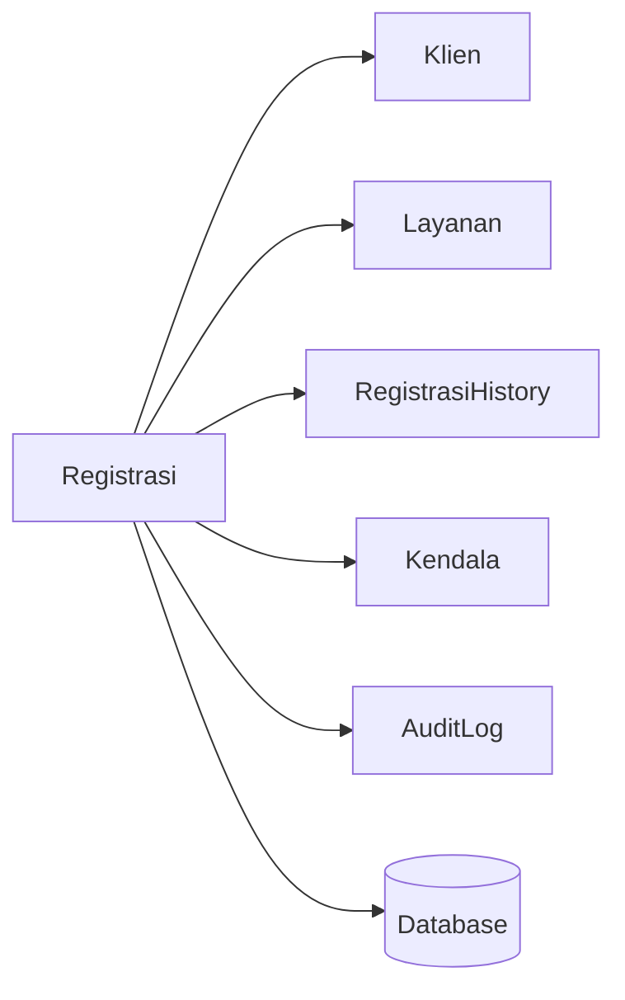

---

### 4.2 Klien Entity

**GetOrCreate Pattern:**
```php
class Klien {
    public function getOrCreate(string $nama, string $hp, ?string $email = null): int {
        $existing = $this->findByHp($hp);
        if ($existing) {
            return $existing['id']; // Reuse existing
        }
        return $this->create(['nama' => $nama, 'hp' => $hp, 'email' => $email]);
    }
}
```

---

### 4.3 User Entity

**Authentication:**
```php
class User {
    public function attemptLogin(string $username, string $password): bool {
        $user = $this->findByUsername($username);
        if (!$user) return false;
        
        if (!password_verify($password, $user['password_hash'])) {
            return false;
        }
        
        Auth::createSession([
            'user_id' => $user['id'],
            'username' => $user['username'],
            'role' => $user['role'],
        ]);
        
        return true;
    }
}
```

---

## 5. Adapter Layer

### 5.1 Database Adapter

**File:** `app/Adapters/Database.php`

**Singleton Pattern:**
```php
class Database {
    private static ?PDO $instance = null;
    
    public static function getInstance(): PDO {
        if (self::$instance === null) {
            self::$instance = new PDO(
                "mysql:host=" . DB_HOST . ";dbname=" . DB_NAME,
                DB_USER,
                DB_PASS,
                [PDO::ATTR_ERRMODE => PDO::ERRMODE_EXCEPTION]
            );
        }
        return self::$instance;
    }
    
    public static function selectOne(string $sql, array $params = []): ?array {
        $stmt = self::prepare($sql);
        $stmt->execute($params);
        return $stmt->fetch(PDO::FETCH_ASSOC) ?: null;
    }
    
    public static function select(string $sql, array $params = []): array {
        $stmt = self::prepare($sql);
        $stmt->execute($params);
        return $stmt->fetchAll(PDO::FETCH_ASSOC);
    }
    
    public static function insert(string $sql, array $params = []): int {
        self::execute($sql, $params);
        return (int) self::getInstance()->lastInsertId();
    }
    
    public static function execute(string $sql, array $params = []): void {
        $stmt = self::prepare($sql);
        $stmt->execute($params);
    }
}
```

**All Entities Use Database Adapter:**
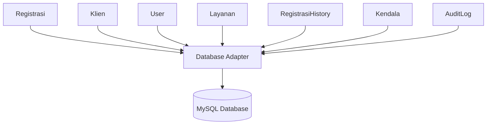

---

### 5.2 Logger Adapter

**File:** `app/Adapters/Logger.php`

**Logging Methods:**
```php
class Logger {
    public static function info(string $action, array $context = []): void {
        self::log('INFO', $action, $context);
    }
    
    public static function error(string $action, array $context = []): void {
        self::log('ERROR', $action, $context);
    }
    
    public static function security(string $action, array $context = []): void {
        self::log('SECURITY', $action, $context);
        // Also write to security.log
    }
    
    private static function log(string $level, string $action, array $context): void {
        $logEntry = [
            'timestamp' => date('Y-m-d H:i:s'),
            'level' => $level,
            'action' => $action,
            'context' => $context,
        ];
        
        file_put_contents(
            LOGS_PATH . '/error.log',
            json_encode($logEntry) . PHP_EOL,
            FILE_APPEND
        );
    }
}
```

---

## 6. Complete Request Flow Example

### 6.1 Update Status Flow

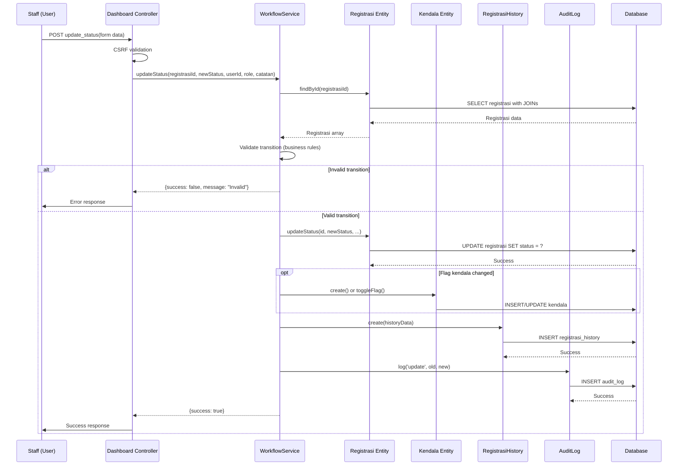

---

## 7. Module Communication Summary

### 7.1 Dependency Matrix

| Module | Main | Auth | Dashboard | Finalisasi | CMS | Media |
|--------|------|------|-----------|------------|-----|-------|
| **Main** | - | - | - | - | - | - |
| **Auth** | - | - | - | - | - | - |
| **Dashboard** | - | ✓ (auth check) | - | ✓ | - | - |
| **Finalisasi** | - | ✓ (auth check) | - | - | - | - |
| **CMS** | ✓ (content) | ✓ (auth check) | - | - | - | ✓ (upload) |
| **Media** | - | ✓ (auth check) | - | - | ✓ | - |

### 7.2 Service Usage Matrix

| Service | Main | Auth | Dashboard | Finalisasi | CMS |
|---------|------|------|-----------|------------|-----|
| WorkflowService | - | - | ✓ | ✓ | - |
| UserService | - | - | ✓ | - | - |
| BackupService | - | - | ✓ | - | - |
| CMSEditorService | - | - | - | - | ✓ |
| FinalisasiService | - | - | - | ✓ | - |

---

## 8. Kesimpulan

Module interaction dalam sistem ini mengikuti prinsip:

1. **Separation of Concerns** - Each module has clear responsibility
2. **Dependency Injection** - Services injected via constructor
3. **Service Layer Pattern** - Business logic isolated in Services
4. **Repository Pattern** - Data access encapsulated in Entities
5. **Adapter Pattern** - Database/Logger abstracted via Adapters
6. **Loose Coupling** - Modules communicate through well-defined interfaces

Architecture ini memastikan:
- **Maintainability** - Easy to modify individual modules
- **Testability** - Modules can be tested in isolation
- **Scalability** - Easy to add new modules
- **Reusability** - Services can be used by multiple modules
