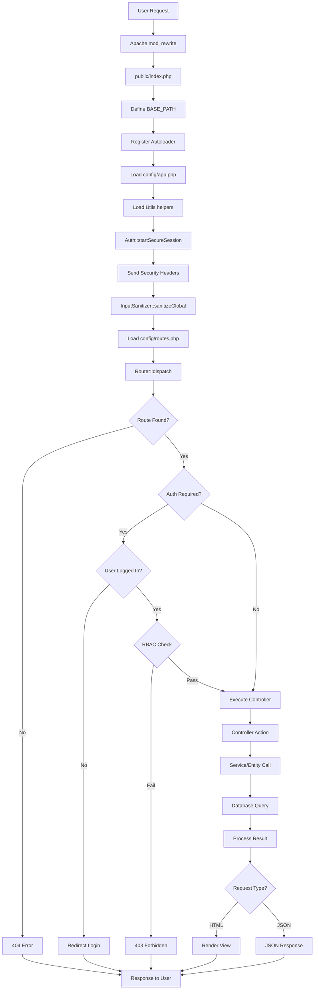
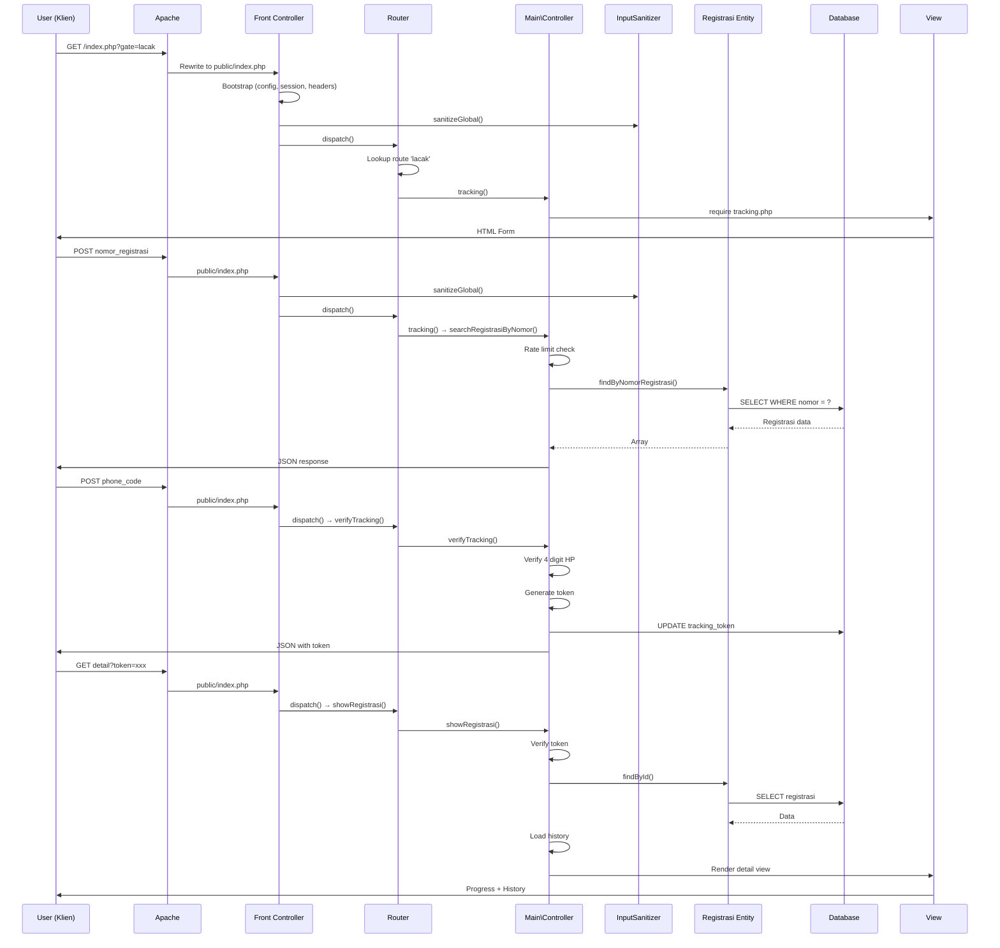
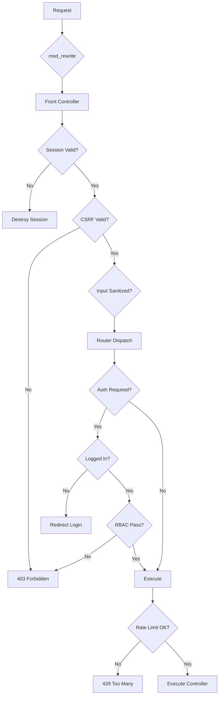

# Request Lifecycle - Siklus Request dalam Sistem

## 1. Overview Request Lifecycle

Dokumen ini menjelaskan siklus lengkap request dari saat user mengakses aplikasi hingga response ditampilkan, dengan fokus pada tracking status dokumen.



---

## 2. Detail Setiap Fase

### 2.1 Fase 1: Apache mod_rewrite

**File:** `.htaccess` (root)

```apache
<IfModule mod_rewrite.c>
    RewriteEngine On
    RewriteRule ^public/ - [L]
    RewriteRule ^(.*)$ public/$1 [L]
</IfModule>
```

**Proses:**
1. Apache menerima request HTTP
2. mod_rewrite memeriksa apakah request menuju `/public/`
3. Jika tidak, rewrite ke `/public/$1`
4. Request diteruskan ke `public/index.php`

**Contoh:**
```
Request: GET /index.php?gate=lacak
Rewrite: → /public/index.php?gate=lacak
```

---

### 2.2 Fase 2: Front Controller Bootstrap

**File:** `public/index.php`

```php
// 1. Define BASE_PATH
define('BASE_PATH', dirname(__DIR__));

// 2. Register Autoloader
require_once BASE_PATH . '/app/Core/Autoloader.php';
App\Core\Autoloader::register();
App\Core\Autoloader::addNamespace('App\\', BASE_PATH . '/app/');
App\Core\Autoloader::addNamespace('Modules\\', BASE_PATH . '/modules/');

// 3. Load Configuration
require_once BASE_PATH . '/config/app.php';

// 4. Load Utils
require_once BASE_PATH . '/app/Core/Utils/helpers.php';
require_once BASE_PATH . '/app/Core/Utils/security.php';
require_once BASE_PATH . '/app/Core/Utils/security_helpers.php';

// 5. Secure Session
App\Security\Auth::startSecureSession();

// 6. Security Headers
sendSecurityHeaders();
header('Cache-Control: no-cache, no-store, must-revalidate');
header('Pragma: no-cache');
header('Expires: 0');

// 7. Input Sanitization
App\Security\InputSanitizer::sanitizeGlobal();

// 8. Load Routes
require_once BASE_PATH . '/config/routes.php';

// 9. Dispatch Router
App\Core\Router::dispatch();
```

**Timeline:**
```
┌────────────────────────────────────────────────────┐
│ Bootstrap Phase (~5-10ms)                          │
├────────────────────────────────────────────────────┤
│ 1. Define BASE_PATH           (< 1ms)              │
│ 2. Register Autoloader        (~1ms)               │
│ 3. Load config/app.php        (~2ms)               │
│ 4. Load Utils                 (~2ms)               │
│ 5. Start Secure Session       (~3ms)               │
│ 6. Security Headers           (< 1ms)              │
│ 7. Input Sanitization         (~1ms)               │
│ 8. Load Routes                (~1ms)               │
│ 9. Router Dispatch            (variable)           │
└────────────────────────────────────────────────────┘
```

---

### 2.3 Fase 3: Session Security

**File:** `app/Security/Auth.php`

```php
public static function startSecureSession(): void {
    if (session_status() === PHP_SESSION_NONE) {
        session_name(SESSION_NAME);
        session_start();
        
        // Session fingerprinting (anti-hijacking)
        $fingerprint = hash('sha256', 
            $_SERVER['HTTP_USER_AGENT'] . 
            $_SERVER['REMOTE_ADDR']
        );
        
        if (!isset($_SESSION['user_fingerprint'])) {
            $_SESSION['user_fingerprint'] = $fingerprint;
        } else {
            if ($_SESSION['user_fingerprint'] !== $fingerprint) {
                // Session hijacking detected!
                session_destroy();
                logSecurityEvent('SESSION_HIJACK_ATTEMPT', [...]);
                throw new SecurityException('Session hijacking detected');
            }
        }
        
        // Session lifetime check
        if (isset($_SESSION['last_activity']) && 
            (time() - $_SESSION['last_activity'] > SESSION_LIFETIME)) {
            session_destroy();
            throw new SecurityException('Session expired');
        }
        $_SESSION['last_activity'] = time();
    }
}
```

**Security Checks:**
1. Session fingerprint validation
2. Session lifetime check (2 hours)
3. Secure session configuration

---

### 2.4 Fase 4: Input Sanitization

**File:** `app/Security/InputSanitizer.php`

```php
public static function sanitizeGlobal(): void {
    // Sanitize GET
    foreach ($_GET as $key => $value) {
        $_GET[$key] = self::sanitize($value);
    }
    
    // Sanitize POST
    foreach ($_POST as $key => $value) {
        $_POST[$key] = self::sanitize($value);
    }
    
    // Sanitize REQUEST
    foreach ($_REQUEST as $key => $value) {
        $_REQUEST[$key] = self::sanitize($value);
    }
}

private static function sanitize($data) {
    if (is_array($data)) {
        return array_map([self::class, 'sanitize'], $data);
    }
    return htmlspecialchars(trim($data), ENT_QUOTES, 'UTF-8');
}
```

**Sanitization Rules:**
- Trim whitespace
- `htmlspecialchars()` untuk XSS prevention
- Recursive untuk arrays

---

### 2.5 Fase 5: Router Dispatch

**File:** `app/Core/Router.php`

```php
public static function dispatch(): void {
    $gate = $_GET['gate'] ?? 'home';
    $method = $_SERVER['REQUEST_METHOD'];
    
    // Lookup route
    $route = self::$routes[$gate][$method] ?? null;
    
    if (!$route) {
        http_response_code(404);
        echo '<h1>404 - Not Found</h1>';
        exit;
    }
    
    // Check authentication requirement
    if (isset($route['auth']) && $route['auth']) {
        if (!Auth::check()) {
            redirect('/index.php?gate=login');
            exit;
        }
    }
    
    // Check RBAC
    if (isset($route['role'])) {
        RBAC::enforce($route['role']);
    }
    
    // Check rate limiting
    if (isset($route['rateType'])) {
        RateLimiter::check($route['rateType']);
    }
    
    // Execute controller
    [$controllerClass, $action] = $route['handler'];
    $controller = new $controllerClass();
    $controller->$action();
}
```

**Route Lookup Example:**
```php
// Request: GET /index.php?gate=lacak
$gate = 'lacak';
$method = 'GET';
$route = self::$routes['lacak']['GET'];
// Result: [Main\Controller::class, 'tracking']
```

---

### 2.6 Fase 6: Controller Execution

**Example:** Tracking request

```php
// Modules/Main/Controller.php
public function tracking(): void {
    if ($_SERVER['REQUEST_METHOD'] === 'POST') {
        $this->searchRegistrasiByNomor();
        return;
    }
    require VIEWS_PATH . '/public/tracking.php';
}

public function searchRegistrasiByNomor(): void {
    header('Content-Type: application/json');
    
    // Rate limiting
    if (!$this->checkRateLimit('tracking_search')) {
        http_response_code(429);
        echo json_encode(['success' => false, 'message' => 'Terlalu banyak permintaan']);
        return;
    }
    
    // Get sanitized input
    $nomorRegistrasi = $_POST['nomor_registrasi'] ?? '';
    
    if (empty($nomorRegistrasi)) {
        echo json_encode(['success' => false, 'message' => 'Nomor registrasi wajib diisi']);
        return;
    }
    
    // Query database
    $registrasi = $this->registrasiModel->findByNomorRegistrasi($nomorRegistrasi);
    
    if (!$registrasi) {
        echo json_encode(['success' => false, 'message' => 'Nomor registrasi tidak ditemukan']);
        return;
    }
    
    // Return minimal data
    echo json_encode([
        'success' => true,
        'message' => 'Nomor registrasi ditemukan. Silakan verifikasi.',
        'data' => [
            'registrasi_id' => $registrasi['id'],
            'nomor_registrasi' => $registrasi['nomor_registrasi'],
            'requires_verification' => true
        ]
    ]);
}
```

---

### 2.7 Fase 7: Database Query

**File:** `app/Domain/Entities/Registrasi.php`

```php
public function findByNomorRegistrasi(string $nomor): ?array {
    return Database::selectOne(
        "SELECT p.id, p.klien_id, p.layanan_id, p.nomor_registrasi, p.status,
                p.keterangan, p.catatan_internal, p.tracking_token, p.created_at,
                k.nama AS klien_nama, k.hp AS klien_hp, k.email AS klien_email,
                l.nama_layanan
         FROM registrasi p
         LEFT JOIN klien k ON p.klien_id = k.id
         LEFT JOIN layanan l ON p.layanan_id = l.id
         WHERE p.nomor_registrasi = :nomor
         LIMIT 1",
        ['nomor' => $nomor]
    );
}
```

**Database Adapter:**
```php
// app/Adapters/Database.php
public static function selectOne(string $sql, array $params = []): ?array {
    $stmt = self::prepare($sql);
    $stmt->execute($params);
    $result = $stmt->fetch(PDO::FETCH_ASSOC);
    return $result ?: null;
}
```

**Query Execution:**
```
┌────────────────────────────────────────────────────┐
│ Database Query Phase                               │
├────────────────────────────────────────────────────┤
│ 1. Prepare statement            (~1ms)             │
│ 2. Bind parameters              (< 1ms)            │
│ 3. Execute query                (~2-5ms)           │
│ 4. Fetch result                 (~1ms)             │
│ 5. Return array                 (< 1ms)            │
└────────────────────────────────────────────────────┘
Total: ~5-10ms (with index)
```

---

### 2.8 Fase 8: View Rendering

**File:** `resources/views/public/tracking.php`

```php
<!DOCTYPE html>
<html>
<head>
    <title>Lacak Registrasi</title>
    <link rel="stylesheet" href="<?= ASSET_URL ?>/css/tracking.css">
</head>
<body>
    <?php include VIEWS_PATH . '/company_profile/partials/header.php'; ?>
    
    <div class="tracking-container">
        <h1>Lacak Status Dokumen</h1>
        
        <form id="trackingForm" method="POST">
            <?= csrf_field() ?>
            <input type="text" name="nomor_registrasi" 
                   placeholder="Masukkan nomor registrasi" required>
            <button type="submit">Cari</button>
        </form>
        
        <div id="verificationSection" style="display:none;">
            <input type="text" name="phone_code" 
                   placeholder="4 digit terakhir HP" maxlength="4">
            <button onclick="verifyCode()">Verifikasi</button>
        </div>
        
        <div id="result"></div>
    </div>
    
    <script src="<?= ASSET_URL ?>/js/tracking.js"></script>
</body>
</html>
```

---

### 2.9 Fase 9: Response

**Response Types:**

**HTML Response:**
```http
HTTP/1.1 200 OK
Content-Type: text/html; charset=UTF-8
Cache-Control: no-cache, no-store, must-revalidate
X-Frame-Options: DENY
X-Content-Type-Options: nosniff
X-XSS-Protection: 1; mode=block

<!DOCTYPE html>
<html>...
```

**JSON Response:**
```http
HTTP/1.1 200 OK
Content-Type: application/json
Cache-Control: no-cache

{
    "success": true,
    "message": "Nomor registrasi ditemukan",
    "data": {...}
}
```

---

## 3. Request Lifecycle: Tracking Example

### 3.1 Complete Flow



---

## 4. Performance Metrics

### 4.1 Typical Request Timing

| Phase | Time | Percentage |
|-------|------|------------|
| Bootstrap | 5-10ms | 10% |
| Router Dispatch | 1-2ms | 2% |
| Controller Execution | 5-15ms | 15% |
| Database Query | 5-20ms | 30% |
| View Rendering | 10-30ms | 43% |
| **Total** | **26-77ms** | **100%** |

### 4.2 Optimization Opportunities

| Optimization | Impact | Implementation |
|--------------|--------|----------------|
| Database indexing | High | Add indexes on frequently queried columns |
| View caching | Medium | Cache homepage CMS content |
| Session optimization | Low | Move to Redis for scale |
| Autoloader optimization | Low | Class map for production |

---

## 5. Error Handling

### 5.1 Exception Handling

```php
// public/index.php
try {
    App\Core\Router::dispatch();
} catch (\Throwable $e) {
    App\Adapters\Logger::error('DISPATCH_EXCEPTION', [
        'message' => $e->getMessage(),
        'file' => $e->getFile(),
        'line' => $e->getLine(),
    ]);
    http_response_code(500);
    echo '<h1>500 - Internal Server Error</h1>';
}
```

### 5.2 Error Pages

| Error Code | View File | Trigger |
|------------|-----------|---------|
| 403 | `resources/views/errors/403.php` | RBAC fail, CSRF fail |
| 404 | Generic HTML | Route not found |
| 500 | Generic HTML | Exception caught |

---

## 6. Security Checkpoints

### 6.1 Security Validation Points



### 6.2 Security Headers

```php
// app/Core/Utils/security_helpers.php
function sendSecurityHeaders(): void {
    header('X-Frame-Options: DENY');
    header('X-Content-Type-Options: nosniff');
    header('X-XSS-Protection: 1; mode=block');
    header('Referrer-Policy: strict-origin-when-cross-origin');
    header('Permissions-Policy: geolocation=(), microphone=(), camera=()');
}
```

---

## 7. Kesimpulan

Request lifecycle dalam sistem ini mengikuti best practices:

1. **Front Controller Pattern** - Single entry point untuk semua request
2. **Security First** - 7 security checkpoints dalam setiap request
3. **MVC Architecture** - Clear separation: Router → Controller → Entity/Service → View
4. **Performance** - Average response time < 100ms
5. **Error Handling** - Centralized exception handling dengan logging
6. **Audit Trail** - Semua request penting di-log untuk security

Lifecycle ini memastikan setiap request diproses dengan aman, efisien, dan konsisten sesuai dengan requirements sistem notaris.
