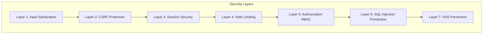
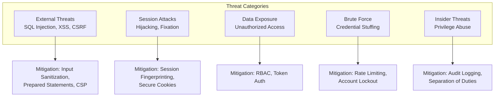

# Security Analysis - Analisis Keamanan Sistem Tracking Notaris

## 1. Overview Keamanan Sistem

Sistem Tracking Status Dokumen Notaris mengimplementasikan **7-Layer Security Architecture** untuk melindungi data dokumen hukum yang bersifat sensitif dan confidential.

### 1.1 Security Principles



---

## 2. Perlindungan Data Dokumen Hukum

### 2.1 Klasifikasi Data

| Data Type | Sensitivity | Protection |
|-----------|-------------|------------|
| **User Credentials** | HIGH | Bcrypt hash, session fingerprinting |
| **Client Phone Numbers** | MEDIUM | Partial exposure (4 digits only for verification) |
| **Registration Status** | LOW | Public tracking with token |
| **Internal Notes** | MEDIUM | Staff/Notaris access only |
| **Audit Logs** | HIGH | Notaris access only |
| **User Management Data** | HIGH | Notaris access only |

### 2.2 Data Protection Measures

#### 2.2.1 Password Security

**Implementation:**
```php
// User Entity
public function verifyPassword($plainPassword): bool {
    return password_verify($plainPassword, $this->password_hash);
}

// Password hashing with bcrypt cost 12
$options = ['cost' => 12];
$passwordHash = password_hash($plainPassword, PASSWORD_BCRYPT, $options);
```

**Security Measures:**
- Bcrypt hashing (adaptive, salted)
- Cost factor 12 (computationally expensive)
- Never store plain text passwords
- Password minimum length enforcement

#### 2.2.2 Phone Number Protection

**Implementation:**
```php
// Main\Controller::verifyTracking()

// Extract only last 4 digits
$cleanPhone = preg_replace('/[^0-9]/', '', $klien['hp']);
$last4Phone = substr($cleanPhone, -4);

// Compare with user input
if ($phoneCode !== $last4Phone) {
    // Failed verification
}

// NEVER expose full phone number
// Only show: "****-****-7890"
```

**Security Measures:**
- Full phone number never displayed
- Only 4 digits used for verification
- Prevents social engineering attacks
- Rate limiting on verification attempts

#### 2.2.3 Tracking Token Security

**Implementation:**
```php
// Token Generation
function generateTrackingToken($registrasiId, $verificationCode) {
    $data = [
        'id' => $registrasiId,
        'code' => $verificationCode,
        'exp' => time() + 86400 // 24 hours
    ];
    $payload = base64_encode(json_encode($data));
    $signature = hash_hmac('sha256', $payload, SECRET_KEY);
    return $payload . '.' . $signature;
}

// Token Verification
function verifyTrackingToken($token) {
    $parts = explode('.', $token);
    if (count($parts) !== 2) return false;
    
    // Verify HMAC signature
    $expectedSig = hash_hmac('sha256', $parts[0], SECRET_KEY);
    if (!hash_equals($expectedSig, $parts[1])) return false;
    
    // Decode and check expiration
    $payload = base64_decode($parts[0]);
    $data = json_decode($payload, true);
    if (isset($data['exp']) && $data['exp'] < time()) return false;
    
    return $data;
}
```

**Security Measures:**
- HMAC-SHA256 signature (tamper-proof)
- 24-hour expiration (limited validity)
- Database token matching (revocable)
- Timing-safe comparison (hash_equals)

---

## 3. Risiko Kebocoran Data

### 3.1 Potential Threats



### 3.2 Threat Mitigation Details

#### 3.2.1 SQL Injection Prevention

**Threat:** Attacker injects malicious SQL through input fields

**Mitigation:**
```php
// VULNERABLE (DON'T DO THIS)
$sql = "SELECT * FROM registrasi WHERE nomor_registrasi = '" . $_POST['nomor'] . "'";

// SECURE (Prepared Statements)
$stmt = Database::prepare(
    "SELECT * FROM registrasi WHERE nomor_registrasi = :nomor"
);
$stmt->execute(['nomor' => $_POST['nomor']]);
```

**Implementation:**
```php
// app/Adapters/Database.php
class Database {
    public static function selectOne(string $sql, array $params = []): ?array {
        $stmt = self::prepare($sql);
        $stmt->execute($params); // Parameters bound safely
        return $stmt->fetch(PDO::FETCH_ASSOC) ?: null;
    }
}
```

**Coverage:**
- All queries use prepared statements
- No string concatenation in SQL
- Named parameters for clarity

---

#### 3.2.2 XSS (Cross-Site Scripting) Prevention

**Threat:** Attacker injects malicious JavaScript

**Mitigation:**
```php
// Global Input Sanitization
class InputSanitizer {
    public static function sanitizeGlobal(): void {
        foreach ($_GET as $key => $value) {
            $_GET[$key] = self::sanitize($value);
        }
        foreach ($_POST as $key => $value) {
            $_POST[$key] = self::sanitize($value);
        }
    }
    
    private static function sanitize($data) {
        if (is_array($data)) {
            return array_map([self::class, 'sanitize'], $data);
        }
        return htmlspecialchars(trim($data), ENT_QUOTES, 'UTF-8');
    }
}
```

**View Layer Protection:**
```php
// In views
<h1><?= htmlspecialchars($pageTitle, ENT_QUOTES, 'UTF-8') ?></h1>
<p><?= $catatan ?></p> <!-- Already sanitized by InputSanitizer -->
```

**Security Headers:**
```php
function sendSecurityHeaders(): void {
    header('X-XSS-Protection: 1; mode=block');
    header('X-Content-Type-Options: nosniff');
    header('Content-Security-Policy: default-src \'self\'');
}
```

---

#### 3.2.3 CSRF (Cross-Site Request Forgery) Prevention

**Threat:** Attacker tricks user into submitting malicious requests

**Mitigation:**
```php
// CSRF Token Generation
class CSRF {
    public static function token(): string {
        if (empty($_SESSION['csrf_token'])) {
            $_SESSION['csrf_token'] = bin2hex(random_bytes(32));
        }
        return $_SESSION['csrf_token'];
    }
    
    public static function validate(?string $token): bool {
        if (empty($token) || empty($_SESSION['csrf_token'])) {
            return false;
        }
        return hash_equals($_SESSION['csrf_token'], $token);
    }
}
```

**Form Implementation:**
```php
<form method="POST" action="/index.php?gate=update_status">
    <input type="hidden" name="csrf_token" value="<?= CSRF::token() ?>">
    <!-- form fields -->
</form>
```

**Controller Validation:**
```php
// In Controller
if ($_SERVER['REQUEST_METHOD'] === 'POST') {
    if (!CSRF::validate($_POST['csrf_token'] ?? null)) {
        http_response_code(403);
        echo json_encode(['success' => false, 'message' => 'CSRF token invalid']);
        exit;
    }
}
```

---

#### 3.2.4 Session Hijacking Prevention

**Threat:** Attacker steals session ID to impersonate user

**Mitigation:**
```php
// Auth::startSecureSession()
public static function startSecureSession(): void {
    if (session_status() === PHP_SESSION_NONE) {
        // Secure session configuration
        ini_set('session.cookie_httponly', 1);
        ini_set('session.cookie_secure', 1);
        ini_set('session.cookie_samesite', 'Strict');
        ini_set('session.use_strict_mode', 1);
        
        session_name(SESSION_NAME);
        session_start();
        
        // Session fingerprinting
        $fingerprint = hash('sha256', 
            $_SERVER['HTTP_USER_AGENT'] . 
            $_SERVER['REMOTE_ADDR']
        );
        
        if (!isset($_SESSION['user_fingerprint'])) {
            $_SESSION['user_fingerprint'] = $fingerprint;
        } else {
            // Timing-safe comparison
            if (!hash_equals($_SESSION['user_fingerprint'], $fingerprint)) {
                // Session hijacking detected!
                session_destroy();
                logSecurityEvent('SESSION_HIJACK_ATTEMPT', [
                    'ip' => $_SERVER['REMOTE_ADDR'],
                    'user_agent' => $_SERVER['HTTP_USER_AGENT'],
                ]);
                throw new SecurityException('Session hijacking detected');
            }
        }
        
        // Session lifetime check
        if (isset($_SESSION['last_activity']) && 
            (time() - $_SESSION['last_activity'] > SESSION_LIFETIME)) {
            session_destroy();
            throw new SecurityException('Session expired');
        }
        $_SESSION['last_activity'] = time();
    }
}
```

**Security Measures:**
- Session fingerprinting (user agent + IP)
- HTTP-only cookies (JavaScript cannot access)
- Secure cookies (HTTPS only)
- SameSite=Strict (CSRF protection)
- Session timeout (2 hours)
- Strict mode (prevent session fixation)

---

#### 3.2.5 Brute Force Prevention

**Threat:** Attacker attempts many password/code combinations

**Mitigation:**
```php
// Rate Limiter
class RateLimiter {
    public static function check(string $key, int $maxRequests = 5, int $window = 60): bool {
        $ip = $_SERVER['REMOTE_ADDR'] ?? 'unknown';
        $file = STORAGE_PATH . '/cache/ratelimit/' . md5($key . $ip) . '.rl';
        
        $now = time();
        $data = file_exists($file) ? json_decode(file_get_contents($file), true) : null;
        
        if (!$data || ($now - $data['time']) > $window) {
            // New window
            file_put_contents($file, json_encode(['count' => 1, 'time' => $now]));
            return true;
        }
        
        if ($data['count'] >= $maxRequests) {
            return false; // Rate limited
        }
        
        $data['count']++;
        file_put_contents($file, json_encode($data));
        return true;
    }
}
```

**Usage:**
```php
// Login endpoint
if (!RateLimiter::check('login', 5, 300)) { // 5 attempts per 5 minutes
    http_response_code(429);
    echo json_encode(['success' => false, 'message' => 'Terlalu banyak percobaan']);
    exit;
}

// Tracking verification
if (!RateLimiter::check('tracking_verify', 5, 60)) { // 5 attempts per minute
    http_response_code(429);
    echo json_encode(['success' => false, 'message' => 'Terlalu banyak permintaan']);
    exit;
}
```

---

## 4. Security Layer Implementation

### 4.1 Layer 1: Input Sanitization

| Aspect | Implementation |
|--------|----------------|
| **Global Sanitization** | `InputSanitizer::sanitizeGlobal()` |
| **XSS Prevention** | `htmlspecialchars()` with ENT_QUOTES |
| **Type Safety** | Type casting for numeric inputs |
| **Trim Whitespace** | `trim()` on all string inputs |

### 4.2 Layer 2: CSRF Protection

| Aspect | Implementation |
|--------|----------------|
| **Token Generation** | `CSRF::token()` - 32-byte random hex |
| **Token Validation** | `CSRF::validate()` with hash_equals |
| **Form Integration** | Hidden input field in all forms |
| **AJAX Integration** | CSRF token in request headers |

### 4.3 Layer 3: Session Security

| Aspect | Implementation |
|--------|----------------|
| **Fingerprinting** | SHA256 hash of user agent + IP |
| **Cookie Security** | HttpOnly, Secure, SameSite=Strict |
| **Session Timeout** | 2 hours inactivity |
| **Fixation Prevention** | Strict mode, regenerate on login |

### 4.4 Layer 4: Rate Limiting

| Endpoint | Limit | Window | Storage |
|----------|-------|--------|---------|
| tracking_search | 5 | 1 minute | File |
| tracking_verify | 5 | 1 minute | File |
| login | 5 | 5 minutes | File |
| homepage | 100 | 1 minute | File |

### 4.5 Layer 5: Authorization (RBAC)

| Aspect | Implementation |
|--------|----------------|
| **Permission Mapping** | `RBAC::$permissions` array |
| **Enforcement** | `RBAC::enforce()` with 403 on fail |
| **Wildcard Access** | Notaris role has `['*']` |
| **Route Protection** | Route config with `role` option |

### 4.6 Layer 6: SQL Injection Prevention

| Aspect | Implementation |
|--------|----------------|
| **Prepared Statements** | PDO prepared statements only |
| **Named Parameters** | `:param` syntax |
| **No Concatenation** | Never concatenate user input |
| **Error Handling** | Generic error messages |

### 4.7 Layer 7: XSS Prevention

| Aspect | Implementation |
|--------|----------------|
| **Output Encoding** | `htmlspecialchars()` in views |
| **Input Sanitization** | Global sanitization |
| **Security Headers** | X-XSS-Protection, CSP |
| **Content-Type** | Explicit charset UTF-8 |

---

## 5. Audit Trail

### 5.1 Logged Events

| Event Type | Table | Data Captured |
|------------|-------|---------------|
| User Login | audit_log | user_id, IP, timestamp |
| User Logout | audit_log | user_id, timestamp |
| Create Registrasi | audit_log + registrasi_history | Full data |
| Update Status | audit_log + registrasi_history | Old/new status |
| User CRUD | audit_log | Username, role changes |
| Backup Delete | audit_log | Filename |
| Failed Verification | security.log | IP, attempted code |
| Session Hijack Attempt | security.log | IP, user agent |

### 5.2 Audit Log Query

```sql
-- Get all actions by a user
SELECT * FROM audit_log 
WHERE user_id = ? 
ORDER BY timestamp DESC;

-- Get all changes to a registrasi
SELECT * FROM audit_log 
WHERE registrasi_id = ? 
ORDER BY timestamp DESC;

-- Get all login attempts
SELECT * FROM audit_log 
WHERE action IN ('login', 'logout') 
ORDER BY timestamp DESC;
```

---

## 6. Security Headers

### 6.1 Implemented Headers

```php
function sendSecurityHeaders(): void {
    // Prevent clickjacking
    header('X-Frame-Options: DENY');
    
    // Prevent MIME type sniffing
    header('X-Content-Type-Options: nosniff');
    
    // XSS filter
    header('X-XSS-Protection: 1; mode=block');
    
    // Referrer policy
    header('Referrer-Policy: strict-origin-when-cross-origin');
    
    // Feature policy
    header('Permissions-Policy: geolocation=(), microphone=(), camera=()');
    
    // Cache control for sensitive pages
    header('Cache-Control: no-cache, no-store, must-revalidate');
    header('Pragma: no-cache');
    header('Expires: 0');
}
```

### 6.2 Header Purpose

| Header | Purpose |
|--------|---------|
| X-Frame-Options | Prevent clickjacking (iframe embedding) |
| X-Content-Type-Options | Prevent MIME type sniffing |
| X-XSS-Protection | Enable browser XSS filter |
| Referrer-Policy | Control referrer information |
| Permissions-Policy | Disable browser features |
| Cache-Control | Prevent caching of sensitive data |

---

## 7. File Upload Security

### 7.1 Upload Validation

```php
// Media\Controller::upload()

// 1. Check file exists
if (!isset($_FILES['image'])) {
    return json(['success' => false, 'message' => 'No file']);
}

$file = $_FILES['image'];

// 2. Check size (max 5MB)
if ($file['size'] > MAX_UPLOAD_SIZE) {
    return json(['success' => false, 'message' => 'File too large']);
}

// 3. Check extension (whitelist)
$ext = strtolower(pathinfo($file['name'], PATHINFO_EXTENSION));
$allowed = ['jpg', 'jpeg', 'png', 'pdf'];
if (!in_array($ext, $allowed)) {
    return json(['success' => false, 'message' => 'Invalid file type']);
}

// 4. Generate secure filename
$secureName = 'img_' . bin2hex(random_bytes(16)) . '.' . $ext;

// 5. Move to secure location
$destination = PUBLIC_PATH . '/assets/images/' . $secureName;
move_uploaded_file($file['tmp_name'], $destination);
```

### 7.2 Security Measures

| Measure | Implementation |
|---------|----------------|
| **Size Limit** | Max 5MB |
| **Extension Whitelist** | Only jpg, jpeg, png, pdf |
| **Secure Filename** | Random hex string |
| **Storage Location** | Outside web root for originals |
| **Serving** | Via image.php with token validation |

---

## 8. Database Security

### 8.1 Connection Security

```php
// config/app.php
define('DB_HOST', 'localhost');
define('DB_NAME', 'norasblmupdate');
define('DB_USER', 'root');
define('DB_PASS', ''); // Should be set in production

// Database adapter
$pdo = new PDO(
    "mysql:host=" . DB_HOST . ";dbname=" . DB_NAME . ";charset=utf8mb4",
    DB_USER,
    DB_PASS,
    [
        PDO::ATTR_ERRMODE => PDO::ERRMODE_EXCEPTION,
        PDO::ATTR_DEFAULT_FETCH_MODE => PDO::FETCH_ASSOC,
        PDO::ATTR_EMULATE_PREPARES => false, // Real prepared statements
    ]
);
```

### 8.2 Security Best Practices

| Practice | Implementation |
|----------|----------------|
| **Least Privilege** | Database user has only necessary permissions |
| **Prepared Statements** | All queries use parameterized statements |
| **Error Handling** | Generic error messages, detailed logs |
| **Connection Encryption** | SSL/TLS for production |
| **Input Validation** | Type checking, length limits |

---

## 9. Security Checklist

### 9.1 Pre-Deployment Checklist

- [ ] Change default database credentials
- [ ] Set strong passwords for all users
- [ ] Enable HTTPS (SSL/TLS)
- [ ] Set DEVELOPMENT_MODE = false
- [ ] Configure proper file permissions
- [ ] Remove test/debug files
- [ ] Update SECRET_KEY in config
- [ ] Test all security layers
- [ ] Review audit logs
- [ ] Backup database

### 9.2 Ongoing Security

- [ ] Regular security audits
- [ ] Monitor audit logs for suspicious activity
- [ ] Update PHP and dependencies
- [ ] Review user access permissions
- [ ] Backup database regularly
- [ ] Test disaster recovery
- [ ] Security training for users

---

## 10. Kesimpulan

Sistem mengimplementasikan comprehensive security measures:

1. **7-Layer Security** - Defense in depth strategy
2. **Data Protection** - Password hashing, phone number protection, token security
3. **Threat Mitigation** - SQL injection, XSS, CSRF, session hijacking, brute force
4. **Audit Trail** - Complete logging untuk accountability
5. **Security Headers** - Browser-level protection
6. **File Upload Security** - Validation dan secure storage
7. **Database Security** - Prepared statements, least privilege

Security architecture ini dirancang untuk melindungi data dokumen hukum yang sensitif sesuai dengan best practices industri dan requirements domain notaris.
