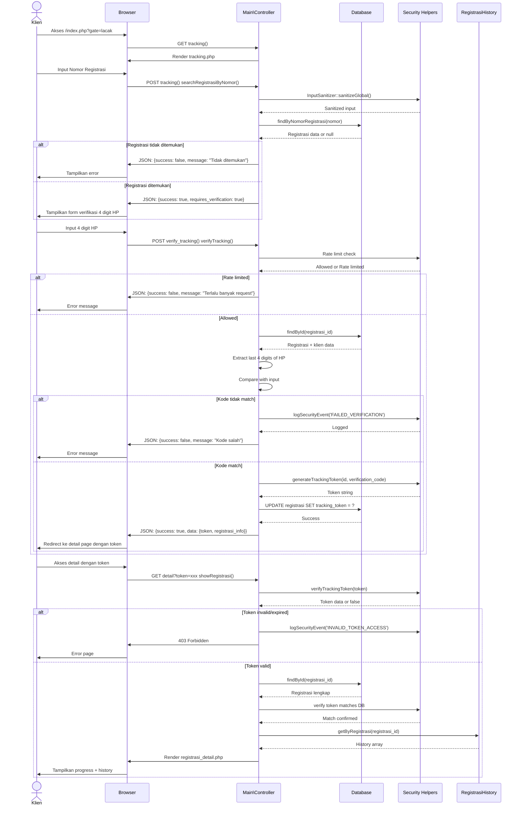
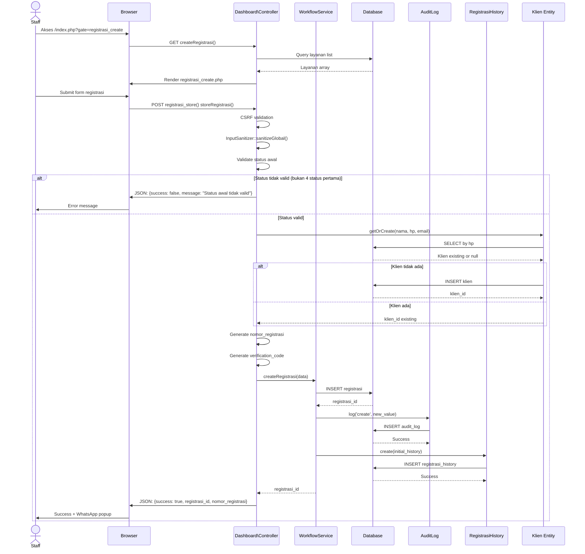
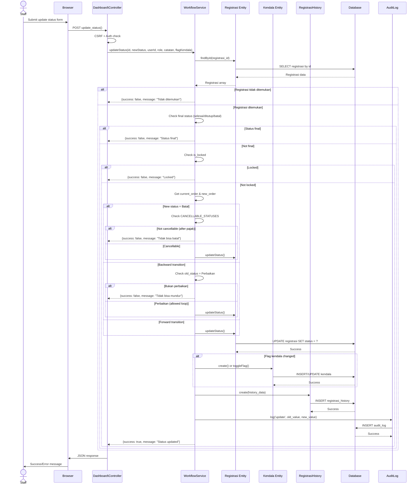
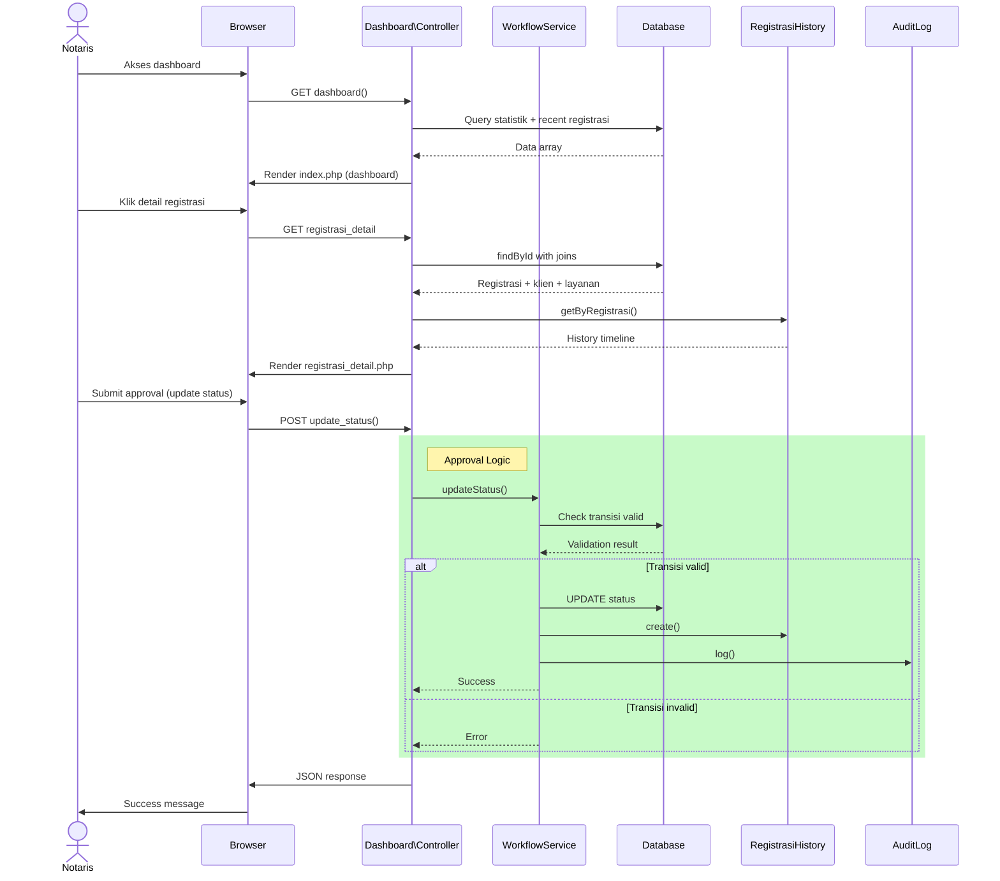
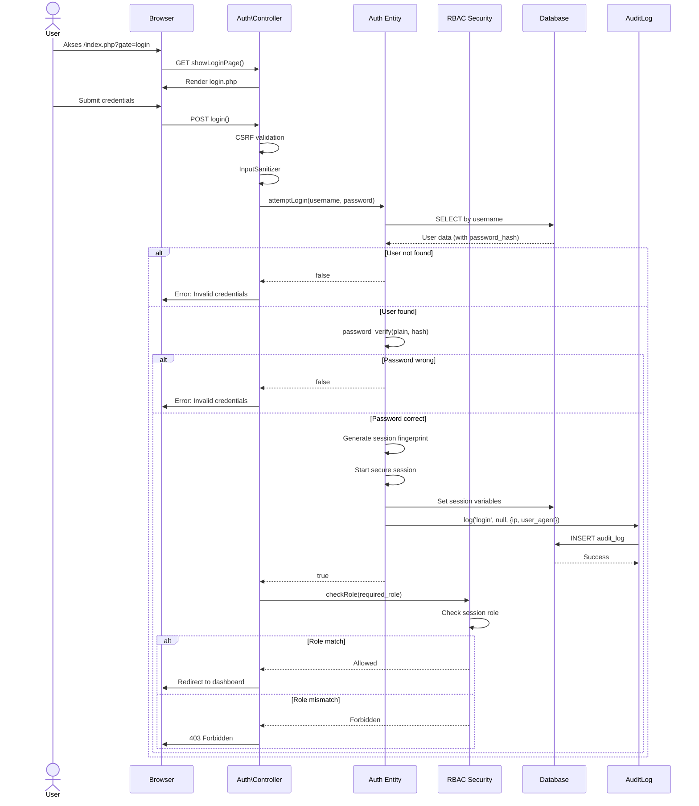
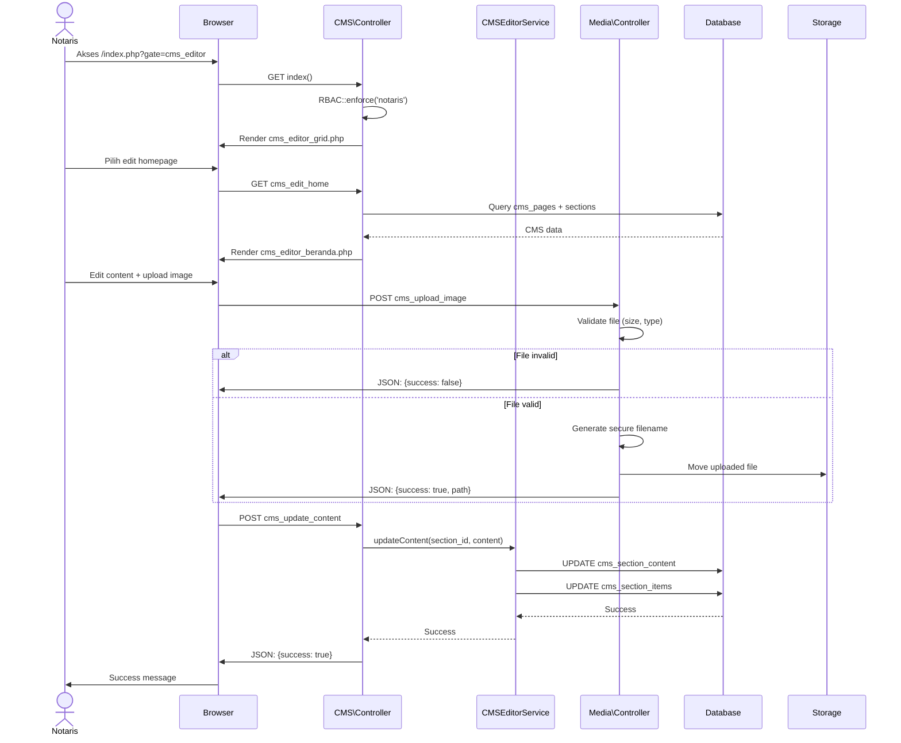
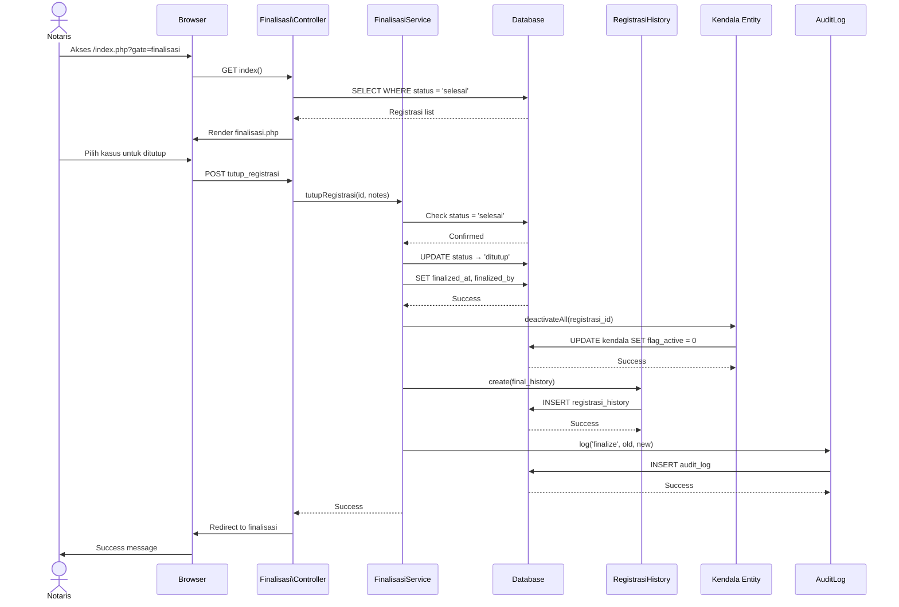
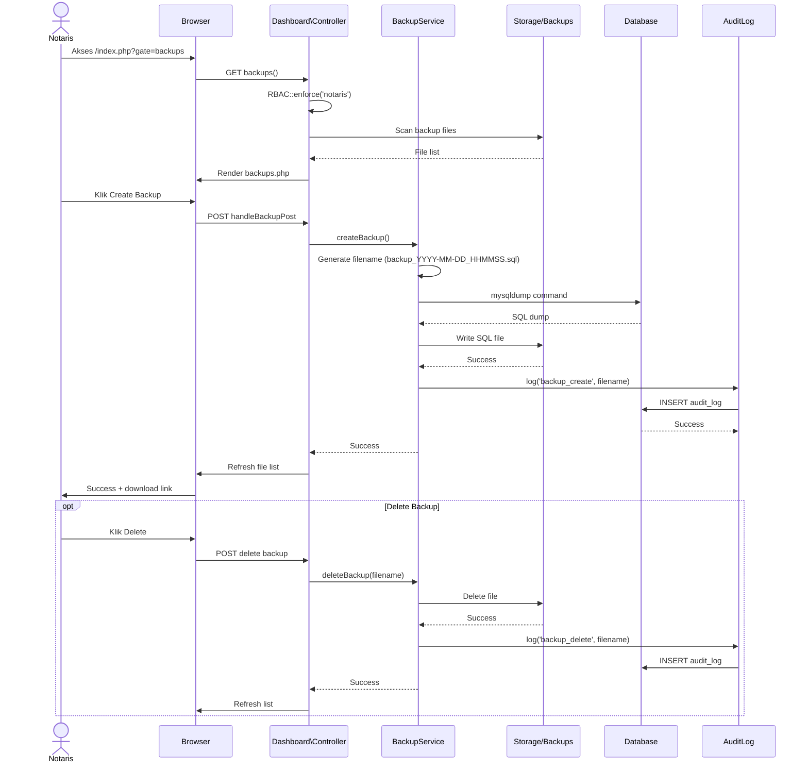

# Sequence Diagram - Sistem Tracking Status Dokumen Notaris

## 1. Sequence Diagram: Tracking Dokumen oleh Klien

### 1.1 Deskripsi

Sequence diagram ini menggambarkan interaksi antara Klien, Browser, System (Controller), Database, dan Security Components dalam proses tracking status dokumen.



### 1.2 Detail Pesan

| Pesan | Deskripsi | Data |
|-------|-----------|------|
| `findByNomorRegistrasi()` | Cari registrasi by nomor | `SELECT ... WHERE nomor_registrasi = ?` |
| `generateTrackingToken()` | Buat secure token | Base64 + HMAC-SHA256 |
| `verifyTrackingToken()` | Validasi token | Check signature + expiry |
| `getByRegistrasi()` | Load history | `SELECT ... WHERE registrasi_id = ? ORDER BY created_at DESC` |

### 1.3 Security Measures

1. **Input Sanitization**: Semua input disanitasi sebelum diproses
2. **Rate Limiting**: 5 request/menit untuk tracking_verify
3. **Token Expiry**: 24 jam expiration
4. **HMAC Signature**: Token integrity protection
5. **No Phone Exposure**: HP tidak pernah ditampilkan lengkap

---

## 2. Sequence Diagram: Staff Input Registrasi Baru

### 2.1 Deskripsi

Sequence diagram untuk proses create registrasi baru oleh staff.



### 2.2 GetOrCreate Pattern

```php
// Klien Entity
public function getOrCreate($nama, $hp, $email = null) {
    $existing = $this->findByHp($hp);
    if ($existing) {
        return $existing['id'];
    }
    return $this->create(['nama' => $nama, 'hp' => $hp, 'email' => $email]);
}
```

### 2.3 Generated Data

| Data | Format | Contoh |
|------|--------|--------|
| nomor_registrasi | NP-YYYYMMDD-XXXX | NP-20260326-1234 |
| verification_code | Random string | a1b2c3d4e5f6 |
| tracking_token | Base64.HMAC | ey...xyz.abcd1234 |

---

## 3. Sequence Diagram: Update Status dengan Workflow Validation

### 3.1 Deskripsi

Sequence diagram detail untuk update status dengan validasi WorkflowService.



### 3.4 Validation Matrix

| Scenario | Old Status | New Status | Result | Reason |
|----------|------------|------------|--------|--------|
| Forward | draft | pembayaran_admin | ✅ OK | Normal progress |
| Backward | validasi_sertifikat | draft | ❌ Error | Cannot go backward |
| Cancel Early | draft | batal | ✅ OK | In CANCELLABLE_STATUSES |
| Cancel Late | pembayaran_pajak | batal | ❌ Error | After tax payment |
| Loop Back | perbaikan | pembayaran_pajak | ✅ OK | Perbaikan exception |
| Final Update | selesai | ditutup | ❌ Error | Final status read-only |

---

## 4. Sequence Diagram: Notaris Approval

### 4.1 Deskripsi

Sequence diagram untuk approval workflow oleh notaris.



---

## 5. Sequence Diagram: Authentication & RBAC

### 5.1 Deskripsi

Sequence diagram untuk authentication dan Role-Based Access Control.



### 5.2 Session Fingerprinting

```php
// Auth::startSecureSession()
$fingerprint = hash('sha256', $_SERVER['HTTP_USER_AGENT'] . $_SERVER['REMOTE_ADDR']);
$_SESSION['user_fingerprint'] = $fingerprint;

// On each request
if ($_SESSION['user_fingerprint'] !== $currentFingerprint) {
    // Session hijacking detected!
    session_destroy();
}
```

---

## 6. Sequence Diagram: CMS Content Management

### 6.1 Deskripsi

Sequence diagram untuk CMS editing oleh notaris.



---

## 7. Sequence Diagram: Finalisasi Case

### 7.1 Deskripsi

Sequence diagram untuk finalisasi (tutup) kasus.



---

## 8. Sequence Diagram: Backup Management

### 8.1 Deskripsi

Sequence diagram untuk backup database.



---

## 9. Kesimpulan

Sequence Diagram yang telah diuraikan mencakup 9 skenario utama:

1. **Tracking Dokumen** - Full flow dari search hingga viewing
2. **Input Registrasi** - Create dengan getOrCreate pattern
3. **Update Status** - Workflow validation detail
4. **Notaris Approval** - Internal workflow
5. **Authentication** - Login + RBAC + session fingerprinting
6. **CMS Management** - Content editing + image upload
7. **Finalisasi** - Tutup kasus dengan auto-deactivate kendala
8. **Backup** - Database backup management

Setiap sequence diagram menunjukkan:
- **Lifeline** yang jelas (aktor, controller, service, database)
- **Pesan** synchronous/asynchronous
- **Alt/Opt** fragments untuk conditional logic
- **Security measures** di setiap critical point

Diagram ini menjadi referensi implementasi dan dokumentasi teknis sistem.
