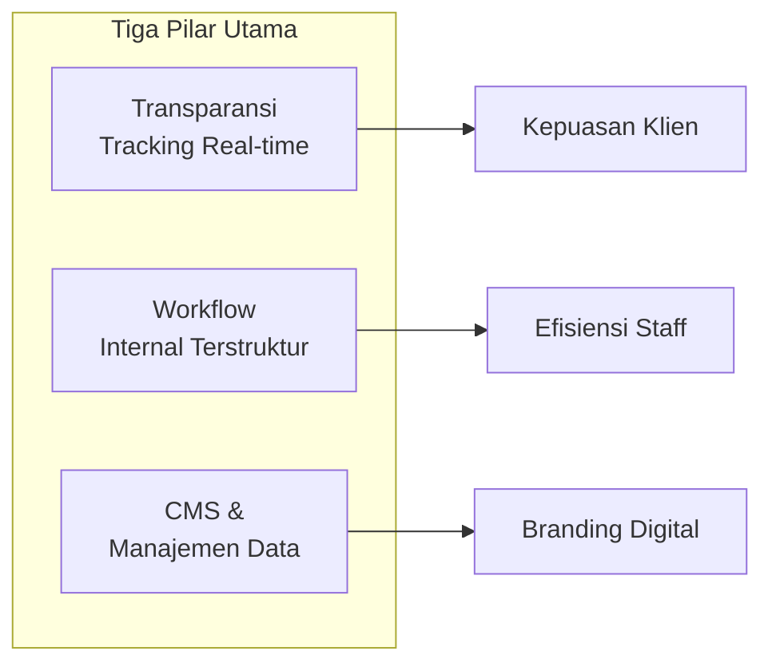
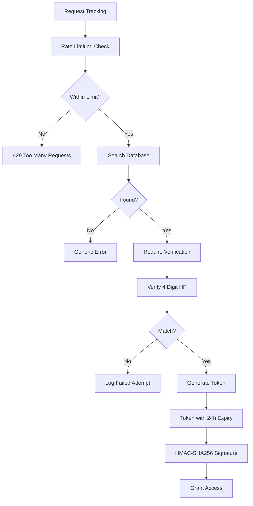
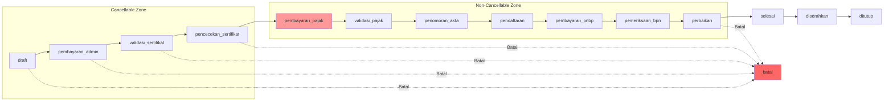
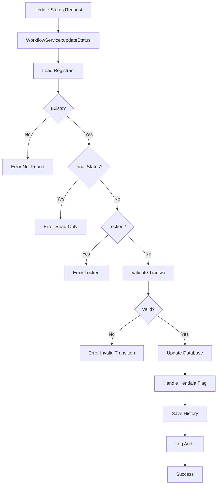
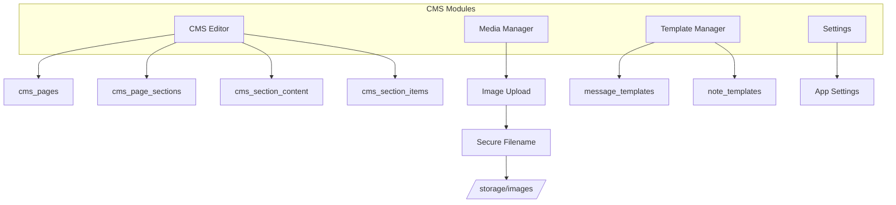
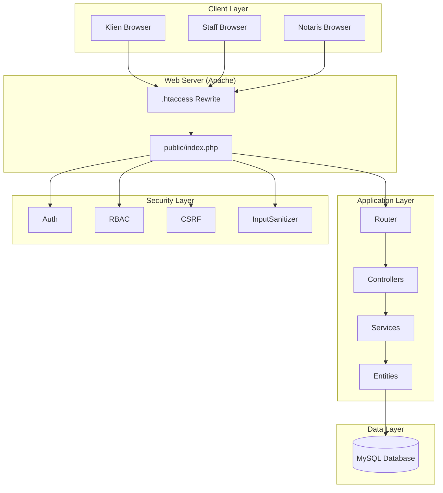
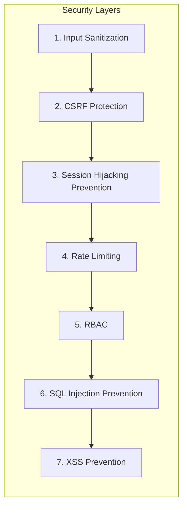
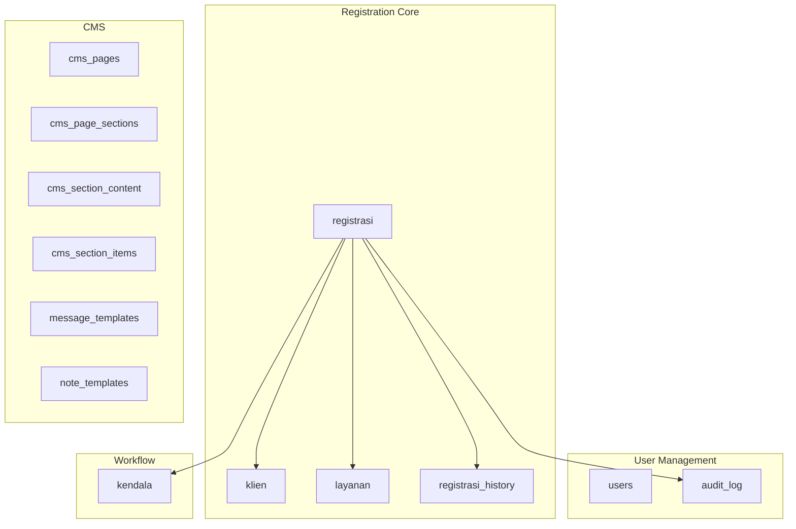

# System Overview - Sistem Tracking Status Dokumen Notaris

## 1. Ringkasan Eksekutif

Sistem Informasi Tracking Status Dokumen adalah aplikasi berbasis web yang dikembangkan untuk Kantor Notaris Sri Anah, S.H., M.Kn. dengan tujuan meningkatkan transparansi layanan dan efisiensi proses dokumen.

### 1.1 Fokus Utama Sistem



---

## 2. Transparansi - Tracking Real-time

### 2.1 Deskripsi

Sistem menyediakan portal publik yang memungkinkan klien melacak status dokumen mereka secara mandiri, 24/7, tanpa perlu menghubungi kantor notaris.

### 2.2 Fitur Utama

| Fitur | Deskripsi | Benefit |
|-------|-----------|---------|
| **Search by Nomor Registrasi** | Klien input nomor registrasi untuk mencari dokumen | Akses cepat tanpa login |
| **Verifikasi 4 Digit HP** | Autentikasi menggunakan 4 digit terakhir nomor HP | Security tanpa password |
| **Progress Bar Visual** | Tampilan 14 status dengan progress bar horizontal | Mudah dipahami |
| **Estimasi Waktu** | Setiap status menampilkan estimasi penyelesaian | Kepastian waktu |
| **Process Log** | Timeline riwayat perubahan status | Transparansi penuh |

### 2.3 Security Measures



**Keamanan Tracking:**
- **No Phone Exposure**: Nomor HP lengkap tidak pernah ditampilkan
- **Rate Limiting**: 5 percobaan verifikasi per menit
- **Token Expiry**: Tracking token expired setelah 24 jam
- **HMAC Signature**: Token integrity protection
- **Failed Attempt Logging**: Deteksi brute force

### 2.4 User Experience

**Before Implementation:**
```
Klien → Telepon Kantor → Staff Cari Manual → Info Status (mungkin outdated)
Time: 5-10 menit per inquiry
Availability: Jam kerja saja
```

**After Implementation:**
```
Klien → Buka Website → Input Nomor → Verifikasi → Lihat Status Real-time
Time: < 1 menit
Availability: 24/7
```

---

## 3. Workflow - Internal Terstruktur

### 3.1 Deskripsi

Sistem mengimplementasikan workflow engine dengan 14 status terdefinisi yang mencerminkan proses notaris sebenarnya, dengan validasi transisi yang ketat.

### 3.2 Status Workflow (14 Status)



### 3.3 Business Rules Enforcement

| Rule | Implementation | Rationale |
|------|----------------|-----------|
| **Tidak Bisa Mundur** | WorkflowService validates order | Progress fisik tidak bisa di-undo |
| **Batas Pembatalan** | CANCELLABLE_STATUSES array | Setelah pajak, ada konsekuensi hukum |
| **Perbaikan Loop** | Special case for perbaikan | Koreksi BPN boleh mundur |
| **Lock Mechanism** | is_locked flag | Sensitif cases perlu proteksi |
| **Final Status Read-Only** | Check selesai/ditutup/batal | Prevent invalid updates |

### 3.4 WorkflowService Architecture



---

## 4. CMS & Manajemen Data

### 4.1 Deskripsi

Content Management System terintegrasi untuk mengelola konten homepage, template pesan, dan pengaturan aplikasi.

### 4.2 CMS Components



### 4.3 Manageable Content

| Content Type | Editable By | Storage |
|--------------|-------------|---------|
| Homepage Hero | Notaris | cms_section_content |
| Layanan List | Notaris | cms_section_items + layanan table |
| Testimoni | Notaris | cms_section_items |
| WhatsApp Templates | Notaris | message_templates |
| Note Templates | Notaris | note_templates |
| App Settings | Notaris | Database/Config |

### 4.4 Image Upload Security

```php
// Security measures for image upload:
1. Max size: 5MB
2. Allowed types: jpg, jpeg, png, pdf
3. Secure filename: img_<random_hex>.ext
4. Storage: /public/assets/images/ (outside web root for originals)
5. Serving: Via image.php dengan token validation
```

---

## 5. Arsitektur Sistem

### 5.1 High-Level Architecture



### 5.2 Design Patterns

| Pattern | Implementation | Location |
|---------|----------------|----------|
| **Front Controller** | All requests through public/index.php | public/index.php |
| **Singleton** | Database connection | App\Adapters\Database |
| **Repository** | Entity classes for data access | App\Domain\Entities\* |
| **Service Layer** | Business logic | App\Services\* |
| **Domain-Driven Design** | Entities with business logic | App\Domain\Entities |
| **RBAC** | Permission mapping | App\Security\RBAC |
| **Query-Parameter Routing** | ?gate=xxx routing | config/routes.php |

---

## 6. Security Architecture

### 6.1 Seven-Layer Security



### 6.2 Security Implementation

| Layer | Implementation | File |
|-------|----------------|------|
| Input Sanitization | InputSanitizer::sanitizeGlobal() | app/Security/InputSanitizer.php |
| CSRF Protection | CSRF::token(), CSRF::validate() | app/Security/CSRF.php |
| Session Security | Auth::startSecureSession() | app/Security/Auth.php |
| Rate Limiting | RateLimiter::check() | app/Security/RateLimiter.php |
| RBAC | RBAC::enforce() | app/Security/RBAC.php |
| SQL Injection | Prepared statements only | app/Adapters/Database.php |
| XSS Prevention | htmlspecialchars() in View | app/Core/View.php |

---

## 7. Database Schema Overview

### 7.1 Core Tables



### 7.2 Key Relationships

| Table | Foreign Keys | Purpose |
|-------|--------------|---------|
| registrasi | klien_id, layanan_id | Main registration record |
| registrasi_history | registrasi_id, user_id | Immutable history ledger |
| audit_log | user_id, registrasi_id | Security audit trail |
| kendala | registrasi_id | Obstacle flags |
| cms_page_sections | page_id | CMS structure |
| cms_section_content | section_id | CMS content values |
| cms_section_items | section_id | CMS items (buttons, cards) |

---

## 8. Performance Considerations

### 8.1 Caching Strategy

| Component | Cache TTL | Storage |
|-----------|-----------|---------|
| Homepage CMS | 1 hour | Memory/Database |
| Tracking Search | 5 minutes | Session |
| User Session | 2 hours | PHP Session |
| Rate Limit Data | 1 minute | File (storage/cache/ratelimit/) |

### 8.2 Database Optimization

```sql
-- Indexed columns for performance
CREATE INDEX idx_registrasi_nomor ON registrasi(nomor_registrasi);
CREATE INDEX idx_registrasi_status ON registrasi(status);
CREATE INDEX idx_registrasi_token ON registrasi(tracking_token);
CREATE INDEX idx_history_registrasi ON registrasi_history(registrasi_id);
CREATE INDEX idx_audit_user ON audit_log(user_id);
```

---

## 9. Deployment Architecture

### 9.1 Server Requirements

| Component | Requirement |
|-----------|-------------|
| Web Server | Apache 2.4+ with mod_rewrite |
| PHP | 7.4+ (tested on 8.x) |
| Database | MySQL 5.7+ / MariaDB 10.4+ |
| SSL | Recommended for production |

### 9.2 Directory Permissions

```
/storage/       - 775 (writable by web server)
/storage/logs/  - 775
/storage/cache/ - 775
/public/        - 755
/app/           - 755
/config/        - 644 (database credentials)
```

---

## 10. Monitoring & Audit

### 10.1 Audit Log Coverage

| Action | Logged To | Data Captured |
|--------|-----------|---------------|
| User Login/Logout | audit_log | IP, timestamp, user |
| Create Registrasi | audit_log + registrasi_history | Full data |
| Update Status | audit_log + registrasi_history | Old/new status |
| User CRUD | audit_log | Username, role changes |
| Backup Delete | audit_log | Filename |
| Failed Verification | security.log | IP, attempted code |

### 10.2 Dashboard Metrics

**Dashboard menampilkan:**
- Total registrasi
- Registrasi aktif
- Selesai bulan ini
- Batal bulan ini
- Registrasi dengan flag kendala
- Recent activity

---

## 11. Kesimpulan

Sistem Tracking Status Dokumen Notaris adalah solusi komprehensif yang mencakup:

1. **Transparansi** - Portal tracking 24/7 untuk klien
2. **Workflow** - 14 status dengan validasi business rules ketat
3. **CMS** - Manajemen konten fleksibel untuk notaris
4. **Security** - 7-layer security architecture
5. **Audit** - Complete audit trail untuk semua aksi penting

Sistem ini production-ready dengan fokus pada domain notaris Indonesia, mengikuti praktik terbaik pengembangan web modern dan security standards.
