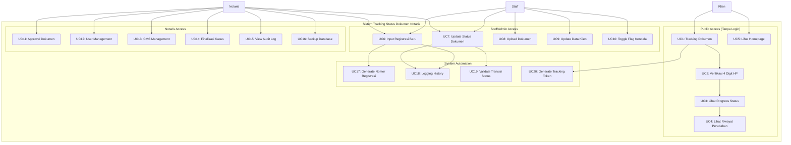

# Use Case Diagram - Sistem Tracking Status Dokumen Notaris

## 1. Aktor Sistem

### 1.1 Definisi Aktor

| Aktor | Deskripsi | Role dalam Sistem |
|-------|-----------|-------------------|
| **Klien** | Pengguna layanan notaris yang ingin tracking status dokumen | Publik (tidak perlu login) |
| **Staff/Admin** | Staff administrasi kantor notaris | Admin (login required) |
| **Notaris** | Notaris/pemimpin kantor notaris | Notaris (full access) |
| **Sistem** | Entitas sistem yang melakukan aksi otomatis | Internal automation |

---

## 2. Use Case Diagram



---

## 3. Detail Use Case

### 3.1 Use Case Public (Klien)

#### UC1: Tracking Dokumen

| Atribut | Deskripsi |
|---------|-----------|
| **Aktor** | Klien |
| **Deskripsi** | Klien mencari status dokumen berdasarkan nomor registrasi |
| **Precondition** | Klien memiliki nomor registrasi yang valid |
| **Postcondition** | Sistem memvalidasi nomor registrasi dan meminta verifikasi |

**Flow of Events:**
```
1. Klien mengakses halaman tracking
2. Klien input nomor registrasi
3. Sistem validasi format nomor registrasi
4. Sistem cek keberadaan nomor registrasi di database
5. Jika ditemukan → sistem minta verifikasi 4 digit HP
6. Jika tidak ditemukan → sistem tampilkan error
```

**Exception:**
- Nomor registrasi tidak ditemukan → Error message
- Format tidak valid → Validation error

---

#### UC2: Verifikasi 4 Digit HP

| Atribut | Deskripsi |
|---------|-----------|
| **Aktor** | Klien |
| **Deskripsi** | Verifikasi identitas klien menggunakan 4 digit terakhir nomor HP |
| **Precondition** | Nomor registrasi ditemukan di sistem |
| **Postcondition** | Klien mendapat akses tracking jika verifikasi berhasil |

**Flow of Events:**
```
1. Klien input 4 digit terakhir nomor HP
2. Sistem ambil data klien dari registrasi
3. Sistem bersihkan nomor HP dari karakter non-numeric
4. Sistem extract 4 digit terakhir
5. Sistem bandingkan dengan input klien
6. Jika match → generate tracking token
7. Jika tidak match → tampilkan error
```

**Security Notes:**
- Rate limiting: 5 percobaan per menit
- Logging failed attempts untuk security monitoring
- Token expired setelah 24 jam

---

#### UC3: Lihat Progress Status

| Atribut | Deskripsi |
|---------|-----------|
| **Aktor** | Klien |
| **Deskripsi** | Klien melihat progress tracking dokumen dalam visualisasi progress bar |
| **Precondition** | Verifikasi berhasil, token valid |
| **Postcondition** | Klien memahami progress dokumen saat ini |

**Flow of Events:**
```
1. Sistem validasi tracking token
2. Sistem ambil data registrasi + status saat ini
3. Sistem hitung progress berdasarkan 14 status order
4. Sistem tampilkan progress bar dengan:
   - Status completed (hijau)
   - Status current (kuning/active)
   - Status pending (abu-abu)
5. Sistem tampilkan estimasi waktu per tahap
```

**Visual Elements:**
- Progress bar horizontal dengan 14 node
- Label status dalam bahasa Indonesia
- Estimasi waktu per tahap (contoh: "7 hari")
- Timestamp update terakhir

---

#### UC4: Lihat Riwayat Perubahan

| Atribut | Deskripsi |
|---------|-----------|
| **Aktor** | Klien |
| **Deskripsi** | Klien melihat business history (riwayat perubahan status) |
| **Precondition** | Token valid, registrasi memiliki history |
| **Postcondition** | Klien mengetahui riwayat progress dokumen |

**Flow of Events:**
```
1. Sistem query registrasi_history untuk registrasi_id
2. Sistem urutkan berdasarkan created_at DESC
3. Sistem tampilkan timeline:
   - Tanggal/waktu perubahan
   - Status lama → status baru
   - Catatan dari staff/notaris
   - User yang melakukan perubahan
```

**Data Displayed:**
- `created_at` - Timestamp perubahan
- `status_old` → `status_new` - Transisi status
- `catatan` - Catatan internal (yang diizinkan untuk klien)
- `user_name` - Staff/notaris yang update

---

#### UC5: Lihat Homepage

| Atribut | Deskripsi |
|---------|-----------|
| **Aktor** | Klien, Publik |
| **Deskripsi** | Mengakses homepage company profile Kantor Notaris |
| **Precondition** | None (public access) |
| **Postcondition** | Publik mendapat informasi layanan notaris |

**Flow of Events:**
```
1. User akses homepage
2. Sistem load konten dari CMS (cms_pages, cms_page_sections)
3. Sistem render:
   - Hero section
   - Layanan section
   - Tentang section
   - Testimoni section
   - Contact section
4. Sistem tampilkan dengan cache (TTL 1 jam)
```

**CMS Content:**
- Dynamic content dari database
- Editable via CMS Editor (Notaris only)
- Image upload via Media Controller

---

### 3.2 Use Case Staff/Admin

#### UC6: Input Registrasi Baru

| Atribut | Deskripsi |
|---------|-----------|
| **Aktor** | Staff, Notaris |
| **Deskripsi** | Mendaftarkan dokumen klien baru ke dalam sistem |
| **Precondition** | User login dengan role staff atau notaris |
| **Postcondition** | Registrasi baru tersimpan dengan nomor registrasi unik |

**Flow of Events:**
```
1. Staff akses form "Tambah Registrasi Baru"
2. Staff input data klien:
   - Nama klien
   - Nomor HP
   - Email (optional)
3. Staff pilih jenis layanan
4. Staff pilih status awal (hanya 4 status pertama yang allowed)
5. Staff input catatan internal
6. Sistem validasi input
7. Sistem generate nomor registrasi unik (format: NP-YYYYMMDD-XXXX)
8. Sistem generate verification_code random
9. Sistem simpan registrasi dengan status default 'draft'
10. Sistem log ke audit_log dan registrasi_history
11. Sistem tampilkan popup WhatsApp (optional)
```

**Business Rules:**
- Status awal hanya boleh: `draft`, `pembayaran_admin`, `validasi_sertifikat`, `pencecekan_sertifikat`
- Nomor registrasi auto-generate dengan format: `NP-YYYYMMDD-RANDOM4`
- Verification code untuk tracking token
- Klien di-create atau di-reuse berdasarkan nomor HP (getOrCreate pattern)

---

#### UC7: Update Status Dokumen

| Atribut | Deskripsi |
|---------|-----------|
| **Aktor** | Staff, Notaris |
| **Deskripsi** | Update status progress dokumen |
| **Precondition** | User login, registrasi tidak locked |
| **Postcondition** | Status berubah, history tercatat |

**Flow of Events:**
```
1. Staff akses detail registrasi
2. Staff klik "Update Status"
3. Staff pilih status baru dari dropdown
4. Staff input catatan (optional)
5. Staff toggle flag kendala (optional)
6. Sistem validasi transisi status (WorkflowService)
7. Jika valid → update database
8. Sistem catat di registrasi_history
9. Sistem catat di audit_log
10. Sistem tampilkan success message
```

**Validation Rules (WorkflowService):**
- Tidak bisa mundur (kecuali dari `perbaikan`)
- Tidak bisa batal setelah `pembayaran_pajak`
- Tidak bisa update jika registrasi locked
- Tidak bisa update jika status final (`selesai`, `ditutup`, `batal`)

---

#### UC8: Upload Dokumen

| Atribut | Deskripsi |
|---------|-----------|
| **Aktor** | Staff, Notaris |
| **Deskripsi** | Upload dokumen pendukung (scan sertifikat, KTP, dll) |
| **Precondition** | User login, registrasi exists |
| **Postcondition** | Dokumen tersimpan dengan secure filename |

**Flow of Events:**
```
1. Staff akses upload section di detail registrasi
2. Staff pilih file (max 5MB, jpg/jpeg/png/pdf)
3. Staff pilih kategori dokumen
4. Sistem validasi file (size, extension)
5. Sistem generate secure filename (encrypted timestamp)
6. Sistem simpan di /public/assets/images/
7. Sistem catat path di database (jika ada tabel dokumen)
8. Sistem tampilkan success message
```

**Security:**
- Max upload: 5MB
- Allowed extensions: jpg, jpeg, png, pdf
- Filename dienkripsi untuk mencegah direct access
- Image serving via image.php dengan validasi token

---

#### UC9: Update Data Klien

| Atribut | Deskripsi |
|---------|-----------|
| **Aktor** | Staff, Notaris |
| **Deskripsi** | Update informasi klien (nama, HP, email) |
| **Precondition** | User login, klien exists |
| **Postcondition** | Data klien terupdate, audit trail tercatat |

**Flow of Events:**
```
1. Staff akses detail registrasi
2. Staff klik "Edit Data Klien"
3. Staff update field yang diperlukan
4. Sistem validasi input (HP format, email format)
5. Sistem update database
6. Sistem catat di audit_log
```

---

#### UC10: Toggle Flag Kendala

| Atribut | Deskripsi |
|---------|-----------|
| **Aktor** | Staff, Notaris |
| **Deskripsi** | Menandai registrasi sedang mengalami kendala/hambatan |
| **Precondition** | User login, registrasi tidak dalam status final |
| **Postcondition** | Flag kendala aktif/nonaktif, history tercatat |

**Flow of Events:**
```
1. Staff akses detail registrasi
2. Staff toggle checkbox "Flag Kendala"
3. Sistem cek status aktif flag saat ini
4. Jika belum aktif → create kendala record
5. Jika sudah aktif → deactivate (toggle)
6. Sistem catat di registrasi_history
7. Sistem update UI indicator
```

**Business Rules:**
- Flag kendala auto-deactivate saat status → `selesai`, `ditutup`, `batal`
- Hanya bisa toggle jika status bukan final
- Setiap toggle tercatat dalam history

---

### 3.3 Use Case Notaris

#### UC11: Approval Dokumen

| Atribut | Deskripsi |
|---------|-----------|
| **Aktor** | Notaris |
| **Deskripsi** | Notaris melakukan review dan approval dokumen hukum |
| **Precondition** | User login sebagai notaris, registrasi dalam status menunggu approval |
| **Postcondition** | Dokumen approved, status lanjut ke tahap berikutnya |

**Flow of Events:**
```
1. Notaris akses dashboard
2. Notaris lihat registrasi yang menunggu approval
3. Notaris akses detail registrasi
4. Notaris review dokumen (scan, data)
5. Notaris approve atau reject
6. Jika approve → sistem lanjut status
7. Jika reject → sistem set status `perbaikan` dengan catatan
8. Sistem catat di audit_log
```

**Note:** Dalam implementasi saat ini, approval dilakukan implicit melalui update status oleh notaris.

---

#### UC12: User Management

| Atribut | Deskripsi |
|---------|-----------|
| **Aktor** | Notaris |
| **Deskripsi** | Manajemen user sistem (create, update, delete) |
| **Precondition** | User login sebagai notaris |
| **Postcondition** | User database terupdate |

**Flow of Events:**
```
1. Notaris akses menu "Users"
2. Notaris lihat list user existing
3. Notaris pilih aksi:
   
   CREATE:
   - Input username, password, role
   - Sistem hash password (bcrypt)
   - Sistem simpan user
   - Audit log: create user
   
   UPDATE:
   - Pilih user
   - Update username/role
   - Sistem update database
   - Audit log: update user
   
   DELETE:
   - Pilih user
   - Konfirmasi delete
   - Sistem delete user
   - Audit log: delete user
```

**Security:**
- Hanya notaris yang bisa akses user management
- Password di-hash dengan bcrypt (cost 12)
- Role change di-audit untuk security

---

#### UC13: CMS Management

| Atribut | Deskripsi |
|---------|-----------|
| **Aktor** | Notaris |
| **Deskripsi** | Manajemen konten homepage dan template pesan |
| **Precondition** | User login sebagai notaris |
| **Postcondition** | Konten CMS terupdate |

**Sub Use Cases:**
- UC13.1: Edit Homepage Content
- UC13.2: Edit Layanan Section
- UC13.3: Manage Message Templates (WhatsApp)
- UC13.4: Manage Note Templates (Internal Notes)
- UC13.5: Upload CMS Images
- UC13.6: App Settings

**Flow of Events (General):**
```
1. Notaris akses CMS Editor
2. Notaris pilih section untuk diedit
3. Notaris edit content (text, images)
4. Notaris save
5. Sistem update cms_section_content / cms_section_items
6. Sistem catat updated_by dan updated_at
```

---

#### UC14: Finalisasi Kasus

| Atribut | Deskripsi |
|---------|-----------|
| **Aktor** | Notaris |
| **Deskripsi** | Menutup kasus yang sudah selesai (status → ditutup) |
| **Precondition** | User login sebagai notaris, registrasi dalam status `selesai` |
| **Postcondition** | Registrasi status → `ditutup` (read-only) |

**Flow of Events:**
```
1. Notaris akses menu "Finalisasi"
2. Notaris lihat list registrasi status `selesai`
3. Notaris pilih registrasi untuk difinalisasi
4. Notaris input catatan finalisasi (optional)
5. Notaris konfirmasi tutup kasus
6. Sistem update status → `ditutup`
7. Sistem set finalized_at, finalized_by
8. Sistem deactivate semua flag kendala
9. Sistem catat di history
```

**Reopen Case:**
- Notaris dapat reopen kasus yang sudah ditutup
- Status kembali ke `selesai`
- Audit trail tercatat

---

#### UC15: View Audit Log

| Atribut | Deskripsi |
|---------|-----------|
| **Aktor** | Notaris |
| **Deskripsi** | Melihat audit log semua aktivitas sistem |
| **Precondition** | User login sebagai notaris |
| **Postcondition** | Notaris dapat monitoring aktivitas sistem |

**Flow of Events:**
```
1. Notaris akses menu "Audit Log"
2. Sistem query audit_log table
3. Sistem tampilkan dengan filter (date range, user, action)
4. Notaris dapat export/log download (optional)
```

**Audit Log Data:**
- `user_id`, `role` - Pelaku aksi
- `action` - Jenis aksi (create, update, delete, login, logout)
- `old_value`, `new_value` - Perubahan data (JSON)
- `timestamp` - Waktu aksi

---

#### UC16: Backup Database

| Atribut | Deskripsi |
|---------|-----------|
| **Aktor** | Notaris |
| **Deskripsi** | Backup database dan manage backup files |
| **Precondition** | User login sebagai notaris |
| **Postcondition** | Backup file tersimpan |

**Flow of Events:**
```
1. Notaris akses menu "Backups"
2. Notaris klik "Create Backup"
3. Sistem execute mysqldump
4. Sistem simpan SQL file di /storage/backups/
5. Sistem tampilkan list backup files
6. Notaris dapat download atau delete backup
```

**Security:**
- Hanya notaris yang bisa backup/restore
- Backup file di-block dari direct access (.htaccess)
- Delete backup dicatat di audit_log

---

### 3.4 Use Case System Automation

#### UC17: Generate Nomor Registrasi

| Atribut | Deskripsi |
|---------|-----------|
| **Aktor** | Sistem |
| **Deskripsi** | Auto-generate nomor registrasi unik saat create |
| **Trigger** | UC6: Input Registrasi Baru |

**Algorithm:**
```php
$nomorRegistrasi = 'NP-' . date('Ymd') . '-' . str_pad(random_int(0, 9999), 4, '0', STR_PAD_LEFT);
```

**Format:** `NP-YYYYMMDD-XXXX`
- NP = Notaris & PPAT
- YYYYMMDD = Tanggal registrasi
- XXXX = Random 4 digit

---

#### UC18: Logging History

| Atribut | Deskripsi |
|---------|-----------|
| **Aktor** | Sistem |
| **Deskripsi** | Auto-logging semua perubahan status dan aksi penting |
| **Trigger** | UC6, UC7, UC10, UC14 |

**Logging Points:**
1. Create registrasi → registrasi_history + audit_log
2. Update status → registrasi_history + audit_log
3. Toggle kendala → registrasi_history
4. User login/logout → audit_log
5. User CRUD → audit_log
6. Backup delete → audit_log

**History Record:**
```php
[
    'registrasi_id' => ...,
    'status_old' => ...,
    'status_new' => ...,
    'catatan' => ...,
    'user_id' => ...,
    'user_name' => ...,
    'user_role' => ...,
    'ip_address' => ...,
    'created_at' => current_timestamp
]
```

---

#### UC19: Validasi Transisi Status

| Atribut | Deskripsi |
|---------|-----------|
| **Aktor** | Sistem |
| **Deskripsi** | Validasi transisi status berdasarkan business rules |
| **Trigger** | UC7: Update Status |

**Validation Logic (WorkflowService):**
```php
// 1. Check backward transition
if ($newOrder < $currentOrder && $newStatus !== STATUS_BATAL) {
    // Exception: perbaikan can go back
    if ($oldStatus !== 'perbaikan') {
        return false;
    }
}

// 2. Check cancellation limit
if ($newStatus === STATUS_BATAL) {
    if (!in_array($oldStatus, CANCELLABLE_STATUSES)) {
        return false; // Cannot cancel after pembayaran_pajak
    }
}

// 3. Check locked status
if ($registrasi['is_locked']) {
    return false;
}

// 4. Check final status
if (in_array($oldStatus, ['selesai', 'ditutup', 'batal'])) {
    return false;
}
```

---

#### UC20: Generate Tracking Token

| Atribut | Deskripsi |
|---------|-----------|
| **Aktor** | Sistem |
| **Deskripsi** | Generate secure token untuk akses tracking publik |
| **Trigger** | UC2: Verifikasi 4 Digit HP |

**Token Generation:**
```php
function generateTrackingToken($registrasiId, $verificationCode) {
    $data = [
        'id' => $registrasiId,
        'code' => $verificationCode,
        'exp' => time() + 86400 // 24 hours
    ];
    $payload = base64_encode(json_encode($data));
    $signature = hash_hmac('sha256', $payload, SECRET_KEY);
    return $payload . '.' . $signature;
}
```

**Token Validation:**
- Check signature dengan HMAC
- Check expiration (24 jam)
- Check matching dengan tracking_token di database

---

## 4. Matriks Hak Akses

| Use Case | Klien | Staff | Notaris | Sistem |
|----------|-------|-------|---------|--------|
| UC1: Tracking Dokumen | ✅ | - | - | - |
| UC2: Verifikasi 4 Digit HP | ✅ | - | - | - |
| UC3: Lihat Progress Status | ✅ | ✅ | ✅ | - |
| UC4: Lihat Riwayat Perubahan | ✅ | ✅ | ✅ | - |
| UC5: Lihat Homepage | ✅ | ✅ | ✅ | - |
| UC6: Input Registrasi Baru | - | ✅ | ✅ | UC17, UC18 |
| UC7: Update Status Dokumen | - | ✅ | ✅ | UC18, UC19 |
| UC8: Upload Dokumen | - | ✅ | ✅ | - |
| UC9: Update Data Klien | - | ✅ | ✅ | - |
| UC10: Toggle Flag Kendala | - | ✅ | ✅ | UC18 |
| UC11: Approval Dokumen | - | - | ✅ | - |
| UC12: User Management | - | - | ✅ | UC18 |
| UC13: CMS Management | - | - | ✅ | - |
| UC14: Finalisasi Kasus | - | - | ✅ | UC18 |
| UC15: View Audit Log | - | - | ✅ | - |
| UC16: Backup Database | - | - | ✅ | - |

---

## 5. Kesimpulan

Use Case Diagram ini mendefinisikan 20 use case yang mencakup seluruh fungsionalitas Sistem Tracking Status Dokumen Notaris. 

**Poin Penting:**
1. **Pemisahan akses jelas** - Klien (public tracking), Staff (operasional), Notaris (full access)
2. **Automation sistem** - 4 use case otomatis untuk logging, validasi, dan generation
3. **Security by design** - Verifikasi token, RBAC, audit trail di semua aksi penting
4. **Business rules enforcement** - Validasi transisi status mencegah error workflow

Diagram ini menjadi dasar untuk Activity Diagram dan Sequence Diagram pada bagian selanjutnya.
