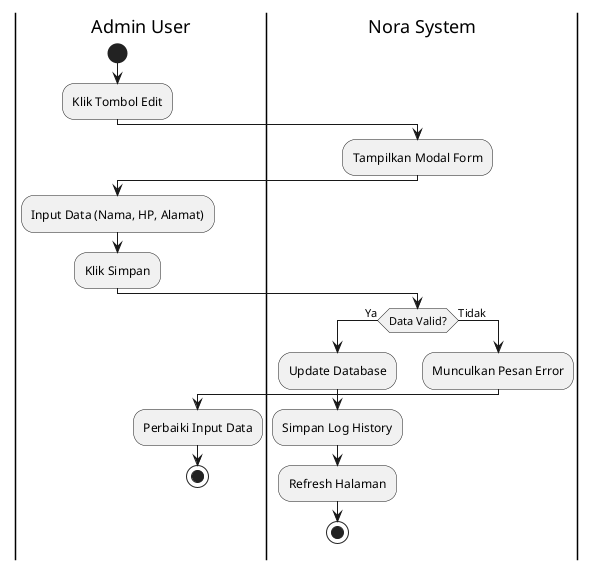

# Activity Diagram: Edit Data Registrasi
Sistem: **Nora 2.0 Management**

## 1. Activity Diagram (PlantUML Standard)

```plantuml
@startuml
|Admin User|
start
:Klik Tombol Edit;
|Nora System|
:Tampilkan Modal Form;
|Admin User|
:Input Data (Nama, HP, Alamat);
:Klik Simpan;
|Nora System|
if (Data Valid?) then (Ya)
  :Update Database;
  :Simpan Log History;
  :Refresh Halaman;
  stop
else (Tidak)
  :Munculkan Pesan Error;
  |Admin User|
  :Perbaiki Input Data;
  stop
endif
@enduml
```
