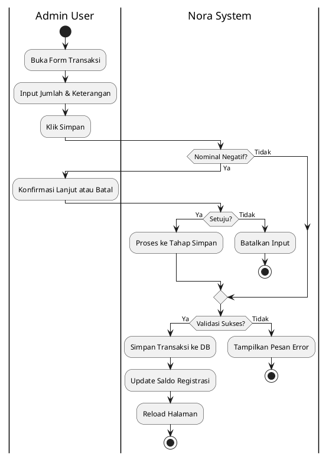

# Activity Diagram: Tambah Transaksi
Sistem: **Nora 2.0 Management**

## 1. Activity Diagram (PlantUML Standard)

```plantuml
@startuml
|Admin User|
start
:Buka Form Transaksi;
:Input Jumlah & Keterangan;
:Klik Simpan;
|Nora System|
if (Nominal Negatif?) then (Ya)
  |Admin User|
  :Konfirmasi Lanjut atau Batal;
  |Nora System|
  if (Setuju?) then (Ya)
    :Proses ke Tahap Simpan;
  else (Tidak)
    :Batalkan Input;
    stop
  endif
else (Tidak)
endif

|Nora System|
if (Validasi Sukses?) then (Ya)
  :Simpan Transaksi ke DB;
  :Update Saldo Registrasi;
  :Reload Halaman;
  stop
else (Tidak)
  :Tampilkan Pesan Error;
  stop
endif
@enduml
```
