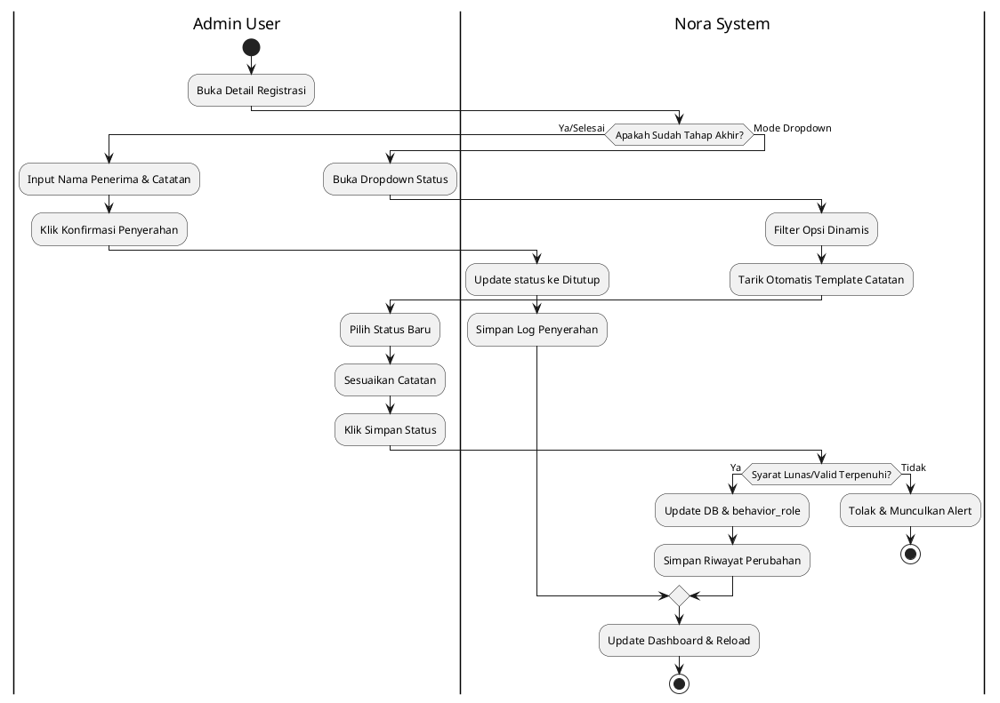

# Activity Diagram: Update Status & Workflow
Sistem: **Nora 2.0 Management**

## 1. Activity Diagram (PlantUML Standard)

```plantuml
@startuml
|Admin User|
start
:Buka Detail Registrasi;
|Nora System|
if (Apakah Sudah Tahap Akhir?) then (Ya/Selesai)
  |Admin User|
  :Input Nama Penerima & Catatan;
  :Klik Konfirmasi Penyerahan;
  |Nora System|
  :Update status ke Ditutup;
  :Simpan Log Penyerahan;
else (Mode Dropdown)
  |Admin User|
  :Buka Dropdown Status;
  |Nora System|
  :Filter Opsi Dinamis;
  :Tarik Otomatis Template Catatan;
  |Admin User|
  :Pilih Status Baru;
  :Sesuaikan Catatan;
  :Klik Simpan Status;
  |Nora System|
  if (Syarat Lunas/Valid Terpenuhi?) then (Ya)
    :Update DB & behavior_role;
    :Simpan Riwayat Perubahan;
  else (Tidak)
    :Tolak & Munculkan Alert;
    stop
  endif
endif

|Nora System|
:Update Dashboard & Reload;
stop
@enduml
```
