# Use Case Documentation - Sistem NORA v2.1

---

## UC-01: View Landing Page

### 4. Main Flow (Alur Utama)

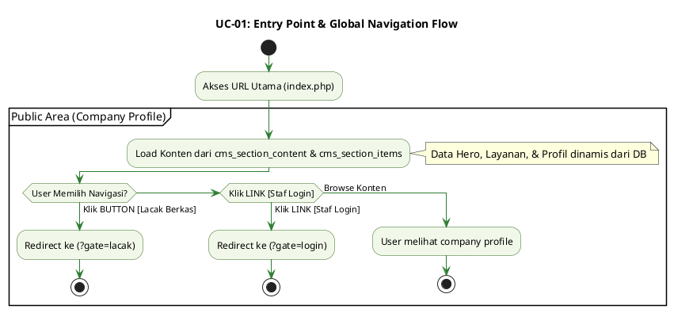

---

## UC-02: Track Berkas (Self-Service)

### 4. Main Flow (Alur Utama)

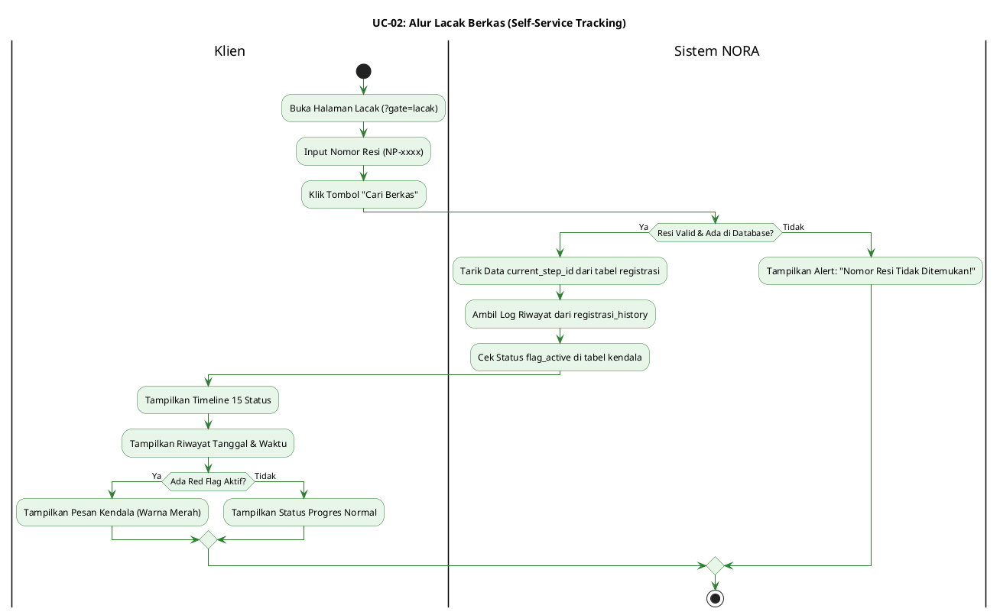

---

## UC-03: Login Staff/Notaris

### 4. Main Flow (Alur Utama)

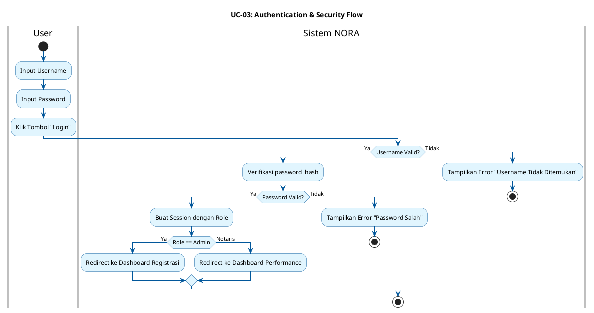

---

## UC-04: Registrasi Berkas Baru

### 4. Main Flow (Alur Utama)

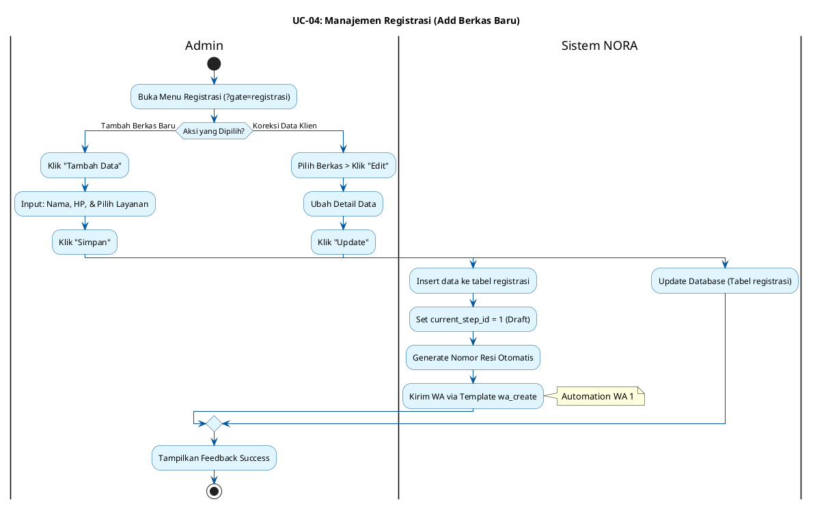

---

## UC-05: Edit Data Registrasi

### 4. Main Flow (Alur Utama)

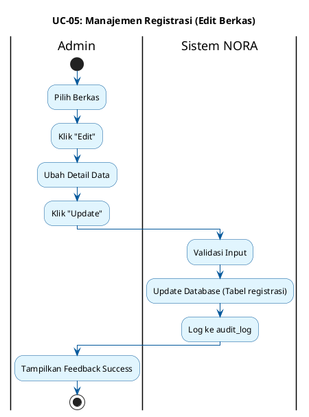

---

## UC-06: Update Status Berkas (15 Status)

### 4. Main Flow (Alur Utama)

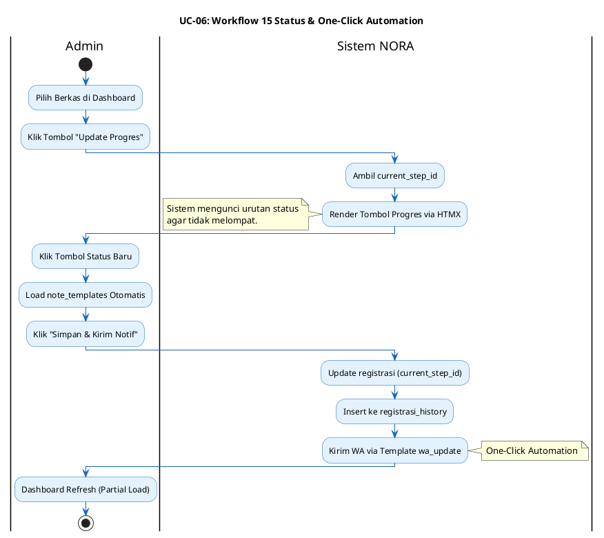

---

## UC-07: Manage CMS Content

### 4. Main Flow (Alur Utama)

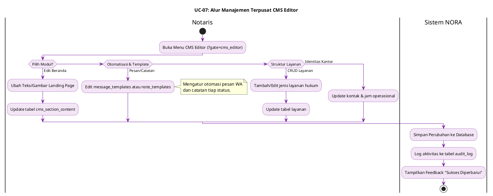

---

## UC-08: Manage Workflow Steps

### 4. Main Flow (Alur Utama)

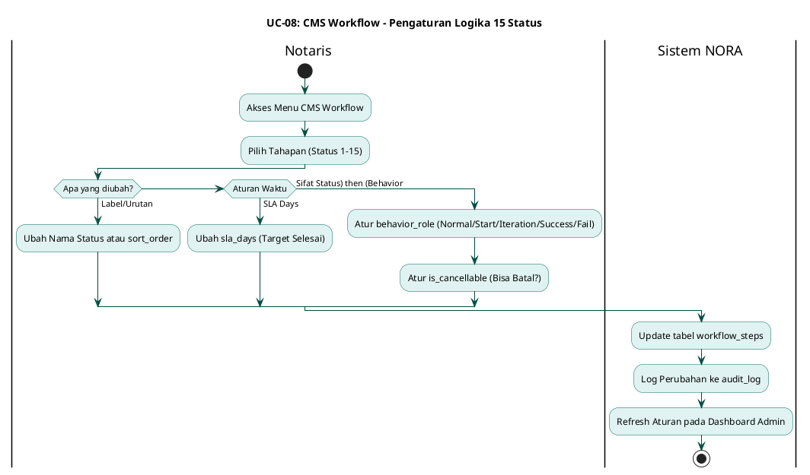

---

## UC-09: Finalisasi & Tutup Kasus

### 4. Main Flow (Alur Utama)

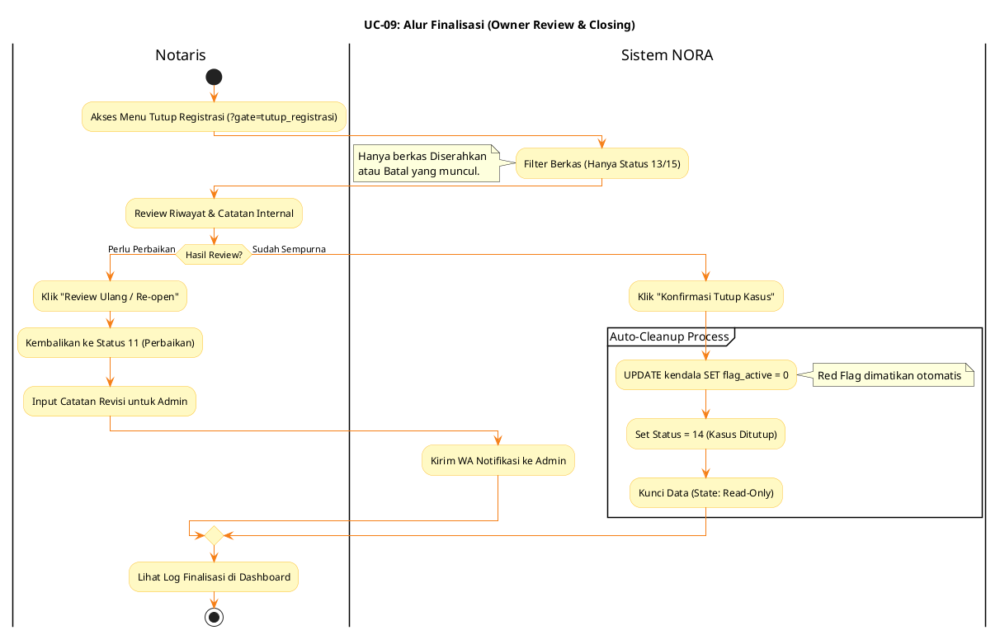

---

## UC-10: Manage Red Flag (Kendala)

### 4. Main Flow (Alur Utama)

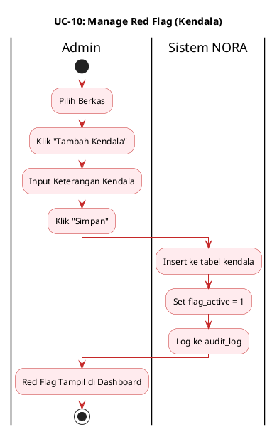

---

## UC-11: View Dashboard Performance

### 4. Main Flow (Alur Utama)

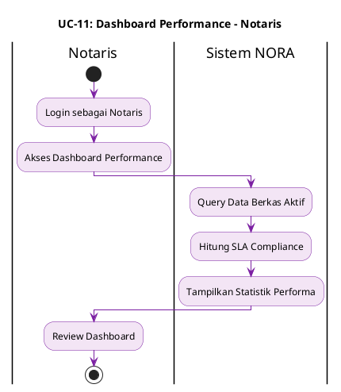

---

## UC-12: Auto-Kirim WhatsApp Notification

### 4. Main Flow (Alur Utama)

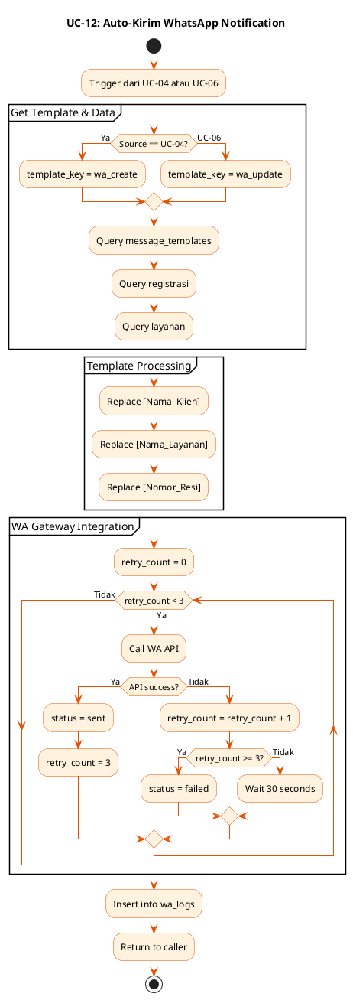

---

*Use Case Documentation berdasarkan dokumentasi asli Sistem NORA v2.1*