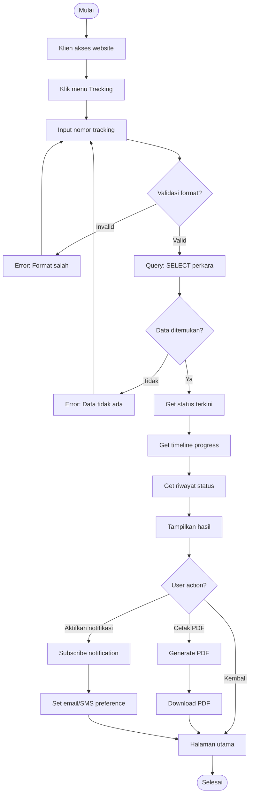
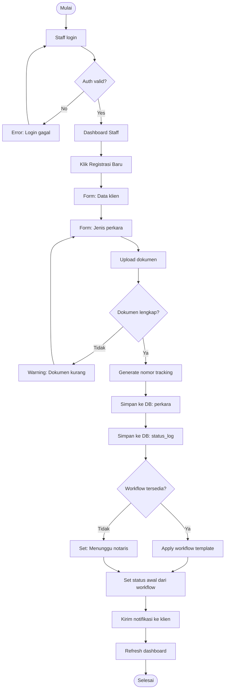
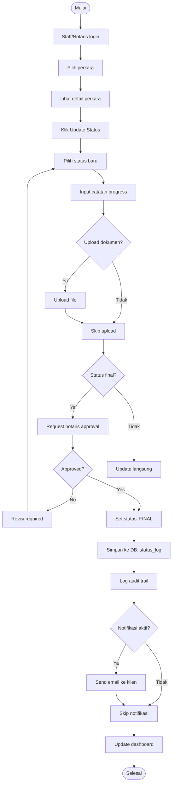

# Activity Diagram - Sistem Tracking Status Dokumen Kantor Notaris

## Deskripsi
Diagram aktivitas ini menggambarkan alur kerja sistem tracking dokumen.

## 1. Activity Diagram - Tracking Real-Time (UC01)

## 2. Activity Diagram - Registrasi & Workflow (UC02, UC06)

## 3. Activity Diagram - Update Status & Notifikasi (UC03, UC07)

## Penjelasan Activity

| Activity | Use Case | Aktor | Output |
|----------|----------|-------|--------|
| Tracking Real-Time | UC01, UC05, UC07 | Klien | Status, timeline, PDF |
| Registrasi & Workflow | UC02, UC06 | Staff | Nomor tracking, notifikasi |
| Update Status & Notifikasi | UC03, UC07 | Staff/Notaris | Status updated, email sent |

## Swimlane Activities

| Swimlane | Activities |
|----------|------------|
| **Klien** | Input tracking, cetak PDF, subscribe notifikasi |
| **Staff** | Login, registrasi, update status, upload dokumen |
| **Notaris** | Approval final, verifikasi, workflow setup |
| **Sistem** | Validasi, generate tracking, query DB, send notification |
