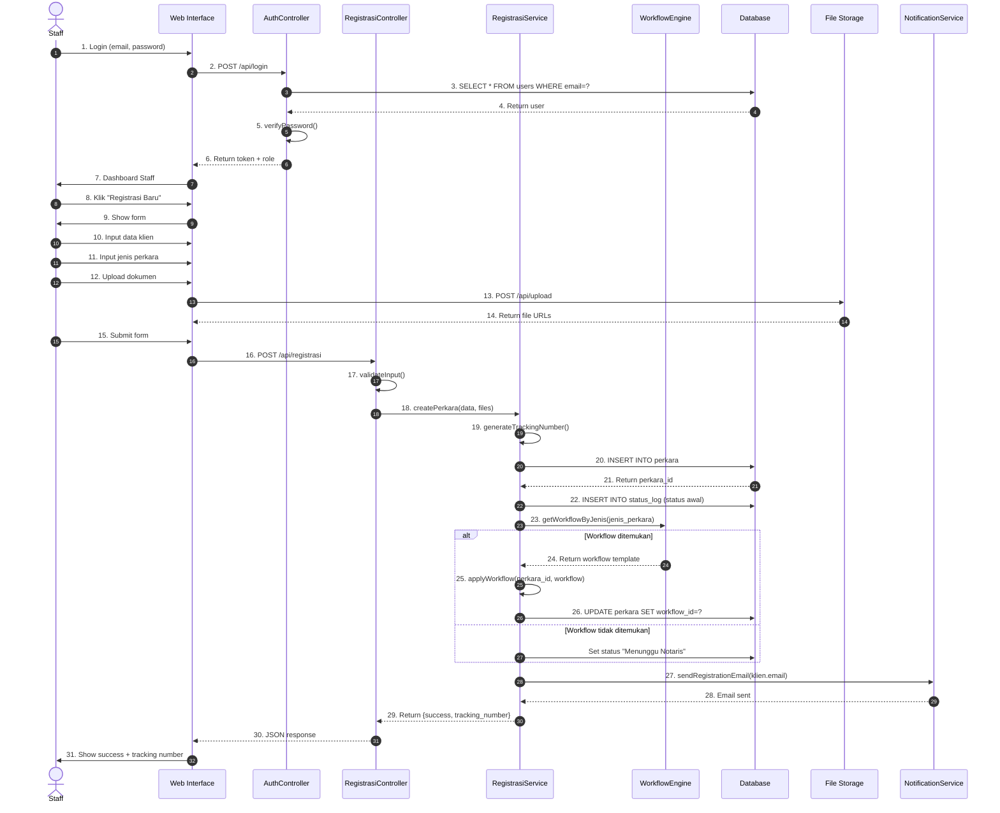
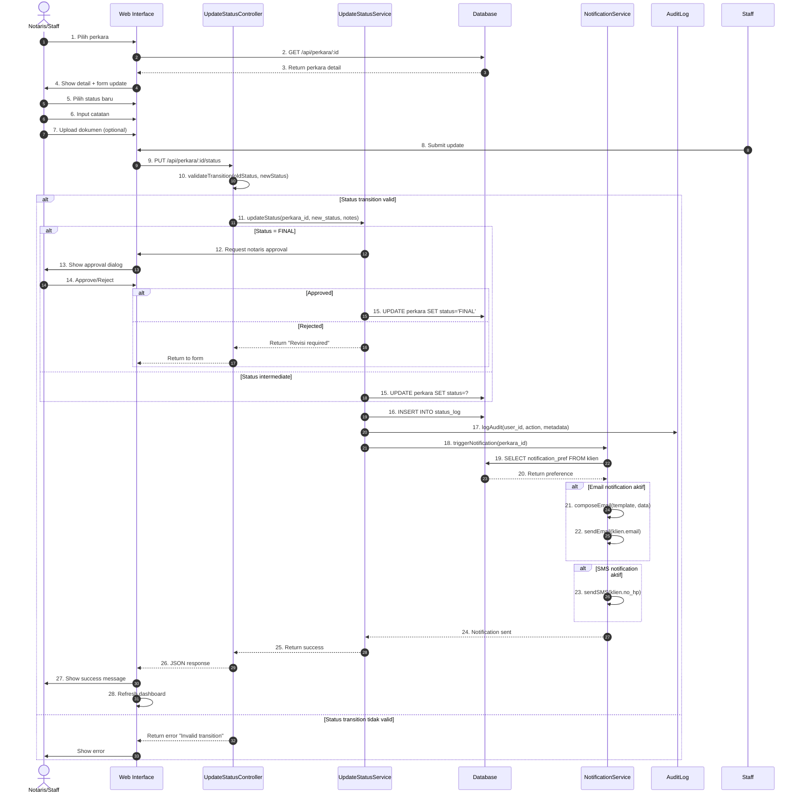
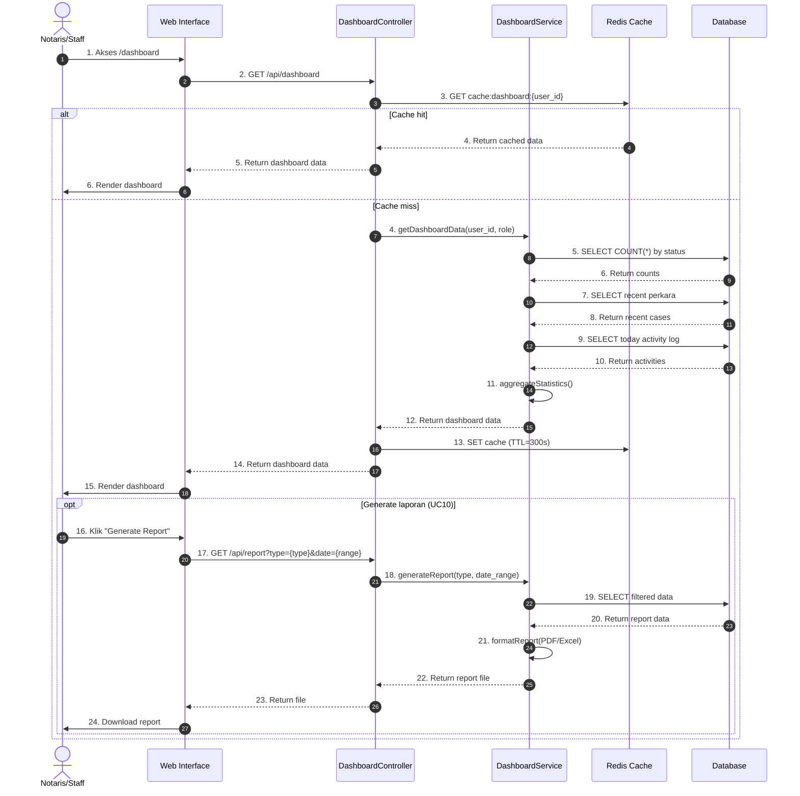

# Sequence Diagram - Sistem Tracking Status Dokumen Kantor Notaris

## Deskripsi
Diagram sequence ini menggambarkan interaksi antar objek berdasarkan urutan waktu.

## 1. Sequence Diagram - Tracking Real-Time (UC01)

```mermaid
sequenceDiagram
    autonumber
    actor K as Klien
    participant UI as Web Interface
    participant Ctrl as TrackingController
    participant Svc as TrackingService
    participant DB as Database
    participant Notif as NotificationService

    K->>UI: 1. Akses /tracking
    UI->>K: 2. Tampilkan form tracking
    
    K->>UI: 3. Input tracking number (TRK-2026-001)
    UI->>Ctrl: 4. POST /api/tracking {number}
    
    Ctrl->>Ctrl: 5. validateFormat(number)
    
    alt Format valid
        Ctrl->>Svc: 6. getPerkaraByTrackingNumber(number)
        Svc->>DB: 7. SELECT * FROM perkara WHERE tracking_no=?
        DB-->>Svc: 8. Return perkara data
        
        alt Data ditemukan
            Svc->>DB: 9. SELECT * FROM status_log WHERE perkara_id=?
            DB-->>Svc: 10. Return status history
            
            Svc->>Svc: 11. formatPerkaraData()
            Svc->>Svc: 12. buildTimeline(history)
            Svc-->>Ctrl: 13. Return {perkara, timeline}
            
            Ctrl-->>UI: 14. JSON response
            UI->>K: 15. Render tracking result
            
            opt Notifikasi tersedia
                Ctrl->>Notif: 16. checkSubscription(klien_id)
                Notif-->>Ctrl: 17. Return subscription status
                UI->>K: 18. Show notification toggle
            end
        else Data tidak ditemukan
            Svc-->>Ctrl: Return null
            Ctrl-->>UI: Return error "Data tidak ditemukan"
            UI->>K: Show error message
        end
    else Format tidak valid
        Ctrl-->>UI: Return validation error
        UI->>K: Show validation error
    end
```

## 2. Sequence Diagram - Registrasi Perkara (UC02, UC06)

## 3. Sequence Diagram - Update Status & Notifikasi (UC03, UC07)

## 4. Sequence Diagram - Dashboard & Laporan (UC04, UC10)

## Penjelasan Sequence

| Sequence | Use Case | Aktor | Deskripsi |
|----------|----------|-------|-----------|
| 1 | UC01, UC07 | Klien | Tracking real-time dengan notifikasi |
| 2 | UC02, UC06 | Staff | Registrasi perkara dengan workflow |
| 3 | UC03, UC07 | Staff/Notaris | Update status dengan notifikasi |
| 4 | UC04, UC10 | Notaris/Staff | Dashboard dengan laporan |

## Komponen yang Terlibat

| Komponen | Peran |
|----------|-------|
| **Web Interface** | Frontend UI (HTML/CSS/JS) |
| **Controller** | Handle HTTP request/response |
| **Service** | Business logic implementation |
| **Database** | MySQL - penyimpanan data |
| **Cache** | Redis - caching untuk performa |
| **NotificationService** | Email/SMS notification |
| **AuditLog** | Logging aktivitas sistem |
| **File Storage** | Penyimpanan dokumen |
