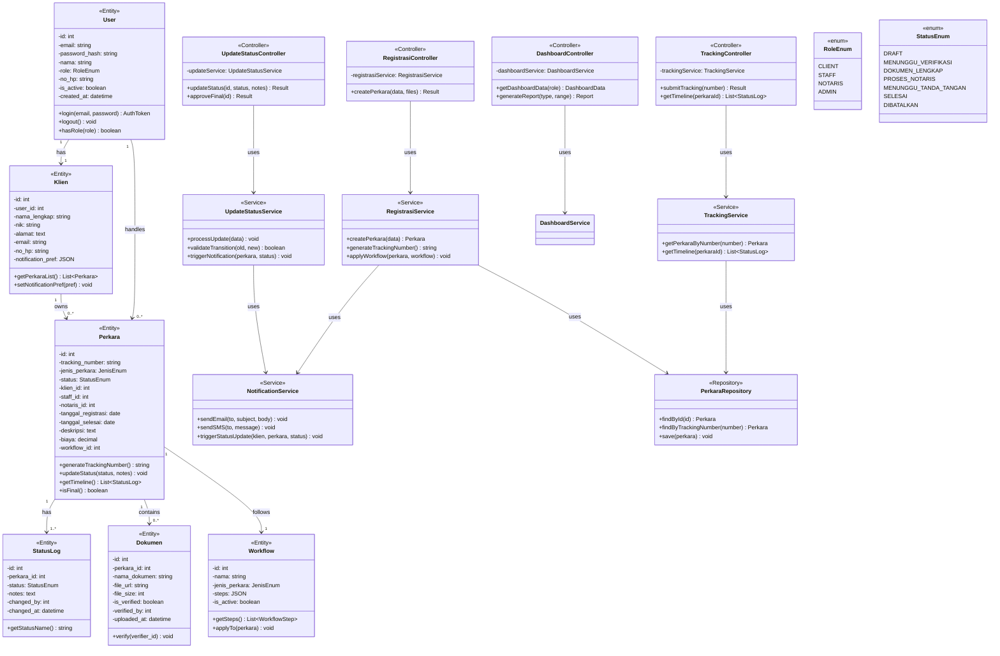

# Class Diagram - Sistem Tracking Status Dokumen Kantor Notaris

## Deskripsi
Diagram kelas ini menampilkan struktur class, atribut, method, dan relasi dalam sistem.

## Mermaid Diagram

## Penjelasan Class

### Entity Classes (Model)

| Class | Tabel | Deskripsi |
|-------|-------|-----------|
| **User** | users | Data pengguna sistem (Staff, Notaris, Admin) |
| **Klien** | klien | Data klien/pencari perkara |
| **Perkara** | perkara | Data perkara/dokumen yang ditangani |
| **StatusLog** | status_log | History perubahan status |
| **Dokumen** | dokumen | File dokumen terkait perkara |
| **Workflow** | workflow | Template alur kerja otomatis |

### Controller Classes

| Class | Route | Use Case |
|-------|-------|----------|
| **TrackingController** | /api/tracking | UC01, UC05, UC07 |
| **RegistrasiController** | /api/registrasi | UC02, UC06 |
| **UpdateStatusController** | /api/perkara/:id/status | UC03, UC12 |
| **DashboardController** | /api/dashboard | UC04, UC10 |

### Service Classes

| Class | Fungsi |
|-------|--------|
| **TrackingService** | Logic tracking & timeline |
| **RegistrasiService** | Logic registrasi & workflow |
| **UpdateStatusService** | Logic update status & notifikasi |
| **NotificationService** | Kirim email/SMS notifikasi |

### Enum Classes

| Enum | Values |
|------|--------|
| **RoleEnum** | CLIENT, STAFF, NOTARIS, ADMIN |
| **StatusEnum** | DRAFT, MENUNGGU_VERIFIKASI, DOKUMEN_LENGKAP, PROSES_NOTARIS, MENUNGGU_TANDA_TANGAN, SELESAI, DIBATALKAN |
