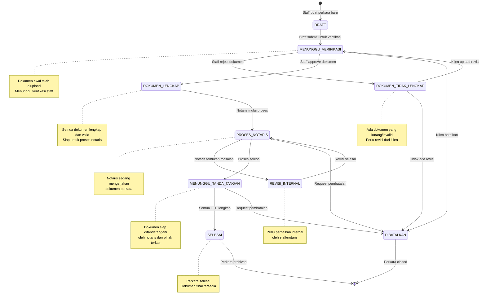
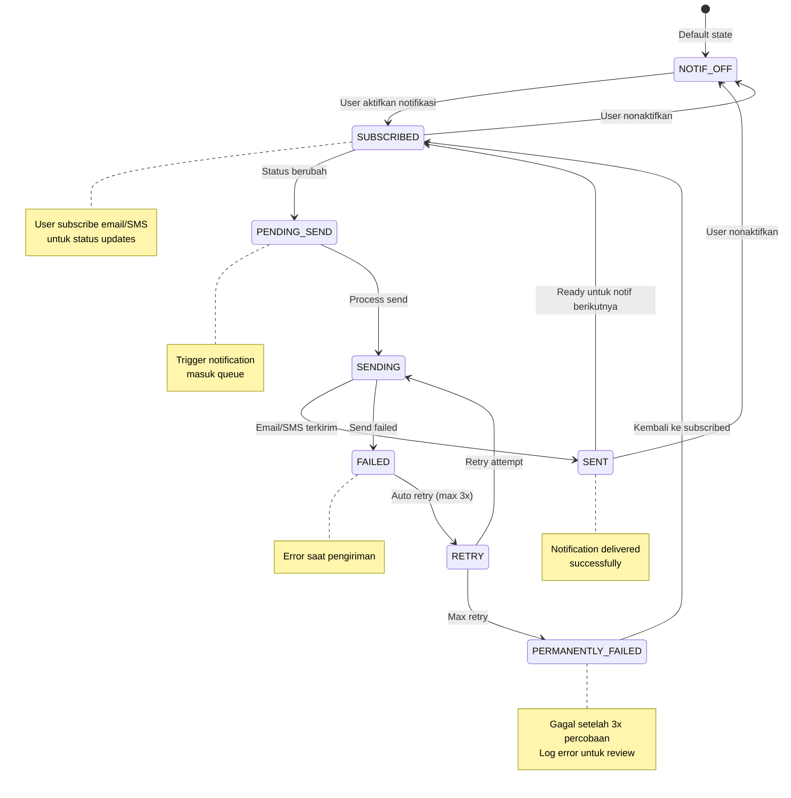

# State Machine Diagram - Sistem Tracking Status Dokumen Kantor Notaris

## Deskripsi
Diagram state machine ini menggambarkan transisi status pada objek **Perkara**.

## 1. State Machine Diagram - Status Perkara

## 2. State Machine Diagram - Notifikasi

## Penjelasan State Perkara

| State | Deskripsi | Trigger Masuk | Trigger Keluar |
|-------|-----------|---------------|----------------|
| **DRAFT** | Perkara baru dibuat | Staff buat perkara | Staff submit |
| **MENUNGGU_VERIFIKASI** | Menunggu verifikasi dokumen | Staff submit | Staff approve/reject |
| **DOKUMEN_TIDAK_LENGKAP** | Dokumen kurang/invalid | Staff reject | Klien upload revisi |
| **DOKUMEN_LENGKAP** | Dokumen lengkap & valid | Staff approve | Notaris mulai proses |
| **PROSES_NOTARIS** | Notaris mengerjakan | Notaris start | Proses selesai/revisi |
| **REVISI_INTERNAL** | Perlu perbaikan internal | Notaris temukan masalah | Revisi selesai |
| **MENUNGGU_TANDA_TANGAN** | Siap TTD | Proses notaris selesai | TTD lengkap |
| **SELESAI** | Perkara selesai | Semua TTD lengkap | Archive |
| **DIBATALKAN** | Perkara dibatalkan | Request cancel | Close |

## Penjelasan State Notifikasi

| State | Deskripsi |
|-------|-----------|
| **NOTIF_OFF** | Notifikasi dinonaktifkan |
| **SUBSCRIBED** | User berlangganan notifikasi |
| **PENDING_SEND** | Notifikasi dalam queue |
| **SENDING** | Proses pengiriman |
| **SENT** | Berhasil terkirim |
| **FAILED** | Gagal terkirim |
| **RETRY** | Retry pengiriman (max 3x) |
| **PERMANENTLY_FAILED** | Gagal permanen setelah max retry |

## Guard Conditions

| Transisi | Guard Condition |
|----------|-----------------|
| MENUNGGU_VERIFIKASI → DOKUMEN_LENGKAP | [semua dokumen valid] |
| MENUNGGU_VERIFIKASI → DOKUMEN_TIDAK_LENGKAP | [ada dokumen tidak valid] |
| PROSES_NOTARIS → MENUNGGU_TANDA_TANGAN | [proses selesai] |
| MENUNGGU_TANDA_TANGAN → SELESAI | [semua tanda tangan lengkap] |
| SENDING → FAILED | [send_error] |
| FAILED → RETRY | [retry_count < 3] |

## Entry/Exit Actions

| State | Entry Action | Exit Action |
|-------|--------------|-------------|
| MENUNGGU_VERIFIKASI | addToVerificationQueue() | removeFromQueue() |
| SELESAI | sendCompletionNotification() | archivePerkara() |
| DIBATALKAN | sendCancellationNotification() | closePerkara() |
| SENT | logNotificationSent() | - |
