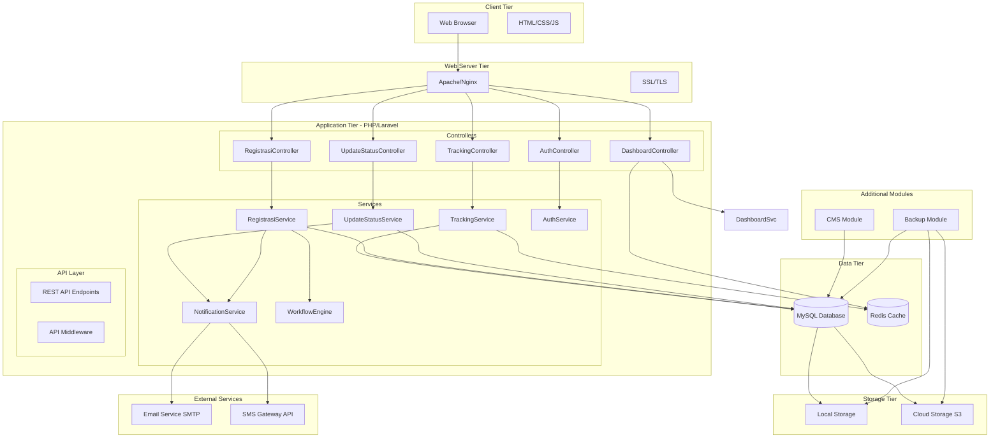

# Component Diagram - Sistem Tracking Status Dokumen Kantor Notaris

## Deskripsi
Diagram komponen ini menggambarkan arsitektur software dan hubungan antar komponen.

## Mermaid Diagram



## Penjelasan Komponen

### Client Tier

| Komponen | Teknologi | Fungsi |
|----------|-----------|--------|
| **Web Browser** | Chrome, Firefox, Safari, Edge | Client access |
| **HTML/CSS/JS** | Bootstrap 5, jQuery | Frontend UI |

### Web Server Tier

| Komponen | Teknologi | Fungsi |
|----------|-----------|--------|
| **Apache/Nginx** | Apache 2.4 / Nginx 1.20 | HTTP server |
| **SSL/TLS** | Let's Encrypt | HTTPS encryption |

### Application Tier

#### Controllers

| Controller | Use Case | Route |
|------------|----------|-------|
| **TrackingController** | UC01, UC05, UC07 | /api/tracking |
| **RegistrasiController** | UC02, UC06 | /api/registrasi |
| **UpdateStatusController** | UC03, UC12 | /api/perkara/:id/status |
| **DashboardController** | UC04, UC10 | /api/dashboard |
| **AuthController** | Login/Logout | /api/auth |

#### Services

| Service | Fungsi |
|---------|--------|
| **TrackingService** | Query tracking, format timeline |
| **RegistrasiService** | Create perkara, generate tracking number |
| **UpdateStatusService** | Update status, validate transition |
| **NotificationService** | Send email/SMS notification |
| **WorkflowEngine** | Apply workflow template |
| **AuthService** | Authentication & authorization |

### Data Tier

| Komponen | Teknologi | Fungsi |
|----------|-----------|--------|
| **MySQL** | MySQL 8.0 | Primary database |
| **Redis** | Redis 6.x | Cache & session storage |

### Storage Tier

| Komponen | Fungsi |
|----------|--------|
| **Local Storage** | Server file storage |
| **Cloud Storage S3** | Backup & scalable storage |

### External Services

| Service | Provider | Fungsi |
|---------|----------|--------|
| **Email Service** | SMTP/PHPMailer | Send email notification |
| **SMS Gateway** | Twilio/Local API | Send SMS notification |

### Additional Modules

| Module | Use Case | Fungsi |
|--------|----------|--------|
| **CMS Module** | UC09 | Content management |
| **Backup Module** | UC08 | Automated backup |

## Arsitektur Layer

```
┌─────────────────────────────────────────┐
│         Presentation Layer               │
│    (Web Browser, HTML/CSS/JS)            │
├─────────────────────────────────────────┤
│         Web Server Layer                 │
│    (Apache/Nginx, SSL)                   │
├─────────────────────────────────────────┤
│         Application Layer                │
│    (Controllers, Services, API)          │
├─────────────────────────────────────────┤
│         Data Access Layer                │
│    (Repositories, MySQL, Redis)          │
├─────────────────────────────────────────┤
│         Infrastructure Layer             │
│    (Storage, Email, SMS, Backup)         │
└─────────────────────────────────────────┘
```

## Teknologi Stack

| Layer | Teknologi |
|-------|-----------|
| **Frontend** | HTML5, CSS3, JavaScript, Bootstrap 5 |
| **Backend** | PHP 8.x, Laravel Framework |
| **Database** | MySQL 8.0 |
| **Cache** | Redis 6.x |
| **Web Server** | Apache 2.4 / Nginx |
| **Email** | PHPMailer / SMTP |
| **SMS** | Twilio / Local SMS API |
| **Storage** | Local / AWS S3 |
